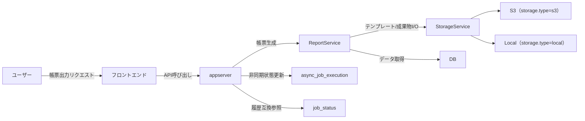
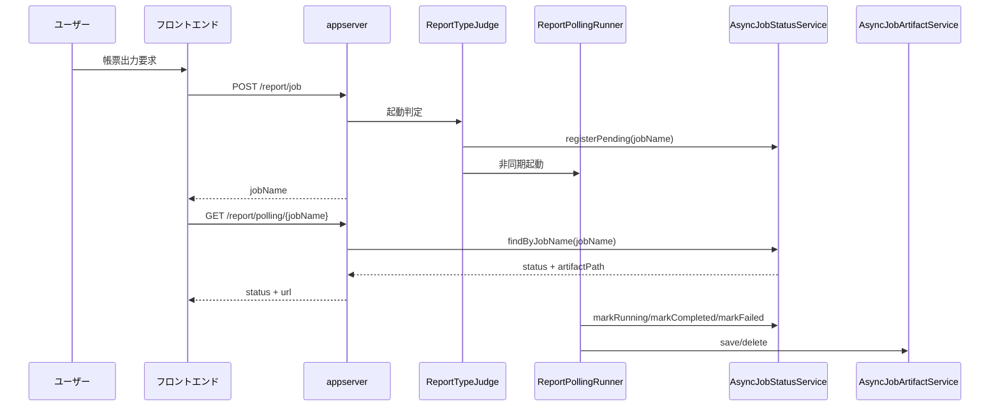

# 帳票出力_全体像設計書

## 目的
帳票出力の全体像を整理し、同期/非同期の責務分担を明確化する。

## 全体アーキテクチャ図

## 全体シーケンス図

## 注記
- 非同期起動は実装済み（`ReportTypeJudge` から `ReportPollingRunner` を呼び出す）。
- 状態管理は `JobStatusCache` ではなく `async_job_execution` を主系とする。
- `job_status` は互換用途で継続参照する。
