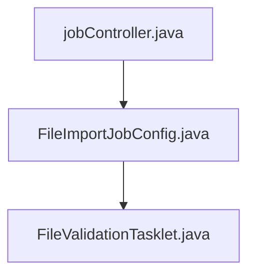

# ゲートウェイ技術設計書 (Spring Cloud Gateway)

## 【目的】
本設計書は、Spring Cloud Gateway を用いた API Gateway における構成、認証、ルーティング、ログ、IP制御などの方針を統一的に管理・運用するための技術基盤を示す。

---

## 1. モジュール概要

| 項目             | 内容                                          |
|------------------|-----------------------------------------------|
| モジュール名     | `gateway`                                     |
| 使用技術         | Spring Boot 3.2.4, Spring Cloud Gateway 2023.0.0 |
| プロジェクト構成 | `myproject/gateway/`                          |
| 主な責務         | リクエストルーティング、認証、ログ出力、IP制御、CORS、リトライ |

---

## 2. 設計方針

### 2-1. ルーティング

- `RouteLocatorBuilder` による JavaConfig ベースのルート定義
- `/api/app/**`, `/api/batch/**` などのルートを定義
- GET/POST 単位でリトライ戦略を指定（外部連携系は GET のみリトライ）

### 2-2. 認証・許可 (`JwtOrSessionAuthFilter`)

- `GlobalFilter` として実装し、全ルート共通で認証を実施
- JWT or セッションのいずれかを許容（JWTは Authorization: Bearer ヘッダー / セッションは JSESSIONID）
- OPTIONSメソッドと `/test-cors` など一部パスはバイパス
- 未認証時は 401 を返却（`UnauthorizedException`）

### 2-3. CORS対応

- `CorsGlobalConfig` にて `CorsWebFilter` を定義
- Origin / Method / Credentials を明示制御
- `test-cors` エンドポイントで単体確認可能
- CORSリクエストも認証フィルターを通過するため、OPTIONSは明示スキップ

```java
@Bean
public CorsWebFilter corsFilter() {
    CorsConfiguration config = new CorsConfiguration();
    config.setAllowedOrigins(List.of("http://localhost:3000"));
    config.setAllowedMethods(List.of("GET", "POST", "PUT", "DELETE", "OPTIONS"));
    config.setAllowedHeaders(List.of("*"));
    config.setAllowCredentials(true);

    UrlBasedCorsConfigurationSource source = new UrlBasedCorsConfigurationSource();
    source.registerCorsConfiguration("/**", config);

    return new CorsWebFilter(source);
}
```

### 2-4. IPホワイトリスト制御 (`IpWhitelistFilter`)

- `GlobalFilter` として実装
- `X-Forwarded-For` または `RemoteAddress` から送信元IPを判定
- `/test-cors` などプリフライト対応のため OPTIONS メソッドはスキップ
- 許可外IPは `403 Forbidden`（`ForbiddenException`）を返却

```yaml
gateway:
  whitelist:
    enabled: true
    allowed-ip-list:
      - 127.0.0.1
      - 192.168.0.0/24
```

### 2-5. ログ出力・トレーサビリティ

- `TraceLoggingFilter` により MDC に traceId を埋め込み
- JSONログ（`LogstashEncoder`）形式で出力し、Kibana 等でトレース可能
- traceId の伝搬はリクエストヘッダー → MDC → ログ で一貫保持

### 2-6. 注意事項
- WebServlet形式とWebFlux形式で、共存できないライブラリを使用していたためすべてWebFlux形式に統一。理由は、サーバ起動ができなくなるため。
- よって、gatewayからservercommonにアクセスすることを禁止する。
  理由は、servercommonにはWebServlet形式のソースがあり、それらをビルドに含めるとが衝突サーバ起動しないため。

### 2-7. 備忘録
- もしgatewayをWebServlet形式に統一すると、**「2-1. ルーティング」** の実装が不可能になる。

---

## 3. リトライ制御

| 呼び出し元 → 呼び出し先         | リトライ | 備考             |
|--------------------------|----------|------------------|
| Gateway → 内部API (GET) | ✅       | 一時エラー吸収可 |
| Gateway → 外部API (GET) | ✅       | 任意で設定        |
| Gateway → POST系API     | ❌       | 副作用あるため禁止 |
| Gateway → 認証API       | ❌       | セキュリティ上禁止 |

```yaml
filters:
  - name: Retry
    args:
      retries: 3
      statuses: INTERNAL_SERVER_ERROR
      methods: GET
      backoff:
        firstBackoff: 100ms
        maxBackoff: 1000ms
        factor: 2
```

---

## 4. 今後の拡張

- [x] JWT署名鍵のKMS化・外部秘密管理
- [ ] IPホワイトリストを Config Server / DB へ移行
- [ ] `/actuator/gateway/routes` の活用による動的ルート監視
- [ ] traceId の画面反映やエンドツーエンド監視の整備

---

## 5. ディレクトリ構成

```
myproject/gateway/
├── config
│   ├── GatewayRouteConfig.java         // ルーティング定義
│   ├── CorsGlobalConfig.java           // CORSフィルター設定
│   └── SecurityConfig.java             // 認証/ホワイトリストBean定義
├── security
│   ├── JwtOrSessionAuthFilter.java     // JWT or セッション認証
│   ├── IpWhitelistFilter.java          // IPホワイトリスト制御
│   └── JwtTokenProvider.java           // JWTの検証ユーティリティ
├── logging
│   └── TraceLoggingFilter.java         // traceId埋め込みフィルター
├── resources
│   ├── application.yml
│   └── logback-spring.xml
└── test
    ├── CorsGlobalConfigIntegrationTest.java // CORSの統合テスト
    └── JwtOrSessionAuthFilterTest.java      // 認証フィルター単体テスト
```

---

## 6. モジュール別補足

### 6-1. GatewayRouteConfig.java

- `RouteLocatorBuilder` によりルート定義
- IPホワイトリスト・認証は全体に GlobalFilter で適用されているため明示不要

### 6-2. JwtOrSessionAuthFilter.java

- 認証フィルターとして `GlobalFilter` 実装
- `Authorization: Bearer` または `JSESSIONID` のどちらかで許可
- `OPTIONS` メソッドおよび `/login`, `/test-cors` 等はスキップ対象

### 6-3. IpWhitelistFilter.java

- `X-Forwarded-For` または `RemoteAddress` から送信元IPを判定
- CIDR対応済み（`IpAddressMatcher` を使用）
- `OPTIONS` メソッドや `/public` 系も通過可能に設定済み

### 6-4. CorsGlobalConfig.java

- `CorsWebFilter` を Bean 登録し、`/test-cors` などのプリフライト対応に利用

### 6-5. JwtTokenProvider.java

- JWT署名検証、有効期限チェック、Claims抽出を行うユーティリティ
- `jjwt` ライブラリをベースに実装

### 6-6. application.yml

- ローカル用ではポート 8888、JWTシークレット、IP制御、CORS 許可Origin を指定

---

## 7. 開発者が実装すべきこと（個別実装範囲）
これだけ実装すれば基本問題なく動作します。処理順に記載しております。

### 7.1. gatewayにアクセスする
```java
  ResponseEntity<ApiResponse> apiResponse = internalApiClient.post(
          // ゲートウェイを通る場合は以下プログラム
          "http://localhost:8888/api/batch/jobs/run/fileImportJob",
          //"http://localhost:8083/jobs/run/fileImportJob",
          formData,
          accsessToken,
          ApiResponse.class);
```

### 7.2. gatewayでルーティングします（ここは共通処理）
```java
public class GatewayRouteConfig {
    @Bean
    public RouteLocator customRouteLocator(RouteLocatorBuilder builder) {
        return builder.routes()
                .route("batchserver", r -> r.path("/api/batch/**")
                        .filters(f -> f.stripPrefix(2)) // ← ここで "/api/batch" を削除
                        .uri("http://localhost:8083"))
    }
}
```

### 7.3. 処理到達！
正常に動作すると、Tasklet等に疎通するはず（以下、一例で私が実装した個別処理です）
```java
public class FileValidationTasklet implements Tasklet {
    @Override
    public RepeatStatus execute(StepContribution contribution, ChunkContext chunkContext) throws Exception {
        JobParameters params = chunkContext.getStepContext().getStepExecution().getJobParameters();

        String templateId = params.getString("templateId");
        String filename = params.getString("fileName");
        String jobName = params.getString("jobName");
    }
}
```

### 7.4. 🔰 バッチ開発初心者向け
以下ソースをご参考に、エンドポイントをご検討ください。


---
## 8. 備考・運用

- `GatewayFilter` → `GlobalFilter` への変更により、ルートごとの filter 呼び出しから共通化された
- 認証やIP制御の bypass 対象パスの設計は今後ルール化して config に切り出すことも可能

---

