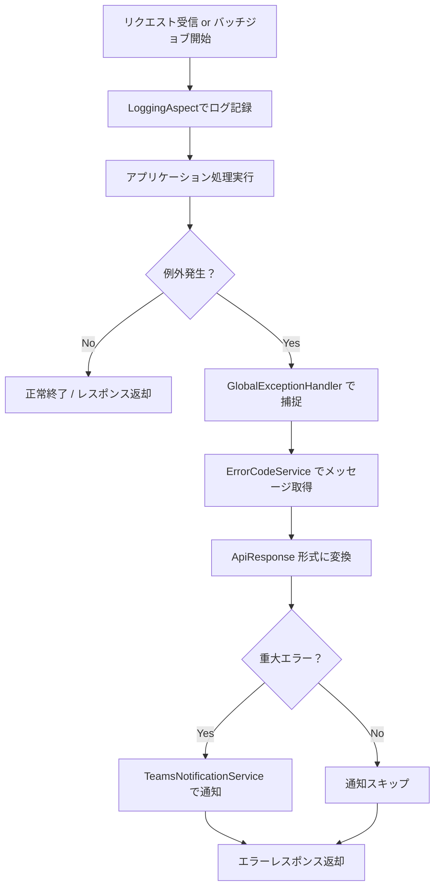

# ロギング・エラーハンドリング設計書（バックエンド編）

## **1. モジュール概要**

### **1-1. 目的**

本モジュールは、アプリケーション全体の**ロギング**および**エラーハンドリング**を統一的かつ信頼性高く実施することを目的とします。

以下の機能を提供します：

- アプリ全体のログ出力管理（AOP利用）
- バリデーションエラーおよび予期しない例外の共通処理
- Microsoft Teams 通知による障害検知
- エラーコード・メッセージの多言語対応

### **1-2. 適用範囲**

- 対象層：Controller層 / Service層
- 対象アプリ：servercommon, appserver, batchserver
- フレームワーク：Spring Boot
- ログライブラリ：SLF4J + Logback
- 通知先：Microsoft Teams Webhook

---

## **2. 設計方針**

### **2-1. ロギング方針**

- **ログ取得方法**：AOP（`@Aspect`）による自動ログ出力
  - 対象：`@RestController`, `@Service`が付予されたクラス
  - 非同期処理に関しては軽量ジョブは本ロガーを経由。
  - バッチサーバーにも適用されるように修正。DBログと合わせて処理のログも記録できるように。
- **ログレベル指針**：
  - `INFO`: メソッド入出力のトレース
  - `WARN`: バリデーション失敗
  - `ERROR`: 未処理例外
- **出力先**：
  - ローカル環境：コンソール出力
  - 本番環境：ファイル出力
- **ログ構成設定**：
  - `logback-spring.xml`にてログ形式・出力先定義
  - servercommonにて各サービスの環境ごとのログレベルを一括管理。個別の設定が必要な場合は各アプリのapplicaton-○○.ymlにログレベルおよびファイル名を記載し、変更可能。
  - ログ出力パス：`C:/logs/myapp/`などを、 #application-○○.ymlに記述し、環境ごとに変更可能とする
  - 日別ローテーション、最大30日保持

### **2-2. エラーハンドリング方針**

- **共通例外ハンドリング**：`@RestControllerAdvice`を用いて全例外を集中管理
- **例外種別ごとの処理**：
  - `MethodArgumentNotValidException`: `400 Bad Request`
  - `Exception`: `500 Internal Server Error`
- **カスタム例外**：
  - `CustomException`: ビジネスロジック用途
- **エラーレスポンス形式**：
  - `ApiResponse<T>` にて統一
  - 詳細：`ErrorDetail(code, message)`

### **2-3. エラーメッセージ多言語対応**

- **DB管理**：`error_codes` テーブル
- **取得ロジック**：`ErrorCodeService#getErrorMessage(code, locale)`
- **キャッシュ**：`@Cacheable`

### **2-4. Teams 通知方針**

- **通知送信タイミング**：
  - 重大な障害発生時 500や複数回の403,401
- **送信形式**：JSON `{"text": "message"}`
- **設定元**：`application.yml`の `teams.webhook.url`

---

## **3. モジュール構成とファイル構造**

```
servercommon
├── aspect
│   └── LoggingAspect.java
├── exception
│   ├── GlobalExceptionHandler.java
│   ├── CustomException.java
│   └── ErrorResponse.java
├── model
│   └── ErrorCode.java
├── notification
│   └── TeamsNotificationService.java
├── responseModel
│   └── ApiResponse.java
├── service
│   └── ErrorCodeService.java
├── repository
│   └── ErrorCodeRepository.java
└── resources
    ├── application.yml
    └── logback-spring.xml
```

---

## **4. 各クラスの役割**

### **LoggingAspect.java**
- Controller / Service の入出力ログを AOP で追跡

```java
@Aspect
@Component
public class LoggingAspect {

    private final Logger logger = LoggerFactory.getLogger(this.getClass());

    // Controller と Service に所属するクラスのメソッドを対象にするポイントカット
    @Pointcut("within(@org.springframework.web.bind.annotation.RestController *) || " +
              "within(@org.springframework.stereotype.Service *)")
    public void applicationPackagePointcut() {
        // ポイントカットの定義
    }

    @Around("applicationPackagePointcut()")
    public Object logAround(ProceedingJoinPoint joinPoint) throws Throwable {
        logger.info("Entering: {} with arguments {}", 
                    joinPoint.getSignature().toShortString(), 
                    Arrays.toString(joinPoint.getArgs()));
        try {
            Object result = joinPoint.proceed();
            logger.info("Exiting: {} with result {}", 
                        joinPoint.getSignature().toShortString(), 
                        result);
            return result;
        } catch (IllegalArgumentException e) {
            logger.error("Illegal argument: {} in {} with arguments {}",
                        e.getMessage(),
                        joinPoint.getSignature().toShortString(),
                        Arrays.toString(joinPoint.getArgs()));
            throw e;
        }
    }
}
```

### **GlobalExceptionHandler.java**
- 全例外を集中管理
- Teams通知、ログ出力、コード化に対応

```java
@Slf4j
@RestControllerAdvice
public class GlobalExceptionHandler {

    private final ErrorCodeService errorCodeService;
    private final TeamsNotificationService teamsNotificationService;

    public GlobalExceptionHandler(ErrorCodeService errorCodeService, TeamsNotificationService teamsNotificationService) {
        this.errorCodeService = errorCodeService;
        this.teamsNotificationService = teamsNotificationService;
    }

    @ExceptionHandler(MethodArgumentNotValidException.class)
    public ResponseEntity<ApiResponse<?>> handleValidationExceptions(MethodArgumentNotValidException ex, Locale locale) {
        String errors = ex.getBindingResult()
                .getFieldErrors()
                .stream()
                .map(e -> e.getField() + ": " + e.getDefaultMessage())
                .collect(Collectors.joining(", "));
        log.warn("Validation error: {}", errors);
        String message = errorCodeService.getErrorMessage("E4001", locale.getLanguage());
        ApiResponse<?> response = ApiResponse.error("E4001", message + " (" + errors + ")");
        return ResponseEntity.status(HttpStatus.BAD_REQUEST).body(response);
    }

    @ExceptionHandler(Exception.class)
    public ResponseEntity<ApiResponse<?>> handleAllExceptions(Exception ex, Locale locale) {
        log.error("Unhandled exception occurred", ex);
        String message = errorCodeService.getErrorMessage("E5001", locale.getLanguage());

        // Teams通知（重大なエラーのみ）
        String teamsMessage = String.format(
            "[重大エラー発生]\nメッセージ: %s\n例外: %s\n詳細: %s",
            message,
            ex.getClass().getName(),
            ex.getMessage()
        );
        teamsNotificationService.sendNotification(teamsMessage);

        ApiResponse<?> response = ApiResponse.error("E5001", message);
        return ResponseEntity.status(HttpStatus.INTERNAL_SERVER_ERROR).body(response);
    }
}

```

### **CustomException.java**
- ビジネスロジックの例外表示

```java
@ResponseStatus(HttpStatus.BAD_REQUEST)
public class CustomException extends RuntimeException {

    public CustomException(String message) {
        super(message);
    }

    public CustomException(String message, Throwable cause) {
        super(message, cause);
    }
}

```

### **ApiResponse.java**
- 成功 / 失敗を統一形式で返す DTO

```java
@Data
@NoArgsConstructor
@AllArgsConstructor
public class ApiResponse<T> {
    private boolean success;
    private T data;
    private ErrorDetail error;

    // 成功時のレスポンス生成
    public static <T> ApiResponse<T> success(T data) {
        return new ApiResponse<>(true, data, null);
    }

    // エラー時のレスポンス生成
    public static <T> ApiResponse<T> error(String code, String message) {
        return new ApiResponse<>(false, null, new ErrorDetail(code, message));
    }
}

```

### **TeamsNotificationService.java**
- Webhook 経由で Microsoft Teams へ通知
```java
@Service
public class TeamsNotificationService {

    private static final Logger logger = LoggerFactory.getLogger(TeamsNotificationService.class);

    // application.yml に設定するTeamsのWebhook URL
    @Value("${teams.webhook.url}")
    private String teamsWebhookUrl;

    private final RestTemplate restTemplate;

    public TeamsNotificationService(RestTemplate restTemplate) {
        this.restTemplate = restTemplate;
    }

    /**
     * Microsoft Teams に通知を送信します。
     * Teams のWebhookでは、シンプルなJSON形式（textフィールドを含む）を受け取ります。
     */
    public void sendNotification(String message) {
        try {
            HttpHeaders headers = new HttpHeaders();
            headers.setContentType(MediaType.APPLICATION_JSON);
            // Teamsに送信するペイロード（必要に応じてフォーマットを調整）
            String payload = "{\"text\": \"" + message + "\"}";
            HttpEntity<String> request = new HttpEntity<>(payload, headers);
            restTemplate.postForEntity(teamsWebhookUrl, request, String.class);
            logger.info("Teams notification sent: {}", message);
        } catch (Exception e) {
            logger.error("Failed to send Teams notification", e);
        }
    }
}


```

### **ErrorCodeService.java**
- DBからコードとロケールに基づきメッセージ取得
```java
@Service
public class ErrorCodeService {

    private final ErrorCodeRepository errorCodeRepository;

    public ErrorCodeService(ErrorCodeRepository errorCodeRepository) {
        this.errorCodeRepository = errorCodeRepository;
    }

    /**
     * 指定されたエラーコードとロケールに対応するエラーメッセージを取得します。
     * キャッシュを利用して、頻繁なDBアクセスを防ぎます。
     *
     * @param code   エラーコード（例："E4001"）
     * @param locale ロケール（例："ja"、"en"）
     * @return 対応するエラーメッセージ、見つからなければデフォルトのメッセージ
     */
    @Cacheable(value = "errorCodes", key = "#code + '_' + #locale")
    public String getErrorMessage(String code, String locale) {
        return errorCodeRepository.findByCodeAndLocale(code, locale)
                .map(ErrorCode::getMessage)
                .orElse("Unknown error (code: " + code + ")");
    }
}

```
---

### **MaskingConverter.java**
- パスワードなど攻撃者が悪意利用可能な情報をマスキングし、ログ出力
```java
public class MaskingConverter extends ClassicConverter {
    @Override
    public String convert(ILoggingEvent event) {
        String message = event.getFormattedMessage();
        if (message != null) {
            // 例: "password=" の後に続く文字列を "****" に置換
            message = message.replaceAll("(?i)(password=)[^\\s,]+", "$1****");
        }
        return message;
    }
}

```
---

## **5. 設定ファイル**

### **application.yml**
```yaml
logging:
  level:
    com.example: DEBUG
  file:
    path: C:/logs/myapp

teams:
  webhook:
    url: "https://outlook.office.com/webhook/..."
```

### **logback-spring.xml**
```xml
<appender name="CONSOLE" class="ch.qos.logback.core.ConsoleAppender">
  <encoder>
    <pattern>%d{yyyy-MM-dd HH:mm:ss.SSS} [%thread] %-5level %logger{36} - %msg%n</pattern>
  </encoder>
</appender>

<root level="DEBUG">
  <appender-ref ref="CONSOLE"/>
</root>
```

---

## **6. 今後の拡張方針**


- Sentry / CloudWatch との連携
- メッセージ定義・エラーコード・ログ文言の一元運用は以下設計書に統合する  
  `../03_共通部品/共通エラーハンドリング・メッセージカタログ設計書.md`

---

## **7. API レスポンス例**

### **成功時**
```json
{
  "success": true,
  "data": { "id": 1, "name": "user1" },
  "error": null
}
```

### **バリデーション失敗時**
```json
{
  "success": false,
  "data": null,
  "error": {
    "code": "E4001",
    "message": "入力に誤りがあります (email: must not be blank)"
  }
}
```

### **システム例外発生時**
```json
{
  "success": false,
  "data": null,
  "error": {
    "code": "E5001",
    "message": "システムエラーが発生しました"
  }
}
```

## **8. 処理フロー図**



## **9. 関連ドキュメント**

- `../03_共通部品/共通エラーハンドリング・メッセージカタログ設計書.md`
- `../reuse/implementation-patterns.md`
- `../reuse/anti-patterns.md`
