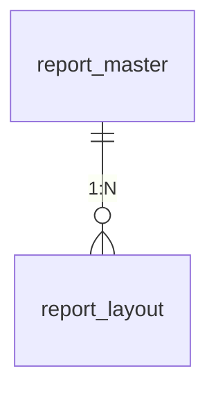


# 📘 帳票出力基盤ドキュメント（完全版）

---

## **1. 概要**

本帳票出力基盤は、**PDF（RapidReport）** と **Excel（Apache POI）** に対応した帳票を、テンプレートとレイアウト定義に基づいて動的に生成する仕組みである。帳票テンプレートは **S3 上に格納** され、データは DB から取得し、帳票に自動埋め込みされる。

---

## **2. 特徴と設計原則**

| 項目      | 内容                                                                 |
| ------- | ------------------------------------------------------------------ |
| 出力形式    | PDF（RapidReport）, Excel（Apache POI）                                |
| テンプレート  | `.rrpt` or `.xlsx` ファイル（S3で管理）                                     |
| データ取得   | JPA または Fetcher（`ReportEntityFetcher`）経由でDBから動的取得                  |
| レイアウト定義 | `report_layout`テーブルで列定義・順序・表示名などを動的管理                              |
| 出力方法    | 即時レスポンス（Base64）、または非同期S3アップロード + 署名付きURL                           |
| 一括出力    | 複数帳票を結合し、一括PDF or Excelで出力（`BulkReportExportServiceImpl`）          |
| ロギング・例外 | SLF4J + `@Slf4j`, `ReportGenerationException`, `@ControllerAdvice` |

---

## **3. コード構成と役割**

### 📂 `servercommon` 内の構成

| パス                                            | クラス・ファイル                                       | 説明 |
| --------------------------------------------- | ---------------------------------------------- | -- |
| `impl/ReportServiceImpl.java`                 | 帳票生成の中核サービス。テンプレート取得→データ取得→PDF/Excel生成→レスポンス生成 |    |
| `impl/BulkReportExportServiceImpl.java`       | 複数の帳票を一括で結合し出力（PDF or Excel）                   |    |
| `components/report/PdfGenerator.java`         | RapidReport を使った PDF 帳票の生成ラッパー                 |    |
| `components/report/ExcelGenerator.java`       | Apache POI を使った Excel 帳票の生成ラッパー                |    |
| `service/reports/ReportEntityFetcher.java`    | 帳票IDごとのデータ取得インタフェース（JOIN済みエンティティなど）            |    |
| `service/reports/FetchReportDataService.java` | レイアウトとデータをマッピングし帳票用データ構造へ変換                    |    |
| `repository/ReportLayoutRepository.java`      | 帳票レイアウト（カラム名、順序、フォーマット）の取得                     |    |
| `repository/ReportMasterRepository.java`      | 帳票マスタ（帳票名、テンプレートファイル名など）の取得                    |    |
| `model/ReportDefinition.java`                 | 帳票テンプレート・レイアウト・メタデータを集約するドメインモデル               |    |
| `utils/FileTypeResolver.java`                 | テンプレートファイルの形式（Excel or PDF）を判定                 |    |
| `file/FileSaver.java`                         | 帳票バイナリをS3へ保存                                   |    |
| `service/StorageService.java`                 | S3とのやりとりの抽象化。テンプレートや出力ファイルの管理                  |    |

---

## **4. 帳票テンプレート設計（S3管理）**

* **PDF**: `.rrpt` ファイル（RapidReport Designer で作成）
* **Excel**: `.xlsx` ファイル（帳票用テンプレート）
* **パス管理**: S3のバケット配下に `"templates/"` ディレクトリとして整理

---

## **5. レイアウト設計（DBで定義）**

### ER図（簡易）



### `report_layout` の役割

* 帳票の列構成・表示順・見出し・フォーマット・可視性を柔軟に制御
* デザイン修正を**DBだけで完結**可能

| カラム              | 内容                                             |
| ---------------- | ---------------------------------------------- |
| `report_id`      | 帳票ID（外部キー）                                     |
| `column_id`      | 各列の識別子                                         |
| `entity_name`    | 対象エンティティ名（例: `Orders`, `Users`）                |
| `property_path`  | オブジェクト上のプロパティ（例: `user.name`, `product.price`） |
| `display_label`  | 帳票上のラベル                                        |
| `display_order`  | 出力順                                            |
| `format_pattern` | 表示書式（例: `#,##0.00`, `yyyy/MM/dd`）              |
| `required_flag`  | 必須/任意                                          |
| `visible_flag`   | 表示/非表示                                         |

---

## **6. 帳票生成のフロー**

### 📄 PDF 帳票生成

1. `ReportDefinitionLoader` でテンプレート・レイアウトを取得
2. `ReportEntityFetcher` で JOIN済みエンティティ一覧を取得
3. `FetchReportDataService` でレイアウトに従って Map化
4. `PdfGenerator` で `.rrpt` テンプレートに埋め込み帳票を生成
5. S3へ保存 or Base64で返却

### 📊 Excel 帳票生成

1. 上記 1〜3 は共通
2. `ExcelGenerator` で `.xlsx` テンプレートに Map埋め込み
3. Excel帳票を生成・保存・返却

---

## **7. 一括帳票出力**

### 対象クラス: `BulkReportExportServiceImpl`

* 複数の帳票をPDF/Excelで出力
* 帳票ごとに個別生成 → 結合（PDF: PDFMergerUtility, Excel: POIブックコピー）
* S3にアップロードし、署名付きURLを返却

---

## **8. サンプルDML（初期データ）**

```sql
INSERT INTO report_master (report_id, report_name, template_file, output_format, updated_at, updated_by)
VALUES ('1', 'PDFサンプル', 'templates/sample.rrpt', 1, NOW(), 'admin');

INSERT INTO report_layout (report_id, column_id, entity_name, property_path, display_label, data_type, display_order, visible_flag, updated_at, updated_by)
VALUES ('1', 'col1', 'Orders', 'user.name', 'ユーザー名', 1, 1, 1, NOW(), 'admin');
```

---

## **9. ログ・エラー設計**

| ログレベル | 内容                        |
| ----- | ------------------------- |
| INFO  | 正常出力ログ（テンプレート名、レコード数など）   |
| WARN  | 想定外だが継続できる（例：レイアウトが空）     |
| ERROR | 帳票出力失敗・例外（例：テンプレートファイル欠落） |

* 全例外は `ReportGenerationException` をベースとする
* グローバルで `@ControllerAdvice` による共通ハンドリング

---

## **10. 拡張指針とベストプラクティス**

| 拡張項目      | ベストプラクティス                                                    |
| --------- | ------------------------------------------------------------ |
| 帳票の追加     | DBへ `report_master` / `report_layout` を INSERT。テンプレートはS3配置のみ |
| データソース変更  | `ReportEntityFetcher` を切り替えることで柔軟に対応可能                       |
| カスタムレイアウト | `format_pattern`, `visible_flag` により出力制御が可能                  |
| 差分検知・通知   | S3アップロード時に SNS, Slack 通知を追加検討                                |

---

## **11. フロントエンド構成（React側）**

| ファイルパス                             | 内容                   |
| ---------------------------------- | -------------------- |
| `pages/report/index.tsx`           | 帳票出力の画面・一覧・出力パラメータ管理 |
| `hooks/usePollingStatus.ts`        | 非同期帳票の状態ポーリング        |
| `api/services/v1/reportService.ts` | 帳票生成API呼び出し、進捗取得API  |
| `components/ReportForm.tsx`        | 出力条件入力フォーム           |

---

### **現行実装注記**
- テンプレート取得・保存は `StorageService` 経由で実施
- 生成処理は `ReportServiceImpl` に集約
- 一括出力は `BulkReportExportServiceImpl` で PDF/Excel を結合
