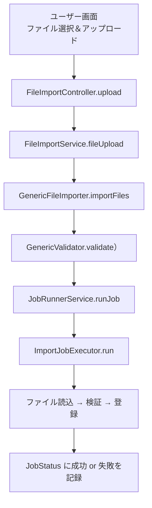

# 📘 ファイル連携機能設計書（バックエンド編・非同期インポート＆バリデーション対応）

---

## **1. モジュール概要**

### 1-1. 目的

本モジュールは、CSV/Excel ファイルをアップロードし、非同期で検証・登録処理を実行するファイル連携基盤を提供する。
データ検証・保存・履歴管理を統合し、拡張可能かつ保守性の高いインポート機能を実現する。

### 1-2. 非同期処理分類との対応

| 分類         | 特徴               | 実行環境      | 処理例                                           |
| ------------ | ------------------ | ------------- | ------------------------------------------------ |
| 軽量処理     | 数 ms〜秒未満      | `appserver`   | フォーマットチェック、即時バリデーション         |
| 中程度の処理 | 数秒〜数分         | `batchRunner` | CSV ファイルインポート、登録ログ出力             |
| 重量処理     | 複数ファイル処理等 | `batchserver` | 一括集計バッチ、定期 S3 取り込み、レポート生成等 |

---

## **2. フォルダ構成**

```
appserver
├── controller
│   └── FileImportController.java         ← アップロードAPI
├── runner
│   └── FileImportRunner.java             ← 同期アップロード処理（レガシー）
│
servercommon
├── service
│   └── ImportJobExecutor.java            ← 非同期実行ロジック
│   └── StorageService.java               ← S3/ローカル抽象化
├── file
│   ├── FileSaver.java                    ← ファイル保存共通処理
│   ├── FileNameResolver.java            ← 命名ユーティリティ
│   └── FileTypeResolver.java            ← ファイル拡張子識別
├── repository
│   └── JobStatusRepository.java         ← 処理履歴リポジトリ
├── model
│   └── JobStatus.java                   ← 処理履歴エンティティ
└── validationtemplate
    └── TemplateGetMapper.java           ← 設定ファイル情報をエンティティにマッピング
```

## 　バリデーション処理は FileImportValidater に委譲するため、別ドキュメントを参照。

## **3. 技術構成**

| 項目               | 内容                                         |
| ------------------ | -------------------------------------------- |
| ファイル受信       | `MultipartFile` による HTTP アップロード     |
| 保存先             | S3 または ローカルファイル（StorageService） |
| 検証               | 行単位のバリデーション（拡張可能）           |
| 登録処理           | バリデーション後、正常データのみ DB 保存     |
| 非同期実行         | `@Async`, `JobRunnerService`, `JobStatus`    |
| エラーハンドリング | 検証失敗、実行時例外 → `JobStatus` に記録    |

---

## **4. 処理フロー**



---

## **5. JobStatus エンティティ構造**

```java
@Data
@Builder
@Entity
public class JobStatus {
    private String jobName;
    private String jobType;
    private String originalFileName;
    private String status;       // RUNNING / SUCCESS / FAILED
    private String message;      // 検証エラーや成功件数のサマリ
    private LocalDateTime startTime;
    private LocalDateTime endTime;
}
```

---

## **6. 処理詳細**

### 6-1. `FileImportController`

- `POST /import/upload`
- ファイルのバリデーション → テンポラリ保存 → 非同期ジョブ起動
- バリデーションエラーは即時返却。処理成功時/失敗時に関わらず、ResponseEntity<ApiResponse<?>>を返す

### 6-2. `FileImportRunner`（レガシー・同期）

- `MultipartFile` を直接処理
- 同期的にバリデーション＋保存＋ JobStatus 書き込み
- 非推奨（将来的には `ImportJobExecutor` に統一予定）

### 6-3. `ImportJobExecutor`

- `StorageService.getFileByPath(jobName)` によりテンポラリファイル読込
- `FileValidatorDispatcher` でファイル種別に応じたバリデーション
- 成功データのみ `UserWriter` などで保存
- 処理件数・エラー内容は `JobStatus.message` に記録

---

## **7. テンプレート命名とバリデーション**

- ファイル名プレフィックス＋拡張子で種別判定（例：`users_*.csv` → `USERS`）
- バリデーションの内容は、すべて「classpath:config/template/xxxxx.yaml」で一元管理
- yaml ファイルを作成するだけで、テンプレート名追加とバリデーションを実装したのと同等になる

---

## **8. エラーハンドリング方針**

| ケース             | 対応内容                                     |
| ------------------ | -------------------------------------------- |
| ファイル名不正     | `E4001` コード + メッセージを返却            |
| バリデーション失敗 | エラー行のメッセージリストを構築して返却     |
| 実行時例外         | `E5001` コード + ログ出力 + JobStatus に記録 |
| 既処理ファイル     | `StorageService.isAlreadyProcessed()` で判定 |

---

## **9. インポート履歴取得 API**

### API: `GET /import/history`

#### パラメータ:

- `page`: ページ番号（デフォルト 0）
- `size`: 件数（デフォルト 20）

#### レスポンス:

- `List<JobStatus>`：`jobName` 降順でソートされたジョブ履歴情報

---

## **10. 使用例（Controller 呼び出し）**

```java
    @PostMapping("/upload")
    public ResponseEntity<ApiResponse<?>> upload(@RequestParam("file") MultipartFile file, @RequestParam("templateId") String templateId, Locale locale) {

        String filename = file.getOriginalFilename();
        String jobName = "import-" + UUID.randomUUID();

        // 業務ロジック呼び出し
        ResponseEntity<ApiResponse<?>> apiResponse = fileImportService.fileUpload(templateId, file, filename, locale,
                jobName);
        return apiResponse;
    }
```

---

## **11. 今後の拡張候補**

| 機能                         | 内容                                           |
| ---------------------------- | ---------------------------------------------- |
| フロントプレビュー対応       | アップロード前に 1 行目を表示して確認できる UI |
| 処理結果ダウンロード         | エラー詳細を含む CSV などを生成・DL 可能に     |
| 複数ファイル一括アップロード | 同一ジョブ名で複数ファイルをまとめて処理       |
| S3 連携強化（監視機能など）  | バッチサーバーによる定期監視 → 自動取り込み    |

---

## **12. 設定例**

**_application.yml_**

```yaml
storage:
  type: s3
  s3:
    bucket: your-bucket
    input-dir: input
    archive-dir: archive
    error-dir: error
    endpoint: http://minio:9000
    access-key: minio
    secret-key: minio123
```

**_users.yaml_**

```yaml
templateId: orders # テンプレート名
version: v1 # バージョン

columns:
  - field: orderId # 物理名（ドキュメント内で重複厳禁）
    name: orderId # 名前
    required: true # 必須可否
    type: string # 型
    repository: ordersRepository # このカラムがどの「repositoy.class」の対象なのかを記載
    entity: com.example.servercommon.model.Orders # このカラムがどのテーブルのデータなのかを記載
```

---

### **現行実装との整合（補足）**
- `/import` 系エンドポイントが現行の正式API
- `/import/upload` は `internalApiClient` 経由で batchserver の `fileImportJob` を起動
- `FileImportRunner` は `GenericFileImporter` で検証・登録し `JobStatus` を保存
- `ImportJobExecutor` は `FileValidatorDispatcher` → `UserWriter` で登録し `JobStatus` を保存
- 取込履歴は `JobStatusRepository.findByJobNameStartingWith("import-")`
