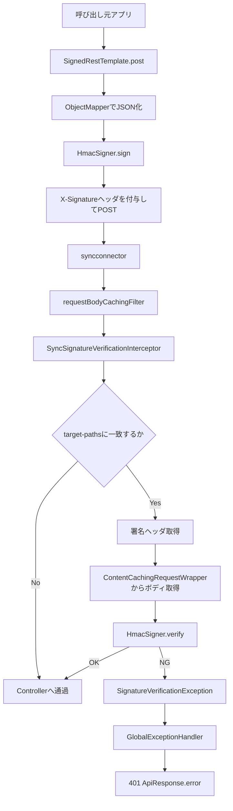

# SyncConnector署名連携_処理方式設計書

## 1. 目的

`syncconnector` における署名付き送信と受信検証の処理経路を整理し、実装・運用時の確認基準を明確にする。

## 2. 対象処理

- 送信処理: `SignedRestTemplate` による署名付き POST
- 受信処理: `SyncSignatureVerificationInterceptor` による HMAC 検証
- 現行サンプル受信 API: `POST /api/sample/receive`
- 送信有効化条件: `sync.outbox.use=true` かつ `syncconnector` が classpath に存在

## 3. 全体フロー

## 4. 送信処理

### 4-1. 入力

- URL
- リクエスト DTO または任意オブジェクト
- 応答型 `Class<T>`

### 4-2. 実行手順

1. `sync.outbox.use` が `true` であることを確認する
2. `syncconnector` 利用可能時に `SignedRestTemplate.post` がリクエストボディを JSON に変換する
3. `HmacSigner.sign` で HMAC-SHA256 署名を生成する
4. 署名を `signature-header` に格納して POST する
5. 応答を `ApiResponse<T>` として受ける

### 4-3. 使用クラス

- `SignedRestTemplate`
- `SignedRestTemplateConfig`
- `SignedRestTemplateProperties`
- `HmacSigner`

## 5. 受信検証処理

### 5-1. 前段処理

- `requestBodyCachingFilter` が `ContentCachingRequestWrapper` を適用する
- これにより Interceptor 内でリクエストボディを再読込できる

### 5-2. 判定手順

1. `SyncSignatureVerificationInterceptor` が `requestURI` を取得する
2. `target-paths` に一致しない場合はそのまま通過する
3. 一致する場合は署名ヘッダを取得する
4. ヘッダ未指定なら `SignatureVerificationException` を送出する
5. キャッシュ済みボディから文字列を取得する
6. `HmacSigner.verify` で署名を比較する
7. 不一致なら `SignatureVerificationException` を送出する
8. 一致した場合だけ Controller に処理を渡す

### 5-3. 使用クラス

- `SyncSignatureVerificationConfig`
- `SyncSignatureVerificationInterceptor`
- `SyncSignatureProperties`
- `HmacSigner`
- `SignatureVerificationException`

## 6. 現行設定の処理対象

| 項目 | 現行値 |
| --- | --- |
| 検証有効 | `true` |
| 検証対象パス | `/api/sample/receive` |
| 署名ヘッダ | `X-Signature` |
| 受信ポート | `8084` |

## 7. 正常系・異常系

### 7-1. 正常系

- 対象外パス: 署名検証せず通過
- 対象パスかつ署名一致: Controller 実行

### 7-2. 異常系

| 条件 | 結果 |
| --- | --- |
| 署名ヘッダなし | 401 |
| 署名不一致 | 401 |
| `ContentCachingRequestWrapper` 未適用 | `IllegalStateException` |
| JSON 変換失敗 | 送信側で RuntimeException |

## 8. サンプル実装の位置づけ

- `SyncRequestReceiverSampleController` は受信の確認用 API
- `SyncRequestSenderSample` は `sample-sync-sender` プロファイル時のみ起動するデモ用送信処理
- 現時点では業務ユースケースよりも、署名基盤の疎通確認用途が強い

## 9. 今後の適用ポイント

- 業務用受信 API を `target-paths` に追加する
- 呼び出し元アプリから `SignedRestTemplate` を利用する実経路を定義する
- 非導入システム向けに `sync.outbox.use=false` の運用手順を固定化する
- リプレイ対策やタイムスタンプ検証が必要ならヘッダ仕様を追加する

## 10. 関連資料

- `../02_基盤アーキテクチャ/SyncConnector連携基盤設計書.md`
