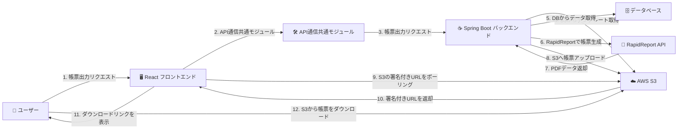
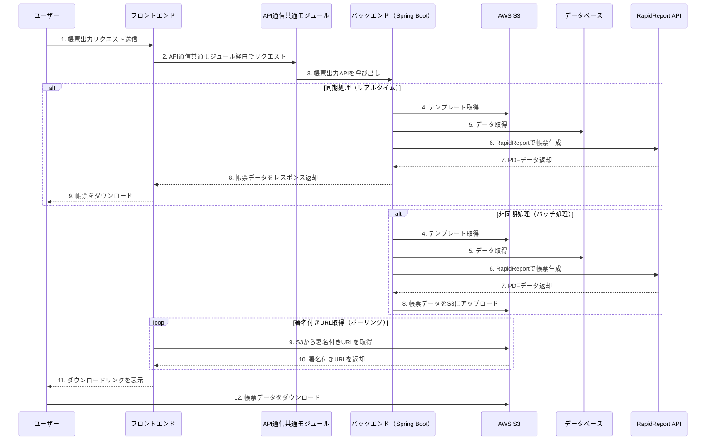
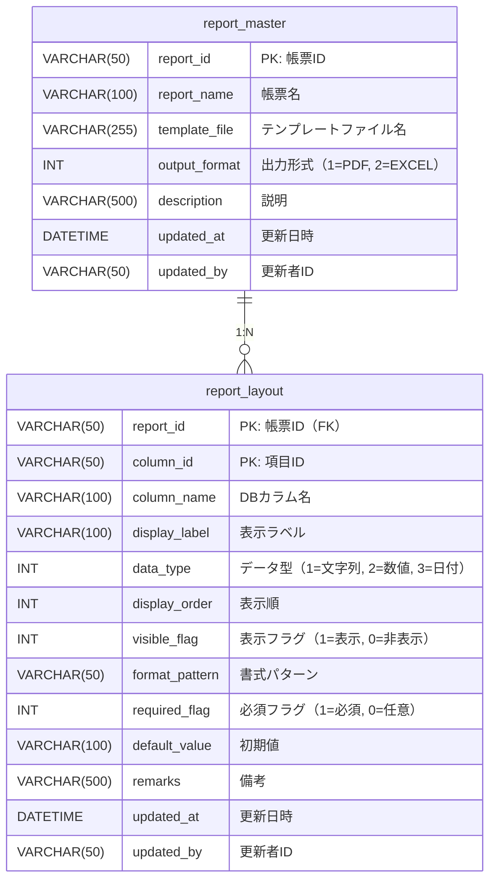
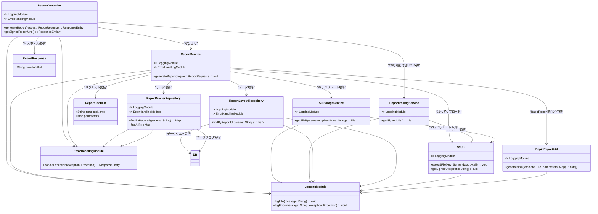

# **1.概要**

本モジュールは、Spring Boot、React を用いた帳票出力機能を統一的に管理するための共通クラスとして提供される。以下の原則に基づいて帳票出力処理を行う。
システム内の各種帳票を **PDF または Excel** 形式で出力する機能を提供する。
帳票テンプレートは **S3 に保存・管理** し、データを動的に埋め込むことで、柔軟かつメンテナンスしやすい帳票生成を実現する。
また、PDF 出力の帳票生成には、日本製の **RapidReport（システムベース社提供）** を利用する。
**固定値の管理**

* **業務要件変更に依存する固定値** → **DBで管理**
* **環境に依存する固定値** → **プロパティファイル（application.yml など）で管理**

### **適用範囲**

* **対象帳票** : システム内で出力されるすべての帳票（定型帳票、データ一覧、統計レポートなど）
* **データ取得方法** : REST API を介したデータ取得、DB 直接参照
* **帳票フォーマット** :* PDF（RapidReport を利用）、* Excel（Apache POI を利用）
* **出力方法** :**即時生成・ダウンロード** （リアルタイムでレスポンス返却）、**非同期処理（ジョブ管理）** （S3 へアップロードし、署名付きURLを発行）

## **設計方針**

### **1. アーキテクチャ方針**

#### **(1) フロントエンド**

* **フレームワーク** : React
* **API通信** : 共通モジュールを利用
* **状態管理** : 共通モジュールを利用
* **帳票出力画面の構成**
  * 帳票一覧表示
  * 帳票出力パラメータ入力フォーム
  * ダウンロードボタン（同期・非同期処理の選択）

#### **(2) バックエンド**

* **フレームワーク** : Spring Boot
* **帳票生成**
  * **PDF** : RapidReport（日本製帳票ツール）
  * **Excel** : Apache POI（Excelテンプレート適用）
* **テンプレート管理**
  * S3 からテンプレートを取得
  * S3 へのテンプレートアップロード管理
* **データ取得**
  * JPA / MyBatis によるデータ取得
* **出力方式**
  * 即時生成・ダウンロード
  * 非同期ジョブ管理（Spring Batch）

#### **(3) データストレージ**

* **帳票テンプレート** : S3 に保存（RapidReport用 `.rrpt` ファイル、Excel用 `.xlsx`）
* **出力結果** : S3 に一時保存（必要に応じて署名付き URL を発行）

---

### **2. 統一的なルール**

| 項目                         | ルール                                                       |
| ---------------------------- | ------------------------------------------------------------ |
| **テンプレート管理**   | S3 に一元管理し、DB には格納しない                           |
| **データ取得**         | MyBatis によるクエリ制御（動的 SQL を考慮）                  |
| **API 設計**           | RESTful API（Spring Boot Controller で統一）                 |
| **帳票フォーマット**   | PDF（RapidReport）、Excel（Apache POI）                      |
| **エラーハンドリング** | グローバル例外ハンドリング（@ControllerAdvice）              |
| **ロギング**           | SLF4J + Logback に統一                                       |
| **ジョブ管理**         | Spring Batch による非同期処理                                |
| **固定値管理**         | 業務要件変更に依存 → DB、環境依存 → application.yml で管理 |
| **通知**               | フロントエンドから定期的に状態を確認 → 通知                 |

---

### **3. 固定値の管理**

| 固定値の種類                       | 管理方法                                              | 例                                             |
| ---------------------------------- | ----------------------------------------------------- | ---------------------------------------------- |
| **業務要件に依存する固定値** | **DBで管理**                                    | 帳票タイトル、部門コード、取引先分類、税率     |
| **環境に依存する固定値**     | **プロパティファイル（application.yml）で管理** | S3のバケット名、ファイル保存パス、APIベースURL |

---

### **4. RapidReport を用いた PDF 帳票処理**

| 項目                       | 設計                                                   |
| -------------------------- | ------------------------------------------------------ |
| **テンプレート管理** | RapidReport の**`.rrpt`**ファイルを S3 に保存        |
| **データ適用**       | **JSON データ**を埋め込み、動的に帳票を生成      |
| **フォーマット**     | 日本の帳票形式（縦書き、罫線、フォント調整などに対応） |
| **API 実装**         | `ReportService`に RapidReport の API を適用          |
| **出力方式**         | PDF をバイナリレスポンスで返却 or S3 にアップロード    |

---

### **5. 拡張性・変更の考慮**

| 項目                       | 考慮点                                                |
| -------------------------- | ----------------------------------------------------- |
| **帳票追加**         | S3 に `.rrpt`テンプレートを追加するだけで対応可能   |
| **データソース変更** | MyBatis のクエリを変更するだけで影響範囲を局所化      |
| **出力フォーマット** | PDF（RapidReport）、Excel（Apache POI）の両方対応     |
| **スケーラビリティ** | 大量データ出力のために Spring Batch を採用            |
| **パフォーマンス**   | S3 からのテンプレート取得をキャッシュ化（Redis など） |

---

## 3.全体アーキテクチャ図

### 1.アーキテクチャ図



### 2.シーケンス図



### 3.テーブル定義書


#### `report_master` テーブル定義書

帳票全体の種類・基本情報を管理するマスタテーブル。

* 帳票ごとの「名前」「テンプレートファイル」「出力形式」などを管理
* 帳票の種類を識別するための **一意なキー（report_id）** を提供
* 画面側で帳票一覧を表示したり、出力時にどのテンプレートを使うか判断するための **基礎データ**

| カラム名      | 論理名               | データ型     | PK | NULL | 説明                                    |
| ------------- | -------------------- | ------------ | -- | ---- | --------------------------------------- |
| report_id     | 帳票ID               | VARCHAR(50)  | ○ | ×   | 帳票を一意に識別するID                  |
| report_name   | 帳票名               | VARCHAR(100) |    | ×   | 画面表示用の帳票名称                    |
| template_file | テンプレートファイル | VARCHAR(255) |    | ×   | S3上のテンプレートファイル名（.rrpt等） |
| output_format | 出力形式区分         | INT          |    | ×   | 1=PDF, 2=EXCEL                          |
| description   | 説明                 | VARCHAR(500) |    | ○   | 帳票の説明や補足                        |
| updated_at    | 更新日時             | DATETIME     |    | ×   | レコードの更新日時                      |
| updated_by    | 更新者ID             | VARCHAR(50)  |    | ×   | レコードを更新したユーザーID            |

---

#### `report_layout` テーブル定義書

帳票に含める項目（カラム）の構成や表示制御を定義するテーブル。

* 各帳票（report_id）ごとに、**どの項目を出力するか／順序や表示名はどうするか** を動的に制御
* 表示ラベル、出力順、データ型、必須フラグ、非表示設定など、**帳票の中身（構造）を定義**
* これにより、**帳票の項目をDB側で柔軟にメンテナンス可能にする**

| カラム名       | 論理名       | データ型     | PK | NULL | 説明                               |
| -------------- | ------------ | ------------ | -- | ---- | ---------------------------------- |
| report_id      | 帳票ID       | VARCHAR(50)  | ○ | ×   | 帳票を一意に識別するID（外部キー） |
| column_id      | 項目ID       | VARCHAR(50)  | ○ | ×   | 帳票内での一意な項目識別子         |
| table_name     | テーブル名   | VARCHAR(100) |    | ×   | DBの物理テーブル名と対応                 |
| column_name    | カラム名     | VARCHAR(100) |    | ×   | DBの物理列名と対応                 |
| display_label  | 表示ラベル   | VARCHAR(100) |    | ×   | 帳票上に表示する列名               |
| data_type      | データ型区分 | INT          |    | ×   | 1=文字列, 2=数値, 3=日付など       |
| display_order  | 表示順       | INT          |    | ×   | 帳票内の表示順序（昇順）           |
| visible_flag   | 表示フラグ   | INT          |    | ×   | 1=表示, 0=非表示                   |
| format_pattern | 書式パターン | VARCHAR(50)  |    | ○   | 日付・数値などのフォーマット指定   |
| required_flag  | 必須フラグ   | INT          |    | ×   | 1=必須, 0=任意                     |
| default_value  | 初期値       | VARCHAR(100) |    | ○   | 初期表示値（省略可能）             |
| remarks        | 備考         | VARCHAR(500) |    | ○   | 補足情報                           |
| updated_at     | 更新日時     | DATETIME     |    | ×   | レコードの更新日時                 |
| updated_by     | 更新者ID     | VARCHAR(50)  |    | ×   | レコードを更新したユーザーID       |

#### ER図



---

# **4.クラス構成**

### **4.1. 本モジュールのクラス構成を以下に記します。**

| クラス名              | 役割説明                      | 主なメソッド                                         | 備考                                                                                                 |
| --------------------- | ----------------------------- | ---------------------------------------------------- | ---------------------------------------------------------------------------------------------------- |
| ReportController      | 帳票リクエストの受付          | ['generateReport(request)', 'getSignedReportUrls()'] | リクエストを受け付け、サービスを呼び出す。ロギング・エラーハンドリング共通モジュールを利用           |
| ReportService         | 帳票生成処理                  | ['generateReport(request)']                          | S3からテンプレート取得、DBからデータ取得、帳票生成。ロギング・エラーハンドリング共通モジュールを利用 |
| S3StorageService | S3の帳票テンプレート管理      | ['getFileByName(templateName)']                  | S3から指定されたテンプレートを取得。ロギング共通モジュールを利用                                     |
| ReportPollingService  | S3の帳票URL取得               | ['getSignedUrls()']                                  | S3にアップロードされた帳票の署名付きURLを取得。ロギング共通モジュールを利用                          |
| ReportLayoutRepository      | DBのデータ取得                | ['findByReportId(params)']                            | Hibernate を使用してDBからデータ取得。ロギング・エラーハンドリング共通モジュールを利用                  |
| ReportMasterRepository      | DBのデータ取得                | ['findByReportId(params)', 'findAll()']                            | Hibernate を使用してDBからデータ取得。ロギング・エラーハンドリング共通モジュールを利用                  |
| S3Util                | S3ファイル操作                | ['uploadFile(key, data)', 'getSignedUrls(prefix)']   | S3のアップロード、署名付きURLの取得。ロギング共通モジュールを利用                                    |
| RapidReportUtil       | RapidReportを利用した帳票生成 | ['generatePdf(template, parameters)']                | RapidReport API を使用して PDF を生成。ロギング共通モジュールを利用                                  |
| ReportRequest         | 帳票出力リクエストDTO         | ['templateName', 'parameters']                       | クライアントからのリクエストデータ                                                                   |
| ReportResponse        | 帳票出力レスポンスDTO         | ['downloadUrl']                                      | APIのレスポンスデータ                                                                                |



### **4.2. 📂 フォルダ構成とファイルの役割**

```plaintext
frontend/
└── src/
    ├── api/
    │   ├── services/v1
    │   │   └── reportService.ts    // ポーリングを管理（定期的にFEからBEに問合せ）
    │   └── apiEndpoints.ts         // apiのエンドポイントを一元管理（追記）
    ├── hooks/
    │   └── usePollingStatus.ts     // ポーリングのステータスを管理
    └── pages/report
        └── report.tsx              // レポートの中身の情報の型を定義

backend/
├── appserver/src/main/java/com/example/controller/
│   └── ReportController.java       // リクエストを受け付け、サービスを呼び出す。
├── /service
│   └── AsyncJobCleanupService.java // 期限切れジョブの掃除を実行
├── /runner
│   └── ReportPollingRunner.java    // ジョブ状態を永続化し、ファイル作成処理を実行
└── servercommon/src/main/java/com/example/
    ├── components/report/          // PDFとExcelのテンプレート作成
    ├── impl/                       // Serviceで定義したインタフェースを実現し、業務処理を実装
    ├── model/                      // 帳票出力に必要な情報と AsyncJobExecution を格納
    ├── responsemodel/              // FEへ渡すレスポンスの型を定義
    ├── utils/                      // PDFを読み込む処理を実装
    ├── service/reports             // 帳票のレイアウト情報に基づき、対象テーブルからデータを取得
    ├── service/                    // AsyncJobStatusService / AsyncJobArtifactService
    └── repository/                 // 帳票出力処理に必要なDB問合せのメソッドを管理
```

---

# **5.ロギング仕様**

| **ログレベル** | **使用用途**                 |
| :------------------- | :--------------------------------- |
| DEBUG                | 開発・デバッグ用の詳細ログ         |
| INFO                 | 一般的な処理情報 (通常動作の記録)  |
| WARN                 | 想定外だが、処理継続可能な状態     |
| ERROR                | システムエラー (要対応)            |
| FATAL                | 即時対応が必要なクリティカルエラー |

- @Slf4j を利用し、全てのエラーは ERROR レベルでログに記録する。
- クライアントのリクエスト不備によるエラーは WARN レベルとする。

# **6.運用方法**

- エラーログの管理: ログは log/error.log に保存される。
- モニタリング: CloudWatch、Elasticsearch などを利用し、エラーログを監視する。
- 通知連携: 重大なエラー発生時は、Slack や PagerDuty などを通じて運用チームに通知する。
- エラーコードの拡張: 新たな機能の追加時に ErrorCode に新しいエラーコードを追加する。
- 定期的なログ分析: ログを分析し、エラー発生の傾向を監視し、必要に応じて改善を行う。

# 7.補足

テーブル作成のSQL-Create文

`report_master` テーブル DDL

```sql
CREATE TABLE report_master (
    report_id        VARCHAR(50)   NOT NULL COMMENT '帳票ID（主キー）',
    report_name      VARCHAR(100)  NOT NULL COMMENT '帳票名',
    template_file    VARCHAR(255)  NOT NULL COMMENT 'テンプレートファイル名（S3上のパス）',
    output_format    INT           NOT NULL COMMENT '出力形式（1=PDF, 2=EXCEL）',
    description      VARCHAR(500)           COMMENT '帳票の説明や補足',
    updated_at       DATETIME      NOT NULL COMMENT '更新日時',
    updated_by       VARCHAR(50)   NOT NULL COMMENT '更新者ID',
    PRIMARY KEY (report_id)
) ENGINE=InnoDB DEFAULT CHARSET=utf8mb4 COMMENT='帳票マスタ';

```

`report_layout` テーブル DDL

```sql
CREATE TABLE report_layout (
    report_id        BIGINT         NOT NULL COMMENT '帳票ID（外部キー）',
    column_id        INT            NOT NULL COMMENT '帳票内のカラムID（ユニーク）',
    table_name       VARCHAR(100)   NOT NULL COMMENT '対象テーブル名',
    column_name      VARCHAR(100)   NOT NULL COMMENT 'DBのカラム名',
    display_label    VARCHAR(100)   NOT NULL COMMENT '表示ラベル（帳票上のヘッダ）',
    data_type        INT            NOT NULL COMMENT 'データ型（1=文字列, 2=数値, 3=日付）',
    display_order    INT            NOT NULL COMMENT '表示順（昇順）',
    visible_flag     INT            NOT NULL COMMENT '表示可否（1=表示, 0=非表示）',
    format_pattern   VARCHAR(50)             COMMENT '書式（yyyy/MM/dd, #,##0.00など）',
    required_flag    INT            NOT NULL COMMENT '必須フラグ（1=必須, 0=任意）',
    default_value    VARCHAR(100)            COMMENT '初期値（任意）',
    entity_name      VARCHAR(100)            COMMENT '埋め込み対象のエンティティ名',
    property_path    VARCHAR(200)            COMMENT 'エンティティ上のプロパティパス（例: customer.name）',
    remarks          VARCHAR(500)            COMMENT '備考（説明・注記など）',
    updated_at       DATETIME       NOT NULL COMMENT '更新日時',
    updated_by       VARCHAR(50)    NOT NULL COMMENT '更新者ID',
    PRIMARY KEY (report_id, column_id),
    CONSTRAINT fk_report_layout_master FOREIGN KEY (report_id)
        REFERENCES report_master (report_id)
        ON DELETE CASCADE
) ENGINE=InnoDB DEFAULT CHARSET=utf8mb4 COMMENT='帳票レイアウト';

```

# **8.変更履歴**

| ver | 更新日 | 更新者 | 内容 |
| :-- | :----- | :----- | :--- |
|  0.1   | 4/14       |  髙﨑      |  4. クラス構成の更新    |
|     |        |        |      |
|     |        |        |      |


# **9.動作確認準備**

- 以下DMLを実行する。
```sql
INSERT INTO report_master (
  report_id, report_name, template_file, output_format,
  description, updated_at, updated_by
) VALUES
('1', 'Excelサンプル', 'templates/excel-template1.xlsx', 2, 'Excelサンプル', '2025-03-24 00:00:00', 'admin'),
('2', 'Excelサンプル2', 'templates/excel-template2.xlsx', 2, 'Excelサンプル2', '2025-04-08 00:00:00', 'admin'),
('3', 'PDFサンプル1', 'templates/PDFsample1.rrpt', 1, 'PDFサンプル', '2025-04-23 00:00:00', 'admin');

INSERT INTO report_layout (
  report_id, column_id, column_name, table_name, display_label,
  data_type, display_order, visible_flag, format_pattern,
  required_flag, default_value, remarks, updated_at, updated_by
) VALUES
(1, 1, 'username', 'user', 'ユーザー名', 1, 1, 1, NULL, 1, NULL, NULL, '2025-03-24 00:00:00', 'admin'),
(1, 2, 'email', 'user', 'メールアドレス', 1, 2, 1, NULL, 1, NULL, NULL, '2025-03-24 00:00:00', 'admin'),
(1, 3, 'role', 'user', '権限', 1, 3, 1, NULL, 1, 'user', NULL, '2025-03-24 00:00:00', 'admin'),
(2, 1, 'username', 'user', 'ユーザー名', 1, 1, 1, NULL, 1, NULL, NULL, '2025-03-24 00:00:00', 'admin'),
(2, 2, 'email', 'user', 'メールアドレス', 1, 2, 1, NULL, 1, NULL, NULL, '2025-05-02 13:33:00', 'admin'),
(2, 3, 'role', 'user', '権限', 1, 3, 1, NULL, 1, 'user', NULL, '2025-03-24 00:00:00', 'admin'),
(3, 1, 'username', 'user', 'ユーザー名', 1, 3, 1, NULL, 1, 'user', NULL, '2025-03-24 00:00:00', 'admin'),
(3, 2, 'email', 'user', 'メールアドレス', 1, 3, 1, NULL, 1, 'user', NULL, '2025-03-24 00:00:00', 'admin'),
(3, 3, 'role', 'user', '権限', 1, 3, 1, NULL, 1, 'user', NULL, '2025-03-24 00:00:00', 'admin');
```
- 'report_master' テーブルの'template_file' カラムに記載されたS3のディレクトリに、ファイルを配置する。

### **現行実装との整合（補足）**
- テンプレート取得/保存は `StorageService` 経由（S3/MinIO 固定ではない）
- `/report` 系エンドポイントが現行の正式API
- 一括出力は `BulkReportExportServiceImpl`（PDF: `PDFMergerUtility`, Excel: `XSSFWorkbook`）
- 生成処理は `ReportServiceImpl` に集約
