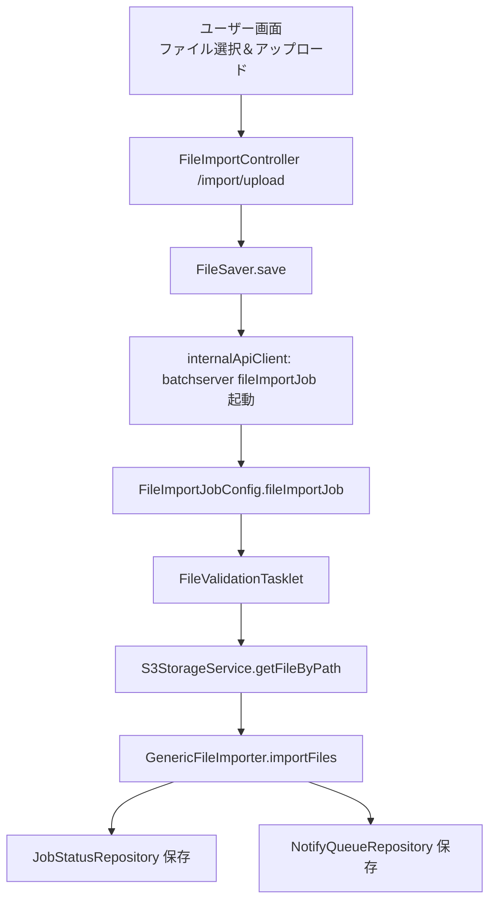

# ファイル取込_処理方式設計書

## 目的
ファイル取込の処理方式を整理し、非同期分類と処理フローを示す。

## 現行の主経路（batchserver 実行）

## 非同期処理分類との対応

| 分類 | 特徴 | 実行環境 | 処理例 |
| --- | --- | --- | --- |
| 軽量処理 | 数 ms〜秒未満 | appserver | フォーマットチェック、即時バリデーション | 
| 中程度の処理 | 数秒〜数分 | batchserver | fileImportJob（FileValidationTasklet） | 
| 重量処理 | 複数ファイル処理等 | batchserver | 一括集計バッチ、定期取り込みなど | 

## 旧仕様または未使用の経路（要確認）
- appserver の `FileImportService` による直接処理は Controller 側でコメントアウトされている。
- `FileImportScheduler` は `ImportJobExecutor.execute(file)` の呼び出しがコメントアウトされている。

## 注記
- `FileValidationTasklet` は `S3StorageService` を直接参照しているため、バッチ経路は S3 前提となっている可能性がある。切替可否は要確認。

## 参照元
- FileImport.md
