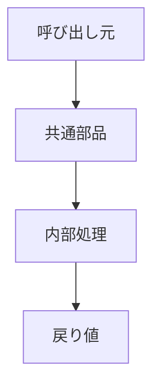

# 03_共通部品テンプレート

---

## 1. 目的
本モジュールの目的を記載する。  
「何を共通化するのか」「なぜ必要か」を明確にする。

---

## 2. 適用範囲
- 対象アプリ：{appserver / servercommon / batchserver}
- 利用対象：
  - {どの機能から呼ばれるか}
  - {どの層で使われるか（Controller / Service / Batch など）}

---

## 3. モジュール概要

### 3-1. 役割
- {何をする部品か}
- {どの処理を担うか}

### 3-2. 分類
- Utility / Service / Validator / Generator / Mapper / Component など

---

## 4. 構成要素

| 区分 | 名称 | 役割 |
|------|------|------|
| Service | `{Class名}` | {説明} |
| Utility | `{Class名}` | {説明} |
| Validator | `{Class名}` | {説明} |
| Repository | `{Class名}` | {説明} |
| Model | `{Class名}` | {説明} |

---

## 5. 入出力仕様

### 5-1. 主なメソッド

#### `{メソッド名}`

- 入力：
  - {パラメータ}
- 出力：
  - {戻り値}
- 説明：
  - {処理内容}

---

## 6. 処理フロー

または

1. {処理1}
2. {処理2}
3. {処理3}

---

## 7. 設計方針

### 7-1. 再利用性
- なぜ共通化されているか
- 他機能での利用想定

### 7-2. 拡張性
- どのように拡張可能か
- インタフェース設計の意図

### 7-3. 責務分離
- このモジュールがやること
- やらないこと

---

## 8. 依存関係

### 8-1. 依存先
- {Repository / Service / 外部API}

### 8-2. 呼び出し元
- {どの機能から使われるか}

---

## 9. 利用箇所

- {利用機能1}
- {利用機能2}
- {利用機能3}

---

## 10. 実装との整合

### 10-1. 確認内容
- クラス存在
- メソッド存在
- 入出力一致

### 10-2. 実装差異
- {差異があれば記載}
- 不明点は「要確認」

---

## 11. 制約・注意事項
- {排他制御}
- {トランザクション}
- {例外処理}
- {性能上の注意点}

---

## 12. テスト観点

| 観点 | 内容 |
|------|------|
| 正常系 | {説明} |
| 異常系 | {説明} |
| 境界値 | {説明} |
| 再利用性 | {説明} |

---

## 13. 要確認事項
- {要確認1}
- {要確認2}

---

## 14. 更新履歴

| ver | 日付 | 内容 |
|-----|------|------|
| 0.1 | {yyyy/MM/dd} | 初版 |

---

## 記載ルール

- 実装コードを正とする
- 推測禁止
- 不明は「要確認」
- 共通部品は「再利用単位」で書く
- 個別機能の説明は書かない（05に寄せる）
- API仕様は基本書かない（必要な場合のみ）
