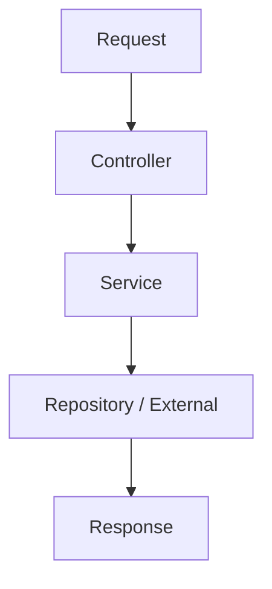

# 05_個別機能テンプレート

## 1. 目的
本機能の目的を記載する。  
利用者視点で「何のために使う機能か」を簡潔に記載する。

---

## 2. ユースケース
- どの画面・処理・利用者が使うか
- どのような操作で起動されるか
- 何を結果として得るか

### 2-1. 主な利用シナリオ
- {ユースケース1}
- {ユースケース2}
- {ユースケース3}

---

## 3. API仕様

### 3-1. API一覧
| No | Method | Path | 概要 |
|----|--------|------|------|
| 1 | {GET/POST/...} | `{path}` | {説明} |

### 3-2. リクエスト
#### エンドポイント: `{path}`

| 項目 | 型 | 必須 | 説明 |
|------|----|------|------|
| {項目名} | {型} | ○/× | {説明} |

#### リクエスト例
```json
{
  "{key}": "{value}"
}
```

### 3-3. レスポンス
| 項目 | 型 | 説明 |
|------|----|------|
| {項目名} | {型} | {説明} |

#### レスポンス例
```json
{
  "status": 200,
  "body": {}
}
```

---

## 4. 処理フロー

### 4-1. 概要フロー
1. {フロントエンド/呼び出し元} がリクエストを送信する
2. `{Controller}` が受信する
3. `{Service}` が処理を実行する
4. 必要に応じて `{Repository / 外部連携 / Job}` を呼び出す
5. レスポンスを返却する

### 4-2. フロー図（必要に応じて）


---

## 5. モジュール構成

| 区分 | 名称 | 役割 |
|------|------|------|
| Controller | `{Controller名}` | {説明} |
| Service | `{Service名}` | {説明} |
| Request DTO | `{Request名}` | {説明} |
| Response DTO | `{Response名}` | {説明} |
| Repository | `{Repository名}` | {説明} |
| Entity / Model | `{Entity名}` | {説明} |
| Enum | `{Enum名}` | {説明} |

### 5-1. 配置例
```plaintext
appserver
├── controller
│   └── {Controller名}.java
├── service
│   └── {Service名}.java
├── request
│   └── {Request名}.java

servercommon
├── repository
│   └── {Repository名}.java
├── entity
│   └── {Entity名}.java
└── enums
    └── {Enum名}.java
```

---

## 6. 実装との整合

### 6-1. 現行実装との対応
- 実装コードを正とする
- 設計書と実装が異なる場合は、実装内容を優先して記載する
- 実装未確認のものは「要確認」と明記する

### 6-2. 確認済み項目
- エンドポイント: `{path}`
- Controller: `{Controller名}`
- Service: `{Service名}`
- DTO: `{Request/Response}`
- 関連Enum/状態値: `{Enum名}`
- 関連Repository/Entity: `{Repository/Entity名}`

### 6-3. 実装注記
- {実装上の補足}
- {コメントアウト箇所や暫定実装など}
- {未実装/要確認事項}

---

## 7. 関連資料
- `DOC/1_DesignDocument/1-1_BaseDocs/BE/01_全体構成/...`
- `DOC/1_DesignDocument/1-1_BaseDocs/BE/02_設定値/...`
- `DOC/1_DesignDocument/1-1_BaseDocs/BE/03_共通部品/...`
- `DOC/1_DesignDocument/1-1_BaseDocs/BE/06_外部連携/...`
- `DOC/1_DesignDocument/1-1_BaseDocs/BE/07_例外処理/...`
- `DOC/1_DesignDocument/1-1_BaseDocs/BE/08_状態_コード定義/...`

---

## 8. 要確認事項
- {要確認1}
- {要確認2}
- {要確認3}

---

## 9. 制約・注意事項
- {業務上の制約}
- {実装上の制約}
- {運用上の注意点}

---

## 10. テスト観点
| 観点 | 内容 |
|------|------|
| 正常系 | {説明} |
| 異常系 | {説明} |
| 境界値 | {説明} |
| 業務整合性 | {説明} |

---

## 11. 更新履歴
| ver | 更新日 | 更新者 | 内容 |
|-----|--------|--------|------|
| 0.1 | {yyyy/MM/dd} | {name} | 初版作成 |

---

## 記載ルール
- 05_個別機能 では「利用者視点の機能仕様」と「実装との整合」を中心に書く
- 共通部品の内部詳細は書きすぎず、必要に応じて関連資料を参照させる
- 設定値、コード定義、外部連携の詳細は専用階層を参照する
- 実装コードを正とし、推測で補完しない
- 不明な事項は「要確認」と明記する
