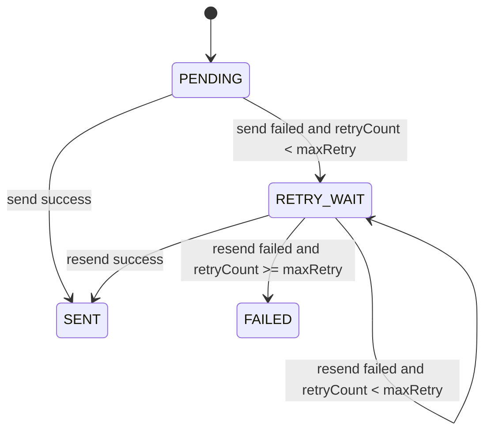

# 通知再送制御基盤_機能設計書

## 1. 目的
`notify_queue` ベース通知に再送上限、バックオフ、永久失敗状態管理を追加し、通知運用の安定性と監査性を高める。

## 2. ユースケース
- 帳票出力完了通知などで、一時的なWebSocket送信失敗が発生しても自動再送したい。
- 再送上限到達後の失敗を運用で追跡したい。

## 3. 主要処理

### 3-1. キュー登録
- `NotifyQueuePublisher.publish(eventType, refId)`
- `status=PENDING`, `retryCount=0`, `maxRetry=設定値`, `nextAttemptAt=now` で登録。

### 3-2. 定期スキャン送信
- `NotifyQueueScanService.scanAndNotify()`
- 対象: `status in (PENDING, RETRY_WAIT)` かつ `nextAttemptAt <= now`

### 3-3. 結果反映
- 成功: `SENT`, `notified=true`
- 失敗（上限未達）: `RETRY_WAIT`, `retryCount++`, `nextAttemptAt=backoff計算値`
- 失敗（上限到達）: `FAILED`, `nextAttemptAt=null`

## 4. API互換性
- 既存のイベント登録呼び出し（`publish(String, Long)`）は維持。
- 通知トピック命名（`/topic/notify/{eventType小文字}`）は変更なし。
- `NotifyQueueController` の最新取得は `SENT` 状態を参照。

## 5. 状態遷移図

## 6. 関連テーブル
- `notify_queue`
  - 追加: `status`, `max_retry`, `next_attempt_at`, `last_error_message`

## 7. 設定値
- `notify.queue.scan.limit`
- `notify.queue.scan.fixed-delay-ms`
- `notify.queue.scan.max-retry`
- `notify.queue.scan.backoff-initial-delay-ms`
- `notify.queue.scan.backoff-multiplier`
- `notify.queue.scan.backoff-max-delay-ms`

## 8. テスト観点
- 成功時 `SENT` 遷移
- 一時失敗時 `RETRY_WAIT` 遷移
- 上限到達時 `FAILED` 遷移
- Publisherの初期値設定
- eventType空文字の例外

## 9. 関連資料
- `03_共通部品/NotifyQueuePublisher設計書.md`
- `03_共通部品/NotifyQueueScanService設計書.md`
- `03_共通部品/WebSocketNotificationService設計書.md`
- `08_状態_コード定義/notify_queue定義書.md`

## 10. 更新履歴
| ver | 更新日 | 更新者 | 内容 |
|-----|--------|--------|------|
| 1.0 | 2026/04/01 | Codex | 通知再送制御基盤の実装内容を反映 |
