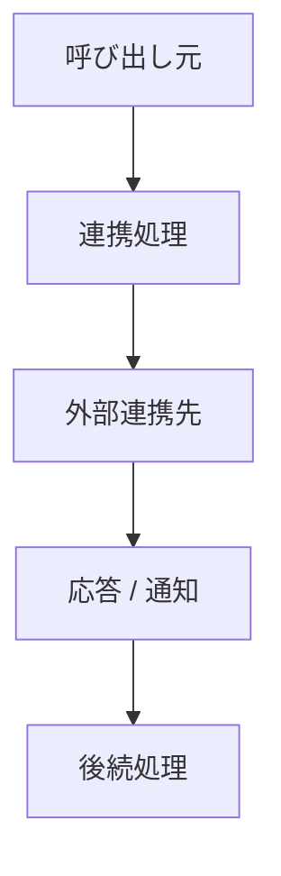

# 06_外部連携テンプレート

---

## 1. 目的
本資料は、外部システムまたは外部インフラとの連携方式を整理し、
**接続先・通信方式・入出力・エラー時の扱いを明確化すること**を目的とする。

---

## 2. 適用範囲
- 対象アプリ：{appserver / batchserver / servercommon / frontend}
- 連携対象：
  - {S3 / WebSocket / 外部API / HMAC署名通信 / メール / 通知基盤 など}
- 対象範囲：
  - 接続方式
  - 通信プロトコル
  - 送受信データ
  - エラー時の扱い

---

## 3. 連携概要

### 3-1. 連携先
- 連携先名：{名称}
- 種別：{外部API / ストレージ / メッセージング / 通知基盤}
- 役割：{何のために連携するか}

### 3-2. 連携方式
- 通信方式：{HTTP / HTTPS / WebSocket / STOMP / S3 API / SDK}
- 認証方式：{なし / HMAC / JWT / Basic / AccessKey}
- 同期 / 非同期：{同期 / 非同期}
- 接続方向：{送信 / 受信 / 双方向}

---

## 4. 接続仕様

### 4-1. 接続先
| 項目 | 内容 |
|------|------|
| エンドポイント / 接続先 | {URL / バケット / topic / path} |
| プロトコル | {HTTPS / STOMP / S3} |
| 認証情報 | {使用するキー・ヘッダ・トークン} |
| タイムアウト | {値} |
| リトライ | {有無 / 方針} |

### 4-2. 送信仕様
| 項目 | 内容 |
|------|------|
| 送信契機 | {いつ送るか} |
| 送信データ | {DTO / JSON / ファイル} |
| 送信先 | {URL / topic / bucket} |
| 送信形式 | {POST / PUT / convertAndSend / upload} |

### 4-3. 受信仕様
| 項目 | 内容 |
|------|------|
| 受信契機 | {何を契機に受けるか} |
| 受信データ | {DTO / JSON / ファイル} |
| 判定方法 | {署名検証 / topic / path一致} |
| 受信後処理 | {保存 / 通知 / 画面反映} |

---

## 5. 入出力仕様

### 5-1. 入力
| 項目 | 型 | 必須 | 説明 |
|------|----|------|------|
| {項目名} | {型} | ○/× | {説明} |

### 5-2. 出力
| 項目 | 型 | 説明 |
|------|----|------|
| {項目名} | {型} | {説明} |

---

## 6. 処理フロー

### 6-1. 概要フロー
1. {呼び出し元} が連携処理を開始する
2. {署名付与 / 接続 / DTO変換 / アップロード} を実施する
3. 外部連携先へ送信または接続する
4. レスポンスまたは通知を受け取る
5. 結果を {保存 / 返却 / 通知} する

### 6-2. フロー図

---

## 7. エラー処理・リトライ

| ケース | 対応 |
|--------|------|
| 接続失敗 | {例外 / ログ / 再試行} |
| 認証失敗 | {エラーコード / ログ} |
| タイムアウト | {再送 / 中断} |
| 署名不一致 | {拒否 / 例外} |

---

## 8. 設定値

| 設定キー | 用途 | 参照箇所 | 備考 |
|----------|------|----------|------|
| {key} | {説明} | {クラス} | {備考} |

---

## 9. 依存関係

### 9-1. 呼び出し元
- {どの機能 / サービス / バッチが使うか}

### 9-2. 関連部品
- {StorageService / SignedRestTemplate / NotificationService など}

### 9-3. 外部連携先
- {S3 / RapidReport / WebSocket Client / 他システム}

---

## 10. 実装との整合

### 10-1. 確認内容
- 接続先の存在
- 使用クラスの存在
- 認証方式の一致
- 入出力の一致

### 10-2. 実装差異
- {差異があれば記載}
- 不明は「要確認」とする

---

## 11. 制約・注意事項
- {外部システム依存}
- {ネットワーク制約}
- {順序保証 / 冪等性 / 署名期限}
- {運用上の注意点}

---

## 12. テスト観点

| 観点 | 内容 |
|------|------|
| 正常系 | {説明} |
| 異常系 | {説明} |
| 接続障害 | {説明} |
| 認証 / 署名 | {説明} |
| リトライ | {説明} |

---

## 13. 要確認事項
- {要確認1}
- {要確認2}

---

## 14. 更新履歴

| ver | 日付 | 内容 |
|-----|------|------|
| 0.1 | {yyyy/MM/dd} | 初版 |

---

## 記載ルール
- 実装コードを正とする
- 推測禁止
- 不明は「要確認」
- 06では「外部との接続仕様」を書く
- クラス内部実装の詳細は03に記載する
- DB定義は08に記載する
- 機能仕様は05に記載する
