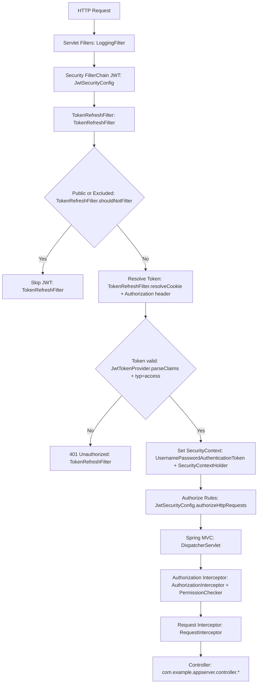
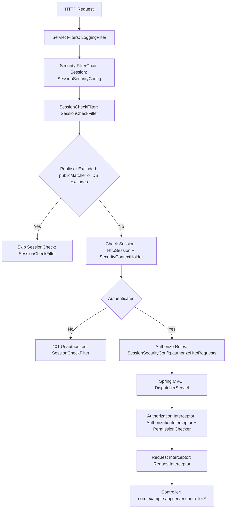

# Security Class Report (appserver)

## Overview
This report summarizes the current security execution flow for API requests in `BE/appserver` and lists classes that are not invoked in the main runtime path.

## Active Config (by `security.auth.mode`)
- `jwt` (default): `JwtSecurityConfig` is active.
- `session`: `SessionSecurityConfig` is active.

`application-local.yml` currently sets `security.auth.mode: jwt`.

## Flow Diagram (JWT mode)

## Flow Diagram (Session mode)

## Flow Step to Class Mapping
### Common Steps
- Servlet Filters: `BE/appserver/src/main/java/com/example/appserver/config/WebConfig.java` registers `LoggingFilter` (`BE/appserver/src/main/java/com/example/appserver/filter/LoggingFilter.java`).
- Spring MVC: Controller layer under `BE/appserver/src/main/java/com/example/appserver/controller`.
- Authorization Interceptor: `BE/appserver/src/main/java/com/example/appserver/interceptor/AuthorizationInterceptor.java`
- PermissionChecker: `BE/appserver/src/main/java/com/example/appserver/security/PermissionChecker.java`
- Request Interceptor: `BE/appserver/src/main/java/com/example/appserver/interceptor/RequestInterceptor.java`

### JWT Mode Steps
- Security FilterChain JWT: `BE/appserver/src/main/java/com/example/appserver/config/JwtSecurityConfig.java`
- TokenRefreshFilter: `BE/appserver/src/main/java/com/example/appserver/filter/TokenRefreshFilter.java`
- Resolve Token: `TokenRefreshFilter.resolveCookie(...)` and `Authorization` header parsing
- Token valid: `JwtTokenProvider.parseClaims(...)` and `typ=access` check in `TokenRefreshFilter`
- Set SecurityContext: `TokenRefreshFilter` sets `UsernamePasswordAuthenticationToken` into `SecurityContextHolder`
- Authorize Rules: `JwtSecurityConfig.authorizeHttpRequests(...)`

### Session Mode Steps
- Security FilterChain Session: `BE/appserver/src/main/java/com/example/appserver/config/SessionSecurityConfig.java`
- SessionCheckFilter: `BE/appserver/src/main/java/com/example/appserver/filter/SessionCheckFilter.java`
- Public or Excluded: `SessionCheckFilter.publicMatcher` and DB-driven excludes via `EndpointSessionNotSubjectRepository`
- Check Session: `SessionCheckFilter` checks `HttpSession` and `SecurityContextHolder`
- Authorize Rules: `SessionSecurityConfig.authorizeHttpRequests(...)`

## Concrete Execution Order (from code)
### Common
- `LoggingFilter` is registered as a servlet `Filter` via `WebConfig`.
- Spring Security filter chain is registered by Spring Security.
- Interceptors run in order of registration: `AuthorizationInterceptor` then `RequestInterceptor`.

### JWT mode (`JwtSecurityConfig`)
1. CORS enabled
2. form login disabled
3. CSRF disabled
4. logout disabled
5. session policy = STATELESS
6. `TokenRefreshFilter` added **before** `UsernamePasswordAuthenticationFilter`
7. SecurityContextRepository = `NullSecurityContextRepository`
8. `exceptionHandling` -> 401/403
9. `authorizeHttpRequests` with explicit allowlist + `anyRequest().authenticated()`

### Session mode (`SessionSecurityConfig`)
1. CORS enabled
2. form login disabled
3. CSRF disabled
4. logout disabled
5. session policy = IF_REQUIRED
6. `SessionCheckFilter` added **before** `UsernamePasswordAuthenticationFilter`
7. SecurityContextRepository = `HttpSessionSecurityContextRepository`
8. `exceptionHandling` -> 401/403
9. `authorizeHttpRequests` with explicit allowlist + `anyRequest().authenticated()`

## Unused / Not Invoked in Main Runtime
### `JwtAuthenticationFilter`
- File: `BE/appserver/src/main/java/com/example/appserver/security/JwtAuthenticationFilter.java`
- Evidence: Not referenced or registered in any `SecurityFilterChain` or bean config.
- Only referenced in tests: `B`.

## Notes / Potential Ambiguities
- `LoggingFilter` order relative to Spring Security chain is not explicitly controlled (no `@Order` or `FilterRegistrationBean` order). If strict ordering is required, consider adding explicit order.

## Source Files Reviewed
- `BE/appserver/src/main/java/com/example/appserver/config/JwtSecurityConfig.java`
- `BE/appserver/src/main/java/com/example/appserver/config/SessionSecurityConfig.java`
- `BE/appserver/src/main/java/com/example/appserver/filter/TokenRefreshFilter.java`
- `BE/appserver/src/main/java/com/example/appserver/filter/SessionCheckFilter.java`
- `BE/appserver/src/main/java/com/example/appserver/config/WebConfig.java`
- `BE/appserver/src/main/java/com/example/appserver/interceptor/AuthorizationInterceptor.java`
- `BE/appserver/src/main/java/com/example/appserver/interceptor/RequestInterceptor.java`
- `BE/appserver/src/main/java/com/example/appserver/security/JwtAuthenticationFilter.java`
- `BE/appserver/src/main/resources/application-local.yml`
