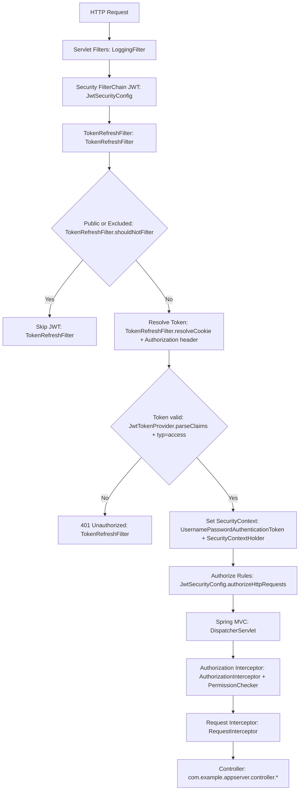
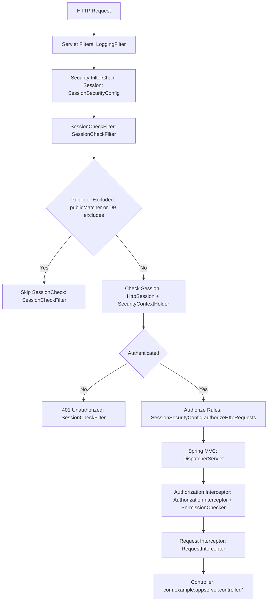

# セキュリティクラス調査レポート（appserver）

## 概要
本レポートは `BE/appserver` における API リクエスト時のセキュリティ実行フローを整理し、実行経路に乗らないクラスを一覧化したものです。

## 有効設定（`security.auth.mode`）
- `jwt`（デフォルト）: `JwtSecurityConfig` が有効
- `session`: `SessionSecurityConfig` が有効

`application-local.yml` では `security.auth.mode: jwt` が設定されています。

## フロー図（JWT モード）

## フロー図（Session モード）

## フロー各ステップと該当クラス
### 共通ステップ
- Servlet Filters: `BE/appserver/src/main/java/com/example/appserver/config/WebConfig.java` が `LoggingFilter` を登録（`BE/appserver/src/main/java/com/example/appserver/filter/LoggingFilter.java`）。
- Spring MVC: Controller 層（`BE/appserver/src/main/java/com/example/appserver/controller` 配下）。
- Authorization Interceptor: `BE/appserver/src/main/java/com/example/appserver/interceptor/AuthorizationInterceptor.java`
- PermissionChecker: `BE/appserver/src/main/java/com/example/appserver/security/PermissionChecker.java`
- Request Interceptor: `BE/appserver/src/main/java/com/example/appserver/interceptor/RequestInterceptor.java`

### JWT モードのステップ
- Security FilterChain JWT: `BE/appserver/src/main/java/com/example/appserver/config/JwtSecurityConfig.java`
- TokenRefreshFilter: `BE/appserver/src/main/java/com/example/appserver/filter/TokenRefreshFilter.java`
- Resolve Token: `TokenRefreshFilter.resolveCookie(...)` と `Authorization` ヘッダ解析
- Token valid: `JwtTokenProvider.parseClaims(...)` と `typ=access` 判定（`TokenRefreshFilter` 内）
- Set SecurityContext: `TokenRefreshFilter` が `UsernamePasswordAuthenticationToken` を `SecurityContextHolder` に設定
- Authorize Rules: `JwtSecurityConfig.authorizeHttpRequests(...)`

### Session モードのステップ
- Security FilterChain Session: `BE/appserver/src/main/java/com/example/appserver/config/SessionSecurityConfig.java`
- SessionCheckFilter: `BE/appserver/src/main/java/com/example/appserver/filter/SessionCheckFilter.java`
- Public or Excluded: `SessionCheckFilter.publicMatcher` および `EndpointSessionNotSubjectRepository` による DB 除外
- Check Session: `SessionCheckFilter` が `HttpSession` と `SecurityContextHolder` を確認
- Authorize Rules: `SessionSecurityConfig.authorizeHttpRequests(...)`

## 実行順（コードベース）
### 共通
- `LoggingFilter` は `WebConfig` で servlet `Filter` として登録。
- Spring Security の FilterChain は Spring Security により登録。
- Interceptor の実行順は登録順で、`AuthorizationInterceptor` → `RequestInterceptor`。

### JWT モード（`JwtSecurityConfig`）
1. CORS 有効化
2. form login 無効化
3. CSRF 無効化
4. logout 無効化
5. session policy = STATELESS
6. `TokenRefreshFilter` を **`UsernamePasswordAuthenticationFilter` より前**に追加
7. SecurityContextRepository = `NullSecurityContextRepository`
8. `exceptionHandling` -> 401/403
9. `authorizeHttpRequests`（許可パス + `anyRequest().authenticated()`）

### Session モード（`SessionSecurityConfig`）
1. CORS 有効化
2. form login 無効化
3. CSRF 無効化
4. logout 無効化
5. session policy = IF_REQUIRED
6. `SessionCheckFilter` を **`UsernamePasswordAuthenticationFilter` より前**に追加
7. SecurityContextRepository = `HttpSessionSecurityContextRepository`
8. `exceptionHandling` -> 401/403
9. `authorizeHttpRequests`（許可パス + `anyRequest().authenticated()`）

## 未使用／実行経路に入らないクラス
### `JwtAuthenticationFilter`
- ファイル: `BE/appserver/src/main/java/com/example/appserver/security/JwtAuthenticationFilter.java`
- 根拠: `SecurityFilterChain` や Bean 設定に登録されていないため、本番フローには乗らない。
- 参照先: テストのみ（`BE/appserver/src/test/java/com/example/appserver/security/JwtAuthenticationFilterTest.java`）。

## 注意点／曖昧さ
- `LoggingFilter` の実行順は明示されていない（`@Order` や `FilterRegistrationBean` で order が未設定）。順序の厳密化が必要なら明示的に order 設定が必要。

## 参照ファイル
- `BE/appserver/src/main/java/com/example/appserver/config/JwtSecurityConfig.java`
- `BE/appserver/src/main/java/com/example/appserver/config/SessionSecurityConfig.java`
- `BE/appserver/src/main/java/com/example/appserver/filter/TokenRefreshFilter.java`
- `BE/appserver/src/main/java/com/example/appserver/filter/SessionCheckFilter.java`
- `BE/appserver/src/main/java/com/example/appserver/config/WebConfig.java`
- `BE/appserver/src/main/java/com/example/appserver/interceptor/AuthorizationInterceptor.java`
- `BE/appserver/src/main/java/com/example/appserver/interceptor/RequestInterceptor.java`
- `BE/appserver/src/main/java/com/example/appserver/security/JwtAuthenticationFilter.java`
- `BE/appserver/src/main/resources/application-local.yml`

