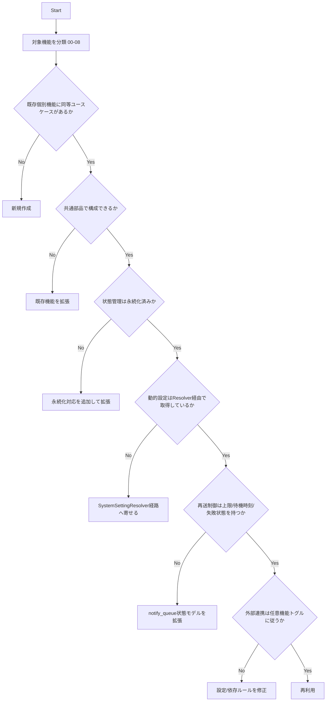

# 再利用判定フロー（バックエンド）

## 目的
新規実装時に、既存資産の再利用/拡張/新規作成を一貫した基準で判断する。

## 判定フロー

## 判定観点

### 1. 機能境界
- `05_個別機能` のAPI契約を維持しているか。
- 既存利用者の互換性（レスポンス形式、jobName利用）を壊していないか。

### 2. 共通部品利用
- 生成/保存は `StorageService`。
- 非同期状態は `AsyncJobStatusService` + `async_job_execution`。
- エラー処理は共通方針（`BackendMessageCatalog`、共通ハンドリング）。

### 3. 状態管理
- メモリキャッシュ単独管理になっていないか。
- TTL削除と期限切れ状態（`EXPIRED`）を定義しているか。

### 4. 外部連携と依存
- sync送信は `sync.outbox.use` でON/OFF可能か。
- `sync.outbox.use=false` のシステムに `sync-connector` 依存を強制していないか。

### 5. 動的設定解決
- 業務可変設定が `SystemSettingResolver` 経由で取得されているか。
- 設定キーを `SystemSettingKeys` で管理しているか。
- 更新時に履歴保存とキャッシュ無効化が実行されるか。

### 6. 通知再送制御
- 通知再送は `NotifyQueueStatus`（`PENDING/RETRY_WAIT/SENT/FAILED`）で管理しているか。
- `next_attempt_at` とバックオフ設定で再送タイミングを制御しているか。
- 上限到達時に `FAILED` を保持し、監査可能か。

## 結論基準
- 再利用: 既存機能・共通部品・状態管理・依存ルールの全条件を満たす。
- 拡張: 機能境界は一致するが、状態管理/設定/例外が不足する。
- 新規作成: 既存ユースケースと責務が明確に異なる。
