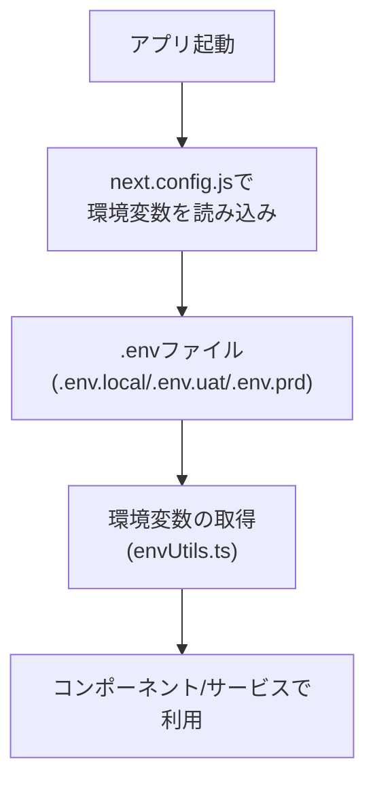
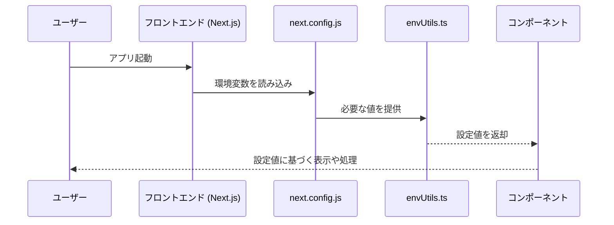

# 環境変数の設定 フロントエンド編

## 1. モジュール概要

### 1-1. 目的
本モジュールは、Next.js アプリケーション内で使用する各種設定値（API のベースURL、タイムアウト、通知表示時間など）を環境変数として一元管理することを目的とする。  
これにより、以下の点が実現される：
- **セキュリティの向上**：公開すべき値（NEXT_PUBLIC_～）と秘密情報（サーバーサイドのみ使用）を分離できる。
- **柔軟な設定変更**：開発環境、ステージング、本番環境など各環境に応じた設定が可能となる。
- **保守性・拡張性の向上**：設定値の変更がアプリケーションコードに影響を与えず、容易に環境ごとの調整が行える。

### 1-2. 適用範囲
本モジュールで管理する環境変数は、以下の用途に適用される：
- **API通信**  
  - API のベースURL（例: `NEXT_PUBLIC_API_BASE_URL`）  
  - タイムアウト設定（例: `NEXT_PUBLIC_API_TIMEOUT`）
  - APIのキャッシュ設定(例:`NEXT_PUBLIC_REACT_QUERY_STALE_TIME=30000 ,NEXT_PUBLIC_REACT_QUERY_CACHE_TIME=90000`)

- **UI通知**  
  - エラーメッセージ通知（例: `NEXT_PUBLIC_ERROR_NOTIFICATION_TIMEOUT`）  
  - スナックバーの表示時間（例: `NEXT_PUBLIC_SNACKBAR_TIMEOUT`）
**非公開のログレベルなどの設定**  
  -ログレベル(例:`LOG_LEVEL=debug`)
- **その他のフロントエンド設定**  
  アプリケーション内で必要となる公開設定全般

## 2. 設計方針

### 2-1. アーキテクチャ方針
- **環境変数ファイルの利用**  
  Next.js の仕様に従い、ルートディレクトリに `.env.local`、`.env.uat`、`.env.prd` などのファイルを配置する。
- **型安全性の確保**  
  TypeScript を活用し、必要に応じて環境変数の値を変換・検証するユーティリティ関数を実装する。
- **ランタイム設定**  
  Next.js の `next.config.js` で環境変数を公開設定（`NEXT_PUBLIC_` で始まる変数）として定義し、クライアント側でも利用可能にする。

### 2-2. 統一的なルール
- **命名規則**  
  クライアント側で利用する環境変数は必ず `NEXT_PUBLIC_` で始める。
- **デフォルト値の設定**  
  環境変数が未定義の場合に備えたデフォルト値を用意する。
- **セキュリティ対策**  
  サーバーサイド専用の設定値は `NEXT_PUBLIC_` プレフィックスを付けず、クライアントには公開されないようにする。

### 2-3. 拡張性・変更の考慮
- **環境毎の設定管理**  
  各環境（開発、ステージング、本番）ごとに異なる設定値を `.env` ファイルに記述し、dotenv などの環境変数管理ツールを活用する。
- **再利用性**  
  環境変数の取得・変換を共通のユーティリティ関数で実装し、コード全体で再利用する。

## 3. 📂 フォルダ構成とファイルの役割

```plaintext
.
├── .env.local                // ローカル開発用環境変数
├── .env.development          // 開発環境用環境変数
├── .env.production           // 本番環境用環境変数
├── next.config.js            // Next.js の公開環境変数設定
└── src/
    ├── utils/
    │   └── envUtils.ts       // 環境変数の取得と型変換用ユーティリティ
    └── (その他のアプリケーションコード)
```

## 4. 📌 各ファイルの説明

- **.env.local, .env.uat, .env.prd**  
    各環境に合わせた環境変数の定義ファイル。

```
#APIエンドポイント
NEXT_PUBLIC_API_BASE_URL=http://localhost:3005
NEXT_PUBLIC_API_VERSION=v1
# APIのキャッシュ設定
NEXT_PUBLIC_REACT_QUERY_STALE_TIME=30000
NEXT_PUBLIC_REACT_QUERY_CACHE_TIME=90000

# APIのタイムアウト設定
NEXT_PUBLIC_API_TIMEOUT=10000

# エラー通知の表示時間
NEXT_PUBLIC_ERROR_NOTIFICATION_TIMEOUT=5000

# ログレベル これらはクライアントに表示しない。
LOG_LEVEL=debug
LOG_MAX_SIZE=20m
LOG_MAX_FILES=14d
LOG_ROTATION_FREQUENCY=1d

TEAMS_WEBHOOK_URL=https://outlook.office.com/webhook/your-webhook-url
NEXT_PUBLIC_SENTRY_DSN=your-sentry-dsn
```

- **next.config.js**
Next.js の設定ファイル。
公開環境変数（NEXT_PUBLIC_ で始まる変数）を env プロパティで定義する。
```
module.exports = {
  env: {
    NEXT_PUBLIC_API_BASE_URL: process.env.NEXT_PUBLIC_API_BASE_URL,
    NEXT_PUBLIC_API_TIMEOUT: process.env.NEXT_PUBLIC_API_TIMEOUT,
    NEXT_PUBLIC_ERROR_NOTIFICATION_TIMEOUT: process.env.NEXT_PUBLIC_ERROR_NOTIFICATION_TIMEOUT,
    NEXT_PUBLIC_SNACKBAR_TIMEOUT: process.env.NEXT_PUBLIC_SNACKBAR_TIMEOUT,
  },
};

```

- **src/utils/envUtils.ts**
環境変数の取得と型変換のためのユーティリティ関数を提供する。

```
export const getApiBaseUrl = (): string => {
  return process.env.NEXT_PUBLIC_API_BASE_URL || 'https://default.example.com';
};

export const getApiTimeout = (): number => {
  return Number(process.env.NEXT_PUBLIC_API_TIMEOUT) || 5000;
};

```

## 5. 📌 処理フロー図



## 6. 📌 処理シーケンス図


