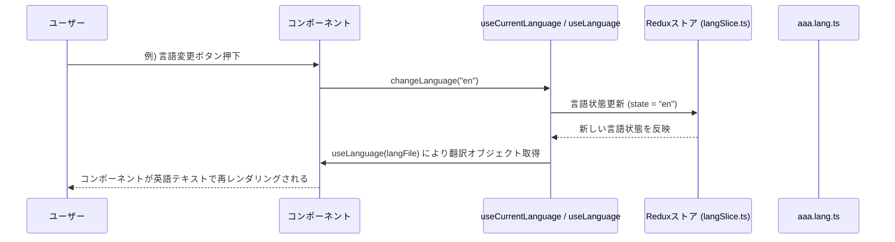

# 言語切り替え機能設計書

## 1. モジュール概要

### 1-1. 目的
本モジュールは、アプリケーション内で使用するテキストをユーザーの選択に応じて切り替えるための共通インターフェースを提供する。  
これにより、グローバルな言語設定に基づき各画面・コンポーネントで適切な言語の表示が可能となり、ユーザーエクスペリエンスの向上と国際化対応を実現する。

### 1-2. 適用範囲
- アプリケーション内の全ページおよび各コンポーネントでのテキスト表示
- ユーザーが言語設定を変更した際の即時反映
- 言語ごとの翻訳ファイル（例: `user.lang.ts`）によるテキスト管理

---

## 2. 設計方針

### 2-1. アーキテクチャ
- **Redux ベースの状態管理**
  言語設定は Redux の `langSlice.ts` によりグローバルに管理され、アプリ内の全コンポーネントで共通の言語情報として参照できるようにする。

- **カスタムフックの利用**
  - **useCurrentLanguage.ts:** Redux の `langSlice.ts` を利用し、言語状態の参照と変更操作を簡潔に実装する。
  - **useLanguage.ts:** 現在の `langSlice` の状態（例: `ja` または `en`）を参照し、各コンポーネント固有の言語ファイル（例: `user.lang.ts`）から適切なテキストオブジェクトを返す。

- **言語ファイルの管理**
  各ページ・コンポーネント用に、専用の言語ファイル（例: `aaa.lang.ts`）を用意し、共通フォーマットで翻訳テキストを定義する。
  例:
  ```js
  export default {
    ja: { title: 'タイトル' },
    en: { title: 'title' },
  };
  ```

- **実装例**  
  ```jsx
  // 使用例
  import lang from 'path/to/aaa.lang';
  const l = useLanguage(lang);
  return <text>{l.title}</text>;
  ```

### 2-2. 統一ルール
- すべての言語状態は Redux 経由で管理し、コンポーネントからはカスタムフックを利用して参照・更新する。  
- 言語ファイルは各モジュールごとに共通フォーマットで定義し、容易なメンテナンスと拡張性を確保する。  
- 初期言語はアプリ起動時に設定され、ユーザー操作により動的に変更可能とする。

---

## 3. 📂 フォルダ構成とファイルの役割

```plaintext
src/
├── slices/
│   └── langSlice.ts          // グローバルな言語状態の管理（現在の言語、切り替えアクション）
├── hooks/
│   ├── useCurrentLanguage.ts // 言語状態参照・変更用カスタムフック
│   └── useLanguage.ts        // 現在の言語状態に基づき、指定した言語ファイルから適切なテキストを返すカスタムフック
└── page/
│   ├── user.tsx                //ページファイル
    └── user.lang.ts           // 各ページ・コンポーネント用の言語ファイル例
```

---

## 4. 📌 各ファイルの説明

### langSlice.ts
**目的:**
グローバルな言語設定（例: 現在選択中の言語 `ja` / `en`）を管理する。

**機能:**
- **changeLanguage:** 指定した言語に状態を更新するアクションを提供する。
- **初期値:** アプリ起動時のデフォルト言語（例: `ja`）を設定。

```ts
<!-- INCLUDE:FE\spa-next\my-next-app\src\slices\langSlice.ts -->
```

---

### useCurrentLanguage.ts
**目的:**
Redux の `langSlice.ts` を利用して、現在の言語状態参照と切り替え操作を簡潔に呼び出せるカスタムフックを提供する。

**機能:**
- **language:** 現在の言語状態を返す。
- **changeLanguage:** 例: `const { language, changeLanguage } = useCurrentLanguage();` として使用し、引数で指定した言語に切り替える。

```ts
  <!-- INCLUDE:FE\spa-next\my-next-app\src\hooks\useCurrentLanguage.ts -->
```

---

### useLanguage.ts
**目的:**
現在の言語状態（`langSlice` の state）を参照し、渡された言語ファイルから該当する言語のテキストオブジェクトを返すカスタムフックを提供する。

**機能:**
- **引数:** 各コンポーネント固有の言語ファイル（例: `user.lang.ts`）
- **返却:** 現在の言語に対応する翻訳オブジェクト
- **利用例:**
  ```jsx
  const lang = userLang; // aaa.lang.ts のインポート結果
  const l = useLanguage(lang);
  return <text>{l.title}</text>;
  ```

---

### user.lang.ts
**目的:**
各ページ・コンポーネント単位で使用する翻訳テキストを定義する。

**形式:**
```js
export default {
  ja: { title: 'ユーザーページ' },
  en: { title: 'UserPage' },
};
```

---

## 5. 📂 処理フロー図

```mermaid
flowchart TD
    A[アプリ起動]
    B[Redux ストア初期化 <br>(store.ts)]
    C[langSlice 初期化]
    D[useCurrentLanguage / useLanguage フック利用]
    E[各コンポーネントで適切な言語テキストをレンダリング]

    A --> B
    B --> C
    C --> D
    D --> E
```

---

## 6. 📂 処理シーケンス図



---

## 7. 実装例

```jsx
import React from 'react';
import userLang from '../user.lang';
import { useLanguage } from '../hooks/useLanguage';
import { useCurrentLanguage } from '../hooks/useCurrentLanguage';

const UserPage = () => {
  const { language } = useCurrentLanguage();
  const l = useLanguage(userLang);
  return (
    <div>
      <h1>{l.title}</h1> {/* 現在の language に応じたページタイトル */}
      {/* 他のコンポーネントも同様に利用 */}
    </div>
  );
};

export default UserPage;
```


