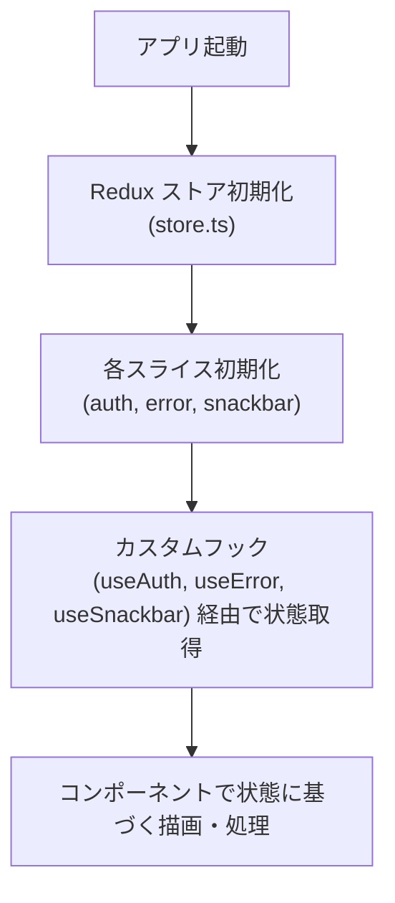
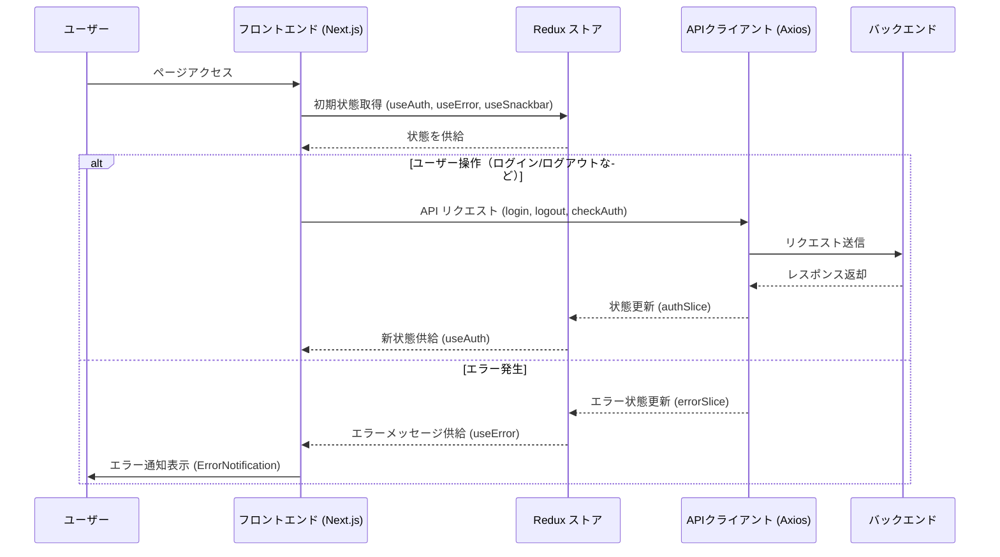

# 状態管理モジュール  仕様書

本仕様書は、アプリケーション全体のグローバル状態を管理するためのモジュールに関する設計・実装方針を定義します。  
主に Redux を中心に、認証状態、エラー、通知（スナックバー）などの状態管理を行います。

---

## 1. モジュール概要

### 1-1. 目的
- アプリ全体の状態（認証、エラー、通知など）を一元管理し、各コンポーネント間で状態を共有する。
- 状態の更新・取得を効率化し、コンポーネントの再レンダリングや副作用管理を容易にする。
- 型安全な実装（TypeScript と Redux Toolkit）により、開発中のエラー発生を最小限に抑える。

### 1-2. 適用範囲
- 認証情報（ログイン状態、ユーザー権限）の管理
  → `authSlice.ts` とカスタムフック `useAuth.ts` により実装
- エラーメッセージの管理
  → `errorSlice.ts` とカスタムフック `useError.ts` により実装
- スナックバー通知の管理
  → `snackbarSlice.ts` とカスタムフック `useSnackbar.ts` により実装

---

## 2. 設計方針

### 2-1. アーキテクチャ方針
- **Redux を中心とした状態管理**
  - Redux Toolkit を使用して、状態管理ロジック（スライス）の実装を簡略化し、型安全性を確保する。
  - 各状態（認証、エラー、スナックバー、lang）はそれぞれ独立したスライスとして実装し、責務を明確に分離する。

- **カスタムフックによるアクセスの抽象化**
  - `useAuth`, `useError`, `useSnackbar` などのカスタムフックを用いて、コンポーネントは Redux の内部実装に依存せずに状態へアクセスできる。
  - これにより、状態管理のロジックを変更する場合でもコンポーネント側の修正を最小限に抑える。

### 2-2. 統一的なルール
- **状態の初期値と更新**
  - 各スライスは初期状態（initialState）を明確に定義し、アクションによる状態更新（reducers および extraReducers）を行う。
- **非同期処理の管理**
  - 認証チェック、ログイン、ログアウトなどの非同期処理は、Redux の createAsyncThunk を用いて実装する。
- **エラーハンドリング**
  - API 呼び出しで発生したエラーは `errorSlice` を通してグローバルに管理し、必要に応じて通知コンポーネントで表示する。
- **ログアウト時の挙動**
　- 各sliceには初期値を設定し、ログアウト処理時に初期化されても、UIに影響を与えない設計とする。
  - システム要件によってはログアウト後にも保持される場合あり。

### 2-3. 拡張性・変更の考慮
- **モジュールの分離**
  - 認証、エラー、通知は別々のスライスとして管理し、今後の機能拡張に対応可能な設計とする。
- **型安全性**
  - TypeScript により、状態やアクションの型を明確に定義し、開発時のエラー検出を容易にする。

### 2-4. APIモジュールとの住み分け
## 1. Redux の役割

- **クライアントサイドの状態管理**
  ユーザーインターフェースの状態、フォーム入力、ナビゲーション情報、UI の表示非表示など、アプリ全体で共有・変更されるローカルな状態の管理に最適。

- **アプリケーションロジックの集中**
  グローバルな状態管理により、どのコンポーネントからも同じ状態にアクセスできるため、アプリのロジックや状態遷移が一元的に把握しやすい。

## 2. React Query の役割

- **サーバーサイドの状態管理**
  非同期データのフェッチ、キャッシュ、再検証（revalidation）、エラーハンドリングなど、サーバーから取得するデータに特化した管理を行います。

- **キャッシュ戦略と自動リフェッチ**
  `staleTime` や `cacheTime` を柔軟に設定でき、ユーザー体験やサーバー負荷に合わせた最適なデータ更新を実現します。プリセットによる一貫性のある戦略を適用できるため、各 API ごとのデータ鮮度の管理が容易です。

- **ボイラープレートの削減**
  API 呼び出しの共通処理（ローディング状態やエラー処理など）がフックとして提供されるため、コード量を大幅に削減でき、開発効率が向上します。

## 3. 分担することのメリット

- **責務の分離（Separation of Concerns）**
  クライアントサイドのローカル状態とサーバーサイドの非同期データを明確に分けることで、各領域の複雑性を管理しやすくなります。UI の動作とデータフェッチを分離させることでデバッグが用意になる。

- **パフォーマンスとユーザー体験の向上**
  React Query のキャッシュと自動リフェッチ機能により、最新のサーバーデータを効率よく管理し、ユーザーへのレスポンスを高速に提供。一方、Redux は頻繁に変化するローカルな UI 状態の管理に最適であり、全体のパフォーマンスを維持できる。

- **保守性と拡張性**
  それぞれのツールが専門分野に特化するため、アプリケーションの保守や拡張が容易になる。Redux は UI 状態の一元管理に専念し、React Query は API コールとサーバーデータのキャッシュ戦略に特化することで、今後の要件変更や新機能追加にも柔軟に対応可能。

## まとめ

Redux と React Query を役割ごとに分担する設計は、クライアント側のローカル状態とサーバーからのデータ取得をそれぞれ専門的に扱うため、コードの明確性、パフォーマンス、保守性の向上に大きく寄与。これにより、アプリケーション全体が堅牢で拡張しやすい構造にとなる。

---
### 2-5. ReactContextとReduxについて

---

| 比較項目                   | React Context                                                    | Redux                                                        | コメント・スケールメリット                         |
|----------------------------|------------------------------------------------------------------|--------------------------------------------------------------|---------------------------------------------------|
| **パフォーマンス**         | コンテキストの値が変わると、すべてのコンシューマが再レンダリングされる | セレクターやメモ化により、必要な部分のみ再レンダリングされる     | 大規模アプリでは無駄なレンダリングを抑え、効率的な更新が可能 |
| **状態管理の一元化**       | 複数のコンテキストで状態管理すると管理が分散しやすい               | 単一のストアで全体の状態を一元管理し、状態の流れが明確になる         | 状態管理が統一され、保守性・拡張性が向上           |
| **デバッグ・ツール**       | デフォルトでは専用のデバッグツールが存在しない                     | Redux DevTools によるタイムトラベルやアクションロギングが可能         | 状態変化の追跡やデバッグが容易になり、問題解決が迅速   |
| **ミドルウェア・拡張性**   | ミドルウェアの概念がなく、共通処理の統一が難しい                     | ミドルウェア（例: redux-thunk、redux-saga）により共通処理を一元化可能  | 拡張や非同期処理の実装が柔軟で、大規模な拡張に対応できる  |
| **ボイラープレート**       | シンプルな実装で初期設定は容易                                       | 初期設定やコード量は増えるが、Redux Toolkit で軽減可能              | 小規模では冗長になるが、スケールアップ時には投資効果が高い |
| **学習コスト**             | 簡単に導入できるが、規模が大きくなると複雑になりやすい               | 初期の学習コストは高いが、大規模開発に適した堅牢な設計が可能          | 大規模プロジェクトでは、学習投資が長期的に有益         |

---

---

## 3. 📂 フォルダ構成とファイルの役割
src/
├── slices/
│   ├── authSlice.ts        // 認証状態（ログイン、ユーザー権限）の管理
│   ├── errorSlice.ts       // グローバルエラーメッセージの管理
│   ├── langSlice.ts       // グローバル言語状態の管理
│   └── snackbarSlice.ts    // スナックバー通知の管理
├── hooks/
│   ├── useAuth.ts          // Redux の authSlice を利用した認証状態アクセス用カスタムフック
│   ├── useError.ts         // Redux の errorSlice を利用したエラー管理用カスタムフック
│   ├── useCurrentLanguage.ts // Redux の langSlice を利用した言語状態参照・更新用カスタムフック
│   ├── useLanguage.ts     // 現在の言語状態に応じて辞書から文言を返すフック
│   └── useSnackbar.ts      // Redux の snackbarSlice を利用した通知管理用カスタムフック
└── store.ts                // Redux ストアの設定と各スライスの統合


## 4. 📌 各ファイルの説明

### 4-1. store.ts
- **役割**: Redux ストアの作成と設定を行い、各スライス（auth、error、snackbar）を統合する。
- **ポイント**: Redux Toolkit を利用して効率的にストア設定を行う。

```js
<!-- INCLUDE:FE\spa-next\my-next-app\src\store.ts -->
```

### 4-2. slices/authSlice.ts
- **役割**: 認証状態、ユーザーの権限情報を管理。ログイン、ログアウト、認証チェックなどの非同期処理を実装する。
- **主な機能**:
  - `login`、`logout`、`checkAuth` の createAsyncThunk を用いた非同期アクション
  - 成功時・失敗時の状態更新（isAuthenticated、rolePermissions、status、error）

```js
<!-- INCLUDE:FE\spa-next\my-next-app\src\slices\authSlice.ts -->
```

### 4-3. slices/errorSlice.ts
- **役割**: グローバルなエラーメッセージを管理するためのスライス。エラー発生時にエラーメッセージを更新し、ユーザーに通知する。
- **主な機能**:
  - エラーメッセージの設定 (`setErrorMessage`)
  - エラーメッセージのクリア (`clearErrorMessage`)

```js
<!-- INCLUDE:FE\spa-next\my-next-app\src\slices\errorSlice.ts -->
```

### 4-4. slices/snackbarSlice.ts
- **役割**: スナックバー通知（ユーザーへの一時的なメッセージ表示）の管理を行うスライス。
- **主な機能**:
  - スナックバー表示 (`showSnackbar`)
  - スナックバー非表示 (`hideSnackbar`)

```js
<!-- INCLUDE:FE\spa-next\my-next-app\src\slices\snackbarSlice.ts -->
```

### 4-5. slices/langSlice.ts
- **役割**: グローバルの言語設定管理を行うスライス。
- **主な機能**:
  - 表示言語の切り替え (`language`)

```js
<!-- INCLUDE:FE\spa-next\my-next-app\src\slices\langSlice.ts -->
```

### 4-6 hooks/useAuth.ts
- **役割**: Redux の authSlice を利用し、認証状態やログイン・ログアウト処理をコンポーネントから簡単に利用できるようにするカスタムフック。
- **提供機能**:
  - `loginUser`：ログイン処理のディスパッチ
  - `logoutUser`：ログアウト処理のディスパッチ
  - `refreshAuth`：認証チェックのディスパッチ

```js
<!-- INCLUDE:FE\spa-next\my-next-app\src\hooks\useAuth.ts -->
```

### 4-7. hooks/useError.ts
- **役割**: Redux の errorSlice を利用して、エラーメッセージの表示とクリアを行うカスタムフック。

```js
<!-- INCLUDE:FE\spa-next\my-next-app\src\hooks\useError.ts -->
```

### 4-8. hooks/useSnackbar.ts
- **役割**: Redux の snackbarSlice を利用して、スナックバー通知の表示と非表示を制御するカスタムフック。

```js
<!-- INCLUDE:FE\spa-next\my-next-app\src\hooks\useSnackbar.ts -->
```
### 4-9. hooks/useCurrentLanguage.ts
- **役割**: Redux の langSlice を利用して、言語の現在値参照と切り替えを行うカスタムフック。

```js
<!-- INCLUDE:FE\spa-next\my-next-app\src\hooks\useCurrentLanguage.ts -->
```

### 4-10. hooks/useLanguage.ts
- **役割**: Redux の langSlice から言語状態を取得し、渡された `*.lang.ts` 辞書から現在言語の文言を返すフック。
- lang.ts
```js
ja:{
 title:"タイトル"
},
en:{
　title:"title"
}
```
- tsxででの実装
```js
const lang = lang.ts
const l = useLanguage(lang)

<Font16>{l.title}</Font16>

```

- 固定文字列を lang ファイルに分離し、言語の選択状態に応じて自動で切り替えを行う。
- 言語状態の参照・更新は `useCurrentLanguage`、辞書の解決は `useLanguage` に分離する。

---

## 5. 📌 処理フロー図


## 6. 📌 処理シーケンス図

