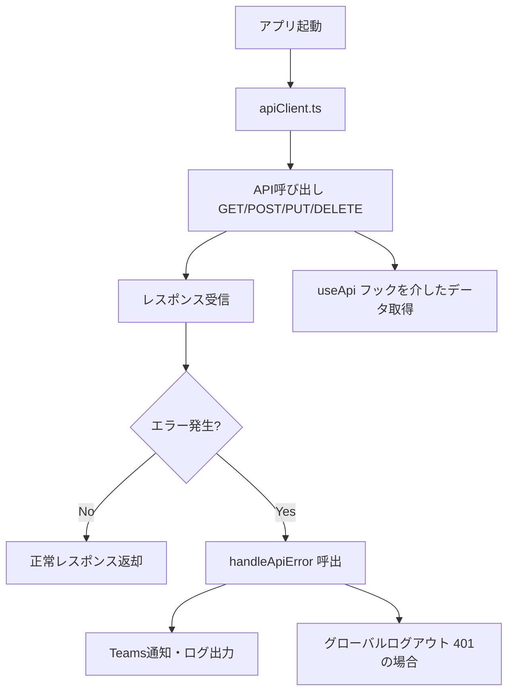
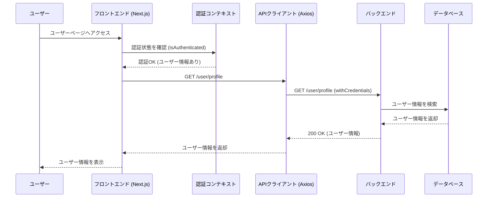

# APIモジュール設計書

## 1. モジュール概要

### 1-1. 目的
本APIモジュールは、フロントエンド（Next.js）からバックエンドのREST APIと安全かつ効率的に通信するための共通インターフェースを提供することを目的とする。
具体的には以下を実現する：

API通信の共通化による開発効率の向上
統一されたエラーハンドリングによる安定性の向上
認証情報の適切な管理とセキュリティ確保
スケーラブルな構成による将来的な拡張性の担保
1-2. 適用範囲
本モジュールは、プロジェクト全体のREST API通信に関わる処理を担当し、以下のコンポーネントに適用される。

` apiClient.ts`を使用した全API呼び出し
汎用的なAPIサービス` (apiService.ts) `の利用
認証` (authService.ts) `やユーザー管理 `(userService.ts) `などの各種APIサービス
React Queryを活用したデータ取得 `(useApi.ts)`

---

## 2. 設計方針

### 2-1. アーキテクチャ方針

本モジュールは、以下のアーキテクチャの考え方を採用する：

* レイヤードアーキテクチャ
  * APIクライアント (`apiClient.ts`) でAxiosのインスタンスを統一
  * APIサービス (`apiService.ts`) で共通のAPI通信ロジックを提供
  * 個別サービス (`authService.ts`, `userService.ts`) でサービスごとのAPIを実装
  * React Queryのカスタムフック (`useApi.ts`) でデータ取得・キャッシュ管理
* 疎結合
  * APIクライアント・エラーハンドリング・各サービス層を明確に分離し、変更に強い設計とする。
    型安全性
  * TypeScriptを用いてAPIレスポンスやリクエストの型を明確に定義し、開発時のエラーを最小化する。

### 2-2. 統一的なルール

本モジュールでは、以下のルールを統一して適用する：

* APIリクエスト
  * すべてのAPIリクエストは `apiService.ts `を経由する。
  * `POST`, `PUT`, `DELETE `のリクエスト時は必ずリクエストボディを JSON 形式で送信する。
  * クエリパラメータを使用する場合は `URLSearchParams `を利用する。
* 認証
  * 認証情報（JWT）は `Authorization `ヘッダーに付与。
  * 401エラー時は自動的にログアウト処理を行い、ユーザーに再ログインを促す。
* エラーハンドリング
  * errorHandler.ts に統一し、適切なエラー表示とログ出力を行う。
  * ネットワークエラーやAPIエラーはユーザーに適切なメッセージを通知。
* 環境変数管理
  * APIのベースURL `(NEXT_PUBLIC_API_BASE_URL) `は .env にて管理。
  * APIのキャッシュ戦略は `cacheStrategies.ts `にて管理し、各サービスで呼び出し、使用する。

### 2-3. 拡張性・変更の考慮

本モジュールは、以下の点を考慮して拡張性を確保する：

* APIエンドポイントの一元管理
  * `apiEndpoints.ts` にてエンドポイントを定義し、変更時の影響を最小限にする。
* モジュールの分離
  * 認証、ユーザー管理、管理者機能など、機能ごとに` services/v1,v2/,・・・` 以下のファイルを分割し、責務を明確にする。
* キャッシュ戦略
  * React Query の` staleTime`,` cacheTime` を適切に設定し、不要なAPIリクエストを抑制する。(環境変数から呼び出す。)
* APIバージョニング
  * 将来的なAPI仕様変更に備え、`/v1/ `のようなバージョン管理を行う。
  - 複数バージョンでの同時運用が必要な場合はバージョン事のエンドポイントを**apiEndpoints.ts**で切り替え、既存および新規双方の実装に影響が及ばないようにすること。
  - 既存のバージョンを破棄する場合。
  　- `v1Deleted`として無効化を明示する。
    - 外部APIとの連携や外部からの通信など、自社サービス以外に影響が及ぶ際には事前告知を必須とし、営業フロントと連携を行うこと。
```js
// src/api/apiEndpoints.ts
const API_VERSION = process.env.NEXT_PUBLIC_API_VERSION || "v1";
export const API_ENDPOINTS = {
  AUTH: API_VERSION === "v2" ? {
    LOGIN: '/auth/user/access/login',
    LOGOUT: '/auth/user/access/logout',
    REFRESH: '/auth/user/access/refresh',
    STATUS: '/auth/user/access/status',
  } : {
    LOGIN: '/auth/login',
    LOGOUT: '/auth/logout',
    REFRESH: '/auth/refresh',
    STATUS: '/auth/status',
  },
};
```

### 2-4. ロギングと監視

* ログの出力
  * APIエラー発生時には、エラーログを `console.error() `だけでなく、外部ログシステム (例: Sentry, Datadog) に送信する。
  * `handleError.ts` 内で `sendErrorToTeams() `を活用し、重要なエラーはSlackやTeamsに通知。
* リクエストの監視
  * すべてのAPIリクエストの成功率やレスポンスタイムを計測できるように `axios.interceptors `を利用。
  * `performance.now()` を用いたAPI応答時間の計測を実装し、ボトルネックを特定できるようにする。
* 異常検知
  * 連続した `500 `エラー発生時にはアラートを送信する。
  * 重要  API（ログイン、決済など）には特別な監視ルールを設定する。
* 備考
  * **リクエストの監視**を除く、これらの設定はエラーハンドラ、ロギング側の設定として行いますが関連するアクション等を記述します。

### 2-5. 使用する環境変数

| 環境変数名                             | 説明                                          | 例                                      |
| ------------------------------------- | -------------------------------------------- | --------------------------------------- |
| NEXT_PUBLIC_API_BASE_URL              | APIのベースURL。                              | https://api.example.com                 |
| NEXT_PUBLIC_API_TIMEOUT               | APIリクエストのタイムアウト設定（ミリ秒単位）。  | 5000                                    |
| NEXT_PUBLIC_API_VERSION               | APIバージョニング用の設定。                     | v1                                      |
| NEXT_PUBLIC_SENTRY_DSN                | Sentry等の外部ログシステムにエラーログを送信するためのDSN| https://xxx@sentry.io/123456     |
| LOG_LEVEL                             | APIリクエストの監視を有効化するためのフラグ | true                                    |


## 3.📂 フォルダ構成とファイルの役割

```
src/
└── api/
    ├── apiClient.ts          // Axios のインスタンス作成・設定、インターセプター実装
    ├── apiEndpoints.ts       // API の各エンドポイント URL 定義
    ├── apiService.ts         // 汎用 API 呼び出し関数（get, post, put, delete）
    └── services/v1/
         ├── authService.ts   // 認証系 API (ログイン、ログアウト、認証状態確認)
         ├── userService.ts   // ユーザープロフィール取得・更新 API
         ├── index.ts         // 各サービスのエクスポートを統合
└── hooks/
    ├── useApi.ts             // APIデータ取得用のカスタムフック (React Query)
└── config/
    ├── cacheStrategies.ts    // キャッシュ戦略のプリセット
└── utils/
    ├── errorHandler.ts    // 共通の エラーハンドリング関数
```

## 4. 📌 各ファイルの説明

- **apiClient.ts**

  - Axios のインスタンスを生成し、環境変数 (`NEXT_PUBLIC_API_BASE_URL`, `NEXT_PUBLIC_API_TIMEOUT`) を使ってベース URL やタイムアウト値を設定。
  - レスポンスインターセプターにより、エラー発生時に `handleApiError` を呼び出し、
  　各エラーコードに応じた処理詳細はエラーハンドラーを参照。以下にクライアント側でのリトライや別ロジックのトリガーとなるものを示す。
    ・401 エラーの場合はグローバルログアウトイベントを実行。
    ・503エラー時にリトライ処理を実行。
    ・403のエラーの回数が一定期間×一定回数を超過した場合は一定期間ログインページへのリダイレクトを阻害する。(protectedRouteと連携)
  - axios.interceptors,performance.now(),を組み込み、APIのパフォーマンスを監視可能とする。

```js
   <!-- INCLUDE:FE\spa-next\my-next-app\src\api\apiClient.ts -->
```

- **apiEndpoints.ts**

  - アプリ内で利用するすべての API の URL を一元管理。
  - 各機能（認証、ユーザー、管理者）ごとにエンドポイントを定義。
  - 環境変数からapiのバージョンを取得し、エンドポイント及び利用するサービスのバージョンを変更する。デフォルト**v1**。

```js
export const API_ENDPOINTS = {
  ADMIN: {
    GET_USERS: "/admin/users",
    DELETE_USER: "/admin/user/delete",
    UPDATE_PERMISSIONS: "/admin/user/permissions",
  },
};

```
- **apiService.ts**
  - 汎用的な API 操作（GET、POST、PUT、DELETE）を型安全に実装。
  - 各サービスから呼び出して利用できる共通インターフェースを提供する。

```js
<!-- INCLUDE:FE\spa-next\my-next-app\src\api\apiService.ts -->
```

- **services/authService.ts**
  - ユーザーのログイン、ログアウト、認証状態確認の API を実装。
  - 正常時は認証情報を返し、エラー時は `handleApiError` により処理。

```js
<!-- INCLUDE:FE\spa-next\my-next-app\src\api\services\v1\authService.ts -->
```
- **services/userService.ts**
  - ユーザー一覧とユーザプロフィール一覧の取得用フックを実装。
  - フェッチに必要な情報を返す。

```js
<!-- INCLUDE:FE\spa-next\my-next-app\src\api\services\v1\userService.ts -->
```

- **useApi.ts**
  - React Query を利用した API フェッチを簡単に行うためのカスタムフック。
  - `useFetch` で GET リクエストを管理し、`useApiMutation` で POST/PUT/DELETE 操作を一元管理。

```js
<!-- INCLUDE:FE\spa-next\my-next-app\src\hooks\useApi.ts -->
```

- **errorHandler.ts**
  - API 呼び出しで発生するエラーを処理する共通関数 `handleApiError` を実装。詳しくはエラーハンドリングモジュールを参照。
  - APIに関連するエラー処理は全て**apiClient.ts**に集約しそこから、**errorHandler.ts**を経由させることで個別の処理記述しないものとする。


```js
<!-- INCLUDE:FE\spa-next\my-next-app\src\utils\errorHandler.ts -->
```

- **cacheStrategies.ts**

  - APIのサービス単位で本プリセットを呼び出し、キャッシュ戦略を変更可能とする。
  - サービス単位で固有の戦略を採用することも可能だが、一覧性を高めるため、新規追加の際はこちらに追加する運用とする。

```js
   <!-- INCLUDE:FE\spa-next\my-next-app\src\config\cacheStrategies.ts -->
```


## 5. 📌 処理フロー図



## 6 .  📌処理シーケンス図


