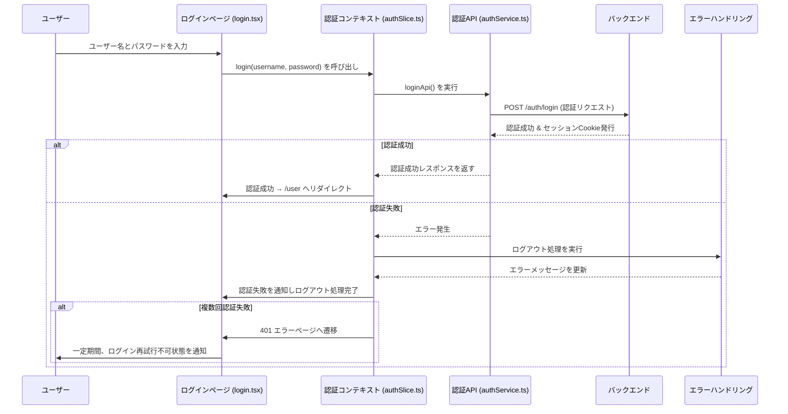
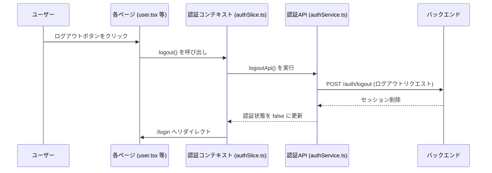
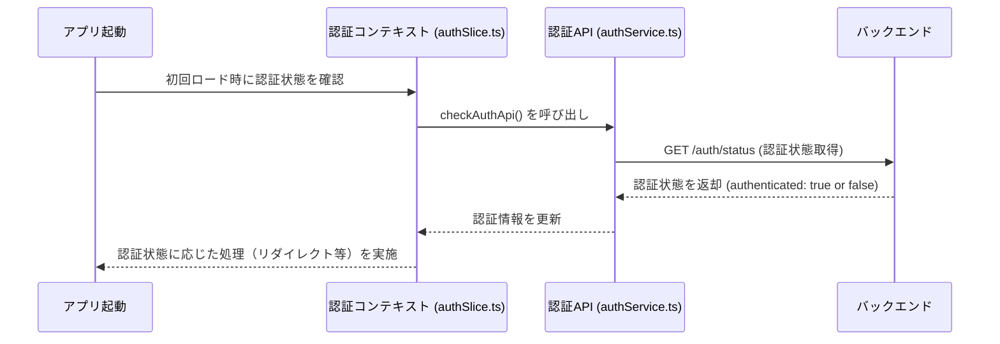
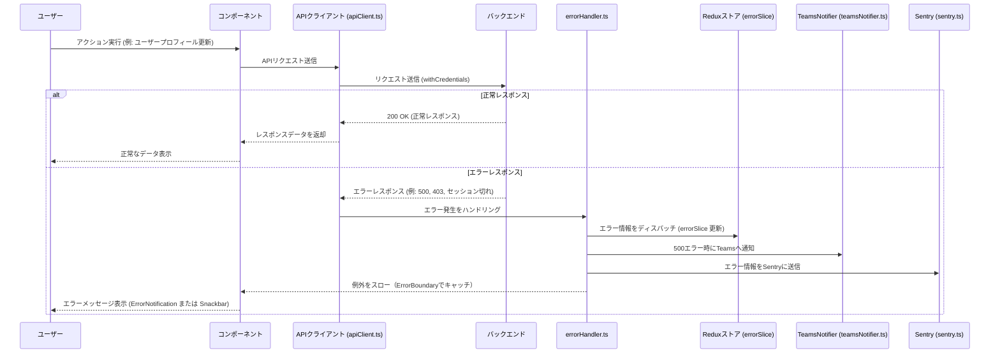

# 認証・API統合エラーハンドリング設計書

本設計書は、アプリケーションの認証機能、API通信、およびエラーハンドリングを統合的に管理するための設計概要を示します。  
この設計は、ユーザー認証、APIコール時のエラーハンドリング、認可エラー、セッションエラーなど、さまざまなケースに対応できるようにしています。

---

## 1. モジュール概要

- **ユーザー認証**
  - ユーザーのログイン、ログアウト、認証状態のチェックを行い、セッション管理とアクセス制御を実現します。
  - 認証結果に基づいて、ユーザーごとの権限情報（ロール）を管理し、各ページへのアクセス制御（ProtectedRoute）を行います。
  - 将来的にJWT認証に変更する場合、認証機能はバックエンドが担当することとし、フロントエンドではエンドポイントから取得した認可情報に応じたページアクセス制御のみを行う。エンドポイントの保護はバックエンドが担当する。
- **API通信**
  - Axios を利用して API 通信を統一的に管理し、`withCredentials` を用いて httpOnly Cookie をやり取りします。
  - API呼び出しは共通の apiService.ts 経由で行い、エラーハンドリングは errorHandler.tsで統一処理します。

- **エラーハンドリング**
  - APIエラーやUIエラーを一元的にキャッチし、適切なユーザー通知（ErrorNotification、SnackbarNotification）と外部ログ送信（Sentry, TeamsNotifier）を行います。
  - エラーは ErrorBoundary コンポーネントでキャッチし、ユーザーにフォールバックUIを表示します。

---

## 2. 設計方針

### 2-1. アーキテクチャの統合
- **状態管理**  
  認証状態、エラー状態、通知状態は Redux を中心に管理し、各種カスタムフック（useAuth、useError、useSnackbar）を利用して各コンポーネントに提供します。

- **API通信とエラーハンドリング**  
  API通信は Axios インスタンス（apiClient.ts）を用いて統一的に管理し、レスポンスインターセプターでエラーを捕捉して共通エラーハンドラー（errorHandler.ts）へ委譲します。

- **認証と認可のチェック**  
  初回アクセス時およびルート遷移時に認証状態をチェックし、認証されていないユーザーや権限が不足しているユーザーは適切なリダイレクトと通知を実施します。

### 2-2. 統一的なルール
- **API呼び出しルール**
  - 全API通信は apiService.ts を経由し、エラーハンドリングは errorHandler.ts を利用。
  - セッション管理は httpOnly Cookie に依存し、Axios の withCredentials オプションを有効にする。
  
- **エラーハンドリングルール**
  - ネットワークエラーやHTTPステータス（401, 403, 500 など）に応じた処理を行い、エラーメッセージを生成。
  - 500 エラー発生時は TeamsNotifier や Sentry を利用して外部にログ送信。
  - 例外はスローし、ErrorBoundary でキャッチする。

- **認証ルール**
  - 初回アクセス時に `/auth/status` API を呼び出し認証状態を取得。
  - 未認証の場合は `/login` へリダイレクト、認証済みの場合はユーザーページに遷移。
  - ログアウト時は `/auth/logout` を呼び出し、セッションを削除後に `/login` へリダイレクト。

---

## 3. フォルダ構成とファイルの役割

```
src/
├── api/
│   ├── apiClient.ts         // Axios インスタンスの生成・設定（withCredentials, インターセプター実装）
│   ├── apiEndpoints.ts      // APIエンドポイント URL 定義（v1, v2 で切替可能な設計）
│   ├── errorHandler.ts      // API エラーハンドリング関数（handleApiError関数を使用）
│   ├── apiService.ts        // 汎用 API 呼び出しラッパー（get, post, put, delete）
│   └── services/
│       ├── v1/
│       │   ├── authService.ts   // v1 認証 API（ログイン、ログアウト、認証状態確認）
│       │   ├── userService.ts   // v1 ユーザー管理 API（プロフィール取得・更新、ユーザー一覧）
│       │   └── adminService.ts  // v1 管理者 API（権限管理、ユーザー管理）
│       └── v2/
│           ├── authService.ts   // v2 認証 API
│           ├── userService.ts   // v2 ユーザー管理 API
│           └── adminService.ts  // v2 管理者 API
├── hooks/
│   ├── useApi.ts            // React Query を用いた API 呼び出し用カスタムフック
│   └── useAuth.ts           // Redux の authSlice を利用した認証状態およびセッション操作用カスタムフック
├── slices/
│   ├── authSlice.ts         // 認証状態（ログイン状況、ユーザー情報、権限）管理
│   ├── errorSlice.ts        // グローバルエラー情報の管理
│   └── snackbarSlice.ts     // スナックバー通知の管理
├── utils/
│   ├── sentry.ts            // Sentry SDK の初期化と連携
│   └── teamsNotifier.ts     // Microsoft Teams へのエラー通知機能
├── components/
│   ├── composite/
│   │   ├── Header.tsx
│   │   ├── Footer.tsx
│   │   └── BasePage.tsx     // 共通レイアウト（Header, Footer, ErrorNotification 等）
│   └── functional/
│       ├── ProtectedRoute.tsx    // 認証・認可ルート保護コンポーネント
│       ├── ErrorBoundary.tsx     // UI エラーキャッチ用コンポーネント
│       ├── ErrorNotification.tsx // エラーメッセージ通知用コンポーネント
│       └── SnackbarNotification.tsx // スナックバー通知用コンポーネント
└── pages/
    ├── login/
    │   └── login.tsx         // ログインページ
    ├── user/
    │   └── user.tsx          // 認証済みユーザーページ
    ├── admin/
    │   └── admin.tsx         // 管理者ページ
    └── _app.tsx              // Next.js エントリーポイント

```

## 4. 📌 各ファイルの説明

### **authSlice.ts**
- **目的:**  
  認証状態（ログイン状況、ユーザー情報、権限）の管理を行う。
- **機能:**
  - ログイン、ログアウト、認証状態確認の非同期処理を実装。
  - API 呼び出し結果に基づき、認証状態と権限情報を更新する。
  - エラー時はエラー情報を `errorSlice` にディスパッチして、グローバルエラーメッセージを更新する。

---

### **useAuth.ts**
- **目的:**  
  Redux の `authSlice` を利用し、認証状態およびセッション操作を簡単に呼び出すためのカスタムフックを提供する。
- **機能:**
  - `loginUser`, `logoutUser`, `refreshAuth` などの関数を公開し、コンポーネントから認証関連の操作を実行可能にする。
  - グローバルな認証状態とユーザー情報を返却する。

---

### **errorSlice.ts**
- **目的:**  
  グローバルなエラー情報（エラーメッセージ）の状態管理を行う。
- **機能:**
  - エラーメッセージの設定とクリアのアクションを定義し、Redux ストアに統合する。

---

### **useError.ts**
- **目的:**  
  Redux の `errorSlice` を利用し、エラー表示およびクリアの処理を容易に呼び出せるカスタムフックを提供する。
- **機能:**
  - `showError` と `clearError` 関数を公開し、コンポーネントからエラー操作を実行可能にする。

---

### **errorHandler.ts**
- **目的:**  
  API 通信時に発生するエラーを一元的に処理し、適切なユーザー通知およびログ出力を行う。
- **機能:**
  - ネットワークエラーおよび HTTP エラーに応じたエラーメッセージを生成する。
  - 500 番台のエラーの場合、`sendErrorToTeams` を呼び出して Teams への通知を実施する。
  - `Sentry.captureException` を通じて Sentry へのエラー送信を行う（`sentry.ts` 経由）。
  - ローカルログは `winston` を使用して記録し、例外をスローして上位のエラーハンドリング（ErrorBoundary など）に委ねる。

---

### **teamsNotifier.ts**
- **目的:**  
  Microsoft Teams へのエラー通知を実施する。
- **機能:**
  - 環境変数 `TEAMS_WEBHOOK_URL` を使用し、エラー情報を JSON ペイロードとして POST 送信する。

---

### **sentry.ts**
- **目的:**  
  Sentry SDK の初期化とエラー監視を行い、発生したエラーを自動的に Sentry に送信する。
- **機能:**
  - 環境変数 `NEXT_PUBLIC_SENTRY_DSN` と `NEXT_PUBLIC_LOG_LEVEL` を利用して Sentry をセットアップする。

---

### **ErrorBoundary.tsx**
- **目的:**  
  コンポーネントツリー内で発生したエラーをキャッチし、フォールバック UI を表示する。
- **機能:**
  - `getDerivedStateFromError` と `componentDidCatch` を利用して、エラー発生時に状態更新とログ出力（例: Sentry への送信）を行う。

---

### **ErrorNotification.tsx**
- **目的:**  
  Redux やその他のグローバルステートから取得したエラー情報をユーザーに通知する UI を提供する。
- **機能:**
  - エラーメッセージを画面上に表示し、一定時間後に自動的に非表示にするタイマー処理を実装する。

---

### **SnackbarNotification.tsx**
- **目的:**  
  スナックバー形式でエラーやその他の通知メッセージをユーザーに表示する。
- **機能:**
  - Redux の状態から通知メッセージと通知タイプ（SUCCESS, ERROR, ALERT）を取得し、ユーザー操作またはタイムアウトにより通知を非表示にする処理を実装する.


## 5.1 ログイン処理フロー


## 5.2 ログアウト処理フロー

## 5.3 認証状態確認フロー


## 5.4 API呼び出し 統合フロー


