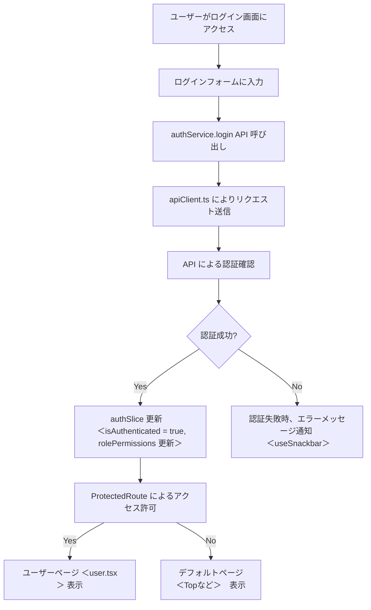
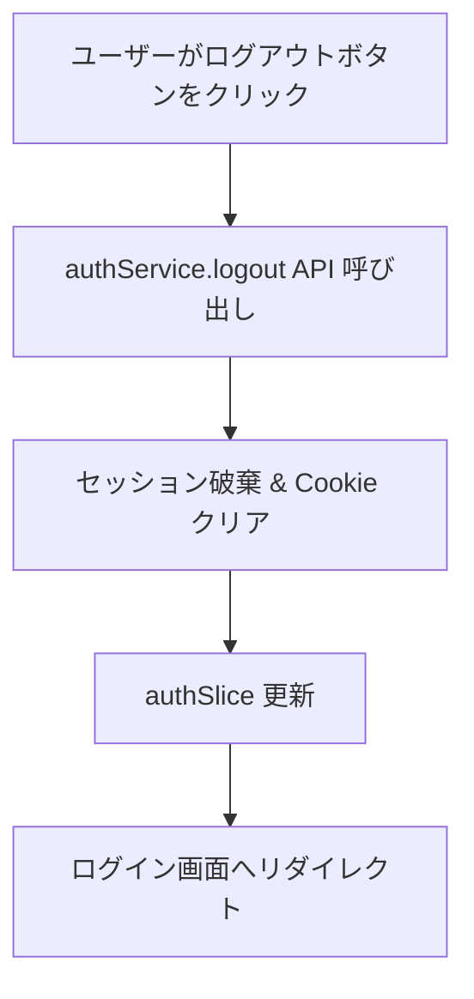

# 認証・認可モジュール設計書(フロントエンド編)

## **1. モジュール概要**

### **1-1. 目的**

本モジュールは、アプリケーションの**認証（Authentication）**および**認可（Authorization）**の機能を提供し、ユーザーのアクセス制御を実現することを目的とする。

具体的には、以下の機能を提供する：

* ユーザーのログイン・ログアウト機能
* 認証状態の管理と自動更新（例: 認証チェック、セッション検証）
* ロールベースのアクセス制御（RBAC）によるページ保護
* セッション管理とセキュリティ対策（`httpOnly` Cookie の利用）
* エラーハンドリングとリカバリー　エラーハンドリングモジュールを参照。本設計書では割愛する。

### **1-2. 適用範囲**

本モジュールは、**フロントエンドアプリケーション**に適用され、主に以下の技術スタックを前提とする：

* **フレームワーク** : Next.js (React)
* **通信** : REST API（バックエンド認証 API との連携）
* **認証方式** : セッションベース認証（`httpOnly` Cookie を利用）
* **対象機能** :
* 認証済みユーザー向けのページ遷移制御
* API コール時の認証チェック
* 権限ごとの UI レンダリング制御（ボタンの表示制御など）
* エラー処理とユーザーフィードバック

---

## **2. 設計方針**

### **2-1. アーキテクチャ方針**

- **クライアントサイドの状態管理**
  従来の React Context による認証状態管理から、**Redux** を利用した状態管理へ移行。
  - 認証状態（`isAuthenticated`、`user`、`role` など）は `authSlice.ts` により一元管理し、`useAuth.ts` のカスタムフックでアクセスする。
  -エラー情報やスナックバー通知はそれぞれ `errorSlice.ts`、`snackbarSlice.ts` で管理。

- **サーバーサイドとの連携**
  - API 通信は統一された Axios インスタンス（`apiClient.ts`）を通して行い、セッション管理は `httpOnly` Cookie により実施。
  - **CSRF-Token**を設定し、リクエストヘッダーに含める。

- **ルートガードとアクセス制御**
  - `ProtectedRoute.tsx` コンポーネントにより、認証状態およびユーザー権限をチェックし、未認証または権限不足の場合に適切なリダイレクトと通知を実施。
  - ページごとに `pageConfig.ts` で最低必要なアクセス権限（`requiredPermission`）を定義し、ロールベース認証（RBAC）を実現。

---

### **2-2. 統一的なルール**

- **API コール**
  すべての API 通信は `apiService.ts` 経由で行い、認証チェックやエラーハンドリングは共通の `errorHandler.ts` を用いて処理とする。

- **エラーハンドリング**
  - API 呼び出しエラーは `errorHandler.ts` で処理し、特定のエラー（401、500 など）の場合は自動的にログアウト処理や外部サービス（Teams、Sentry）への通知を行う
  - 

- **認証チェックのタイミング**
  - アプリ起動時に `useAuth.ts` を通して `GET /auth/status` を実行し、認証状態を確認
  - `ProtectedRoute.tsx` を利用して、認証が必要なページへのアクセス時にリアルタイムで認証状態および権限の検証を行う。

- **認証状態の管理**
  - アプリケーション全体での認証状態はAuthSliceにて共有する。
  - ログイン、ログアウトの処理はuseAuthのカスタムフックを利用し、AuthSliceの状態を変更する。
  - ログイン処理→認証成功時AuthSliceに認証情報/認可情報を格納
  - ログアウト処理→AuthSliceの認証情報をクリア。バックエンドのセッションも削除する。

---

### **2-3. 拡張性・変更の考慮**

- **モジュール分割**
  認証 API の呼び出しロジックは `authService.ts` に集約し、将来的に OAuth や JWT などの認証方式を追加する際の影響範囲を最小限に留める。

- **状態管理の統一**
  Redux ストアに認証、エラー、通知の状態を統合し、コンポーネント間で一貫したデータフローを実現。

- **将来的な認証方式の追加**
  現在はセッションベース認証を前提とし、JWT やソーシャルログイン、多要素認証（MFA）への対応も視野に入れた設計とする。
  service内のロジックを書き換えることを想定。

---

### **2-4. ロギングと監視**

* **クライアントエラーの監視**
  * `Sentry` との連携 (`sentry.ts`) により、フロントエンドのエラーを収集。
  * 重要なエラー (`認証失敗の連続発生` や `403 の過剰発生`) は `TeamsNotifier.ts` を使い、管理者へ通知。
* **API コールのログ**
  * `apiClient.ts` でリクエスト/レスポンスのログを記録（開発モードのみ）。
  * 重大なエラー（`500` や `認証エラーの連続発生`）は Sentry 経由で報告。
* **認証エラーの分析**
  * `/auth/login` の `401` エラーが一定回数以上発生した場合、401ページへ遷移。
  * `/auth/status` への異常なアクセス頻度を検知し、不審なアクティビティとして記録。

## 📂 3. フォルダ構成とファイルの役割

```plaintext
src/
├── api/
│   ├── apiClient.ts         // Axios インスタンスの設定と共通API通信処理
│   ├── apiEndpoints.ts      // API エンドポイントの一覧
│   ├── apiService.ts        // 汎用 API 呼び出しラッパー
│   └── services/
│       ├── authService.ts   // ログイン、ログアウト、認証状態確認 API の実装
│       └── userService.ts   // ユーザー情報取得・更新 API の実装
├── config/
│   └── pageConfig.ts        // ページごとのアクセス権限設定
├── hooks/
│   ├── useApi.ts            // API コール用カスタムフック（React Query利用）
│   ├── useAuth.ts           // Redux の authSlice を利用した認証状態管理用カスタムフック
│   ├── useError.ts          // Redux の errorSlice を利用したエラー管理用カスタムフック
│   └── useSnackbar.ts       // Redux の snackbarSlice を利用した通知管理用カスタムフック
├── slices/
│   ├── authSlice.ts         // 認証状態（ログイン、ユーザー権限）の管理
│   ├── errorSlice.ts        // グローバルエラー情報（エラーメッセージ）の管理
│   ├── authErrorSlice.ts    // 認証エラー情報回数の管理
│   └── snackbarSlice.ts     // スナックバー通知の管理（エラー表示も含む）
├── store.ts                 // Redux ストアの設定と各スライスの統合
├── types/
│   └── auth.ts              // 認証関連の型定義
├── utils/
│   ├── AuthRoles.ts         // ユーザーロールと権限の定義
│   └── errorHandler.ts      // 共通のエラーハンドリングの実装
│
├── components/
│   └── functional/
│       ├── ErrorNotification.tsx    // UIエラー通知コンポーネント（グローバルエラー表示）
│       ├── ProtectedRoute.tsx       // 認証が必要なルートのアクセス保護
│       └── UserUpdateForm.tsx       // ユーザー情報更新フォーム
├── pages/
│   ├── 401.tsx                // 401 認証エラーページ
│   ├── 403.tsx                // 403 エラーページ
│   ├── login/
│   │   └── index.tsx          // ログイン画面
│   ├── user/
│   │   └── index.tsx          // 認証済みユーザー向けページ
│   └── _app.tsx               // Next.js アプリのエントリーポイント


```
## 4. 📌 各ファイルの説明

### authSlice.ts
- **目的**:  認証状態（ログイン状況、ユーザー情報、権限）の管理を行う。

- **機能**:
  - エラーハンドリングは共通の `handleError` を利用。
  **ログイン処理**
  - サーバー側とのセッションを構築するため、POST `auth/login` を実行する。
  - 200 OK が返された後、クライアント側のセッション状態を構築し、`/user` へリダイレクトする。
  - 401エラーの回数を記録** authErrorSlice.ts**し、設定時間×設定回数以上のエラーが発生した場合は401ページへリダイレクトなどの処理を行う（エラーハンドラ側の設定）
  **初回認証チェック**
  - アプリの初回ページアクセス時に認証状態のチェックを実施する（例: GET `/auth/status`）。
  - アクセスページが `/login` や `/` の場合、認証が成功していれば自動的に `/user` へリダイレクトする。
  - 認証が必須のその他のページにアクセスする際は、`ProtectedRoute` を通して認証状態が検証される。

  **ログアウト処理**
  - サーバー側のセッションを破棄するため、POST `/auth/logout` を実行する。
  - 200 OK が返された後、クライアント側のセッション状態を破棄し、`/login` へリダイレクトする。

---

```js
<!-- INCLUDE:FE\spa-next\my-next-app\src\slices\authSlice.ts -->
```

### useAuth.ts
- **目的**:Redux の authSlice を利用し、認証状態およびセッション操作を簡単に呼び出すためのカスタムフックを提供する。

- **機能**:`loginUser`、`logoutUser`、`checkAuthApi` などの関数を公開し、コンポーネントから認証関連の操作を実行可能にする。

```js
<!-- INCLUDE:FE\spa-next\my-next-app\src\hooks\useAuth.ts -->
```
---

- **apiClient.ts**
- **目的**:  Axios を使用し、すべての API 通信を統一的に管理する。
- **機能**:
  - `withCredentials: true` をデフォルトで適用し、httpOnly のセッション Cookie をサーバーとやり取りする。
  - レスポンスインターセプターを利用し、401 エラー時に自動ログアウト処理をトリガーする。

```js
<!-- INCLUDE:FE\spa-next\my-next-app\src\api\apiClient.ts　-->
```

---
- **authService.ts**
- **目的**:API を用いたログイン、ログアウト、認証状態確認の各関数を実装する。
- **機能**:
  - エラーハンドリングは共通の `handleError` を利用。
  - 認証は httpOnly のセッション Cookie を利用して実施し、クライアント側では認証トークンを直接管理しない。

```js
<!-- INCLUDE:FE\spa-next\my-next-app\src\api\services\v1\authService.ts　-->
```
---
## ProtectedRoute.tsx
- **目的**:
- 認証が必要なルート（ページ）へのアクセスを保護するコンポーネント。
- 認証状態とユーザーの権限レベルを確認し、未認証または権限不足の場合に適切なリダイレクトおよび通知を行う。
- **機能**:
**認証チェック**
  - `AuthContext` の状態を参照し、ユーザーが認証されていない場合は `/login` へリダイレクトする。
  - 認証済みであっても、アクセスするページの権限設定とユーザーの権限レベルを比較して判断する。
**ロールベース認証**
  - 各ページには `pageConfig` を通じて `requiredPermission` が定義される。
  - 例えば、`/admin` ページの設定が `{ name: "管理者ページ", resourceKey: "/admin", requiredPermission: 3 }` の場合、権限レベルが 0、1、2 のユーザーはアクセスが禁止される。
  - 権限不足の場合、ユーザーは指定されたページ（例: `/home`）へ強制リダイレクトされ、`useSnackbar` を利用して「権限がありません」という通知が表示される。
**レンダリング制御**
  - 認証および権限のチェックが完了し、条件を満たす場合にのみ子コンポーネントをレンダリングする。
  - 条件を満たさない場合は、リダイレクトとエラーメッセージ表示を行い、ページのレンダリングをブロックする。

```js
<!-- INCLUDE:FE\spa-next\my-next-app\src\api\services\v1\authService.ts　-->
```
---

### useError.ts
- **目的**:Redux の errorSlice を利用し、エラー表示およびクリアの処理を容易に呼び出せるカスタムフックを提供する。
- **機能**:`showError` と `clearError` 関数を公開し、コンポーネントからエラー操作を実行可能にする。
---

- **エラー時の挙動**
  - 各種エラー処理はエラーハンドリングモジュールに記載する為本仕様書では割愛し、関連モジュールのみ記載
### errorHandler.ts
- **目的**:API 通信時に発生するエラーを一元的に処理し、適切なユーザー通知およびログ出力を行う。
### ErrorNotification.tsx
- **目的**:Redux やその他のグローバルステートから取得したエラー情報をユーザーに通知する UI を提供する。
### SnackbarNotification.tsx
- **目的**:  スナックバー形式でエラーやその他の通知メッセージをユーザーに表示する。

```js
<!-- INCLUDE:FE\spa-next\my-next-app\src\hooks\useError.ts　-->
```

---

## 📌 5. バックエンドとの通信仕様

### 3.1 フロントエンドから送信するデータ

- **ログインリクエスト (`POST /auth/login`)**

  ```json
  {
    "username": "ユーザー名",
    "password": "パスワード"
  }
  ```

  - `Content-Type: application/json`
  - `withCredentials: true` を指定し、`httpOnly` の Cookie を受け取る。
- **ログアウトリクエスト (`POST /auth/logout`)**

  - セッション Cookie を削除し、サーバー側で認証情報を無効化。
  - フロント側も現在のcookieを破棄し、次回操作時に改めてログインを促す。
- **認証状態確認 (`GET /auth/status`)**

  - `Cookie` を含めてリクエストを送信し、認証状態を確認。

### 3.2 バックエンドからのレスポンス

- **ログイン成功時 (`200 OK`)**

  ```json
  {
    "authenticated": true,
    "user": {
      "username": "ユーザー名",
      "rolePermissions": { "/user": 2, "/admin": 3 }
    }
  }
  ```

  - `httpOnly` の Cookie にセッション ID を格納。
- **ログイン失敗時 (`401 Unauthorized`)**

  ```json
  {
    "authenticated": false,
    "message": "無効なユーザー名またはパスワード"
  }
  ```
- **ログアウト成功時 (`200 OK`)**

  ```json
  {
    "authenticated": false,
    "message": "ログアウトしました"
  }
  ```
- **認証状態チェック (`200 OK` or `403 Forbidden`)**

  ```json
  {
    "authenticated": true,
    "rolePermissions": { "/user": 2, "/admin": 3 }
  }
  ```

  または

  ```json
  {
    "authenticated": false,
    "message": "セッションが無効です"
  }
  ```

## 📌 6. 認証フロー図

### 6.1 ログイン処理フロー



### 6.2 ログアウト処理フロー


