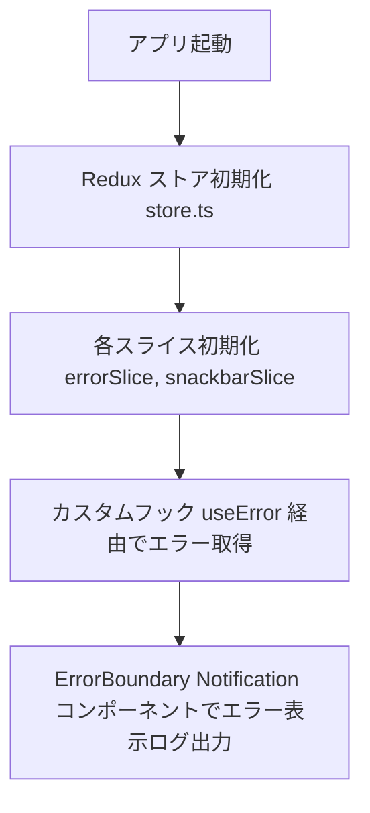
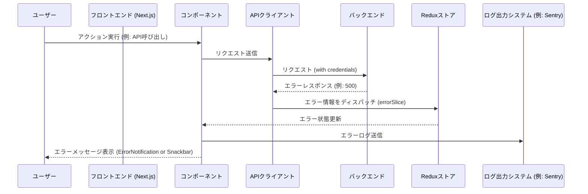

# エラーハンドリング及びログ出力　フロントエンド 仕様書

このモジュールは、アプリケーション全体で発生するエラーの統一的な処理およびログ出力を担当。  
API通信時のエラーハンドリング、グローバルなエラーメッセージ管理、エラー発生時のユーザー通知（スナックバー・エラーメッセージ表示）とログ出力を実現。

---

## 1. モジュール概要

- **目的**  
  アプリケーション内で発生するエラーを一元管理し、ユーザーへの通知と開発者向けのログ出力を統一的に行うことで、システムの安定性とデバッグ効率を向上させる。  
  具体的には、以下の機能を提供する：
  - API呼び出し時およびUIエラー時の共通エラーハンドリング（`errorHandler.ts`）
  - グローバルエラー情報の管理（Redux の `errorSlice.ts`）
  - スナックバー通知によるエラーメッセージの表示（Redux の `snackbarSlice.ts` と `SnackbarNotification.tsx`）
  - コンポーネントツリー上のエラーハンドリング（`ErrorBoundary.tsx` と `ErrorNotification.tsx`）
  - ログ出力および外部通知（`logger.ts`、`teamsNotifier.ts` などを活用）

- **適用範囲**
  フロントエンドアプリ全体のAPI通信、ユーザー操作、システムエラーなどにおけるエラー検知、エラー通知およびログ出力の処理。

---

## 2. 設計方針

### 2-1. アーキテクチャ方針
- **疎結合**
  エラーハンドリング、ログ出力処理、UI通知処理（スナックバーでのエラーメッセージ表示）を各モジュールで明確に分離し、再利用性と変更耐性を確保する。

- **一元管理**
  Redux を用いてグローバルなエラーメッセージとスナックバー通知の状態を管理し、各コンポーネントから統一的にアクセス・更新できるようにする。
  また、API呼び出し時のエラーハンドリングは `errorHandler.ts` で集約し、ログ出力および外部通知（例: Teams、Sentry）を実施する。

- **型安全性**
  TypeScript を利用し、エラーオブジェクト、レスポンスデータ、通知メッセージなどの型定義を明確に行うことで、開発時のミスを低減する。

### 2-2. 統一的なルール
- **エラーハンドリング**
  - API呼び出し時は、共通関数 `errorHandler.ts` を用いてエラーハンドリングを実施。
  - ネットワークエラー、HTTPステータスコード（400, 401, 403, 404, 500等）に応じたUI通知とログ出力、個別のアクションを実行する。なお、説明の為に各ステータスコードとメッセージを記載しているが、エラーメッセージは全てBEから取得する事とするので、アプリケーションごとに個別の処理が無い限りは実装の必要はない。
  ```
  switch (statusCode) {
  case 400:
    // リクエスト内容に誤りがある場合
    errorMessage = data.message || "入力内容に誤りがあります。再度ご確認ください。";
    // ※ 入力チェックの結果やフォーム再表示など、ユーザーに再入力を促す処理を実施（FE）
    break;
  case 401:
    // 認証失敗の場合
    errorMessage = "ログインに失敗しました。ユーザー名やパスワードをご確認ください。";
    // ※ セッションのクリア、ログアウト状態の維持、ログイン画面へのリダイレクトなどを実施
    // ※ 環境変数で指定された時間×回数を超過した場合は401エラーページを表示し、一定時間ログイン処理不可とする。
    if (typeof window !== "undefined") {
      window.dispatchEvent(new Event("logout"));
    }
    break;
  case 403:
    // 権限不足の場合
    errorMessage = data.message || "この操作を行う権限がありません。";
    // ※ TOPページなどへのリダイレクト
    break;
  case 404:
    // リソースが見つからない場合
    errorMessage = data.message || "お探しのページが見つかりません。URLをご確認ください。";
    // ※ 404専用のエラーページへ遷移させる
    break;
  case 409:
    // 重複エラー（Unique Constraint違反）の場合
    errorMessage = data.message || "同じデータが既に存在しています。内容を見直してください。";
    // ※ ユーザーに既存データの存在を通知し、入力内容の変更や再確認を促す処理を実施
    break;
  case 422:
    // 参照エラー（外部キー制約違反）の場合
    errorMessage = data.message || "入力された情報に不整合があります。正しい内容をご確認ください。";
    // ※ 入力データの検証結果に基づき、詳細なエラーメッセージや修正方法の案内を表示する処理を実施（BE側でのエラーメッセージ追加）
    break;
  case 500:
    // SQLエラー、内部処理ミス等の場合
    errorMessage = data.message || "システムエラーが発生しました。しばらくしてから再試行してください。";
    // ※ エラーログの出力、管理者への通知
    break;
  case 503:
    // サーバーやDB接続エラーの場合
    errorMessage = data.message || "ネットワーク接続が不安定です。リトライします。";
    // ※ 自動リトライ（設定はconfigから）、運用チームへの通知処理を実施
    break;
  case 504:
    // クエリ実行エラー（タイムアウト・デッドロック）の場合
    errorMessage = data.message || "処理に時間がかかっています。ネットワーク状況をご確認の上、再試行してください。";
    // ※ エラーログの出力、管理者への通知
    break;
  case 507:
    // ストレージ不足の場合
    errorMessage = data.message || "サーバーのストレージ容量が不足しています。管理者にご連絡ください。";
    // ※ エラーログの出力、管理者への通知
    break;
  case 100:
    // 大容量アップロードの場合（情報提供）
    errorMessage = data.message || "大容量データのアップロードを開始しました。完了までしばらくお待ちください。";
    // ※ アップロードの進捗状況の表示、ユーザーへのリアルタイムフィードバックの実施
    break;
  default:
    errorMessage = data.message || "予期せぬエラーが発生しました。サポートにお問い合わせください。"
    // ※ エラーログの出力、管理者への通知
    break;
  }

- **ログ出力**
  - 重要なエラー発生時は、`logger.ts` 経由で `console.error` に加え、外部ログシステム（例: Sentry, Datadog, Teams 通知）へも送信する。
  - DEBUG以外のログレベルではサーバーサイドでのログファイルへの出力を行う。

- **UI通知**
  - Redux の `snackbarSlice.ts` と連携し、エラー通知は `SnackbarNotification.tsx` や `ErrorNotification.tsx` コンポーネントで表示する。
  - コンポーネントツリー内で発生したエラーは、`ErrorBoundary.tsx` でキャッチしてフォールバックUIを表示する。

---

## 3. 📂 フォルダ構成とファイルの役割

src/
├── slices/
│   ├── errorSlice.ts         // グローバルエラー情報（エラーメッセージとステータス）の管理
│   ├── authErrorSlice.ts     // 認証エラー情報ログの履歴管理
│   └── snackbarSlice.ts      // スナックバー通知の管理（エラーメッセージの表示も含む）
├── hooks/
│   └── useError.ts           // Redux の errorSlice を利用したグローバルエラー情報管理用カスタムフック
├── utils/
│   ├── logger.ts             // 環境変数からログレベルと通知先の設定
│   └── errorHandler.ts       // API呼び出し時のエラーハンドリング関数（handleApiError関数を使用）
├── components/
│   └── functional/
│       ├── ErrorBoundary.tsx       // コンポーネントツリーのエラーキャッチ用
│       ├── ErrorNotification.tsx   // キャッチされたエラーをユーザーに通知するUI
│       └── SnackbarNotification.tsx// スナックバーによる通知表示

---
## 4. 📌 各ファイルの説明

### errorSlice.ts
- **目的**: グローバルエラー情報（エラーメッセージとステータス）の状態管理を行う。
- **機能**: エラーメッセージの設定・クリア操作を定義し、Redux ストアで管理する。

```js
<!-- INCLUDE:FE\spa-next\my-next-app\src/slices/errorSlice.ts -->
```

### useError.ts
- **目的**: Redux の `errorSlice` を利用して、エラーメッセージの表示・クリアを簡単に行うカスタムフック。
- **機能**: `showError` と `clearError` 関数を提供し、コンポーネントからエラー操作を実行可能にする。

```js
<!-- INCLUDE:FE\spa-next\my-next-app\src/hooks/useError.ts -->
```

### errorHandler.ts
- **目的**: エラーを一元管理し、適切なエラーハンドリングとログ出力を行う。
- **機能**:
  - ネットワークエラーおよび HTTP エラーに対して適切なエラーメッセージを生成する。
  - **2-2. 統一的なルール**に基づき各エラーを処理し、適切なアクションを実施する。
  - 500 番台のエラーなど通知が必要な場合、`sendErrorToTeams` を呼び出して Microsoft Teams への通知を実施する。(通知処理の例)
  - Sentry へのエラー送信（`sentry.ts` 経由）を実行する。
  - ローカルのロガー（例：winston）を使用してエラー内容を記録する（ログファイルへの書き出し）。
  - 最終的に例外をスローし、上位のエラーハンドリング（例：`ErrorBoundary`）でキャッチさせる。
  - サーバーサイド、クライアントサイドでロガーの設定を分離させる。
  - 401エラーの回数を記録（authErrorSliceに保存）。
---

```js
<!-- INCLUDE:FE\spa-next\my-next-app\src/utils/errorHandler.ts -->
```

### ErrorBoundary.tsx
- **目的**: Reactコンポーネントツリー内で発生したレンダリングエラーをキャッチし、フォールバックUIを表示する。
- **機能**: `getDerivedStateFromError` と `componentDidCatch` を使用し、エラー発生時にログ出力および通知処理を実行する。
```js
<!-- INCLUDE:FE\spa-next\my-next-app\src\components\functional\ErrorBoundary.tsx -->
```

### ErrorNotification.tsx
- **目的**: グローバルエラー状態に基づき、ユーザーにエラーメッセージを通知するUIを提供する。
- **機能**: `useError` フックを利用してエラー情報を取得し、一定時間後に自動で非表示にする。

```js
<!-- INCLUDE:FE\spa-next\my-next-app\src\components\functional\ErrorNotification.tsx -->
```
### teamsNotifier.ts
- **目的**: Microsoft Teams へのエラー通知を実施する。※通知方法の1案
- **機能**: 環境変数 `TEAMS_WEBHOOK_URL` を使用し、エラー情報を JSON ペイロードとして POST 送信する。

```js
<!-- INCLUDE:FE\spa-next\my-next-app\src/utils/teamsNotifier.ts -->
```

---

### sentry.ts
- **目的**: Sentry SDK を初期化し、エラー発生時に自動的にエラーログを送信する。
- **機能**: 環境変数 `NEXT_PUBLIC_SENTRY_DSN` と `NEXT_PUBLIC_LOG_LEVEL` を使用して Sentry をセットアップし、エラー情報を記録する。

```js
<!-- INCLUDE:FE\spa-next\my-next-app\src/utils/sentry.ts -->
```

---
### logger.ts
- **目的**: 環境変数からログの出力レベル及び出力先を取得し、提供する。ログファイルの出力はサーバーサイドで行う。
- **機能**:
```
LOG_LEVELを環境変数から取得し、処理を分岐させる。
| 環境         | ログレベル   | 具体的な理由                                      |
| ----------- | --------------- | ----------------------------------------------|
| ローカル開発 | DEBUG   | すべてのログ（詳細なデバッグ情報含む）を出力。   　　　　　ログファイル出力無し。　　 |
| テスト環境   | INFO    | 重要なイベントやエラーのみを記録し、過剰なログ出力を抑制。 ログファイル出力あり。　　|
| 本番環境     | WARN    | 問題発生時のみのログ出力に留める。                     　ログファイル出力あり。   |
```

```js
  <!-- INCLUDE:FE\spa-next\my-next-app\src\utils\logger.ts -->
```
---
## 5. 📌 処理フロー図




## 6. 処理シーケンス図


