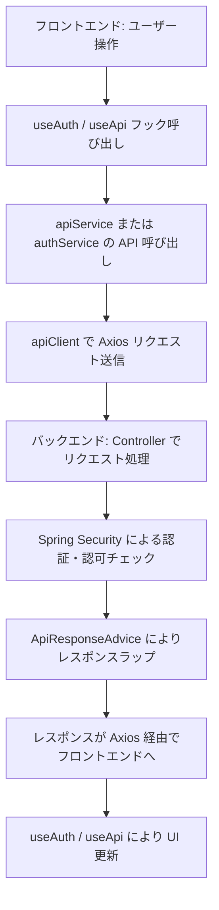
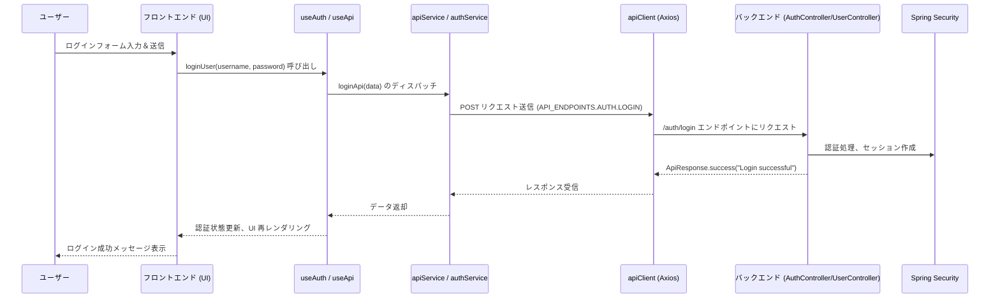

# バックエンド・フロントエンド通信設計書

## 1. モジュール概要

### 1-1. 目的
本設計書は、バックエンド（Spring Boot を利用した アプリケーションサーバー）とフロントエンド（React を利用した SPA）間の通信処理および認証・ユーザー管理等の API 呼び出しに関する仕様と実装例を定義する。  
これにより、システム全体で統一的なエラーハンドリング、パフォーマンス計測、セキュリティチェックが実現され、保守性および拡張性が向上する。

### 1-2. 適用範囲
- バックエンド側の認証、ユーザー管理、エンドポイントアクセス制御
- フロントエンド側の APIクライアント（Axios インスタンス）、APIエンドポイント管理、認証・ユーザー情報取得用カスタムフック
- バージョン管理された APIエンドポイントおよびエラーレスポンスの共通ラッピング

---

## 2. 設計方針

### 2-1. アーキテクチャ
- **バックエンド側**
  - **Controller 層:**  
    `AuthController` と `UserController` で認証、ログアウト、ユーザー情報取得、更新、新規ユーザー作成などの APIエンドポイントを提供。
  - **セキュリティ:**  
    Spring Security による認証、認可処理を `SecurityConfig`、`CustomPermissionEvaluator` で実装。  
    APIエンドポイントごとの権限管理は `EndpointPermissionConfig` や `PermissionConfigProviderImpl` で実施。
  - **レスポンス:**  
    全てのレスポンスは `ApiResponseAdvice` により統一フォーマット（`ApiResponse`）でラップされる。

- **フロントエンド側**
  - **APIクライアント:**  
    `apiClient.ts` にて Axios インスタンスを生成し、リクエスト/レスポンスのインターセプターでパフォーマンス計測およびエラー通知（Sentry連携）を実装。
  - **APIエンドポイント管理:**  
    `apiEndpoints.ts` により、APIバージョンに応じたAPIエンドポイントの定義を行う。
  - **サービス層:**  
    `apiService.ts` や `userService.ts` などで、API呼び出しをラップし、React Query のフック（`useFetch`, `useApiMutation`）を用いて非同期通信を管理する。
  - **認証管理:**  
    `useAuth.ts` によって、認証状態の取得およびログイン／ログアウトのディスパッチを実装する。

### 2-2. 統一ルール
- **レスポンスの共通化:**  
  バックエンドは全てのレスポンスを `ApiResponse` 形式に統一し、エラー時はエラーコード・メッセージを付与する。
  この実装により、FE-BE間の通信定義を固定化することで保守性を高める。
  また、レスポンス形式を固定化することで、フロントエンド単体での実装を可能とする。（形式が固定であれば、key:valueを定義すればフロントは作れるので）
- **セキュリティ:**  
  Spring Security による認証および権限チェックを各 API 呼び出しで実施し、カスタム権限の場合はカスタム評価ロジック（`CustomPermissionEvaluator`）を利用する。
- **パフォーマンス計測:**  
  フロントエンドでは、Axios のリクエスト・レスポンスインターセプターを利用して、API応答時間を計測し、Sentry などの監視ツールに通知する。
- **バージョン管理:**  
  `apiEndpoints.ts` により、APIバージョンごとにAPIエンドポイントを柔軟に切り替え可能とする。
  バックエンド側は対応するサービスを新たに作成する。


---

## 3. 📂 フォルダ構成とファイルの役割

```plaintext
backend/
├── appserver/src/main/java/com/example/controller/
│   ├── AuthController.java         // 認証、ログアウト、認証状態確認の API を実装
│   └── UserController.java         // ユーザー情報取得・更新、新規ユーザー作成の API を実装
├── /config
│   ├── SecurityConfig.java         // Spring Security の設定（認証、セッション管理、フィルター等）
│   ├── WebConfig.java              // ログ出力フィルター、リクエストインターセプターの設定
│   └── EndpointPermissionConfig.java // エンドポイント毎の権限設定を定義
├── /security
│   ├── CustomPermissionEvaluator.java // カスタム権限評価ロジック
│   └── PermissionChecker.java      // ユーザーのアクセス許可をチェックするためのコンポーネント
└── servercommon/src/main/java/com/example/
    ├── model/                      // ApiResponse, ErrorCode, UserRolePermission などのモデル定義
    ├── responsemodel/              // ApiResponse, ErrorDetail などのレスポンスモデル
    └── repository/                 // ErrorCodeRepository 等のリポジトリ

frontend/
└── src/
    ├── api/
    │   ├── apiClient.ts            // Axios インスタンスの生成とインターセプター設定
    │   ├── apiEndpoints.ts         // バージョンに応じた APIエンドポイントの定義
    │   └── apiService.ts           // GET/POST/PUT/DELETE のラッパー関数
    ├── hooks/
    │   ├── useApi.ts               // React Query を利用した API通信フック
    │   └── useAuth.ts              // 認証状態の管理、ログイン／ログアウト処理用のカスタムフック
    └── services/
        ├── userService.ts          // ユーザー情報取得やプロフィール更新などの API 呼び出しサービス
        └── authService.ts          // ログイン、ログアウト、認証状態チェックの API 呼び出しサービス
```

---

## 4. 📌 各ファイルの説明

### バックエンド

#### AuthController.java
- **目的:**
  ユーザーのログイン、ログアウト、認証状態の確認を実装する。
- **機能:**
  - `/auth/login`：ユーザー認証、パスワードハッシュ化
  - `/auth/logout`：セッションの無効化および SecurityContext のクリア
  - `/auth/status`：認証状態のチェックと、ユーザー情報および権限情報の返却

#### UserController.java
- **目的:**
  ユーザーのプロフィール取得、更新、新規作成などを実装する。
- **機能:**
  - `/user/profile`：認証済みユーザーのプロフィール情報取得
  - `/user/update`：ユーザー情報の更新（認可チェック付き）
  - `/user/create`：新規ユーザー作成時の情報登録

#### EndpointPermissionConfig.java / PermissionConfigProviderImpl.java
- **目的:**
  各 APIエンドポイントに対するアクセス許可レベルを定義し、カスタム権限評価に利用する。

#### SecurityConfig.java / WebConfig.java
- **目的:**
  Spring Security の設定、認証マネージャ、セッション管理、CORS、CSRF、ログアウト処理、フィルター・インターセプターの登録を行う。

#### ApiResponseAdvice.java
- **目的:**
  すべての API レスポンスを共通の `ApiResponse` 形式でラップし、エラーハンドリングを統一する。

### フロントエンド

#### apiClient.ts
- **目的:**
  Axios インスタンスを生成し、APIリクエスト時にパフォーマンス計測、エラーハンドリング、Sentry 連携を実装する。
- **機能:**
  - リクエスト開始時に `performance.now()` で開始時刻を記録
  - レスポンス受信時に応答時間を計測し、ログおよび Sentry に通知

#### apiEndpoints.ts
- **目的:**
  API バージョンに応じた各APIエンドポイントのURLを定義する。
- **機能:**
  - AUTH、USER、ADMIN などのエンドポイントを条件分岐して定義

#### apiService.ts
- **目的:**
  API エンドポイントへの GET/POST/PUT/DELETE 呼び出しをラップし、共通のレスポンス処理を提供する。

#### useApi.ts
- **目的:**
  React Query の `useQuery` および `useMutation` を利用し、非同期 API 通信を管理するためのフックを提供する。

#### useAuth.ts
- **目的:**
  Redux ストアから認証状態を取得し、ログイン、ログアウト、認証チェックなどの処理をカスタムフックで提供する。

#### userService.ts / authService.ts
- **目的:**
  ユーザー情報および認証関連の API 呼び出し（例：loginApi、logoutApi、checkAuthApi）を実装し、各コンポーネントから簡単に利用できるようにする。

---

## 5. 📂 処理フロー図



---

## 6. 📂 処理シーケンス図



---

## 7. 実装例

### バックエンド側（AuthController の抜粋）
```java
@PostMapping("/login")
public ResponseEntity<ApiResponse<String>> login(@Valid @RequestBody LoginRequest loginRequest,
                                                   HttpServletRequest request) {
    // パスワードハッシュ生成（デバッグ用）
    String hashedPassword = passwordEncoder.encode(loginRequest.getPassword());
    log.info("Hashed password: {}", hashedPassword);

    UsernamePasswordAuthenticationToken authToken =
            new UsernamePasswordAuthenticationToken(loginRequest.getUsername(), loginRequest.getPassword());
    try {
        Authentication authentication = authenticationManager.authenticate(authToken);
        SecurityContextHolder.getContext().setAuthentication(authentication);
        request.getSession(true).setAttribute("SPRING_SECURITY_CONTEXT", SecurityContextHolder.getContext());
        return ResponseEntity.ok(ApiResponse.success("Login successful"));
    } catch (AuthenticationException ex) {
        return ResponseEntity.status(HttpStatus.UNAUTHORIZED)
                .body(ApiResponse.error("E401", "Invalid credentials"));
    }
}
```

### フロントエンド側（loginApi の抜粋）
```typescript
import apiClient from "../../apiClient";
import { API_ENDPOINTS } from "../../apiEndpoints";
import { LoginResponse } from "../../../types/auth";
import { handleApiError } from "../../../utils/errorHandler";

export const loginApi = async (data: { username: string; password: string }): Promise<LoginResponse> => {
  try {
    const response = await apiClient.post<LoginResponse>(API_ENDPOINTS.AUTH.LOGIN, data);
    return response.data;
  } catch (error: unknown) {
    handleApiError(error, "ログインに失敗しました");
    throw new Error("ログインに失敗しました");
  }
};
```

