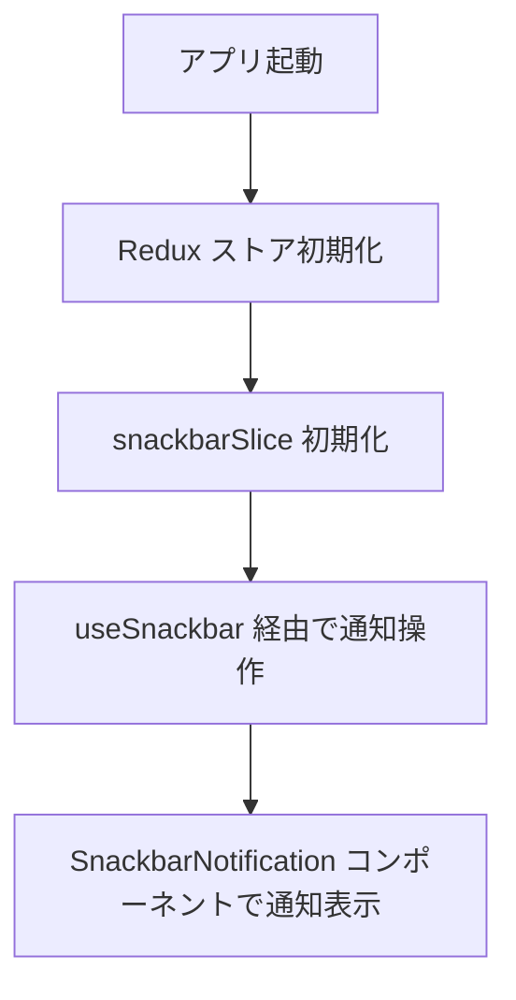
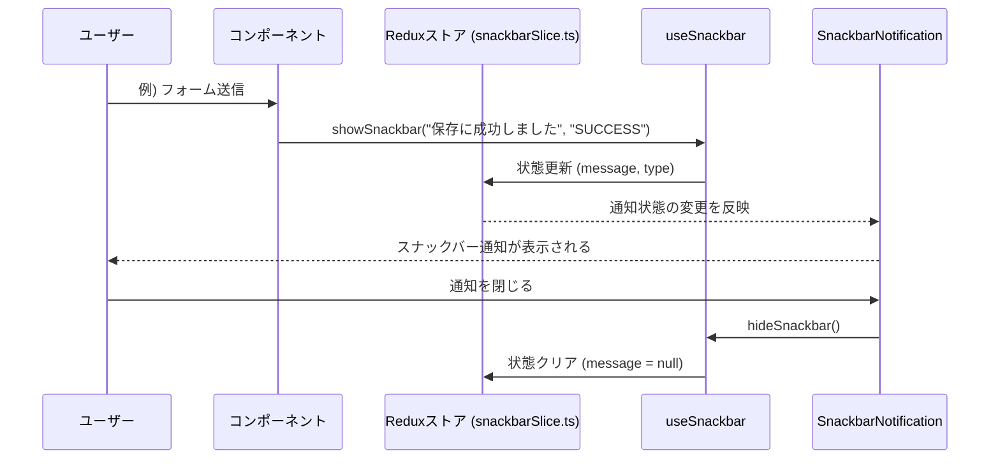

# スナックバー通知モジュール仕様書

## 1. モジュール概要

### 1-1. 目的
このモジュールは、アプリケーション内で発生する各種通知（エラー、成功、警告など）をスナックバー形式でユーザーに表示するための共通インターフェースを提供する。これにより、ユーザーエクスペリエンスの向上と、アプリ全体での一貫した通知管理が実現される。

### 1-2. 適用範囲
- API 呼び出しやユーザー操作に伴う通知表示
- エラーメッセージや成功メッセージの即時フィードバック
- アプリ全体で共通の UI コンポーネントとして利用

---

## 2. 設計方針

### 2-1. アーキテクチャ
- **Redux ベースの状態管理**  
  **SnackBar**通知メッセージおよびそのタイプは Redux の `snackbarSlice.ts` によりグローバルに管理され、アプリ内のどのコンポーネントからもアクセス可能とする。

- **カスタムフックの利用**
  `useSnackbar.ts` を用いることで、コンポーネントは通知の表示や非表示を制御する。

- **UI コンポーネント**
  `SnackbarNotification.tsx` が Redux の状態に基づいてスナックバー通知をレンダリングし、ユーザーに対してメッセージを表示。

### 2-2. 統一ルール
- すべての通知操作は Redux を通じて管理する。
- 通知は、ユーザーの操作または自動タイマーによって非表示にする。
- 通知のスタイルやアニメーションは統一的に管理し、ユーザーにわかりやすいフィードバックを提供する。
- 各スライスには初期値を設定し、ログアウト時の初期化によってUIが影響を受けない設計とする。

---

## 3. 📂 フォルダ構成とファイルの役割

```plaintext
src/
├── slices/
│   └── snackbarSlice.ts       // SnackBar通知の状態管理（メッセージ、タイプの設定・クリア）
├── hooks/
│   └── useSnackbar.ts         // snackbarSlice.ts を利用したカスタムフック
└── components/
    └── functional/
        └── SnackbarNotification.tsx   // スナックバー通知を画面に表示する UI コンポーネント
```
## 4. 📌 各ファイルの説明

### snackbarSlice.ts
**目的:**
グローバルなスナックバー通知の状態を管理する。

**機能:**
- **showSnackbar:** 通知メッセージと通知タイプ（SUCCESS, ERROR, ALERT）を設定し、表示状態にする。
- **hideSnackbar:** 現在の通知をクリアし、非表示にする。


```js
<!-- INCLUDE:FE\spa-next\my-next-app\src\slices\snackbarSlice.ts -->
```
---

### useSnackbar.ts
**目的:**
Redux の `snackbarSlice.ts` を利用し、スナックバー通知の表示および非表示処理を簡単に呼び出せるカスタムフックを提供する。

**機能:**
- **showSnackbar:** 指定したメッセージと通知タイプを設定して通知を表示する。
- **hideSnackbar:** 表示中の通知をクリアする。
- **状態の返却:** 現在の通知状態（メッセージ、通知タイプ）を返す。

```js
<!-- INCLUDE:FE\spa-next\my-next-app\src\hooks\useSnackbar.ts -->
```

---

### SnackbarNotification.tsx
**目的:**
Redux で管理されるスナックバー通知状態に基づき、ユーザーに通知メッセージを表示する UI コンポーネントを提供する。

**機能:**
- Redux の状態からメッセージと通知タイプを取得し、画面上にスナックバー通知を表示する。
- タイマーやユーザー操作によって通知を自動的に非表示にする。
- 表示位置、アニメーション、スタイルを統一的に管理し、一貫したユーザー体験を提供する。

```js
<!-- INCLUDE:FE\spa-next\my-next-app\src\components\functional\SnackbarNotification.tsx -->
```

---
## 5. 📂 処理フロー図




## 6. 📂 処理シーケンス図




