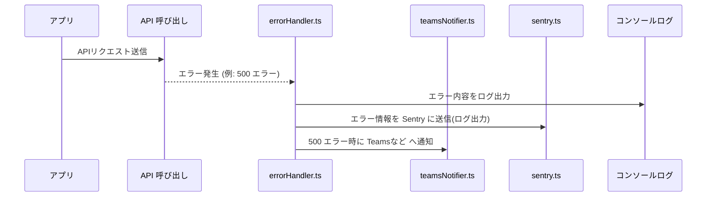
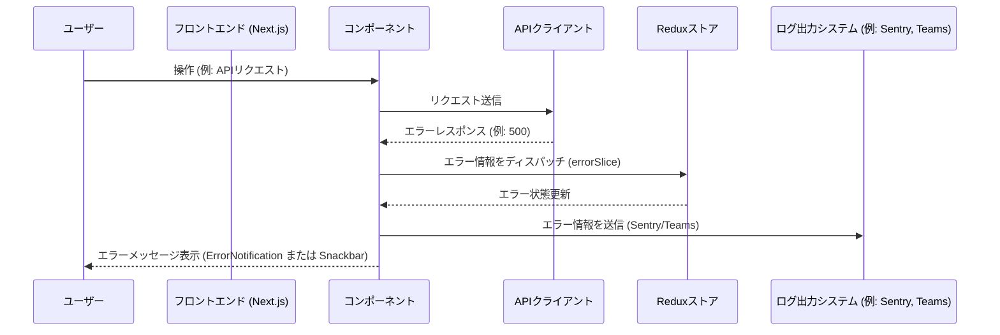

# ログシステム仕様書

この仕様書は、アプリケーション全体で発生するエラーの統一的な処理とログ出力の仕組みを実現するための設計方針、ファイル構成、各ファイルの役割、処理フローおよびシーケンスをまとめたものです。

---

## 1. モジュール概要

### 1-1. 目的
- アプリケーション内で発生する各種エラー（API通信時のエラー、UIエラー等）を一元的にキャッチ・処理し、ユーザーへ適切に通知するとともに、開発者向けに詳細なログ出力および外部ログシステム（Sentry、Microsoft Teams など）への送信を行う。
- エラーハンドリングの統一により、デバッグ効率の向上と運用時の安定性を担保する。

### 1-2. 適用範囲
- **API通信時のエラー**  
  - ネットワークエラー、HTTPステータスコード（400, 401, 403, 404, 500など）のエラー処理
- **UIエラーのキャッチ**  
  - コンポーネントツリー内で発生するレンダリングエラーのキャッチとフォールバック表示（ErrorBoundary）
- **ユーザー通知**  
  - グローバルなエラー通知（ErrorNotification、SnackbarNotification）
- **外部ログ出力**  
  - Sentry へのエラーログ送信、Teams 通知による重大エラーの即時通知

---

## 2. 設計方針

### 2-1. アーキテクチャ方針
- **疎結合**  
  各処理（エラーハンドリング、ログ出力、UI通知）は独立したモジュールとして実装し、変更や拡張に強い設計とする。
- **一元管理**  
  Redux を用いてグローバルなエラー情報とスナックバー通知の状態を管理し、アプリケーション全体から統一された方法でアクセス・更新できるようにする。
- **型安全性**  
  TypeScript による厳密な型定義を行い、エラーオブジェクトやログメッセージの整合性を担保する。

### 2-2. 統一的なルール
- **エラーハンドリング**  
  - API 呼び出し時は `errorHandler.ts` を使用し、HTTP ステータスコードに応じたエラーメッセージ生成と通知を行う。  
  - 401 エラーの場合はグローバルログアウトや再ログインを促す処理を実施する。
- **ログ出力**  
  - 開発環境ではコンソール出力、運用環境では外部ロガー（例：winston など）を使用し、ログのファイルローテーションや外部システム（Sentry、Teams）への通知を行う。

---

## 3. 📂 フォルダ構成とファイルの役割

```plaintext
src/
├── slices/
│   ├── errorSlice.ts         // グローバルエラー情報（エラーメッセージ）の状態管理
│   └── snackbarSlice.ts      // スナックバー通知の状態管理（エラー通知含む）
├── hooks/
│   └── useError.ts           // Redux の errorSlice を利用したエラー管理用カスタムフック
├── utils/
│   ├── errorHandler.ts       // API呼び出し時のエラーハンドリング関数
│   ├── teamsNotifier.ts      // Teams へのエラー通知機能（Incoming Webhook 経由）
│   ├── logger.ts             // 環境変数からログレベルと通知先の設定
│   └── sentry.ts             // Sentry SDK の初期化とエラー送信処理
├── components/
│   └── functional/
│       ├── ErrorBoundary.tsx       // React コンポーネントツリー内のエラーをキャッチし、フォールバックUIを表示
│       ├── ErrorNotification.tsx   // グローバルエラー情報を元にユーザーへエラーメッセージを表示
│       └── SnackbarNotification.tsx// スナックバーによる通知表示（エラー通知も含む）
```

## 4. 📌 各ファイルの説明

### errorSlice.ts
- **目的**:  
  グローバルなエラー情報（エラーメッセージ）の状態を管理する。

- **機能**:  
  エラーメッセージの設定・クリアのアクションを定義し、Redux ストアに統合する。
```js
<!-- INCLUDE:FE\spa-next\my-next-app\src/slices/errorSlice.ts -->
```
---

### useError.ts
- **目的**:  
  Redux の `errorSlice` を利用し、エラー表示およびクリアの処理を簡単に呼び出せるカスタムフックを提供する。

- **機能**:  
  `showError` と `clearError` 関数を公開し、コンポーネントからエラー状態の更新を行う。

```js
<!-- INCLUDE:FE\spa-next\my-next-app\src/hooks/useError.ts -->
```

---

### errorHandler.ts
- **目的**:  
  API通信時に発生するエラーを一元的に処理する。

- **機能**:
  - ネットワークエラーおよび HTTP エラーに対して適切なエラーメッセージを生成する。
  - 500 番台のエラーなど通知が必要な場合、`sendErrorToTeams` を呼び出して Microsoft Teams への通知を実施する。(通知処理の例)
  - Sentry へのエラー送信（`sentry.ts` 経由）を実行する。
  - ローカルのロガー（例：winston）を使用してエラー内容を記録する（ログファイルへの書き出し）。
  - 最終的に例外をスローし、上位のエラーハンドリング（例：`ErrorBoundary`）でキャッチさせる。

```js
<!-- INCLUDE:FE\spa-next\my-next-app\src/utils/errorHandler.ts -->
```
---

### teamsNotifier.ts
- **目的**:  
  Microsoft Teams へのエラー通知を実施する。※通知方法の1案

- **機能**:  
  環境変数 `TEAMS_WEBHOOK_URL` を使用し、エラー情報を JSON ペイロードとして POST 送信する。

```js
<!-- INCLUDE:FE\spa-next\my-next-app\src/utils/teamsNotifier.ts -->
```
---

### sentry.ts
- **目的**:  
  Sentry SDK を初期化し、エラー発生時に自動的にエラーログを送信する。 ※通知方法の1案

- **機能**:  
  環境変数 `NEXT_PUBLIC_SENTRY_DSN` と `NEXT_PUBLIC_LOG_LEVEL` を使用して Sentry をセットアップし、エラー情報を記録する。
```js
<!-- INCLUDE:FE\spa-next\my-next-app\src/utils/sentry.ts -->
```
---

### ErrorBoundary.tsx
- **目的**:  
  コンポーネントツリー内で発生したエラーをキャッチし、フォールバック UI を表示する。

- **機能**:  
  `getDerivedStateFromError` と `componentDidCatch` を利用して、エラー発生時に状態更新およびログ出力（Sentry 送信など）を行う。

```js
<!-- INCLUDE:FE\spa-next\my-next-app\src\components\functional\ErrorBoundary.tsx -->
```

---

### ErrorNotification.tsx
- **目的**:  
  Redux やその他のグローバルステートから取得したエラー情報をユーザーに通知する。

- **機能**:  
  エラーメッセージを画面上に表示し、一定時間後に自動で非表示にするタイマー処理を実装する。

```js
<!-- INCLUDE:FE\spa-next\my-next-app\src\components\functional\ErrorNotification.tsx -->
```
---

### SnackbarNotification.tsx
- **目的**:
  スナックバー形式でエラーや通知メッセージをユーザーに表示する。

- **機能**:
  Redux の状態からメッセージと通知タイプを取得し、ユーザー操作またはタイムアウトで通知を非表示にする処理を実装する.
```js
  <!-- INCLUDE:FE\spa-next\my-next-app\src\components\functional\SnackbarNotification.tsx -->
```
---
### logger.ts
- **目的**: 環境変数からログの出力レベル及び出力先を取得し、提供する。ログファイルの出力はサーバーサイドで行う。
- **機能**:
```
LOG_LEVELを環境変数から取得し、処理を分岐させる。
| 環境         | ログレベル   | 具体的な理由                                      |
| ----------- | --------------- | ----------------------------------------------|
| ローカル開発 | DEBUG   | すべてのログ（詳細なデバッグ情報含む）を出力。   　　　　　ログファイル出力無し。　　 |
| テスト環境   | INFO    | 重要なイベントやエラーのみを記録し、過剰なログ出力を抑制。 ログファイル出力あり。　　|
| 本番環境     | WARN    | 問題発生時のみのログ出力に留める。                     　ログファイル出力あり。   |
---
```
```js
  <!-- INCLUDE:FE\spa-next\my-next-app\src\utils\logger.ts -->
```

## 5. 📌処理フロー図



## 6. 📌 処理シーケンス図

