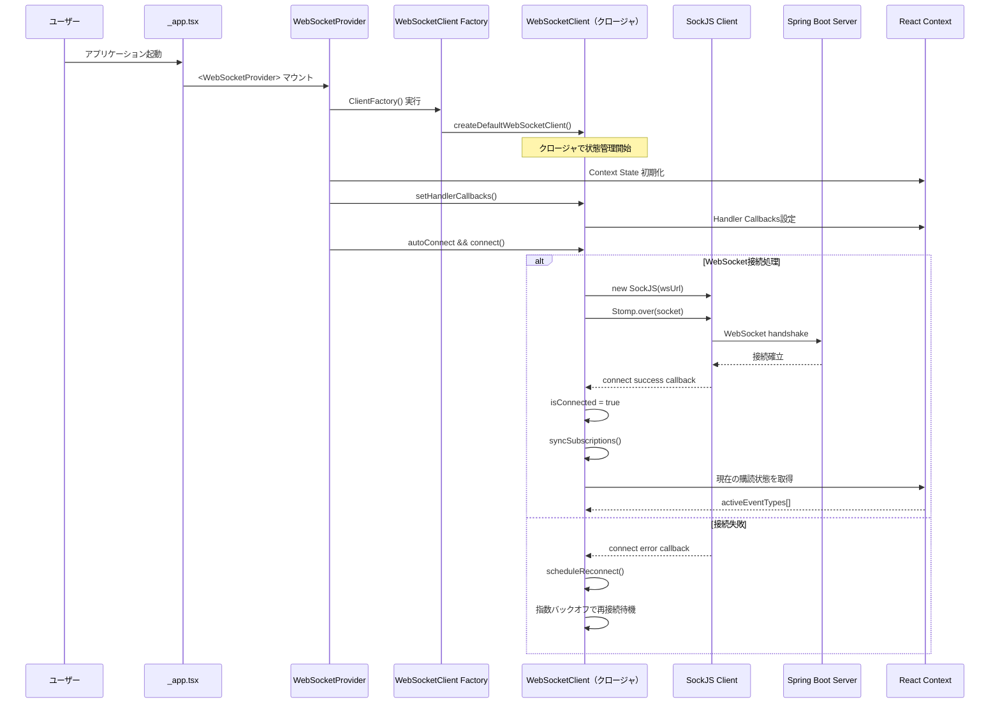
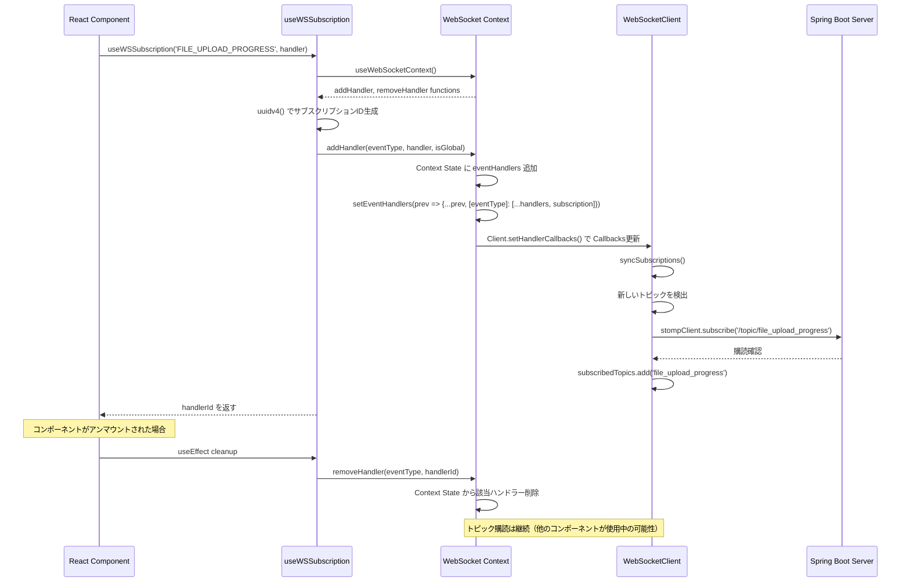
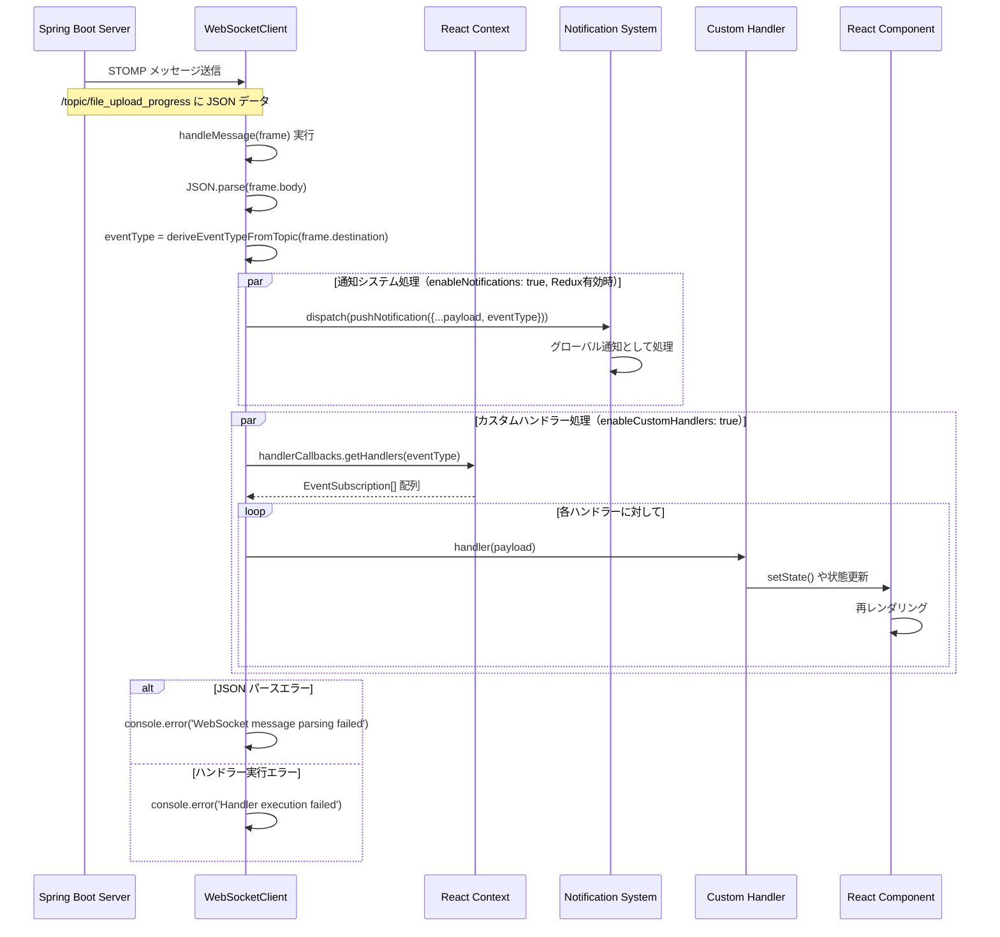
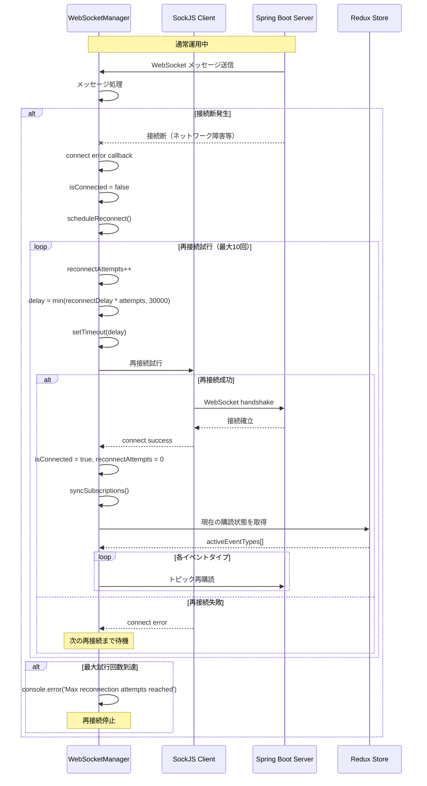
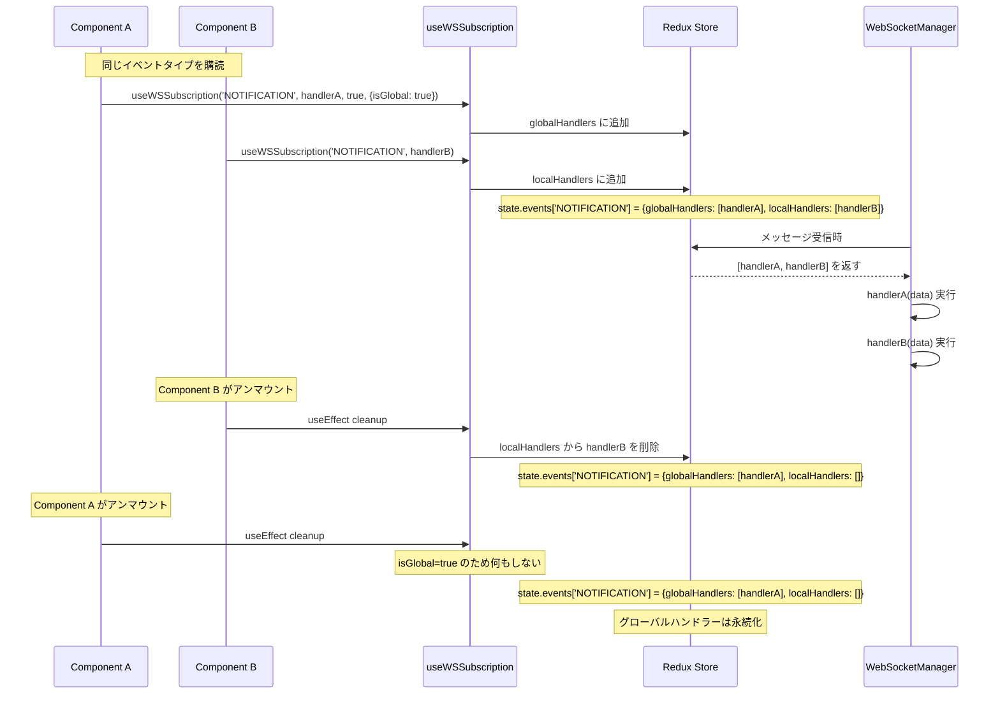
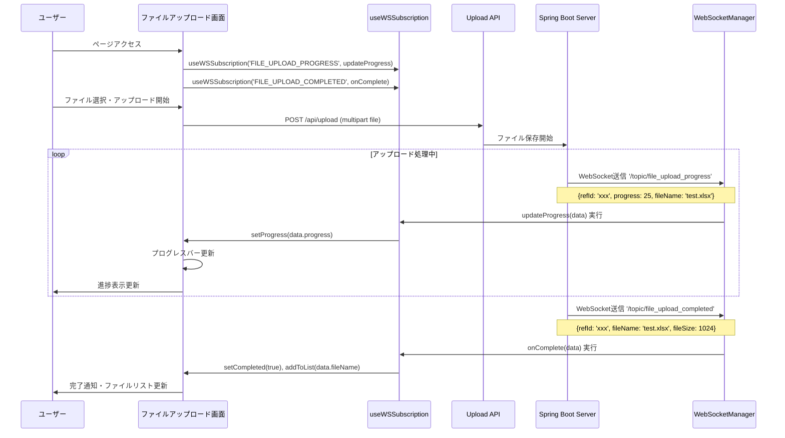

# 📘 WebSocket通知モジュール仕様書（フロントエンド）

## 1. 概要

このモジュールは、Spring Boot バックエンドが提供する STOMP over WebSocket ベースの通知機構にフロントエンドから接続し、リアルタイムイベントの送受信を行うためのものです。**Context-only**アーキテクチャを採用し、Redux不要でシンプルなWebSocket通信機能を提供します。

## 1.1 現在のアーキテクチャの特徴

- **Context-only**: Redux不要、React Contextのみで状態管理
- **ファクトリーパターン**: WebSocketClient作成にファクトリーパターンを採用
- **自動クリーンアップ**: コンポーネントアンマウント時の自動購読解除
- **型安全性**: TypeScriptによる完全な型安全サポート
- **柔軟な購読**: 条件付き購読、グローバル購読対応
- **統合通知システム**: Context内蔵の通知管理とSnackbar自動表示
- **包括的テスト**: Jest/React Testing Libraryによる完全なテストカバレッジ
- **MSWフレンドリー**: StorybookでのMSW統合を前提とした設計

---

## 2. 構成概要

```
📂 src/
├── utils/
│   └── webSocketClient.ts           // WebSocketClient ファクトリー（Context-only対応）
├── hooks/
│   └── useWSSubscription.ts         // WebSocketイベント購読フック（統合版）
├── components/
│   ├── providers/
│   │   └── WebSocketProvider.tsx    // WebSocket Provider（Context-only実装）
│   └── composite/
│       └── SnackbarListener.tsx     // 自動Snackbar通知システム
├── types/
│   └── webSocketEvents.ts           // WebSocketイベントの型定義
├── stories/
│   └── WebSocketDemo.stories.tsx    // Storybook用デモ（MSW対応）
└── __tests__/                       // 包括的テストスイート
    ├── webSocketClient.test.ts
    ├── WebSocketProvider.test.tsx
    ├── useWSSubscription.test.tsx
    └── SnackbarListener.test.tsx
```

---

## 3. 技術スタック

| 項目             | 使用技術                                    |
| ---------------- | ------------------------------------------- |
| 通信ライブラリ   | `sockjs-client`, `@stomp/stompjs`          |
| 接続プロトコル   | STOMP over WebSocket                        |
| UIフレームワーク | React 18, Next.js 15                        |
| 状態管理         | Redux Toolkit                               |
| 型安全性         | TypeScript 5                                |

---

## 4. Context-onlyアーキテクチャ詳細

### 4.1 Context-only階層構造

```mermaid
graph TD
    A[WebSocketProvider] --> B[WebSocketClient Factory]
    B --> C[STOMP Client]
    D[useWSSubscription Hook] --> A
    E[Components] --> D
    A --> F[Handler Context State]
    
    subgraph "Context-only構成"
        A
        D
        F
    end
```mermaid
graph TD
    A[WebSocketProvider] --> B[WebSocketCore Factory]
    B --> C[STOMP Client]
    B --> D[Redux Store]
    E[useWebSocketEvent Hook] --> A
    F[Components] --> E
    D --> G[wsSubscriptionsSlice]
    
    subgraph "3層構成"
        A
        E
        B
    end
```

### 4.2 主要コンポーネント

#### WebSocketClient (`utils/webSocketClient.ts`)

ファクトリーパターンによるWebSocket接続の中核実装。**Redux不要**のContext-only設計。

**主な機能：**
- STOMP over SockJSによる接続管理
- 自動再接続（最大10回、指数バックオフ）
- Context状態との同期
- デバッグモード
- クロージャベースの状態管理

**ファクトリー関数：**
```typescript
// デフォルトファクトリー
const createDefaultWebSocketClient = (): WebSocketClient => {
  return createWebSocketClient({
    enableNotifications: true,
    enableCustomHandlers: true,
  });
};

// 通知専用ファクトリー
const createNotificationOnlyWebSocketClient = (): WebSocketClient => {
  return createWebSocketClient({
    enableNotifications: true,
    enableCustomHandlers: false,
  });
};

// カスタムハンドラー専用ファクトリー
const createCustomHandlerOnlyWebSocketClient = (): WebSocketClient => {
  return createWebSocketClient({
    enableNotifications: false,
    enableCustomHandlers: true,
  });
};
```

**設定オプション：**
```typescript
type WebSocketClientConfig = {
  url?: string;                     // WebSocketエンドポイント
  reconnectDelay?: number;          // 再接続遅延（デフォルト: 5000ms）
  maxReconnectAttempts?: number;    // 最大再接続試行回数（デフォルト: 10）
  debug?: boolean;                  // デバッグモード（デフォルト: false）
  enableNotifications?: boolean;    // 通知システム有効化（デフォルト: true）
  enableCustomHandlers?: boolean;   // カスタムハンドラー有効化（デフォルト: true）
}
```

#### WebSocketProvider (`components/providers/WebSocketProvider.tsx`)

**Context-only**実装のプロバイダーコンポーネント。WebSocketClientを依存性注入で管理し、内蔵通知システムを提供。

```typescript
type WebSocketProviderProps = {
  children: ReactNode;
  ClientFactory?: () => WebSocketClient; // DIで柔軟性を提供
  autoConnect?: boolean;                 // 自動接続
  debug?: boolean;                       // デバッグモード
}

<WebSocketProvider 
  ClientFactory={createDefaultWebSocketClient}
  autoConnect={true}
  debug={false}
>
  {children}
</WebSocketProvider>
```

**内蔵通知システム:**
- `addNotification`: 手動通知追加
- `notifications`: 通知一覧の取得
- `clearNotifications`: 通知クリア
- `useLatestNotification`: 最新通知の監視

#### SnackbarListener (`components/composite/SnackbarListener.tsx`)

WebSocket通知を自動的にSnackbar表示するコンポーネント。

```typescript
// 自動処理される通知タイプ
const SUPPORTED_EVENTS = {
  'FILE_UPLOAD_COMPLETED': 'ファイルアップロード完了！',
  'FILE_DOWNLOAD_COMPLETED': 'ファイルダウンロードの準備完了！',
  'USER_SESSION_EXPIRED': 'セッションが切れました。再ログインしてください'
};

// 使用方法
<WebSocketProvider>
  <SnackbarListener /> {/* 自動通知処理 */}
  <App />
</WebSocketProvider>
```

#### useWSSubscription (`hooks/useWSSubscription.ts`)

**Context-only**対応のWebSocketイベント購読フック。

**特徴：**
- 型安全なイベントタイプとデータ
- 自動的なクリーンアップ
- グローバル/ローカルハンドラーの選択可能
- UUIDによる購読者の一意識別

**基本フック：**
```typescript
const useWSSubscription = (
  eventType: string,
  handler: (data: any) => void,
  enabled: boolean = true,
  options?: { isGlobal?: boolean; autoCleanup?: boolean; }
): string | null => {
  const { addHandler, removeHandler } = useWebSocketContext();
  const handlerIdRef = useRef<string | null>(null);
  
  useEffect(() => {
    if (!enabled || !handler) return;
    const handlerId = addHandler(eventType, handler, options?.isGlobal ?? false);
    handlerIdRef.current = handlerId;
    
    return () => {
      if (handlerIdRef.current) {
        removeHandler(eventType, handlerIdRef.current);
      }
    };
  }, [addHandler, removeHandler, eventType, handler, enabled, options?.isGlobal]);
  
  return handlerIdRef.current;
};
```

**便利フック：**
```typescript
// グローバルハンドラー用
const useGlobalWebSocketEvent = (eventType, handler, enabled = true) => 
  useWSSubscription(eventType, handler, enabled, { isGlobal: true });

// 複数イベント同時購読用
const useMultipleWebSocketEvents = (subscriptions) => { ... };

// 条件付き購読用
const useConditionalWebSocketEvent = (eventType, handler, condition, isGlobal = false) => 
  useWSSubscription(eventType, handler, condition, { isGlobal });
```

---

## 5. イベントタイプ定義

### 5.1 定義済みイベントタイプ (`types/webSocketEvents.ts`)

| イベントタイプ | 説明 | データ型 |
|---------------|------|----------|
| `FILE_UPLOAD_PROGRESS` | ファイルアップロード進捗 | `{refId, progress, fileName, totalSize, uploadedSize}` |
| `FILE_UPLOAD_COMPLETED` | ファイルアップロード完了 | `{refId, fileName, fileSize, uploadTime}` |
| `FILE_DOWNLOAD_COMPLETED` | ファイルダウンロード完了 | `{refId, fileName, downloadUrl}` |
| `FILE_CREATE_PROGRESS` | ファイル作成進捗 | `{refId, progress, status}` |
| `NOTIFICATION` | 一般通知 | `{id, message, type, timestamp}` |
| `ERROR_NOTIFICATION` | エラー通知 | `{id, message, errorCode?, timestamp}` |
| `GATE_IN` | ゲート入場 | `{deviceId, userId, timestamp, location}` |
| `GATE_OUT` | ゲート退場 | `{deviceId, userId, timestamp, location}` |
| `BATCH_PROGRESS` | バッチ処理進捗 | `{jobId, progress, total, current, estimatedTimeRemaining?}` |
| `BATCH_COMPLETED` | バッチ処理完了 | `{jobId, success, results, completedAt}` |
| `SYSTEM_MAINTENANCE` | システムメンテナンス | `{message, startTime, estimatedDuration, maintenanceType}` |
| `USER_SESSION_EXPIRED` | セッション期限切れ | `{userId, expiredAt, reason}` |

### 5.2 カスタムイベントの追加方法

1. `WS_EVENTS`定数に新しいイベントタイプを追加
2. `WSEventDataMap`に対応するデータ型を定義
3. TypeScriptが自動的に型チェックを適用

---

## 6. Context状態管理

### 6.1 Handler管理

WebSocket購読の状態管理をReact Contextで実装。**Redux不要**のシンプルな設計。

**状態構造：**
```typescript
type EventSubscription = {
  id: string;
  handler: (data: any) => void;
  isGlobal: boolean;
};

type WebSocketContextValue = {
  client: WebSocketClient;
  addHandler: (eventType: string, handler: (data: any) => void, isGlobal: boolean) => string;
  removeHandler: (eventType: string, handlerId: string) => void;
  getHandlers: (eventType: string) => EventSubscription[];
  getActiveEventTypes: () => string[];
  // 通知システム
  addNotification: (notification: any) => void;
  notifications: any[];
  clearNotifications: () => void;
};
```

**Context操作：**
- `addHandler`: イベントハンドラーの追加
- `removeHandler`: ハンドラーの削除（自動クリーンアップ）
- `getHandlers`: 特定イベントのハンドラー取得
- `getActiveEventTypes`: アクティブなイベントタイプ一覧
- `addNotification`: 手動通知追加（テスト用）
- `notifications`: 現在の通知一覧
- `clearNotifications`: 全通知のクリア

---

## 7. Context-onlyアーキテクチャでの実装例

### 7.1 基本的な使用方法（Context-only）

```typescript
const FileUploadComponent = () => {
  const [progress, setProgress] = useState(0);

  // Context-onlyフックでファイルアップロード進捗の監視
  useWSSubscription('FILE_UPLOAD_PROGRESS', (data) => {
    setProgress(data.progress);
  });

  return <ProgressBar value={progress} />;
};
```

### 7.2 複数イベントの購読（一括管理）

```typescript
const Dashboard = () => {
  const [notifications, setNotifications] = useState([]);
  const [errors, setErrors] = useState([]);
  const [batchProgress, setBatchProgress] = useState(0);

  // 複数イベントの同時購読
  useMultipleWebSocketEvents([
    {
      eventType: 'NOTIFICATION',
      handler: (data) => {
        setNotifications(prev => [...prev, data]);
        showSnackbar(data.message, data.type);
      },
      enabled: true
    },
    {
      eventType: 'ERROR_NOTIFICATION', 
      handler: (data) => {
        setErrors(prev => [...prev, data]);
        showError(`エラー: ${data.message}`);
      },
      enabled: true
    },
    {
      eventType: 'BATCH_PROGRESS',
      handler: (data) => {
        setBatchProgress(data.progress);
      },
      enabled: true
    }
  ]);

  // または個別購読
  useWSSubscription('NOTIFICATION', (data) => {
    setNotifications(prev => [...prev, data]);
    showSnackbar(data.message, data.type);
  });

  useWSSubscription('ERROR_NOTIFICATION', (data) => {
    setErrors(prev => [...prev, data]);
    showError(`エラー: ${data.message}`);
  });

  return <div>ダッシュボード</div>;
};
```

### 7.3 条件付き購読（パフォーマンス最適化）

```typescript
const ConditionalComponent = () => {
  const [isMonitoring, setIsMonitoring] = useState(false);

  // 条件付きWebSocketイベント購読
  useConditionalWebSocketEvent(
    'SYSTEM_MAINTENANCE',
    (data) => {
      handleMaintenance(data);
      showMaintenanceModal(data);
    },
    isMonitoring  // この条件がtrueの時のみ購読
  );

  // または基本Hookのenabledパラメータ使用
  useWSSubscription(
    'SYSTEM_MAINTENANCE',
    (data) => {
      handleMaintenance(data);
      showMaintenanceModal(data);
    },
    isMonitoring // enabled パラメータ
  );

  return (
    <Button onClick={() => setIsMonitoring(!isMonitoring)}>
      {isMonitoring ? '監視停止' : '監視開始'}
    </Button>
  );
};
```

### 7.4 Storybook用MSW統合例

```typescript
// src/stories/WebSocketDemo.stories.tsx
const WebSocketDemoInner: React.FC = () => {
  const [messages, setMessages] = useState<WSMessage[]>([]);
  const [isSubscribed, setIsSubscribed] = useState(false);

  // WebSocketClientとステータスを取得
  const client = useWebSocketClient();
  const status = useWebSocketStatus();

  // WebSocketイベントハンドラー
  const handleWebSocketMessage = useCallback((data: any) => {
    const message: WSMessage = {
      id: crypto.randomUUID(),
      eventType: 'GATE_IN',
      data: data,
      timestamp: Date.now(),
      source: 'websocket',
    };
    setMessages(prev => [message, ...prev].slice(0, 20));
  }, []);

  // WebSocketイベント購読
  useWSSubscription('GATE_IN', handleWebSocketMessage, isSubscribed);

  return (
    <Box sx={{ p: 3 }}>
      {/* UI実装 */}
    </Box>
  );
};

// MSWでWebSocket通信をモック可能な設計
export const Default: Story = {
  name: 'WebSocketデモ（MSW対応）',
};
```

---

## 8. エラーハンドリングと再接続

### 8.1 自動再接続機能

- 接続失敗時に自動的に再接続を試行
- 指数バックオフアルゴリズムによる遅延（最大30秒）
- 最大再接続試行回数の制限（デフォルト: 10回）

### 8.2 エラーハンドリング（新アーキテクチャ）

```typescript
// WebSocketCore内部での処理（クロージャ）
const handleMessage = (frame: any) => {
  try {
    if (debug) console.log('📨 WebSocket message received:', frame.body);
    
    const payload = JSON.parse(frame.body);
    const eventType = deriveEventTypeFromTopic(frame.destination);
    
    if (enableCustomHandlers && store) {
      const handlers = selectEventHandlers(store.getState(), eventType);
      handlers.forEach(({ handler }) => {
        try {
          handler(payload);
        } catch (handlerError) {
          console.error('🚨 Handler execution failed:', handlerError);
        }
      });
    }
  } catch (error) {
    console.error('🚨 WebSocket message parsing failed:', error);
  }
};
```

---

## 9. 処理シーケンス図

### 9.1 Context-onlyアーキテクチャ：アプリケーション起動時の初期化フロー



### 9.2 Context-onlyアーキテクチャ：コンポーネントでのイベント購読フロー



### 9.3 Context-onlyアーキテクチャ：WebSocketメッセージ受信・処理フロー



### 9.4 接続断・再接続フロー



### 9.5 グローバルハンドラーとローカルハンドラーの処理差異



### 9.6 実用例：ファイルアップロード監視の完全フロー



---

## 10. Context-onlyアーキテクチャ移行ガイド

### 10.1 Redux+ContextからContext-onlyへの移行（2025年8月実施済み）

#### 移行対象ファイル

**削除されたファイル:**
- `slices/wsSubscriptionsSlice.ts` → 削除（Redux状態管理を撤廃）
- 旧WebSocket関連ファイル（移行済み）

**更新されたファイル:**
- `components/providers/WebSocketProvider.tsx` → Context-only実装に変更
- `hooks/useWSSubscription.ts` → Context API使用に変更
- `utils/webSocketClient.ts` → Context Callbacks対応

#### アーキテクチャ変更

**Before（Redux+Context）:**
```typescript
// Redux Sliceで状態管理
const wsSubscriptionsSlice = createSlice({
  name: 'wsSubscriptions',
  initialState: { events: {} },
  reducers: {
    addEvent: (state, action) => { /* Redux state update */ }
  }
});

// Provider内でRedux使用
const { addHandler } = useWebSocketContext();
dispatch(addEvent({ eventType, handlerId, handler }));
```

**After（Context-only）:**
```typescript
// Context内で状態管理
const [eventHandlers, setEventHandlers] = useState<Record<string, EventSubscription[]>>({});

// Context APIのみで完結
const addHandler = (eventType: string, handler: (data: any) => void, isGlobal: boolean): string => {
  const handlerId = uuidv4();
  setEventHandlers(prev => ({
    ...prev,
    [eventType]: [...(prev[eventType] || []), { id: handlerId, handler, isGlobal }]
  }));
  return handlerId;
};
```

### 10.2 Context-only移行のメリット

1. **シンプル化**: Redux不要でコード量削減、学習コストの軽減
2. **状態管理の一元化**: React Contextのみで完結、複雑性の除去
3. **メモリ効率**: Redux Store不要でメモリ使用量削減
4. **型安全性**: TypeScript支援の向上、Redux Toolkitの複雑性除去
5. **保守性向上**: 依存関係の単純化、デバッグの容易さ
6. **MSWフレンドリー**: Storybookでのテスト環境がより簡潔

### 10.3 Context-only移行後の変更点

#### API変更
- Redux統合が**オプション**に：`enableReduxIntegration={false}` がデフォルト
- `wsSubscriptionsSlice`が不要：Context内で状態管理
- `useWSSubscription`の引数形式が一部変更：`options`パラメータでオプション指定

#### Context-only用新機能
- `useGlobalWebSocketEvent`: グローバルハンドラー専用フック
- `useMultipleWebSocketEvents`: 複数イベント同時購読
- `useConditionalWebSocketEvent`: 条件付き購読
- `useWebSocketContext`: 低レベルContext操作用フック

---

## 11. パフォーマンス最適化

### 11.1 購読の最適化

- 不要な購読を避ける（`enabled`パラメータの活用）
- グローバルハンドラーは慎重に使用
- 大量のメッセージ処理時はデバウンスやスロットリングを検討

### 11.2 メモリ管理

- ローカルハンドラーは自動的にクリーンアップ
- グローバルハンドラーは永続化されるため注意が必要

---

## 12. セキュリティ考慮事項

### 12.1 認証

- JWT/セッションベースの認証をサポート
- Gateway経由での認証チェック

### 12.2 データ検証

- 受信データの型チェック
- 不正なメッセージのフィルタリング

---

## 13. トラブルシューティング

### 13.1 接続できない場合

1. WebSocketエンドポイントURLを確認
2. ネットワーク接続を確認
3. CORSの設定を確認
4. デバッグモードを有効化して詳細ログを確認

### 13.2 メッセージが受信できない場合

1. イベントタイプが正しいか確認
2. Redux DevToolsで購読状態を確認
3. サーバー側のトピック設定を確認

---

## 14. 今後の拡張予定

### 14.1 MSW統合の完全実装

- StorybookでのMSW WebSocketモッキング
- E2EテストでのWebSocket通信モック
- 開発環境でのリアルタイムデバッグ支援

### 14.2 パフォーマンス監視

- WebSocket接続状態の可視化
- メッセージ送受信レートの監視
- メモリ使用量の追跡

### 14.3 高度な機能

- WebSocketイベントのフィルタリング機能
- バッチ処理でのメッセージキューイング
- 優先度付きメッセージ処理

---

## 15. APIリファレンス

### 15.1 useWSSubscription Hook

基本的なWebSocketイベント購読Hook

```typescript
function useWSSubscription(
  eventType: string,
  handler: (data: any) => void,
  enabled?: boolean,
  options?: {
    isGlobal?: boolean;
    autoCleanup?: boolean; // 後方互換用（現在は無効）
  }
): string | null
```

**パラメータ:**
- `eventType`: 購読するWebSocketイベントタイプ
- `handler`: イベント受信時に実行される関数
- `enabled`: 購読を有効にするか（デフォルト: true）
- `options.isGlobal`: グローバルハンドラーとして登録するか（デフォルト: false）

**戻り値:**
- 購読ID（文字列）またはnull

### 15.2 便利Hook群

#### useGlobalWebSocketEvent
```typescript
function useGlobalWebSocketEvent(
  eventType: string,
  handler: (data: any) => void,
  enabled?: boolean
): string | null
```

#### useMultipleWebSocketEvents
```typescript
function useMultipleWebSocketEvents(
  subscriptions: Array<{
    eventType: string;
    handler: (data: any) => void;
    enabled?: boolean;
    isGlobal?: boolean;
  }>
): Record<string, string | null>
```

#### useConditionalWebSocketEvent
```typescript
function useConditionalWebSocketEvent(
  eventType: string,
  handler: (data: any) => void,
  condition: boolean,
  isGlobal?: boolean
): string | null
```

### 15.3 Context API

#### useWebSocketContext
```typescript
function useWebSocketContext(): {
  client: WebSocketClient;
  addHandler: (eventType: string, handler: (data: any) => void, isGlobal: boolean) => string;
  removeHandler: (eventType: string, handlerId: string) => void;
  getHandlers: (eventType: string) => EventSubscription[];
  getActiveEventTypes: () => string[];
  // 通知システム
  addNotification: (notification: any) => void;
  notifications: any[];
  clearNotifications: () => void;
}
```

#### useLatestNotification
```typescript
function useLatestNotification(): any | null
// 最新の通知を取得（SnackbarListener等で使用）
```

#### useWebSocketClient
```typescript
function useWebSocketClient(): WebSocketClient
```

#### useWebSocketStatus
```typescript
function useWebSocketStatus(): {
  isConnected: boolean;
  subscribedTopics: string[];
  config: WebSocketClientConfig;
}
```

### 15.4 WebSocketClient インターフェース

```typescript
interface WebSocketClient {
  connect: () => Promise<void>;
  disconnect: () => void;
  subscribe: (eventType: string, handler: (data: any) => void, isGlobal?: boolean) => string;
  unsubscribe: (eventType: string, handlerId: string) => void;
  getStatus: () => {
    isConnected: boolean;
    subscribedTopics: string[];
    config: WebSocketClientConfig;
  };
  setStore: (store: Store) => void;
  setHandlerCallbacks: (callbacks: HandlerCallbacks) => void;
}
```

### 15.5 型定義

#### EventSubscription
```typescript
type EventSubscription = {
  id: string;
  handler: (data: any) => void;
  isGlobal: boolean;
};
```

#### WebSocketClientConfig
```typescript
type WebSocketClientConfig = {
  url?: string;
  reconnectDelay?: number;
  maxReconnectAttempts?: number;
  debug?: boolean;
  enableNotifications?: boolean;
  enableCustomHandlers?: boolean;
}
```

#### HandlerCallbacks
```typescript
type HandlerCallbacks = {
  getHandlers: (eventType: string) => EventSubscription[];
  getActiveEventTypes: () => string[];
};
```

---

## 16. テスト体系

### 16.1 テストファイル構成

**包括的テストスイート:**
- `webSocketClient.test.ts` - WebSocketClient核機能、ファクトリー関数、STOMP メッセージ受信テスト
- `WebSocketProvider.test.tsx` - Context統合、通知システム、ハンドラー実行統合テスト
- `useWSSubscription.test.tsx` - Hook機能、複数購読、ハンドラー呼び出しテスト
- `SnackbarListener.test.tsx` - 通知処理、Snackbar統合、自動表示テスト

### 16.2 テスト実行

```bash
# 全WebSocketテストの実行
npm test -- --testPathPattern="webSocketClient.test.ts|WebSocketProvider.test.tsx|useWSSubscription.test.tsx|SnackbarListener.test.tsx"

# 個別テストファイルの実行
npm test -- --testPathPattern="webSocketClient.test.ts"
npm test -- --testPathPattern="WebSocketProvider.test.tsx"
npm test -- --testPathPattern="useWSSubscription.test.tsx"
npm test -- --testPathPattern="SnackbarListener.test.tsx"
```

### 16.3 テストカバレッジ

- **ハンドラー実行テスト**: WebSocketメッセージ受信時のハンドラー呼び出し検証
- **統合テスト**: Provider、Hook、Clientの連携動作検証
- **通知システムテスト**: 自動通知生成とSnackbar表示検証
- **エラーハンドリングテスト**: 接続失敗、再接続、ハンドラー例外処理検証
- **クリーンアップテスト**: コンポーネントアンマウント時の購読解除検証

### 16.4 モック戦略

```typescript
// STOMPクライアント、SockJS、UUID のモック
// React Testing Library によるContext統合テスト
// Jest による非同期処理とハンドラー実行の検証
```

---

最終更新日: 2025-08-05
更新内容: 通知システム統合、包括的テストスイート追加、SnackbarListener自動通知処理を反映