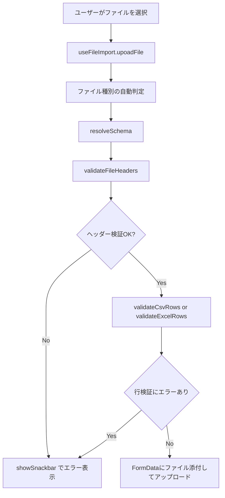

# ファイルバリデーションモジュール設計書（フロントエンド編）

## **1. モジュール概要**

### **1-1. 目的**

本モジュールは、ユーザーがアップロードする CSV または Excel ファイルに対して、**ファイル種別に応じたヘッダーと行の検証**を行い、サーバーに送信する前にフロントエンド側でバリデーションを完結させることを目的とする。

提供機能は以下の通り：

- ファイル種別（CSV/Excel）の自動判定と分岐処理
- ヘッダー行の構文・項目一致の検証
- データ行ごとの型・必須項目・形式ルールチェック
- バリデーション結果（エラー・警告）の分類表示
- 多言語対応（i18n）によるエラーメッセージの動的切替

---

### **1-2. 適用範囲**

本モジュールは、Next.js フロントエンドに組み込まれており、以下の技術要素と連携する：

- **ファイル形式**：CSV / Excel (.xlsx)
- **バリデーションルール**：サーバー側で定義されたスキーマ（HeaderDefinition）に準拠
- **UI 通知方式**：Redux ベースのスナックバー通知（`useSnackbar`）
- **翻訳対応**：`useValidationLang` による辞書切り替え

---

## **2. 設計方針**

### **2-1. アーキテクチャ方針**

- **ファイル種別ディスパッチ**

  - `validateFileHeaders` および `validateCsvRows` / `validateExcelRows` を通じて、CSV/Excel による処理の分岐を抽象化。

- **スキーマ駆動型検証**

  - ファイルに対するバリデーションは、`resolveSchema(kind)` により取得した `HeaderDefinition[]` に基づき、動的に処理を切り替える。

- **ユーザー通知の統一**

  - すべての検証結果は `useSnackbar` によって UI 上に通知され、ユーザーがリアルタイムでエラー確認できる。

- **多言語対応**

  - バリデーションメッセージは `useValidationLang` フックを通じて取得し、すべての検証関数に共通インタフェースで渡される。

---

### **2-2. 検証処理フロー**



---

### **2-3. エラーハンドリングと通知**

- すべてのエラー・警告は以下の種類で区別される：

| 種別           | 例                           | 処理方法                        |
| -------------- | ---------------------------- | ------------------------------- |
| ヘッダーエラー | 項目不足、不要項目           | 即時中断・全件エラー表示        |
| 行エラー       | 型不一致、必須項目欠落       | 行番号つきでエラー表示          |
| 警告           | 空行、上限超過などの軽微問題 | `warnings` として表示（続行可） |
| カスタムエラー | カスタム関数や正規表現など   | 即時中断・エラー箇所表示        |
| 読み込み失敗   | ファイル形式不正など         | `t.READ_ERROR` を返す           |

---

## 📂 3. フォルダ構成とファイルの役割

```plaintext
src/
├── utils/
│   ├── file/
│   │   ├── index.ts                 // ファイルバリデーション関連のエクスポート統括
│   │   ├── types.ts                 // HeaderDefinition / RowValidationResult 等の型定義
│   │   ├── validators/
│   │   │   ├── typeValidators.ts         // 型別バリデーションロジック
│   │   │   ├── validateCsvHeaders.ts     // CSV ヘッダー検証ロジック
│   │   │   ├── validateCsvRows.ts        // CSV 行の検証
│   │   │   ├── validateExcelHeaders.ts   // Excel ヘッダー検証
│   │   │   ├── validateExcelRows.ts      // Excel 行の検証
│   │   │   └── validateFileHeaders.ts    // ファイル種別によるヘッダー検証分岐
│   │   └── schemas/
│   │       └── schema.ts              // BEから設定ファイルの情報を取得する（別紙「BE/FileImport.md」を参照）
│   ├── cache/
│   │　└── cacheUtils.ts               // キャッシュの共通処理
│   └── templateGet.ts                 // 入力ファイルのバリデーション情報を取得するAPI
└── hooks/
     ├── useFileImport.ts              // アップロード処理とバリデーション呼び出しを統括
     ├── useSnackbar.ts                // 通知用カスタムフック
     └── useValidationLang.ts          // 多言語対応辞書フック
```

---

## 📌 4. 代表ファイルの解説

### useFileImport.ts

- **役割**：ファイル選択時のバリデーションおよびアップロード処理を統括。
- **主な処理**：

  - ファイル未指定・kind（テンプレート ID）未指定の早期リターン
  - `resolveSchema()` によるスキーマ取得
  - `validateFileHeaders()` でヘッダー検証
  - `validateCsvRows()` または `validateExcelRows()` による行検証
  - 警告表示 + アップロード処理（`apiClient.post()`）

```ts
<!-- INCLUDE:FE/spa-next/my-next-app/src/hooks/useFileImport.ts -->
```

---

### validateCsvRows.ts / validateExcelRows.ts

- **目的**：行データのバリデーションをスキーマに基づいて行う
- **共通仕様**：

  - `required` チェック（必須項目であるかどうか）
  - `type` チェック（`isValidByType()`、型チェック）
  - `validation` 関数 または `RegExp` による検証（カスタムチェック）
  - 行ごとにエラーと警告を保持（`RowValidationResult`）
  - 詳細は、「BE/FileImport.md」を参照

---

### validateFileHeaders.ts

- **目的**：ファイルの種別に応じて `validateCsvHeaders` または `validateExcelHeaders` を呼び出すディスパッチャ
- **戻り値**：`string[]`（エラーメッセージ配列）または `null`（問題なし）

---

## 📌 5. スキーマ定義の仕様

```ts
export interface HeaderDefinition {
  field: string; // ファイル上の列名
  name?: string; // 表示用ラベル
  required: boolean; // 必須かどうか
  type: HeaderType; // 'string' | 'number' | 'boolean'
  repository: string; // このカラムはどのrepositoryに属するのかを定義
  pattern?: RegExp | ((value: string) => boolean); // 任意のバリデーション
  validationMessage?: string; // カスタムエラーメッセージ
  enumValues?: string[]; // 定数チェック
}
```

---

## 📌 6. テストと拡張性

### テスト対象とファイル（**tests**）

```plaintext
__tests__/
├── typeValidators.test.ts         // isValidByType の単体テスト
├── validateCsvRows.test.ts        // CSV 行検証のバリエーションテスト
├── validateExcelRows.test.ts      // Excel 行検証の正常/異常ケース
└── helpers/
    └── mockExcelFile.ts           // テスト用 Excel ファイルモック
```

### 今後の拡張案

- アップロード時に成功件数/失敗件数のサマリ表示
- サーバーサイドと共有するスキーマ定義フォーマット（JSON Schema など）
\n\n---\n\n## 差分反映: 2025-07-28 validateExcelWorkbook\n\n# 📘 `validateExcelWorkbook` 関数仕様書

## 🔰 概要

`validateExcelWorkbook` は、**複数シートを含む Excel ファイル**を対象に、以下の順序で段階的なバリデーションを実行し、**問題が発生した時点で処理を中断する**関数です。

---

## ✅ 関数シグネチャ

```ts
export const validateExcelWorkbook: (
  file: File,
  schema: HeaderDefinition[],
  expectedHeaders: string[],
  maxRows?: number,
  lang?: Record<string, string>,
  headerRowIndex?: number
) => Promise<SheetValidationResult[]>
```

---

## 🧩 引数の詳細

| 引数名               | 型                             | 説明                            |
| ----------------- | ----------------------------- | ----------------------------- |
| `file`            | `File`                        | 検証対象の Excel ファイル              |
| `schema`          | `HeaderDefinition[]`          | 各列の検証ルール（必須、型、パターン、列名など）      |
| `expectedHeaders` | `string[]`                    | ヘッダーとして期待する列名（順序を問わず存在チェック）   |
| `maxRows`         | `number`（省略可）                 | 最大処理行数（デフォルト: `1000`）         |
| `lang`            | `Record<string, string>`（省略可） | エラーメッセージ辞書（多言語対応）             |
| `headerRowIndex`  | `number`（省略可）                 | ヘッダー行のインデックス（0始まり、デフォルト: `0`） |

---

## 🔄 処理の流れ

各シートごとに以下の処理を行います：

1. **ヘッダー検証**（`validateExcelHeaders` を使用）

   * 不足・余分な列がある場合 → エラーで中断
2. **行数超過チェック**

   * `maxRows` を超えていた場合 → エラーで中断
3. **明細行バリデーション**（`validateExcelRows` を使用）

   * 任意の行に1件でもエラーがある場合 → 全エラーを収集して中断
   * 警告（空行など）があっても処理は継続可能

---

## 📝 返却型

```ts
type SheetValidationResult = {
  sheetName: string;
  headerErrors?: string[];           // ヘッダー・行数関連のエラー
  rowValidation?: RowValidationResult; // 明細バリデーション結果
};

type RowValidationResult = {
  warnings: string[]; // 空行など
  errors: string[];   // 明細行エラー（複数可）
};
```

---

## 📦 使用例

```ts
const file = inputElement.files[0];
const schema = [
  { field: '商品コード', name: '商品コード', required: true },
  { field: '商品名', name: '商品名', required: true, maxLength: 20 },
  { field: '金額', name: '金額', type: 'number' }
];

const expectedHeaders = ['商品コード', '商品名', '金額'];

const results = await validateExcelWorkbook(
  file,
  schema,
  expectedHeaders,
  500, // maxRows
);

// 結果の処理
if (results[0].headerErrors) {
  alert(`❌ ヘッダーエラー:\n${results[0].headerErrors.join('\n')}`);
} else if (results[0].rowValidation?.errors?.length) {
  alert(`❌ 明細エラー:\n${results[0].rowValidation.errors.join('\n')}`);
} else {
  console.log('✅ 検証成功！');
}
```

---

## 🧪 想定される返却パターン

### ✅ 正常

```ts
[
  {
    sheetName: "商品マスタ",
    rowValidation: {
      warnings: ["⚠️ 空行検出。(行番号：7)"],
      errors: []
    }
  }
]
```

### ❌ ヘッダーエラー時

```ts
[
  {
    sheetName: "商品マスタ",
    headerErrors: ["❌ ヘッダー「商品コード」が存在しないため、取込できません。"]
  }
]
```

### ❌ 明細バリデーションエラー時

```ts
[
  {
    sheetName: "商品マスタ",
    rowValidation: {
      warnings: [],
      errors: [
        "❌ 商品コードは必須項目です。(3行目)",
        "❌ 金額の型が不正のため、取込できません。(5行目)"
      ]
    }
  }
]
```
\n\n---\n\n## 差分反映: 2025-07-03 multiSheetsValid\n\n# 📄 複数シート対応 Excel バリデーション処理 仕様書

## 1. 概要

本機能は、複数シートを持つ Excel ファイルを対象に、シート単位で動的に指定されたバリデーションスキーマに基づいて、**各行の検証処理**を実行する仕組みです。
対象データは UI でアップロードされた `.xlsx` ファイルであり、サーバーに送信する前の **フロントエンド側での事前検証処理**を目的としています。

---

## 2. 対象モジュールと主な構成

| モジュール名                 | 説明                     |
| ---------------------- | ---------------------- |
| `validateExcelRows.ts` | 検証本体処理（Promiseベース）     |
| `mockExcelFile.ts`     | テスト用モックファイル生成ユーティリティ   |
| `HeaderDefinition`     | 各列のバリデーション定義を保持するスキーマ型 |
| `RowValidationResult`  | エラー・警告結果を格納する返却型       |

---

## 3. 処理の流れ

### 3.1 入力値

```ts
validateExcelRows(
  file: File,
  schema: HeaderDefinition[],
  headerRowIndex: number = 0,
  maxRows?: number,
  lang?: Record<string, string>,
  sheetName?: string
): Promise<RowValidationResult>
```

| パラメータ名           | 内容                             |
| ---------------- | ------------------------------ |
| `file`           | ユーザーがアップロードした Excel ファイル       |
| `schema`         | 検証対象のスキーマ定義配列（各シートに対応）         |
| `headerRowIndex` | ヘッダー行の行番号（デフォルト: 0）            |
| `maxRows`        | 最大許容データ行数（省略可）                 |
| `lang`           | 多言語メッセージ辞書（各種エラーメッセージに適用）      |
| `sheetName`      | 対象とするシート名（指定しない場合、先頭シートを対象とする） |

---

### 3.2 主な処理内容

| 処理ステップ      | 内容                                                  |
| ----------- | --------------------------------------------------- |
| ファイル読み込み    | FileReader を使用して `.xlsx` を読み込み                      |
| シート選択       | `sheetName` が存在しない場合は `SHEET_NOT_FOUND` エラーを返す      |
| ヘッダー解析      | 指定された行 (`headerRowIndex`) のヘッダーをキーとして使用             |
| 行ごとのバリデーション | スキーマに基づいて、各フィールドの `required`, `enum`, `pattern` を検証 |
| 空行検出        | 完全に空の行は以降のデータ処理対象外とし、警告として追加可能                      |
| 上限行数超過      | `maxRows` を超過した場合にエラーを返す                            |

---

## 4. バリデーション仕様

### 4.1 スキーマ型: `HeaderDefinition`

```ts
type HeaderDefinition = {
  field: string;
  required?: boolean;
  type: 'string' | 'number';
  enumValues?: string[];
  pattern?: RegExp | ((val: string) => boolean);
  validationMessage?: string;
  sheetName: string;
  repository: string;
};
```

### 4.2 対応検証項目

| 検証項目     | 条件                      | エラーメッセージ（langキー）     |                              |
| -------- | ----------------------- | -------------------- | ---------------------------- |
| 必須チェック   | `required: true` かつ空文字  | `REQUIRED`           |                              |
| 列挙チェック   | `enumValues` 配列に含まれていない | `ENUM_MISMATCH`      |                              |
| パターンチェック | \`pattern: RegExp       | (value) => boolean\` | `INVALID_FORMAT` / `INVALID` |
| 空行警告     | 行内がすべて空                 | `EMPTY_ROW`          |                              |
| シート存在    | 指定 `sheetName` が存在しない   | `SHEET_NOT_FOUND`    |                              |
| 行数制限     | `maxRows` 超過時           | `MAX_ROW_EXCEEDED`   |                              |

---

## 5. エラー返却形式

```ts
type RowValidationResult = {
  warnings: string[];
  errors: string[];
};
```

### 例:

```ts
{
  errors: ["❌ 'name' 未入力: 2 行目"],
  warnings: ["⚠️ 空行検出: 5 行目"]
}
```

---

## 6. テストケース概要（Jest）

| テスト名          | 内容                         | 結果                  |
| ------------- | -------------------------- | ------------------- |
| バリデーションがすべて通る | Users + Payments 両方が正しいデータ | ✅                   |
| Users の必須項目欠落 | `name` 列が空欄                | ❌ `REQUIRED`        |
| 存在しないシート名指定   | `sheetName: "NotExist"`    | ❌ `SHEET_NOT_FOUND` |

---

---

## 6. 仕様上の注意

条件により必須のチェック条件が変わるカラムが存在する場合、
本バリデーターでは処理できません。
そのため、必須チェックを外し、バックエンドに処理を委譲してください。

条件の変更がない単純な必須チェックであればフロントで実施し、アップロード前に検知する方が
UX、負荷軽減の観点でも有効なので積極的に活用してください。
---
