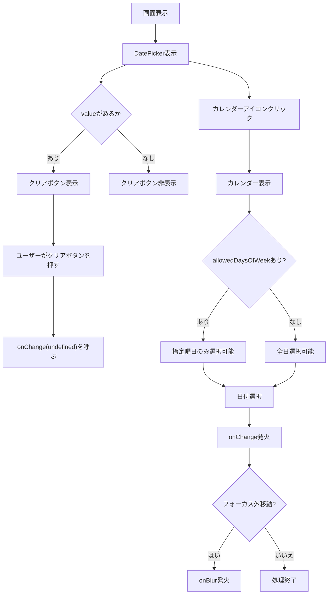

# DatePicker モジュール仕様書

## 1. モジュール概要

### 1-1. 目的
このコンポーネントは、Material UI と Dayjs を用いた再利用可能な日付選択 UI を提供する。

主にフォームやフィルター項目などで使用されることを想定し、ユーザーが日付を明確に入力・選択できるようにする。

### 1-2. 適用範囲
- ユーザー入力フォームの日付項目
- データ検索・絞り込み条件の入力
- アプリケーション内の一貫した日付選択
- 営業日/休日などの曜日制限が必要な日付選択
- バリデーション処理が必要な日付入力

---

## 2. 設計方針

### 2-1. アーキテクチャ
- Material UIの`DatePicker` をラップし、ラベル・日付制限・無効状態をカスタマイズ可能に。
- クリアボタンによって、ユーザーが日付を手動で解除できるよう UX 向上を実現。
- Material UIで推奨されている`Dayjs`を使用し、統一された日付入力を行う。
- 曜日制限機能により、特定の曜日のみ選択可能。
- onBlur機能により、フォーカス離脱時のバリデーション等が可能。

### 2-2. コンポーネント仕様
- `FormControl` により UI の一貫性を担保。
- `LocalizationProvider` に `AdapterDayjs` を設定。
  - MUIでdayjsを使用するために必要なアダプター。
- `disabled` が true のとき、クリアボタン含めすべての操作を不可に。
- `helperText` でヘルパーテキストの表示に対応。
- `error` でエラー表示切替に対応。
- `allowedDaysOfWeek` で曜日制限に対応。
- `onBlur` でフォーカス離脱時の処理に対応。

---

## 3. フォルダ構成

```
src/
└── components/
    └── base/
        └── input/
            └── DatePicker.tsx
```

---

## 4. コンポーネント仕様

**目的:**
アプリケーション内で使い回せる汎用的な日付ピッカー UI を提供。

**主な機能:**
- `label` によるラベリング
- `value` / `onChange` による日付状態の制御
- `minDate` / `maxDate` による選択範囲の制限
- `disabled` による非活性化
- `customStyle` によるスタイル調整
- `helperText` による補助テキスト表示
- `error` によるエラー表示切替
- 日付クリアボタンの表示（`value` があるときのみ）
- `allowedDaysOfWeek` による曜日制限機能
- `onBlur` によるフォーカス離脱時の処理
- `format` による日付表示フォーマットのカスタマイズ

---

## 5. サンプルコード

### 5-1. 基本的な使用例

```tsx
import { useState } from 'react';
import dayjs, { Dayjs } from 'dayjs';
import { DatePicker } from '@/components/base/DatePicker';

const Sample = () => {
  const [date, setDate] = useState<Dayjs | undefined>(dayjs());

  return (
    <DatePicker
      label="生年月日"
      value={date}
      onChange={setDate}
      minDate={dayjs('1900-01-01')}
      maxDate={dayjs('2100-12-31')}
      customStyle={{ width: '250px' }}
    />
  );
};
```

### 5-2. 曜日制限機能の使用例

```tsx
// 平日のみ選択可能
<DatePicker
  label="営業日選択"
  value={date}
  onChange={setDate}
  allowedDaysOfWeek={[1, 2, 3, 4, 5]} // 月〜金
  helperText="営業日（月〜金）のみ選択可能です"
/>

// 週末のみ選択可能
<DatePicker
  label="休日選択"
  value={date}
  onChange={setDate}
  allowedDaysOfWeek={[0, 6]} // 日、土
  helperText="休日（土日）のみ選択可能です"
/>

// 特定曜日のみ選択可能
<DatePicker
  label="会議日選択"
  value={date}
  onChange={setDate}
  allowedDaysOfWeek={[1, 3, 5]} // 月、水、金
  helperText="会議日（月・水・金）のみ選択可能です"
/>
```

### 5-3. onBlur機能の使用例

```tsx
const [date, setDate] = useState<Dayjs | undefined>(undefined);
const [error, setError] = useState(false);
const [helperText, setHelperText] = useState('');

const handleBlur = (event: React.FocusEvent<HTMLInputElement>) => {
  const inputValue = event.target.value;
  
  if (!inputValue) {
    setError(true);
    setHelperText('日付は必須です');
  } else if (!date) {
    setError(true);
    setHelperText('正しい日付形式で入力してください');
  } else {
    setError(false);
    setHelperText('');
  }
};

return (
  <DatePicker
    label="重要な日付"
    value={date}
    onChange={setDate}
    onBlur={handleBlur}
    error={error}
    helperText={helperText}
  />
);
```

### 5-4. 曜日制限とバリデーションの組み合わせ例

```tsx
const [date, setDate] = useState<Dayjs | undefined>(undefined);
const [error, setError] = useState(false);
const [helperText, setHelperText] = useState('');

const handleChange = (newDate: Dayjs | undefined) => {
  setDate(newDate);
  if (newDate) {
    setError(false);
    setHelperText('');
  }
};

const handleBlur = (event: React.FocusEvent<HTMLInputElement>) => {
  if (!date) {
    setError(true);
    setHelperText('営業日を選択してください');
  }
};

return (
  <DatePicker
    label="営業日選択"
    value={date}
    onChange={handleChange}
    onBlur={handleBlur}
    allowedDaysOfWeek={[1, 2, 3, 4, 5]} // 平日のみ
    error={error}
    helperText={helperText}
    format="YYYY年MM月DD日"
  />
);
```

---

## 6. Props 定義

| Prop         | 型                              | 説明                                         | 必須 | デフォルト        |
|--------------|----------------------------------|----------------------------------------------|------|------------------|
| `label`      | `string`                         | テキストフィールドのラベル                   |     | '日付を選択'     |
| `value`      | `Dayjs \| undefined`             | 現在選択されている日付                       |     | `undefined`      |
| `onChange`   | `(newValue: Dayjs \| undefined) => void` | 日付変更時に呼ばれるコールバック   |     | `undefined`      |
| `minDate`    | `Dayjs`                          | 選択可能な最小日付                           |     | -                |
| `maxDate`    | `Dayjs`                          | 選択可能な最大日付                           |     | -                |
| `disabled`   | `boolean`                        | 入力不可状態にする                           |     | `false`          |
| `error`      | `boolean`                        | コンポーネントのエラー表示切替              |     | `false`          |
| `helperText` | `string \| undefined`            | ヘルパーテキスト                           |     | `undefined`      |
| `customStyle`| `object`                         | MUI `sx` 属性として渡されるスタイル指定     |     | `{}`             |
| `allowedDaysOfWeek` | `(0 \| 1 \| 2 \| 3 \| 4 \| 5 \| 6)[]` | 選択可能な曜日の配列（0:日曜〜6:土曜）      |     | `undefined`      |
| `format`     | `string`                         | 日付表示フォーマット                       |     | `'YYYY/MM/DD'`   |
| `onBlur`     | `(event: React.FocusEvent<HTMLInputElement>) => void` | フォーカス離脱時のコールバック |     | `undefined`      |

---

## 7. allowedDaysOfWeek 詳細仕様

### 7-1. 動作仕様
- 配列で指定された曜日のみがカレンダーで選択可能
- 指定されていない曜日は無効化（グレーアウト）表示
- `undefined`または空配列の場合は全日選択可能

### 7-2. 曜日番号の定義
- 0: 日曜日
- 1: 月曜日
- 2: 火曜日
- 3: 水曜日
- 4: 木曜日
- 5: 金曜日
- 6: 土曜日

### 7-3. 技術的実装詳細

```tsx
const shouldDisableDate = (date: Dayjs) => {
  if (!allowedDaysOfWeek || allowedDaysOfWeek.length === 0) {
    return false; // 制限なし
  }
  return !allowedDaysOfWeek.includes(date.day());
};
```

---

## 8. onBlur 詳細仕様

### 8-1. 動作仕様
- DatePickerからフォーカスが完全に外れた際に発火
- カレンダー内での操作（日付選択等）では発火しない
- 真の外部フォーカス移動時のみ発火

### 8-2. 技術的実装詳細
- MUIの内部フォーカス移動を適切に判定
- カレンダーポップアップとの関係を考慮した実装
- DocumentレベルのfocusoutイベントでのfallBack処理

---

## 9. ユーザー操作フロー



---

## 11. テスト観点

### 11-1. 基本機能
- ラベル表示
- value の表示フォーマット（YYYY/MM/DD）
- クリアボタンの表示 / 非表示
- disabled 状態での操作不可確認
- onChange の発火有無
- minDate / maxDate による選択範囲の制限
  - minDate / maxDateはjestによるカレンダーの操作が複雑なため、現状手動で実施。

### 11-2. 拡張機能
- **allowedDaysOfWeek**
  - 指定曜日のみ選択可能であることの確認
  - 未指定曜日が無効化されることの確認
  - undefined/空配列時の全日選択可能確認
  - 他の制限（minDate/maxDate）との組み合わせ確認

- **onBlur**
  - 真の外部フォーカス移動時の発火確認
  - カレンダー内操作時の不発確認
  - バリデーション処理の動作確認

- **format**
  - 指定フォーマットでの日付表示確認
  - デフォルトフォーマット（YYYY/MM/DD）の確認

---