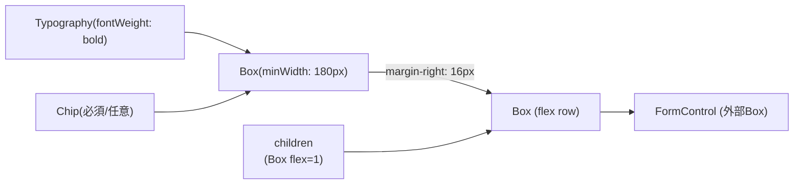
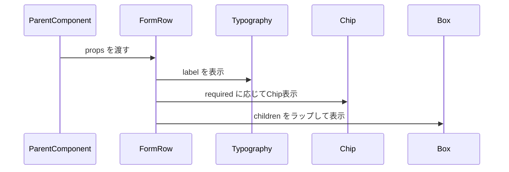

# FormRow モジュール仕様書

## 1. モジュール概要

### 1.1 目的
`FormRow` コンポーネントは、フォームにおけるラベルと入力コンポーネント（TextFieldやSelectなど）を横並びに配置するためのレイアウト用コンポーネント。フォームのUI統一や、入力項目ごとの視認性を高めることを目的とする。必須/任意項目の表示機能と、複数行並べた際のChipの右揃え機能を持つ。

### 1.2 適用範囲
- Material UIを利用したプロジェクト
- 入力フォームのラベル + 入力欄の整形
- レスポンシブでない固定レイアウトのフォームに適する
- 必須・任意項目の視覚的区別が必要なフォーム
- 複数のフォーム項目を縦に並べる際の統一レイアウト

---

## 2. 設計方針

### 2-1. アーキテクチャ

- MUIの`Box` を採用し、横方向のレイアウトを実現
- MUIの`Typography` でラベルを表示
- MUIの`Chip` で必須/任意項目の表示
- `children` として下段の入力範囲を自由に配置
  - `children` のコンポーネントは全て一行で表示される

### 2-2. UI 要素

- ラベル部: `Box`（ラベルとChipを含む）
  - `minWidth: 180px`, `justifyContent: space-between`, `marginRight: 16px`
  - ラベル: `Typography` (`fontWeight: bold`)
  - 必須/任意Chip: `Chip` (`height: 20px`, `fontSize: 0.7rem`)
- コンテンツ部: `Box flex=1`

### 2-3. 新機能（2025年6月追加）

- **必須/任意項目表示**: `required` プロパティによる視覚的区別
  - `required={true}`: 赤色の「必須」Chip表示
  - `required={false}`: グレーの「任意」Chip表示
  - `required={undefined}`: Chip非表示
- **Chipの右揃え**: 複数のFormRowを並べた際、異なる長さのラベルでもChipが右端で整列
- **ラベル配置制御**: `labelAlignment` プロパティによるラベルの垂直配置調整
  - `'top'`: 上揃え（HelperText等がある場合に推奨）
  - `'center'`: 中央揃え（シンプルな入力項目に適用）



- ラベル部は固定幅（180px）でラベルとChipを左右に配置
- `children` は幅いっぱいに広がる
- `rowCustomStyle` は最上位Boxにstyleとしてマージ
- Chipは複数行並べた際に右端で整列

---

## 3. フォルダ構成

```text
src/
└── components/
    └── base/
        └── input/
            └── FormRow.tsx
```

---

## 4. 処理フロー図



---

## 5. サンプルコード

### 5.1 基本的な使用例

```tsx
// 必須項目
<FormRow label="名前" required={true}>
  <TextField fullWidth variant="outlined" />
</FormRow>

// 任意項目
<FormRow label="メモ" required={false} minWidth="380px">
  <TextField fullWidth variant="outlined" />
</FormRow>

// 必須/任意表示なし
<FormRow label="性別">
  <RadioGroup row>
    <RadioButton
        name="radio"
        options={[
          { value: "male", label: "男性" },
          { value: "female", label: "女性" },
        ]}
    />
  </RadioGroup>
</FormRow>
```

### 5.2 ラベル配置制御の例

```tsx
// HelperTextがある場合：上揃えでChipを整列
<FormRow label="申請理由" required={true} minWidth="380px" labelAlignment="top">
  <TextBoxMultiLine helperText="詳細を入力してください" />
</FormRow>

// シンプルな入力：中央揃え
<FormRow label="ユーザー名" required={true} minWidth="380px" labelAlignment="center">
  <TextBox />
</FormRow>
```

### 5.3 複数行表示の例

```tsx
// 複数のFormRowを並べた際のChip右揃え例
<Box>
  <FormRow label="名前" required={true}>
    <TextBox />
  </FormRow>
  <FormRow label="メールアドレス" required={true}>
    <TextBox />
  </FormRow>
  <FormRow label="所属組織・部署名" required={false}>
    <TextBox />
  </FormRow>
  <FormRow label="備考" required={false}>
    <TextBox />
  </FormRow>
</Box>
```

---

### 6. Props定義

| 名前              | 型                     | 説明                                               | 必須 | デフォルト値 |
|------------------|------------------------|----------------------------------------------------|------|--------------|
| `label`          | `string`               | ラベルテキスト                                     | 〇   | -            |
| `children`       | `React.ReactNode`      | 入力コンポーネント                                 | 〇   | -            |
| `rowCustomStyle` | `SxProps<Theme>`       | カスタムスタイル（Boxに渡すstyleオブジェクト）    | -   | `{}`         |
| `required`       | `boolean \| undefined` | 必須項目かどうか（true: 必須、false: 任意、undefined: 非表示） | - | `undefined` |
| `labelAlignment` | `'top' \| 'center'`    | ラベルの垂直配置（top: 上揃え、center: 中央揃え）  | -   | `'top'`      |

### 6.1 新規追加Props（2025年6月）

- **`required`**: 必須/任意項目の視覚的表示を制御
  - `true`: 赤色の「必須」Chipを表示
  - `false`: グレーの「任意」Chipを表示
  - `undefined`: Chipを非表示（従来の動作）

- **`labelAlignment`**: HelperText等がある場合のラベル配置を調整
  - `'top'`: 上揃え（デフォルト、HelperTextありの項目に推奨）
  - `'center'`: 中央揃え（シンプルな入力項目用）

---

## 7. テスト観点

### 7.1 基本機能テスト

- `label` が正しく描画されること
- `children` が表示されること
- `rowCustomStyle` が上位のBoxに適用されること
- MUIレイアウトと整合性があること（横並び, spacing など）

### 7.2 新機能テスト（2025年6月追加）

- **必須/任意表示テスト**
  - `required={true}` で赤色の「必須」Chipが表示されること
  - `required={false}` でグレーの「任意」Chipが表示されること
  - `required={undefined}` でChipが表示されないこと

- **Chip右揃えテスト**
  - 複数のFormRowを並べた際、異なる長さのラベルでもChipが右端で整列すること
  - ラベル部の幅が一定（180px）に保たれること

- **ラベル配置テスト**
  - `labelAlignment="top"` で上揃えになること
  - `labelAlignment="center"` で中央揃えになること
  - HelperTextがある場合に適切にラベルが配置されること

### 7.3 レスポンシブテスト

- 画面幅変更時のレイアウト保持
- Chipとchildrenの間隔が適切に保たれること

---
