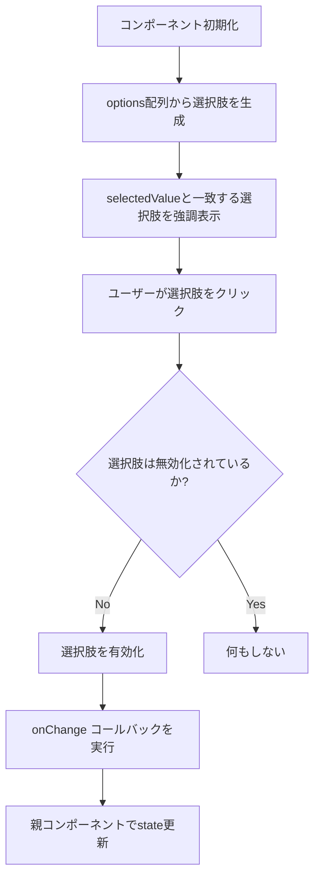

## 📄 RadioMatrix モジュール仕様書

## 1. モジュール概要

### 1-1. 目的

RadioMatrixコンポーネントは、複数の選択肢から一つを選ぶためのラジオボタングループを横並びのマトリクス形式で提供する。従来のラジオボタンよりも視覚的に分かりやすく、タップ/クリックしやすい大きさの選択肢を提供することで、ユーザビリティを向上させる。

### 1-2. 適用範囲

- 権限設定など、限られた選択肢から1つを選ぶ必要がある場面
- フォーム内での選択肢表示
- スペースを効率的に使用しながら選択UIを提供したい場合
- 選択肢ごとに無効化（disabled）制御が必要な場面

---

## 2. 設計方針

### 2-1. 視覚的な一貫性

- 選択状態の視覚表現を明確にするため、色とボーダーによる差別化
- 無効状態（disabled）の選択肢は見た目で区別できるようスタイリング
- Material UIのコンポーネントをベースにしつつ、カスタムスタイリングで独自のデザインを実現

### 2-2. レイヤー構造

- Material UIの`TableContainer`、`TableRow`、`TableCell`を活用した柔軟なレイアウト
- 複数の`RadioMatrix`を縦に並べた場合でも隙間なく配置できる構造

---

## 3. 📂 フォルダ構成とファイルの役割

```plaintext
src/
└── components/
    └── base/
        └── Input/
            ├── OptionInfo.ts        // 選択肢の型定義
            ├── RadioMatrix.tsx      // RadioMatrixコンポーネント本体
            └── RadioMatrix.stories.tsx  // Storybook用のストーリー定義
```

---

## 4. 📌 コンポーネント詳細

**RadioMatrix.tsx**
**役割：**
複数の選択肢から一つを選択するラジオボタンマトリクスを提供する。各選択肢は無効化可能で、選択状態が視覚的に明確に表現される。

**Props 一覧：**

| プロパティ名 | 型 | 必須 | 初期値 | 説明 |
| --- | --- | --- | --- | --- |
| `options` | `OptionInfo[]` | ✅ | - | 選択肢の定義配列 |
| `selectedValue` | `string` | - | `undefined` | 現在選択されている値のID |
| `fontSize` | `string` | - | `'0.875rem'` | 選択肢のフォントサイズ |
| `onChange` | `(optionId: string) => void` | - | `undefined` | 選択変更時のコールバック関数 |

**OptionInfo 型：**

```ts
type OptionInfo = {
  value: string;  // 選択肢のID
  label: string;  // 表示ラベル
  disabled?: boolean;  // 無効化状態（オプション）
};
```

**使用例：**

```tsx
// 基本的な使用例
const options = [
  { value: 'none', label: 'なし' },
  { value: 'reference', label: '参照' },
  { value: 'update', label: '更新' },
  { value: 'approve', label: '承認' },
];

const [selected, setSelected] = useState('none');

<RadioMatrix
  options={options}
  selectedValue={selected}
  onChange={(value) => setSelected(value)}
/>

// 特定の選択肢を無効化した例
const optionsWithDisabled = [
  { value: 'none', label: 'なし' },
  { value: 'reference', label: '参照' },
  { value: 'update', label: '更新', disabled: true },  // 無効化
  { value: 'approve', label: '承認', disabled: true }, // 無効化
];

<RadioMatrix
  options={optionsWithDisabled}
  selectedValue={selected}
  onChange={(value) => setSelected(value)}
/>
```

---

## 5. 🔁 処理フロー図



---

## 6. 🧪 動作確認ポイント

1. **選択状態の切り替え**
   - 選択肢をクリックすると選択状態に変わるか
   - 選択された選択肢は視覚的に他と区別できるか

2. **無効化状態のテスト**
   - 無効化された選択肢をクリックしても選択状態が変わらないか
   - 無効化された選択肢は視覚的に区別できるか

3. **レスポンシブ対応**
   - 画面幅が変わっても適切に表示されるか
   - 縦に複数配置しても隙間なく表示されるか

---
