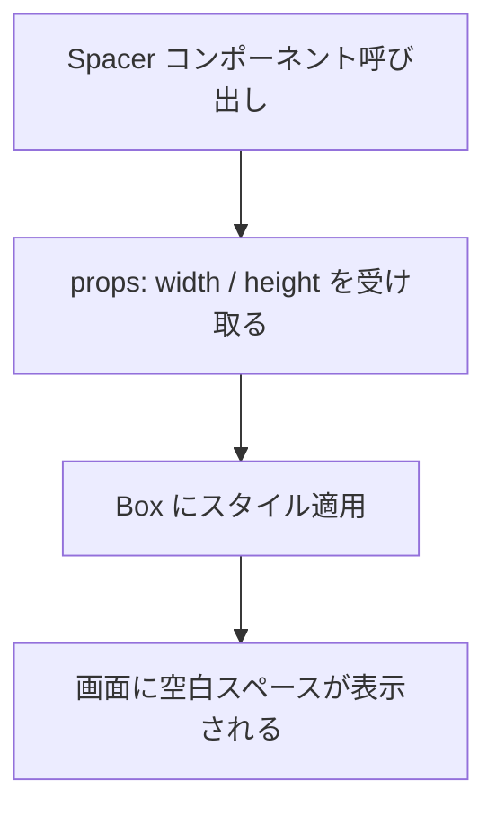
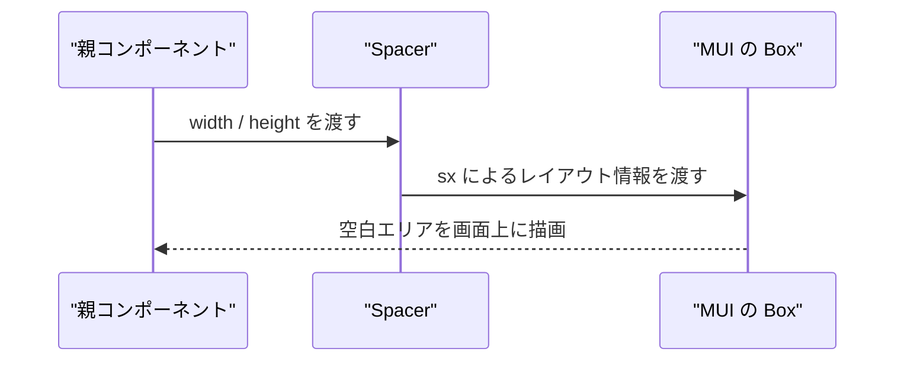

## 📄 Spacer モジュール仕様書
## 1. モジュール概要

### 1-1. 目的
本モジュールは、レイアウトの余白やスペースを簡単に挿入するための汎用コンポーネントである。高さ・幅を指定することで任意の空白エリアを作成し、要素間のスペース調整を柔軟に行える。

### 1-2. 適用範囲
- フォーム項目やボタン、テキストなどの間にスペースを挿入する用途
- margin や padding を用いずに視覚的な余白を調整したい場面に活用

---
## 2. 設計方針
### 2-1. シンプルなレイアウト分離用部品
- Spacer は HTML では表示されないが、周囲との視覚的な距離を調整するための機能に特化している。
- 幅と高さの両方を props で制御可能とし、必要に応じて縦・横・両方向に対応できる。

### 2-2. Material UI の Box をベースに構成
- Box の sx プロパティに width, height, flexShrink を設定し、柔軟なレイアウト配置を保証。
- flexShrink: 0 を指定することで、フレックスコンテナ内で自動縮小されないようにしている。

---
### 3. 📂 フォルダ構成とファイルの役割
```plaintext
src/
└── components/
    └── Spacer.tsx  // スペース挿入用の汎用 Box コンポーネント
```

---
### 4. 📌 コンポーネント詳細
**Spacer.tsx**
**役割：**
指定したサイズ分だけスペース（空白）を表示するための汎用部品。

**Props 一覧：**
| プロパティ名   | 型                  | 初期値 | 説明                |
| -------- | ------------------ | --- | ----------------- |
| `width`  | `number \| string` | `0` | 横方向のスペースサイズ（pxなど） |
| `height` | `number \| string` | `0` | 縦方向のスペースサイズ（pxなど） |

**使用例：**

```tsx
<Spacer height={16} />
<Spacer width="2rem" />
<!-- INCLUDE:FE\spa-next\my-next-app\src\components\Spacer.tsx -->
```

---
### 5. 🔁 処理フロー図


---
### 6. 🔁 処理シーケンス図

