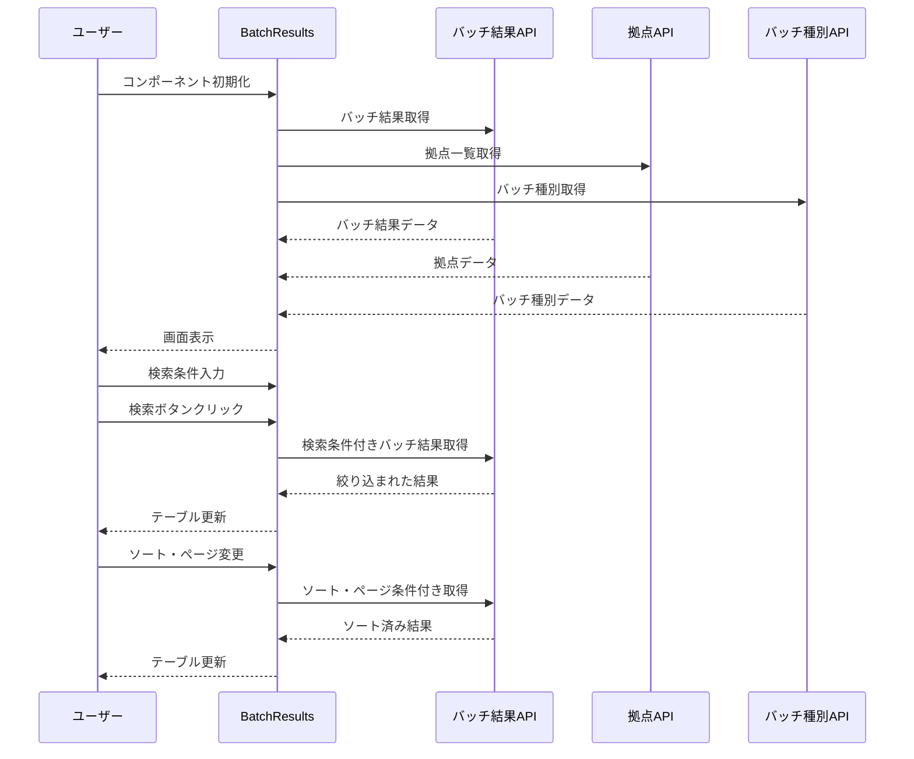

# BatchResults コンポーネント仕様書

## 概要

`BatchResults`は、バッチ処理の実行結果を表示・検索するためのCRJプロジェクト固有のコンポーネントです。ユーザーはバッチの実行状況を拠点、バッチ名、実行開始日で絞り込んで確認できます。

## ファイル情報

- **パス**: `/src/components/CRJ/batchResults/BatchResults.tsx`
- **コンポーネント名**: `BatchResults`
- **用途**: バッチ実行結果一覧表示・検索

## 機能概要

### 主要機能
1. **バッチ実行結果一覧表示**: 拠点別・バッチ別の実行結果をテーブル形式で表示
2. **検索機能**: 拠点、バッチ名、実行開始日による条件検索
3. **ソート機能**: 各カラムによる昇順・降順ソート
4. **ページング機能**: 大量データに対応したページ分割表示
5. **ナビゲーション**: パンくずナビとトップリスト画面への戻り機能

## Props

### BatchResultsProps
```typescript
export type BatchResultsProps = {
  onError?: (message: string) => void;
};
```

| プロパティ | 型 | 必須 | デフォルト | 説明 |
|----------|---|-----|---------|-----|
| `onError` | `(message: string) => void` | × | - | エラー発生時のコールバック関数 |

## 状態管理

### 検索条件の状態
- `selectedBaseCd`: 選択された拠点コード
- `selectedBatchName`: 選択されたバッチ名
- `executeBeginDate`: 実行開始日の検索条件

### テーブル状態
- `tableState`: ページング・ソート情報を含むテーブルの状態
  - `page`: 現在のページ番号（0ベース）
  - `rowsPerPage`: 1ページあたりの表示件数
  - `sortParams`: ソートパラメータ（列名と昇順/降順）

### データ状態
- `batch`: 取得したバッチ実行結果のリスト
- `totalCnt`: 検索結果の総件数

## API連携

### 使用サービス
1. **getBatchStatus**: バッチ実行結果取得
2. **getBaseComboList**: 拠点一覧取得（検索条件用）
3. **getBatchTypes**: バッチ種別一覧取得（検索条件用）

### リクエストパラメータ (BatchListRequest)
```typescript
type BatchListRequest = {
  base?: string;           // 拠点コード
  batch?: string;          // バッチ名
  startDate?: string;      // 実行開始日
  pageNo?: number;         // ページ番号
  pageSize?: number;       // ページサイズ
  sortKey?: string;        // ソートキー
  sortOrder?: boolean;     // ソート順序
  baseExtMatFlag?: boolean;    // 拠点完全一致フラグ
  batchExtMatFlag?: boolean;   // バッチ完全一致フラグ
};
```

## テーブル表示仕様

### カラム定義
| カラムID | ラベル | ソート可能 | 説明 |
|---------|--------|----------|-----|
| `index` | # | × | 行番号 |
| `baseName` | 拠点 | ○ | 拠点名 |
| `batchName` | バッチ名 | ○ | バッチの表示名 |
| `executeBeginDate` | 実行開始日時 | ○ | バッチ開始日時 |
| `executeEndDate` | 実行終了日時 | ○ | バッチ終了日時 |
| `status` | ステータス | ○ | 実行状況（成功/失敗等） |
| `error` | エラー内容 | ○ | エラーメッセージ |

### データマッピング
```typescript
const tableData: RowDefinition[] = batch?.map<RowDefinition>((value, index) => ({
  cells: [
    { id: 'index', columnId: 'index', cell: index, value: index },
    { id: 'baseName', columnId: 'baseName', cell: value.baseName, value: value.baseName },
    { id: 'batchName', columnId: 'batchName', cell: value.batchName, value: value.batchName },
    { id: 'executeBeginDate', columnId: 'executeBeginDate', cell: value.startDateAndTime, value: value.startDateAndTime },
    { id: 'executeEndDate', columnId: 'executeEndDate', cell: value.endDateAndTime, value: value.endDateAndTime },
    { id: 'status', columnId: 'status', cell: value.statusName, value: value.statusName },
    { id: 'error', columnId: 'error', cell: value.errorMessege, value: value.errorMessege },
  ]
}));
```

## 検索条件コンポーネント (SearchCondition)

### Props
```typescript
type SearchConditionProps = {
  selectedBaseCd: string | undefined;
  setSelectedBaseCd: (selectedBaseCd: string | undefined) => void;
  selectedBatchName: string | undefined;
  setSelectedBatchName: (selectedBatchName: string | undefined) => void;
  executeBeginDate: Dayjs | undefined;
  setExecuteBeginDate: (executeBeginDate: Dayjs | undefined) => void;
  onClickSearchButton: () => void;
  onError?: (message: string) => void;
};
```

### 検索フィールド
1. **拠点選択**: AutoComplete コンポーネントを使用
2. **バッチ選択**: AutoComplete コンポーネントを使用  
3. **実行開始日**: DatePicker コンポーネントを使用
4. **検索ボタン**: CRJButton コンポーネントを使用

## 使用コンポーネント

### Base Components
- `AutoComplete`: 拠点・バッチ名の選択
- `Box`: レイアウトコンテナ
- `DatePicker`: 日付選択
- `FormRow`: フォーム行レイアウト
- `CRJButton`: ボタン表示

### Composite Components
- `Breadcrumb`: パンくずナビゲーション
- `ControllableListView`: テーブル表示・ページング・検索

## エラーハンドリング

### エラー種別
1. **バッチ実行結果取得エラー**: APIレスポンスのエラー処理
2. **拠点一覧取得エラー**: 検索条件用データの取得失敗
3. **バッチ種別取得エラー**: 検索条件用データの取得失敗

### エラー処理フロー
```typescript
try {
  const response = await getBatchStatus(searchConditions);
  if (response.error || response.data === null) {
    throw new Error(`バッチ実行結果の取得に失敗しました。${response.error || 'データが見つかりません'}`);
  }
  // 正常処理
} catch (error) {
  if (error instanceof Error) {
    console.error('Batch status fetch error:', error.message);
    if (props.onError) {
      props.onError(error.message);
    }
  }
}
```

## ナビゲーション

### パンくずナビゲーション
- `Breadcrumb`コンポーネントを使用
- 現在のパス情報を表示
- 上位階層への遷移が可能

### 戻るボタン
- `/common/top-list`画面への遷移
- 右上に配置されたCRJButtonを使用

## レスポンシブ対応

### レイアウト設計
- Flexboxを使用したレスポンシブレイアウト
- テーブルは`ControllableListView`のレスポンシブ機能を活用

## データフロー



## パフォーマンス考慮事項

### 最適化ポイント
1. **useEffect依存関係**: `tableState`の変更時のみAPI呼び出し
2. **メモ化**: テーブルデータのマッピング処理は必要時のみ実行
3. **ページング**: 大量データの分割読み込み

### レンダリング最適化
- 検索条件とテーブル状態の分離により不要な再レンダリングを防止
- コンポーネント分離によるプロップスドリリングの最小化

## テスト考慮事項

### テストケース
1. **初期表示テスト**: データ取得と表示の確認
2. **検索機能テスト**: 各検索条件での絞り込み動作
3. **ページング・ソートテスト**: テーブル操作の動作確認
4. **エラーハンドリングテスト**: API失敗時の動作
5. **ナビゲーションテスト**: 戻るボタンとパンくずの動作

### モックデータ
```typescript
const mockBatchData: BatchStatus[] = [
  {
    baseCd: "001",
    baseName: "東京本社",
    batchName: "日次在庫更新",
    startDateAndTime: "2024-01-15 09:00:00",
    endDateAndTime: "2024-01-15 09:15:00",
    statusName: "成功",
    errorMessege: ""
  }
];
```
