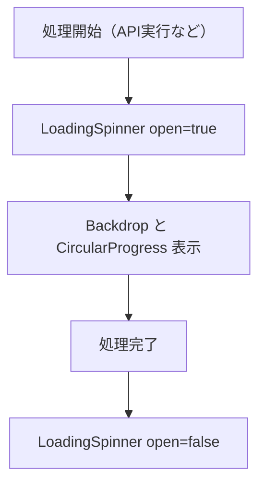
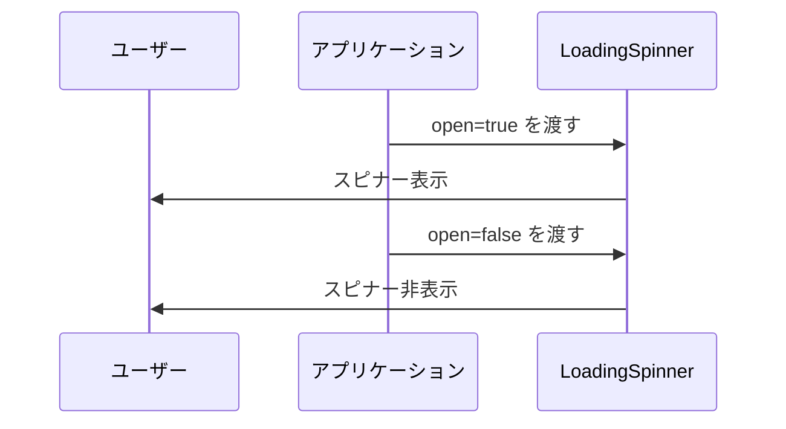

# ローディングスピナーモジュール仕様書

## 1. モジュール概要

### 1-1. 目的
このモジュールは、アプリケーション内での非同期処理中に、全画面を覆う形でユーザーにローディング状態を示すためのスピナー（回転アイコン）を提供する。

### 1-2. 適用範囲
- API呼び出し中の待機表示
- ページ遷移中の状態通知
- 非同期処理のユーザー誘導補助

---

## 2. 設計方針

### 2-1. アーキテクチャ
- **React Functional Component**
  `LoadingSpinner` はシンプルなステートレス関数コンポーネントとして設計。

- **UI フレームワークの活用**
  Material-UI の `Backdrop` および `CircularProgress` を利用して画面中央にスピナーを表示。

- **外部設定の分離**
  背景色やスピナー色は `components/color.ts` に定義し、保守性を向上。

- **サイズの柔軟性**
  スピナーサイズは props 経由で設定可能とし、デフォルト値（120）を用意。

### 2-2. 統一ルール
- 背景色、文字色などのカラープロパティは`color.ts`を定義し、参照する形として変更とメンテナンスを容易にする。
- 本コンポーネントは固定文言を持たず、`Backdrop` と `CircularProgress` による視覚表示のみを提供する。
- `Backdrop` の `zIndex` は 1300（モーダル相当）で他UIより前面に表示。
- `open` が `false` のときは完全に非表示。
- サイズや色のカスタマイズが可能なインターフェースを提供。

---

## 3. 📂 フォルダ構成とファイルの役割

```plaintext
src/
└── components/
    └── composite/
        └── loadingSpinner.tsx     // 全画面ローディングスピナー UI コンポーネント
```

---

## 4. 📌 各ファイルの説明

### loadingSpinner.tsx

**目的:**
アプリケーションのローディング状態を視覚的に表現する全画面スピナーを提供する。

**主な props:**
- `open: boolean` - スピナーの表示制御
- `size?: number` - スピナーのサイズ（任意、デフォルトは `120`）

**仕様:**
- 背景に `Backdrop` を使用し、画面全体を覆う。
- スピナー本体は `CircularProgress` を使用。
- 色や zIndex などのスタイルは `color.ts` から取得。

---

## 5. 📂 処理フロー図



---

## 6. 📂 処理シーケンス図


