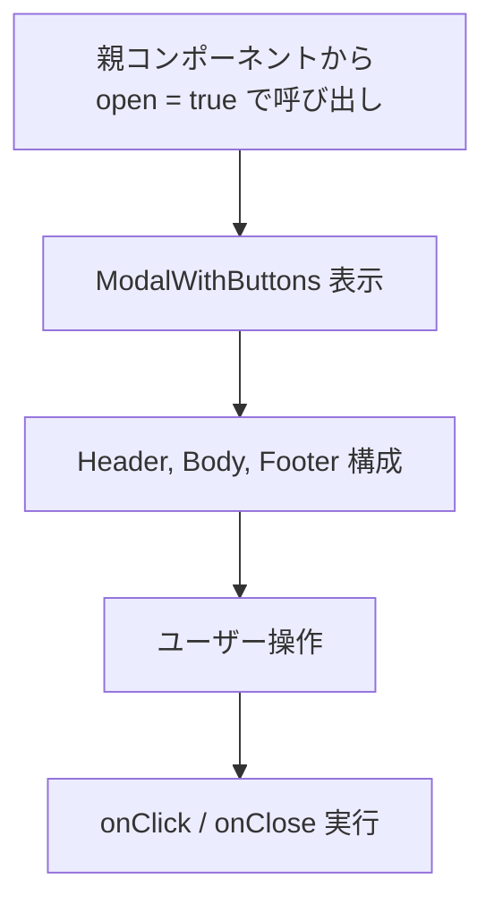
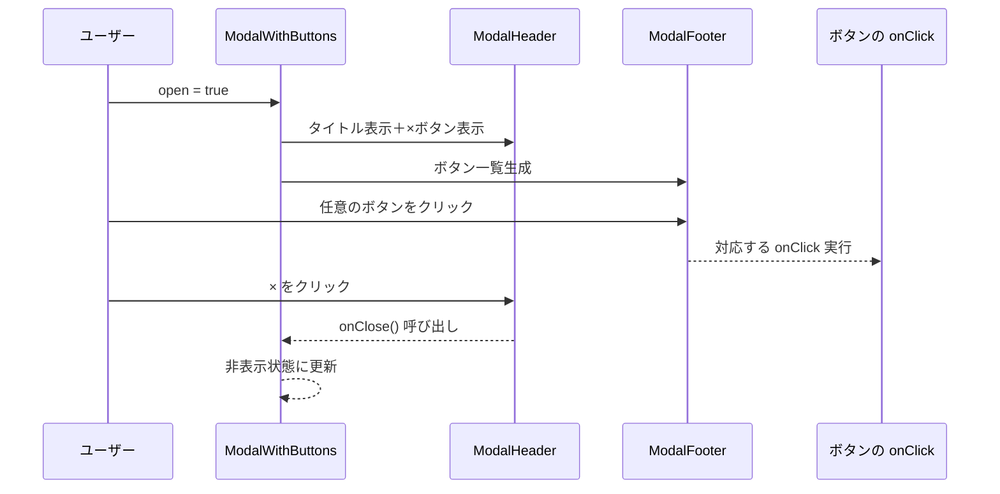

## 📄 モーダルウインドウモジュール仕様書（INCLUDEタグ付き）

## 1. モジュール概要

### 1-1. 目的  
このモジュールは、ユーザーに対して確認・通知・選択操作を提供する汎用的なモーダルウインドウコンポーネントである。タイトル・本文・複数のボタンを自由に構成でき、アプリケーション全体で一貫性のあるモーダルUIを提供する。

### 1-2. 適用範囲  
- フォーム送信前の確認  
- エラー・成功・警告などの通知  
- ユーザー選択を求めるダイアログ  
- 任意の本文・ボタンを伴うカスタムモーダル

---

## 2. 設計方針

### 2-1. アーキテクチャ

- **React Functional Component による分割構成**  
  モーダルは以下の4コンポーネントで構成される：
  - `ModalWithButtons`（親コンテナ）
  - `ModalHeader`（タイトル + ×ボタン）
  - `ModalBody`（本文）
  - `ModalFooter`（ボタン群）

- **MUI の標準コンポーネントを活用**  
  `Modal`, `Box`, `Typography`, `Container`, `IconButton` などを用いてUIを構成。

- **共通デザイン・多言語・色の集中管理**  
  - ボタンは共通の `ButtonBase` を使用し、統一感を確保。  
  - 色設定は `components/color.ts` に集約。  
  - 固定文言は `lang` ファイルにて管理（将来的に多言語対応）。

### 2-2. 統一ルール

- モーダルサイズは `width: 600px`, `height: 400px` をデフォルトとし、propsにより上書き可能。  
- 「閉じる」ボタン（右上×アイコン）と、下部ボタン欄の「閉じる」ボタンは両方実装可能。  
- `showCloseButton` が `true` の場合、`"閉じる"` ボタンを自動追加。  
- ボタン群は `label`, `onClick`, `color` を含むオブジェクト配列で定義。  
- モーダル外クリックまたは `onClose()` によって非表示となる。

---

## 3. 📂 フォルダ構成とファイルの役割

```plaintext
src/
└── components/
    └── composite/
        └── Modal/
            ├── ModalWithButtons.tsx     // モーダル全体の制御コンポーネント
            ├── ModalHeader.tsx          // タイトル表示＋閉じるボタン（×）
            ├── ModalBody.tsx            // モーダル本文
            ├── ModalFooter.tsx          // ボタン一覧の描画
            └── index.ts                 // 各コンポーネントのエクスポート
```

---

## 4. 📌 各コンポーネントの説明

### ModalWithButtons.tsx  
**役割：**  
モーダル全体の表示制御・サイズ・構成を管理。  
ボタンリストに `"閉じる"` ボタンを自動追加するロジックを含む。

```js
<!-- INCLUDE:FE\spa-next\my-next-app\src\components\composite\Modal\ModalWithButtons.tsx -->
```

---

### ModalHeader.tsx  
**役割：**  
モーダルの上部にタイトルを表示し、右上に閉じるボタン（×）を設置する。

```js
<!-- INCLUDE:FE\spa-next\my-next-app\src\components\composite\Modal\ModalHeader.tsx -->
```

---

### ModalBody.tsx  
**役割：**  
モーダルの本文表示領域。`children` をそのまま内包する。

```js
<!-- INCLUDE:FE\spa-next\my-next-app\src\components\composite\Modal\ModalBody.tsx -->
```

---

### ModalFooter.tsx  
**役割：**  
ボタン群の表示を担う。ボタンは `ButtonBase` を使用。

```js
<!-- INCLUDE:FE\spa-next\my-next-app\src\components\composite\Modal\ModalFooter.tsx -->
```

---

## 5. 📂 処理フロー図



---

## 6. 📂 処理シーケンス図


