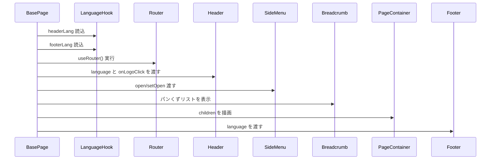

## 📄 BasePage モジュール仕様書

## 1. モジュール概要

### 1-1. 目的

このモジュールは、共通レイアウト機能を提供する BasePage コンポーネントである。ヘッダー、フッター、サイドメニュー、ページ本体、通知領域など、全体構成の基礎となる要素を統合的に提供する。

### 1-2. 適用範囲

- 全ページ共通の画面レイアウト構築
- 国際化対応されたヘッダー/フッター表示
- サイドメニュー表示と開閉制御
- ページ内通知表示（エラー通知）

---

## 2. 設計方針

### 2-1. アーキテクチャ

- React Functional Component + Hooks により状態管理と描画制御を行う。

- 多言語化: `useLanguage(headerLang)` / `useLanguage(footerLang)` を用いて、言語情報を動的に読み込む。

**- レイアウト構成:**
- ヘッダー：`<Header />`
- サイドメニュー：`<SideMenu />`
- パンくずリスト：`<Breadcrumb />`
- メインコンテンツ：`<PageContainer>{children}</PageContainer>`
- フッター：`<Footer />`
- 通知：`<ErrorNotification />`
- MUI の Box により全体のレイアウト構造を構成。
- 画面サイズやヘッダー・サイドバーのサイズは config.ts に定義された定数で管理。

### 2-2. 統一ルール
- React 18+, TypeScript
- Next.js 13+（useRouter などを使用）
- Material UI (MUI)
- 自作カスタムフック（`useCurrentLanguage`, `useLanguage`）
- 共通コンポーネント群（@composite/_, @functional/_, @base/\*）
---

## 3. 📂 フォルダ構成とファイルの役割

```plaintext
src/
└── components/
    └── layout/
        └── BasePage.tsx               // 本モジュール本体
```

---

## 4. 📌 コンポーネント説明

### BasePage.tsx

**役割：**  
画面全体のベースレイアウト構成を司る。ヘッダー／サイドメニュー／ページ本体／通知／フッターを一括で組み上げ、統一されたページ表示を提供する。

**主要な Props：**  
| 名前 | 型 | 説明 |
| -------- | ----------- | ---------------- |
| children | `ReactNode` | 子コンテンツ（各画面ごとの内容） |

**内部状態:**  
| 名前 | 型 | 用途 |
| -------- | --------- | --------------- |
| menuOpen | `boolean` | サイドメニューの開閉状態を管理 |

**構成要素と処理概要：**  
| 要素 | 説明 |
| ------------------- | ------------------------------------- |
| `Header` | ヘッダー表示。ロゴクリックで `router.push('#')` を実行 |
| `SideMenu` | メニュー開閉を `menuOpen` ステートで制御 |
| `Breadcrumb` | パンくずリストを表示 |
| `PageContainer` | メイン表示領域。ヘッダーとサイドメニューのサイズを反映してマージン調整 |
| `ErrorNotification` | エラーメッセージなどの通知コンポーネント |
| `Footer` | ページ下部の著作情報などを表示するフッター |

**多言語対応：**

- `headerLang`, `footerLang` オブジェクトを `useLanguage(...)` で解決し、各コンポーネントに渡す
<!-- INCLUDE:FE\spa-next\my-next-app\src\components\layout\BasePage.tsx -->

---

## 5. 🧭 処理フロー図

flowchart TD
A[BasePage 読込]
B[useLanguage(...) で lang データ取得]
C[ヘッダー/フッター/メニュー 言語情報構築]
D[Header/SideMenu/PageContainer を配置]
E[通知/ErrorNotification を表示]
F[Footer を描画]

    A --> B --> C --> D --> E --> F

---

## 6. 🔁 処理シーケンス図


