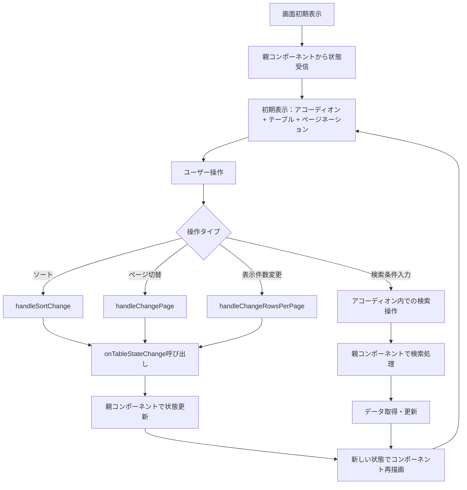
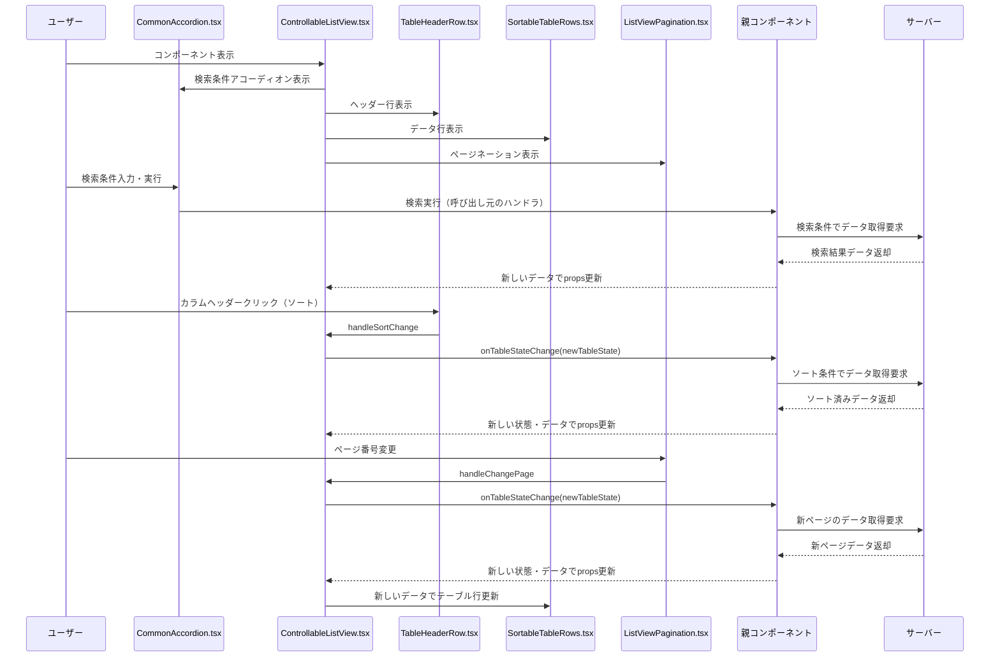

# ControllableListViewモジュール仕様書

## 1. モジュール概要

### 1-1. 目的

ControllableListViewモジュールは、呼び出し元での状態管理に特化したリスト表示コンポーネントです。データの一覧表示、ソート、ページネーション機能を提供し、すべての状態変更を単一のコールバック関数（`onTableStateChange`）を通じて親コンポーネントに通知することで、外部での状態管理を可能にします。

### 1-2. 適用範囲

- 管理画面等での一覧表示（外部状態管理が必要なケース）
- データの並び替え（サーバーサイドソート対応）
- ページ切り替え・表示件数変更（サーバーサイドページネーション対応）
- 複数のListViewコンポーネント間での状態同期が必要なケース
- 検索条件の表示・非表示切り替えが必要な画面

### 1-3. ListViewとの違い

| 機能 | ListView | ControllableListView |
|------|----------|---------------------|
| 状態管理 | 内部で管理 | 外部で管理（制御可能） |
| ソート実行 | 内部で実行 | 外部で実行 |
| データフィルタリング | 内部で実行 | 外部で実行 |
| 検索条件表示 | なし | アコーディオン形式で提供 |
| 適用ケース | 小〜中規模データ（クライアントサイド） | 大規模データ（サーバーサイド） |

---

## 2. 設計方針

### 2-1. アーキテクチャ

- ListView の構成コンポーネント（`TableHeaderRow`、`SortableTableRows`、`ListViewPagination`）を再利用
- 状態管理を完全に外部化し、すべての状態変更を `TableState` 型で統一
- MUI コンポーネントベースの実装で、一貫したデザインを提供
- 検索条件表示用のアコーディオンコンポーネント（`CommonAccordion`）を統合

### 2-2. データ連携と状態管理

- 親コンポーネントから完全な状態（`page`、`rowsPerPage`、`sortParams`）を受け取る
- すべての状態変更は `onTableStateChange` コールバック一つで通知
- データの変更・フィルタリング・ソートは呼び出し元で実装

---

## 3. 📂 フォルダ構成とファイルの役割

```plaintext
src/
└── components/
    └── composite/
        └── Listview/
            ├── ControllableListView.tsx   // 外部制御対応リストビューコンポーネント
            ├── ListViewPagination.tsx     // ページネーション専用コンポーネント（共通）
            ├── SortParams.ts              // ソートパラメータ型定義（共通）
            ├── TableHeaderRow.tsx         // テーブルヘッダー行コンポーネント（共通）
            └── SortableTableRows.tsx      // ソート可能なテーブル行コンポーネント（共通）
    └── base/
        └── utils/
            └── CommonAccordion.tsx        // アコーディオンコンポーネント（共通）
```

---

## 4. 📌 コンポーネント説明

### ControllableListView.tsx

**目的:** 外部状態管理に対応した一覧表示コンポーネント。すべての状態変更を親コンポーネントに委譲。

**主な機能:**

- テーブル表示（`Table`）
- カラムヘッダー表示とソート要求の通知
- ページネーションの上部・下部表示
- 状態変更の統一的な通知
- 検索条件のアコーディオン表示（展開/折りたたみ可能）

**主な props:**

```typescript
type ListViewProps = {
  page: number;                                    // 現在のページ番号（1-based）
  sortParams: SortParams;                          // 現在のソート状態
  rowsPerPage: number;                            // 1ページの表示件数
  onTableStateChange?: (state: TableState) => void; // 状態変更時のコールバック
  rowsPerPageOptions?: number[];                  // 表示件数の選択肢
  rowData: RowDefinition[];                       // 表示対象データ配列
  totalRowCount: number;                          // 総データ件数
  columns: ColumnDefinition[];                    // カラム定義
  sx?: SxProps<Theme>;                           // スタイル定義（オプション）
  searchOptions?: SearchDefinition;              // 検索条件アコーディオンの設定（オプション）
};
```

**型定義:**

```typescript
export type TableState = {
  page: number;
  rowsPerPage: number;
  sortParams: SortParams;
};

export type ColumnDefinition = {
  id: string | number;
  label: ReactNode;
  display: boolean;
  sortable: boolean;
};

export type CellDefinition = {
  id: string | number;
  columnId: string | number;
  cell: ReactNode | undefined;
  value: string | number | undefined;
};

export type RowDefinition = {
  cells: CellDefinition[];
  rowSx?: SxProps<Theme>;
};

export type SearchDefinition = {
  title?: string;                    // アコーディオンのタイトル（デフォルト：「検索条件」）
  elements?: ReactNode;              // アコーディオン内に表示する検索条件コンポーネント
  accordionSx?: SxProps<Theme>;      // アコーディオンのスタイル定義
};
```

---

## 5. 処理フロー図



---

## 6. 処理シーケンス図



---

## 7. 使用例

### 基本的な使用例

```tsx
const ParentComponent: React.FC = () => {
  const [tableState, setTableState] = useState<TableState>({
    page: 1,
    rowsPerPage: 10,
    sortParams: { sortColumn: '', sortOrder: 'asc' },
  });
  const [data, setData] = useState<RowDefinition[]>([]);
  const [totalCount, setTotalCount] = useState(0);

  const handleTableStateChange = async (newState: TableState) => {
    // 状態を更新
    setTableState(newState);
    
    // サーバーから新しいデータを取得
    const response = await fetchData({
      page: newState.page,
      limit: newState.rowsPerPage,
      sortColumn: newState.sortParams.sortColumn,
      sortOrder: newState.sortParams.sortOrder,
    });
    
    setData(convertToListViewData(response.items));
    setTotalCount(response.totalCount);
  };

  return (
    <ControllableListView
      page={tableState.page}
      rowsPerPage={tableState.rowsPerPage}
      sortParams={tableState.sortParams}
      onTableStateChange={handleTableStateChange}
      rowData={data}
      totalRowCount={totalCount}
      columns={columns}
    />
  );
};
```

### カスタム表示件数オプション付きの例

```tsx
<ControllableListView
  page={tableState.page}
  rowsPerPage={tableState.rowsPerPage}
  sortParams={tableState.sortParams}
  onTableStateChange={handleTableStateChange}
  rowData={data}
  totalRowCount={totalCount}
  columns={columns}
  rowsPerPageOptions={[5, 10, 25, 50]}
  sx={{
    '& .MuiTableContainer-root': {
      border: '1px solid #e0e0e0',
      borderRadius: '8px',
    },
  }}
/>
```

### 複数のテーブル状態を管理する例

```tsx
const MultiTableComponent: React.FC = () => {
  const [userTableState, setUserTableState] = useState<TableState>({ /* ... */ });
  const [orderTableState, setOrderTableState] = useState<TableState>({ /* ... */ });

  const handleUserTableStateChange = (newState: TableState) => {
    setUserTableState(newState);
    // ユーザーデータの取得処理
  };

  const handleOrderTableStateChange = (newState: TableState) => {
    setOrderTableState(newState);
    // 注文データの取得処理
  };

  return (
    <div>
      <h2>ユーザー一覧</h2>
      <ControllableListView
        {...userTableState}
        onTableStateChange={handleUserTableStateChange}
        rowData={userData}
        totalRowCount={userTotalCount}
        columns={userColumns}
      />
      
      <h2>注文一覧</h2>
      <ControllableListView
        {...orderTableState}
        onTableStateChange={handleOrderTableStateChange}
        rowData={orderData}
        totalRowCount={orderTotalCount}
        columns={orderColumns}
      />
    </div>
  );
};
```

### 検索条件アコーディオン付きの例

```tsx
const SearchableListComponent: React.FC = () => {
  const [tableState, setTableState] = useState<TableState>({
    page: 1,
    rowsPerPage: 10,
    sortParams: { sortColumn: '', sortOrder: false },
  });
  const [searchValues, setSearchValues] = useState({
    name: '',
    department: '',
    dateFrom: '',
    dateTo: '',
  });
  const [data, setData] = useState<RowDefinition[]>([]);
  const [totalCount, setTotalCount] = useState(0);

  const handleSearch = async () => {
    // 検索実行時はページを1に戻す
    const newTableState = { ...tableState, page: 1 };
    setTableState(newTableState);
    
    const response = await fetchData({
      page: newTableState.page,
      limit: newTableState.rowsPerPage,
      sortColumn: newTableState.sortParams.sortColumn,
      sortOrder: newTableState.sortParams.sortOrder,
      searchName: searchValues.name,
      searchDepartment: searchValues.department,
      searchDateFrom: searchValues.dateFrom,
      searchDateTo: searchValues.dateTo,
    });
    
    setData(convertToListViewData(response.items));
    setTotalCount(response.totalCount);
  };

  const handleTableStateChange = async (newState: TableState) => {
    setTableState(newState);
    
    const response = await fetchData({
      page: newState.page,
      limit: newState.rowsPerPage,
      sortColumn: newState.sortParams.sortColumn,
      sortOrder: newState.sortParams.sortOrder,
      searchName: searchValues.name,
      searchDepartment: searchValues.department,
      searchDateFrom: searchValues.dateFrom,
      searchDateTo: searchValues.dateTo,
    });
    
    setData(convertToListViewData(response.items));
    setTotalCount(response.totalCount);
  };

  // 検索条件コンポーネント
  const searchElements = (
    <Box sx={{ display: 'flex', flexDirection: 'column', gap: 2, p: 2 }}>
      <Box sx={{ display: 'flex', gap: 2, flexWrap: 'wrap' }}>
        <TextField
          label="名前"
          value={searchValues.name}
          onChange={(e) => setSearchValues(prev => ({ ...prev, name: e.target.value }))}
          size="small"
          sx={{ minWidth: 200 }}
        />
        <FormControl size="small" sx={{ minWidth: 150 }}>
          <InputLabel>部署</InputLabel>
          <Select
            value={searchValues.department}
            onChange={(e) => setSearchValues(prev => ({ ...prev, department: e.target.value }))}
            label="部署"
          >
            <MenuItem value="">すべて</MenuItem>
            <MenuItem value="営業部">営業部</MenuItem>
            <MenuItem value="IT部">IT部</MenuItem>
            <MenuItem value="人事部">人事部</MenuItem>
          </Select>
        </FormControl>
        <TextField
          label="入社日（開始）"
          type="date"
          value={searchValues.dateFrom}
          onChange={(e) => setSearchValues(prev => ({ ...prev, dateFrom: e.target.value }))}
          InputLabelProps={{ shrink: true }}
          size="small"
        />
        <TextField
          label="入社日（終了）"
          type="date"
          value={searchValues.dateTo}
          onChange={(e) => setSearchValues(prev => ({ ...prev, dateTo: e.target.value }))}
          InputLabelProps={{ shrink: true }}
          size="small"
        />
      </Box>
      <Box sx={{ display: 'flex', gap: 1 }}>
        <Button variant="contained" onClick={handleSearch} size="small">
          検索
        </Button>
        <Button 
          variant="outlined" 
          onClick={() => setSearchValues({ name: '', department: '', dateFrom: '', dateTo: '' })}
          size="small"
        >
          クリア
        </Button>
      </Box>
    </Box>
  );

  return (
    <ControllableListView
      page={tableState.page}
      rowsPerPage={tableState.rowsPerPage}
      sortParams={tableState.sortParams}
      onTableStateChange={handleTableStateChange}
      rowData={data}
      totalRowCount={totalCount}
      columns={columns}
      searchOptions={{
        title: "従業員検索",
        elements: searchElements,
        accordionSx: {
          mb: 2,
          '& .MuiAccordionSummary-root': {
            backgroundColor: '#f5f5f5',
          },
        },
      }}
      rowsPerPageOptions={[10, 20, 50]}
    />
  );
};
```

---

## 8. パフォーマンス考慮事項

### 8-1. メモ化の推奨

```tsx
// データ変換処理のメモ化
const rowData = useMemo(() => 
  convertToListViewData(rawData), 
  [rawData]
);

// カラム定義のメモ化
const columns = useMemo(() => createColumns(), []);

// 検索条件コンポーネントのメモ化
const searchElements = useMemo(() => (
  <SearchConditionComponent 
    values={searchValues}
    onChange={setSearchValues}
    onSearch={handleSearch}
  />
), [searchValues, handleSearch]);
```

### 8-2. 大量データ対応

- サーバーサイドでのページネーション・ソートの実装を推奨
- `totalRowCount` で正確な総件数を指定
- 必要な分のデータのみを `rowData` で渡す

### 8-3. 検索条件の最適化

- 検索条件が複雑な場合は、検索実行時にデバウンス処理を実装
- アコーディオンの展開/折りたたみ状態は親コンポーネントで管理することを推奨
- 検索条件のリセット時は、必要に応じてデータの再取得を実行

---

## 9. 補足・備考

### 9-1. 状態管理のベストプラクティス

- `TableState` 型を使用して状態を統一管理
- 状態変更時は必ず `onTableStateChange` を経由
- 非同期データ取得時の loading 状態管理は親コンポーネントで実装

### 9-2. エラーハンドリング

- データ取得エラー時の処理は親コンポーネントで実装
- `rowData` が空の場合の表示は自動的に「データがありません」を表示

### 9-3. 検索条件アコーディオンの運用指針

- `searchOptions` が未指定の場合、アコーディオンは表示されません
- アコーディオンのタイトルは `title` プロパティで変更可能（デフォルト：「検索条件」）
- 検索条件コンポーネント（`elements`）は任意のReactNodeを指定可能
- 検索実行は親コンポーネントの責任で実装し、結果に応じて `rowData` と `totalRowCount` を更新
- アコーディオンのスタイルは `accordionSx` で詳細にカスタマイズ可能

### 9-4. CommonAccordionとの連携

- `CommonAccordion` コンポーネントを利用して統一的なアコーディオンUI体験を提供
- アコーディオンの展開/折りたたみ状態は `CommonAccordion` 内部で管理されます
- 初期表示時の展開状態などの詳細制御が必要な場合は、`CommonAccordion` の仕様を参照してください
