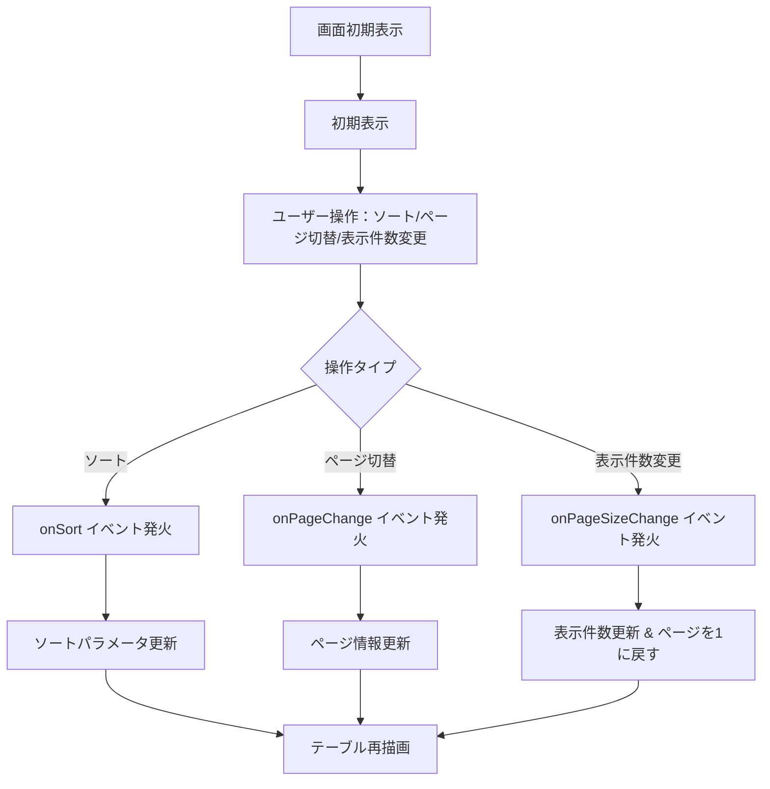
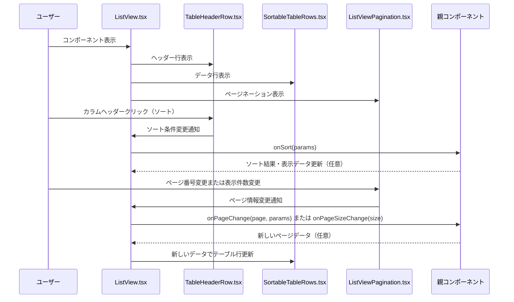

# ListViewモジュール仕様書

## 1. モジュール概要

### 1-1. 目的
ListViewモジュールは、データの一覧表示、ソート、ページネーションなどの機能を提供し、大量のデータから必要な情報をユーザーが効率よく操作できるようにする。

### 1-2. 適用範囲
- 管理画面等での一覧表示
- データの並び替え
- ページ切り替え・表示件数変更

---

## 2. 設計方針

### 2-1. アーキテクチャ
- 各機能（ヘッダー行、データ行、ページネーション）を独立したコンポーネントとして実装
- MUI コンポーネント（Table、TableHead、TableBody、TablePagination 等）を活用
- `SortParams` 型を共有し、ソート・ページネーションの統一管理を行う

### 2-2. データ連携と状態管理
- 親コンポーネントから `rowData`（表示データ）, `columns`（カラム定義）を props で受け取る
- ページ番号・ソート順などを内部でステート管理し、更新時にコールバックで通知

---

## 3. 📂 フォルダ構成とファイルの役割

```plaintext
src/
└── components/
    └── composite/
        └── Listview/
            ├── ListView.tsx               // リスト表示の主要コンポーネント
            ├── ListViewPagination.tsx     // ページネーション専用コンポーネント
            ├── SearchParams.ts            // ソートパラメータ型定義
            ├── TableHeaderRow.tsx         // テーブルヘッダー行コンポーネント
            └── SortableTableRows.tsx      // ソート可能なテーブル行コンポーネント
```

---

## 4. 📌 各コンポーネント説明

### ListView.tsx
**目的:** 一覧の主要表示部。テーブル表示とページネーションを統合的に管理。

**主な機能:**
- テーブル表示（`Table`）
- カラムヘッダー表示とソート機能の提供
- ページネーションの上部・下部表示
- データのソートとページごとの表示
- 横スクロール機能（テーブル幅が親コンテナを超えた際の自動スクロール）

**主な props:**
- `rowData`: 表示対象データ配列（RowDefinition[]）
- `columns`: カラム定義（ColumnDefinition[]）
- `sortColumns`: ソート可能なカラムのID配列
- `onPageChange(page, params)`: ページ切替時のハンドラ
- `onPageSizeChange(size)`: 表示件数切替時のハンドラ
- `onSort(params)`: ソート切替時のコールバック
- `sx`: スタイル定義（オプション）
- `searchOptions`:アコーディオンの表示要素

**型定義:**
```typescript
export type ColumnDefinition = {
  id: string | number;
  label: ReactNode;
  display: boolean;
  sortable: boolean;
};

export type CellDefinition = {
  id: string | number;
  columnId: string | number;
  cell: ReactNode | undefined;
  value: string | number | undefined;
};

export type RowDefinition = {
  cells: CellDefinition[];
  rowSx?: SxProps<Theme>;
};

export type SearchDefinition = {
  title?: string,
  elements: ReactNode,
  accordionSx?: SxProps<Theme>;
};
```

---

### ListViewPagination.tsx
**目的:** ページ切替用 UI を提供

**主な機能:**
- 現在のページ・総アイテム数に応じて `TablePagination` を表示
- ページ変更時に `onPageChange` をコールし、検索パラメータも同時に渡す
- 表示件数変更機能の提供

**主な props:**
- `count`: 総アイテム数
- `page`: 現在のページ番号（1-based）
- `rowsPerPage`: 1ページの表示件数（デフォルト：50）
- `searchParams`: 現在のソート条件
- `onPageChange(newPage, searchParams)`: ページ切替ハンドラ
- `onRowsPerPageChange(event)`: 表示件数切替ハンドラ

---

### TableHeaderRow.tsx
**目的:** テーブルのヘッダー行と各カラムのソート機能を提供

**主な機能:**
- カラム定義に基づいたヘッダーの表示
- ソート可能なカラムには `TableSortLabel` を表示
- クリックによるソート順の切替（昇順⇔降順⇔ソートなし）

**主な props:**
- `columns`: カラム定義（ColumnDefinition[]）
- `sortParams`: 現在のソート状態
- `handleSortChange(params)`: ソート変更時のハンドラ

---

### SortableTableRows.tsx
**目的:** ソートとページネーションに対応したテーブル行の表示

**主な機能:**
- ソート条件に従ってデータをソート
- ページネーション情報に従って現在のページ分のデータのみを表示
- カスタムスタイル（rowSx）の適用

**主な props:**
- `sortParams`: ソートパラメータ
- `rowData`: 表示データ配列
- `columnDefinition`: カラム定義
- `page`: 現在のページ番号
- `rowsPerPage`: 1ページの表示件数
- `bodySx`: テーブルボディのスタイル（オプション）

---

### SearchParams.ts
**目的:** ソートや検索に使うパラメータの型定義を提供

```ts
export type SortParams = {
  sortColumn: string | number;
  sortOrder: 'asc' | 'desc' | false;
};
```

この型はソート・ページネーションのコンポーネント間で共通に使用され、状態を統一して保持・更新するために不可欠な設計要素となっている。

---

## 5. 処理フロー図



---

## 6. 処理シーケンス図



---

## 7. 使用例

```tsx
// 基本的な使用例
<ListView
  columns={columns}
  rowData={convertToListViewData(data)}
  sortColumns={['id', 'name', 'email']}
  onSort={handleSort}
  onPageChange={handlePageChange}
  onPageSizeChange={handlePageSizeChange}
/>

// カスタムスタイル適用例
<ListView
  columns={columns}
  rowData={convertToListViewData(data)}
  sortColumns={['id', 'name', 'email']}
  onSort={handleSort}
  sx={{
    backgroundColor: '#f5f5f5',
    borderRadius: 2,
    '& .MuiTableHead-root': {
      backgroundColor: '#1976d2',
      color: 'white'
    }
  }}
/>
```

---

## 8. 横スクロール機能

### 8-1. 概要
ListViewコンポーネントは、テーブルの幅が親コンテナの幅を超えた場合に自動的に横スクロールを有効にします。これにより、多数のカラムを含むテーブルでもレスポンシブに表示できます。

### 8-2. 技術仕様
- **実装方法**: TableContainerに`overflowX: 'auto'`を適用
- **対応範囲**: テーブル全体（ヘッダー行とデータ行の両方）
- **スクロール条件**: テーブルの幅が親コンテナの幅を超えた場合に自動で有効化

### 8-3. 使用例とテストケース

#### 多カラムテーブルの横スクロール
```tsx
const wideColumns = [
  { id: 'col1', label: 'Column 1', display: true, sortable: true },
  { id: 'col2', label: 'Column 2', display: true, sortable: true },
  // ... 14カラムまで定義
];

<div style={{ width: '800px' }}>
  <ListView
    columns={wideColumns}
    rowData={wideData}
    sortColumns={['col1', 'col2', 'col3']}
    onSort={handleSort}
  />
</div>
```

#### 狭いコンテナでの横スクロール
```tsx
<div style={{ width: '400px' }}>
  <ListView
    columns={standardColumns}
    rowData={data}
    sortColumns={['id', 'name', 'email']}
    onSort={handleSort}
  />
</div>
```

### 8-4. Storybookテスト例
以下のStorybookストーリーで横スクロール機能をテスト可能：

- **HorizontalScrolling**: 14カラムの幅広テーブル（800px コンテナ）
- **NarrowContainer**: 5カラムテーブル（400px コンテナ）
- **LongContentScrolling**: 長いテキストコンテンツ（600px コンテナ）

---

## 9. 補足・備考
- ソート順切替はカラムヘッダークリックによってトグルで切り替え（昇順⇔降順⇔ソートなし）
- テーブル行にカスタムスタイル（`rowSx`）を適用可能
- ReactNode型によるセル内のカスタムレンダリングが可能（リンクやボタン、チェックボックスなど）
- 表示件数は10, 20, 50, 100件から選択可能
- アコーディオンの検索条件の仕様については、別紙「Accordion.md」を参照
