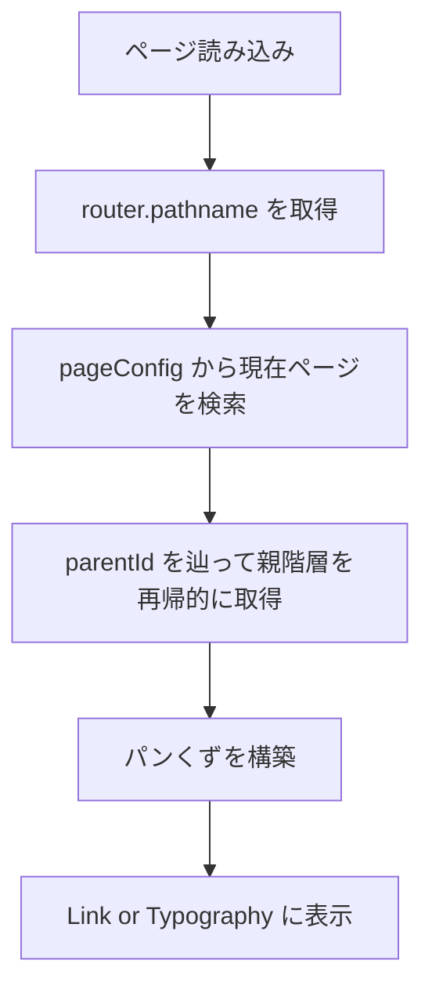
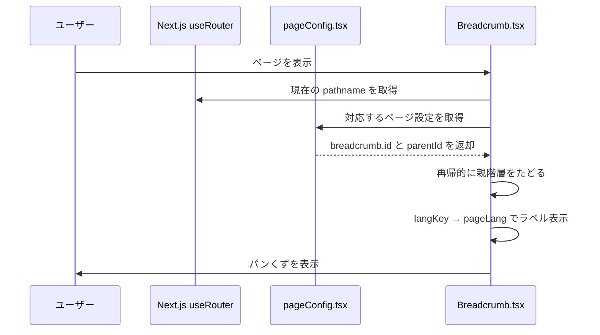

# ✅ パンくずリストモジュール仕様書（最新版）

## 1. モジュール概要

### 1-1. 目的
このモジュールは、現在のページ階層を視覚的に表示し、ユーザーがページ構造を把握・移動しやすくするためのパンくずリストを提供する。

### 1-2. 適用範囲
- 各ページ上部に表示されるグローバルなナビゲーション補助機能
- 階層情報を自動的に構築し、親ページへの遷移を支援する全ページ共通UI

---

## 2. 設計方針

### 2-1. アーキテクチャ

- **Next.js + React Functional Component**
  `useRouter()` により現在のパスに基づいてパンくずを自動生成する。

- **pageConfigベースの構成**
  `src/config/pageConfig.tsx` で定義された各ページの `breadcrumb` 情報（`id`, `parentId`）をもとに階層を構築する。

- **再帰的な構造構築**
  現在のページを起点に `breadcrumb.parentId` を辿ることで親階層を再帰的に構築。

- **多言語対応**
  表示ラベルは `langKey` を通じて `pageLang.ts` から取得し、`useLanguage(pageLang)` によって切り替える。

- **UI ライブラリ**
  Material-UI（MUI）の `Breadcrumbs`, `Typography`, `Link` を使用。

---

## 3. 📂 フォルダ構成とファイルの役割

```plaintext
src/
└── components/
    └── composite/
        └── breadcrumb/
            └── Breadcrumb.tsx         // パンくずリスト UI コンポーネント
src/
└── config/
    └── pageLang.ts                    // パンくずに表示されるページ名（ja/en）
    └── pageConfig.tsx                 // ページ構成・パンくず・パーミッション・多言語情報を一元管理
```

---

## 4. 📌 各ファイルの説明

### Breadcrumb.tsx  
**目的：**  
`pageConfig.tsx` に基づいて、現在のページ階層に対応するパンくずリストを再帰的に構築し表示する。

```tsx
<!-- INCLUDE:FE/spa-next/my-next-app/src/components/composite/breadcrumb/Breadcrumb.tsx -->
```

---

### pageConfig.tsx（抜粋）  
**目的：**  
各ページのURL、パーミッション、表示名、アイコン、パンくずID（親子関係）を一元定義する。

```tsx
<!-- INCLUDE:FE/spa-next/my-next-app/src/config/pageConfig.tsx -->
```

---

### pageLang.ts  
**目的：**  
`langKey` をもとにパンくずの表示ラベル（日本語・英語）を切り替える。

```ts
<!-- INCLUDE:FE/spa-next/my-next-app/src/lang/pageLang.ts -->
```

---

## 5. 🔄 処理フロー図



---

## 6. 🔁 処理シーケンス図



---
