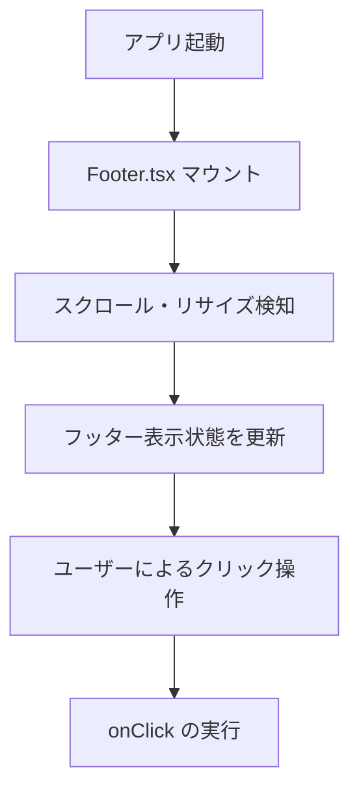
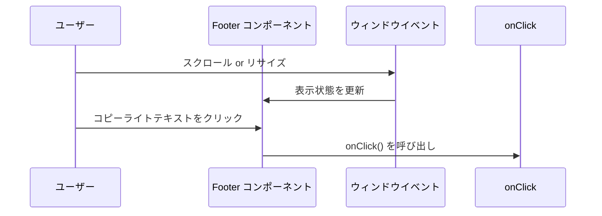

# フッターモジュール仕様書

## 1. モジュール概要

### 1-1. 目的
このモジュールは、アプリケーション全体の共通フッターとして、コピーライト情報の表示とクリックイベントを提供する。ユーザーがアプリケーションを利用する際に、適切な位置でフッターが表示されるように制御する。

### 1-2. 適用範囲
- アプリケーションの全ページに共通して表示されるグローバルフッター
- コピーライト情報の表示
- クリックによる追加アクション

---

## 2. 設計方針

### 2-1. アーキテクチャ
- **Material-UI を活用したデザイン統一**
  `Box` 、 `Container`、`Typography`を用いて、レスポンシブで一貫性のあるフッターを実装。

- **表示制御機能**
  - 現行コードでは、フッターは定義されたスタイルで定位置に表示される。

- **クリックイベントの提供**
  - `onClick` プロパティを受け取り、フッターのクリック時に任意のアクションを実行可能。

- **言語設定の外部注入**
  - `language` プロパティとして言語設定を外部から注入する設計にすることで、コンポーネントが特定のフックに依存せず再利用性を高める。
  - 呼び出し元で `useLanguage(footerLang)` を使用して適切な言語設定を注入する。

### 2-2. 統一ルール
- 背景色、文字色などのカラープロパティは `color.ts`を定義し、参照する形として変更とメンテナンスを容易にする。
- 固定の文字列は `Footer.lang.ts`を定義し、呼び出し元からコンポーネントに注入することで多言語対応を実現する。
- クリック可能なテキストは、ホバー時に下線が表示されるようにする。

---

## 3. 📂 フォルダ構成とファイルの役割

```plaintext
src/
└── components/
    └── composite/
        └── footer/
            ├── Footer.tsx         // グローバルフッター UI コンポーネント
            ├── Footer.stories.tsx // Storybook
```

## 4. 📌 各ファイルの説明

### Footer.tsx
**目的:**
アプリケーション共通のグローバルフッターを提供し、適切なタイミングで表示・非表示を切り替えながら、コピーライト情報を表示する。

**機能:**
- **動的な表示制御:**
  - ページのスクロール位置やウィンドウサイズに応じて、フッターの表示・非表示を自動的に切り替える。
  - ページの高さがウィンドウより小さい場合でも、適切に表示されるよう調整。
- **クリックイベント:** `onClick` を受け取り、フッタークリック時に追加のアクションを実行可能。
- **ホバーエフェクト:** テキストにホバー時のアニメーション（下線表示）を適用。
- **言語設定の外部注入:** `language` プロパティを通じて言語設定を外部から注入し、呼び出し元で `useLanguage(footerLang)` を使用して適切な言語設定を提供する。

---

## 5. 📂 処理フロー図



---

## 6. 📂 処理シーケンス図



## 7. サンプルコード
```tsx
import React, { ReactNode } from 'react';
import { Header } from '@composite/Header';
import { Footer } from '@composite/Footer';
import ErrorNotification from '@functional/ErrorNotification';
import { useRouter } from 'next/router';
import { useLanguage } from '@/hooks/useLanguage';
import { footerLang } from '@/components/composite/Footer/footer.lang';

type BasePageProps = {
  children: ReactNode;
};

const BasePage = ({ children }: BasePageProps) => {
  const router = useRouter();
  
  // useLanguageフックを使用して言語設定を取得
  const footerLanguageRecord = useLanguage(footerLang);
  const footerLanguage: FooterLang = {
    title: footerLanguageRecord['title'],
    description: footerLanguageRecord['description'],
    usernamePlaceholder: footerLanguageRecord['usernamePlaceholder'],
    passwordPlaceholder: footerLanguageRecord['passwordPlaceholder'],
    loginButton: footerLanguageRecord['loginButton'],
    loginError: footerLanguageRecord['loginError'],
    copyrightText: footerLanguageRecord['copyrightText'],
  };

  return (
    <div className="flex flex-col min-h-screen">
      <Header />
      <div className="flex-1 p-4">
        {children}
      </div>
      <ErrorNotification />
      {/* Footerコンポーネントに言語設定を注入 */}
      <Footer
        language={footerLanguage}
        onClick={() => router.push('/about')}
      />
    </div>
  );
};

export default BasePage;
```
