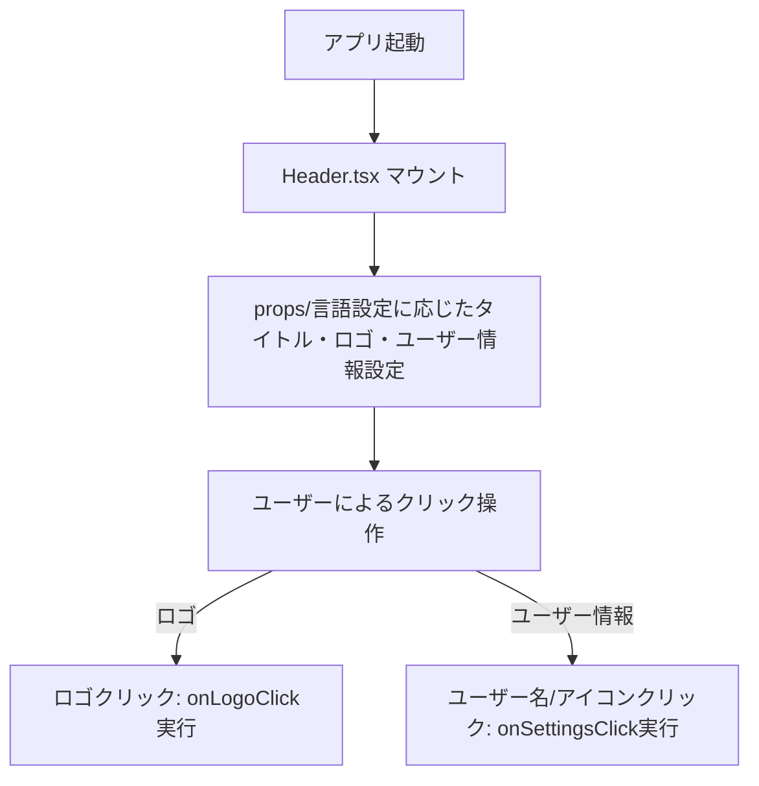
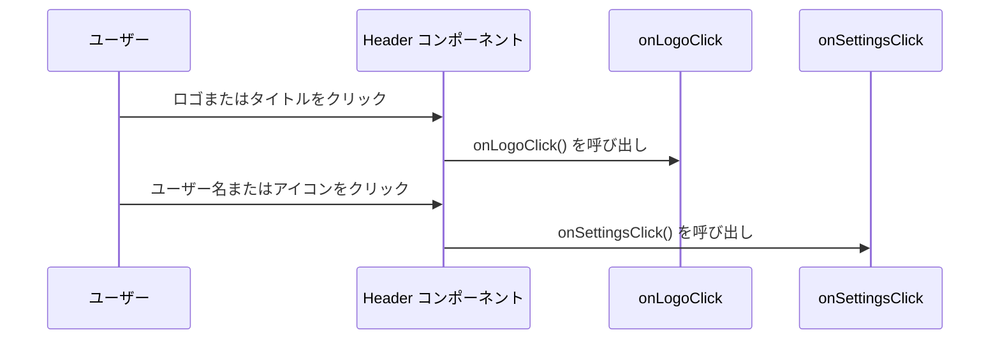

# ヘッダーモジュール仕様書

## 1. モジュール概要

### 1-1. 目的
このモジュールは、アプリケーションの全体共通ヘッダーとして、タイトル表示・ロゴ・ユーザー情報・設定ボタンを提供する。ユーザーがアプリケーション内をナビゲートする際の共通 UI パーツとして、統一されたユーザー体験を実現する。

### 1-2. 適用範囲
- アプリケーションの全ページに共通して表示されるグローバルヘッダー
- タイトルのリンク遷移、ユーザー名表示、設定アイコンのクリックアクションなど

---

## 2. 設計方針

### 2-1. アーキテクチャ

- **UI フレームワークとの統合**
  Material-UI（MUI）の `AppBar`、`Toolbar`、`Typography` などの UI コンポーネントを用いて、レスポンシブかつ一貫した UI を構築。

- **アイコンライブラリの活用**
  FontAwesome の `faCircleUser` アイコンを使用し、ユーザー設定の導線を視覚的に提供。

### 2-2. 統一ルール
- 背景色、文字色などのカラープロパティは`color.ts`を定義し、参照する形として変更とメンテナンスを容易にする。
- 固定の文字列は `header.lang.ts` を定義し、呼び出し元で `useLanguage(headerLang)` により解決して注入する形で多言語対応とする。
- タイトルやロゴはクリック可能で、指定された URL へ遷移する。
- ユーザー名とアイコンは `onSettingsClick` を通じて設定画面やモーダルなどへの導線とする。
- 必須ではない `title` や `userName` は、デフォルト値を使用して柔軟な再利用を可能にする。

---

## 3. 📂 フォルダ構成とファイルの役割

```plaintext
src/
└── components/
    └── composite/
        └── header/
            ├── Header.tsx         // グローバルヘッダー UI コンポーネント
            └── header.lang.ts     // 多言語対応用の定数定義
```

## 4. 📌 各ファイルの説明

### Header.tsx
**目的:**
アプリケーション共通のグローバルヘッダーを提供し、ロゴ・タイトル・ユーザー情報・設定アクションを表示する。

**機能:**
- **ロゴ表示:** Next.jsのImageコンポーネントを使用して動的ロゴURLを表示し、クリックで指定のコールバック関数を実行。
- **タイトル表示:** `title` プロパティで動的にタイトルを表示し、未指定の場合は言語設定のデフォルトタイトルを使用。
- **ユーザー情報:** `userName` を表示し、未指定の場合は言語設定のデフォルトユーザー名を使用し、クリックで設定機能への導線を提供。
- **アイコン表示:** FontAwesome のユーザーアイコンを表示し、クリック時に `onSettingsClick` コールバックを実行。
- **多言語対応:** `language` プロパティを通して、タイトル・ユーザー名・ロゴURLなどを言語別に設定可能。
- **スタイリング:** MUIの `sx` プロパティを使用して、レスポンシブかつ一貫したスタイリングを実現。

### header.lang.ts
**目的:**
多言語対応のために必要なテキストやプロパティを定義する。

**機能:**
- **言語設定:** 日本語 (ja) および英語 (en) の両方の表示テキストを管理。
- **タイトル定義:** 各言語でのデフォルトタイトルを定義。
- **ユーザー名定義:** 各言語でのデフォルトユーザー名を定義。
- **ロゴパラメータ:** ロゴのURL、高さ、マージンなどのスタイル情報を提供。

---

## 5. 📂 処理フロー図



---

## 6. 📂 処理シーケンス図



## 7. サンプルコード
```tsx
import React, { ReactNode } from 'react';
import Header from './header/header';
import Footer from './footer/footer';
import ErrorNotification from '../functional/ErrorNotification';

import { useRouter } from 'next/router';
import { useLanguage } from '@/hooks/useLanguage';
import { HeaderLang, headerLang } from '@/components/composite/Header/header.lang';

type BasePageProps = {
  children: ReactNode;
};

const BasePage = ({ children }: BasePageProps) => {

  const router = useRouter();
  const headerLanguageRecord = useLanguage(headerLang);
  const language: HeaderLang = {
    title: headerLanguageRecord['title'],
    defaultUserName: headerLanguageRecord['defaultUserName'],
    logoUrl: headerLanguageRecord['logoUrl'],
    logoHeight: headerLanguageRecord['logoHeight'],
    iconMarginRight: headerLanguageRecord['iconMarginRight']
  };

  return (
    <div className="flex flex-col min-h-screen">
      <Header onLogoClick={() => router.push()} language={language} />
      <div className="flex-1 p-4">
        {children}
      </div>
      <ErrorNotification />
      <Footer />
    </div>
  );
};

export default BasePage;
```
