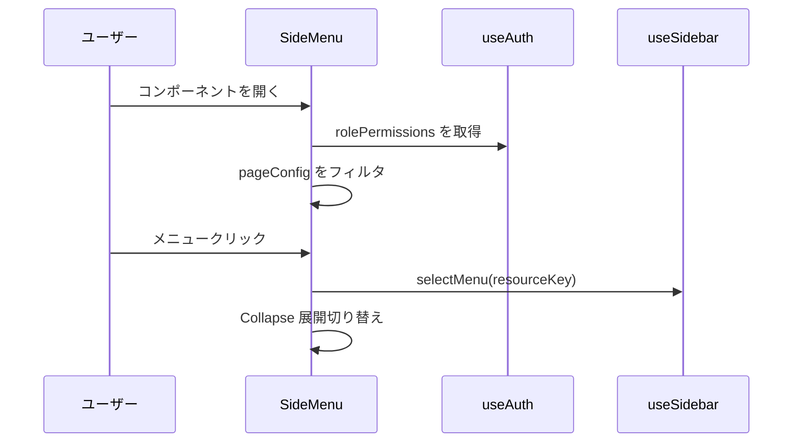

# ✅ サイドメニューモジュール仕様書（最新版）

## 1. モジュール概要

### 1-1. 目的
このモジュールは、ユーザーのロールとパーミッションに応じて表示内容を制御し、アプリケーション内のナビゲーションを提供するグローバルなサイドメニューを構成する。  
折りたたみ・展開、階層構造、選択状態管理、多言語化、アイコン表示などの機能を備え、柔軟で拡張性のあるメニューを実現する。

### 1-2. 適用範囲
- アプリケーションの左サイドに固定表示されるナビゲーション領域
- 権限に応じたメニュー制御、多言語表示が求められる画面全般

---

## 2. 設計方針

### 2-1. アーキテクチャ

- **React Functional Component**
  `SideMenu` は `useAuth()` によって内部でパーミッション情報を取得し、状態に応じて表示内容を動的に制御する。

- **メニュー構造の外部管理**
  ルーティング、権限、表示名、アイコン、親子関係は `pageConfig.tsx` に一元定義。

- **多言語対応**
  表示名は `langKey` を用いて、`useLanguage(pageLang)` + `pageLang.ts` で対応。

- **UI ライブラリ**
  MUI の `Drawer`, `Collapse`, `ListItemButton`, `IconButton` 等を活用。

- **状態管理**
  メニューの開閉、サブメニューの展開、選択状態は `useState` と `useSidebar()` フックで管理。

### 2-2. 統一ルール

- パーミッション制御は `permissionTargetKey` を用い、グループ単位の柔軟な判定を実現。
- メニュー表示名は `langKey` によって多言語化され、`pageLang.ts` に定義。
- アイコン表示は `pageConfig.tsx` に定義した ReactNode をそのまま使用。
- 表示色（背景・選択・テキスト）は `color.ts` に外部定義。
- コンポーネント単位に分割し、可読性と保守性を確保。

---

## 3. 📂 フォルダ構成とファイルの役割

```plaintext
src/
└── components/
    └── composite/
        └── sideMenu/
            ├── SideMenu.tsx           // サイドメニュー本体
            ├── SideMenuItem.tsx       // 再帰的にメニュー表示するユニット
            ├── utils.ts               // フィルタリング・アクセス判定関数
            └── (旧 sideMenuData.tsx / sideMenuDataRole.tsx は廃止)
```

---

## 4. 📌 各ファイルの説明

### SideMenu.tsx  
**役割：**  
ユーザーのパーミッションに応じたメニューを `pageConfig.tsx` から抽出し、折りたたみ可能なサイドメニューを描画する。

```js
<!-- INCLUDE:FE/spa-next/my-next-app/src/components/composite/sideMenu/SideMenu.tsx -->
```

---

### SideMenuItem.tsx  
**役割：**  
多階層メニューに対応した再帰的コンポーネント。`langKey` による多言語表示、`icon` 表示、開閉状態を制御。

```js
<!-- INCLUDE:FE/spa-next/my-next-app/src/components/composite/sideMenu/SideMenuItem.tsx -->
```

---

### utils.ts  
**役割：**  
- `isAccessible()`：パーミッションチェック
- `filterPageConfig()`：再帰的にメニューをフィルタリング

```js
<!-- INCLUDE:FE/spa-next/my-next-app/src/components/composite/sideMenu/utils.ts -->
```

---

## 5. 📂 処理フロー図

```mermaid
flowchart TD
    A[アプリ起動]
    B[SideMenu マウント]
    C[useAuth() → 権限取得]
    D[pageConfig をフィルタリング]
    E[フィルタ済メニューを描画]
    F[ユーザー操作で開閉・選択処理]

    A --> B
    B --> C
    C --> D
    D --> E
    E --> F
```

---

## 6. 📂 処理シーケンス図



---

## 7. 使用サンプル（`UserPage.tsx`）

```tsx
import React from "react";
import { Box } from "@mui/material";
import SideMenu from "@/components/composite/sideMenu/SideMenu";
import { SIDEBAR_WIDTH, HEADER_HEIGHT } from "@/components/config";

const UserPage = () => {
  return (
    <Box sx={{ display: "flex" }}>
      <SideMenu /> {/* ✅ props 不要に変更！ */}

      <Box
        component="main"
        sx={{
          flexGrow: 1,
          mt: `${HEADER_HEIGHT}px`,
          ml: `${SIDEBAR_WIDTH}px`,
          p: 3,
          minHeight: `calc(100vh - ${HEADER_HEIGHT}px)`,
        }}
      >
        <h1>ダッシュボード</h1>
        <p>ここにメインコンテンツが表示されます。</p>
      </Box>
    </Box>
  );
};

export default UserPage;
```
