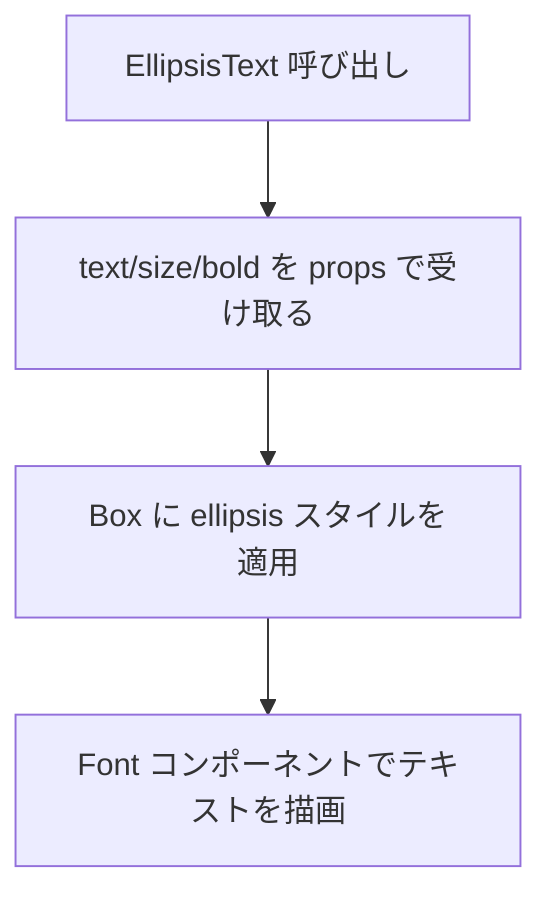
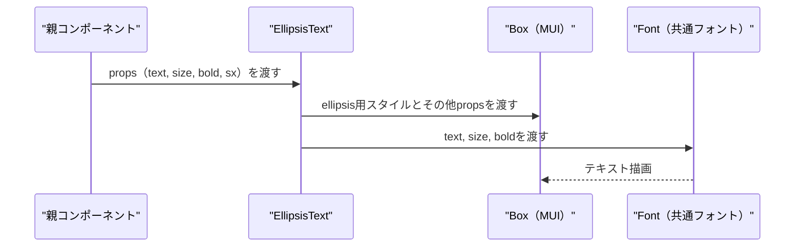

## 📄 EllipsisText モジュール仕様書

## 1. モジュール概要

### 1-1. 目的
このモジュールは、文字列を 1 行で省略（ellipsis）表示するためのラッパーコンポーネントである。任意のフォントサイズ・太さを指定可能で、幅を超えるテキストは "..." で自動的に省略表示される。

### 1-2. 適用範囲
- ラベルやカラム名など、限られた幅に収めたい文字列表示箇所
- 固定サイズや可変幅の UI 内でのテキストの省略表示
- レスポンシブ対応で可読性と情報量の両立を図る UI パーツ
---

## 2. 設計方針

### 2-1. アーキテクチャ構成
- React Functional Component として定義
- MUI の Box を基盤とし、CSS の textOverflow: ellipsis 機能を活用
- カスタムフォントコンポーネント FontBase を内包：共通の文字サイズ・フォント設定を委譲

### 2-2. 使用技術・依存
- React 18+, TypeScript
- Material UI (MUI)
- 自作フォントコンポーネント：@base/Font/FontBase
---

## 3. 📂 フォルダ構成とファイルの役割

```plaintext
src/
└── components/
└── functional/
    └── EllipsisText.tsx // 本モジュール本体
```
---
## 4. 📌 コンポーネント説明

### EllipsisText.tsx

**役割：** 
幅制限のある領域内で、テキストを 1 行表示にし、省略記号（…）を自動付加する表示専用コンポーネント。

Props 定義：

| 名前      | 型         | デフォルト | 説明                                     |
| --------- | ---------- | ---------- | ---------------------------------------- |
| `text`    | `string`   | ―          | 表示するテキスト内容                     |
| `size`    | `number`   | `14`       | `Font` に渡す文字サイズ（px 単位）       |
| `bold`    | `boolean`  | `false`    | 太字にするかどうかを制御                 |
| `sx`      | `SxProps`  | ―          | MUI のカスタムスタイル指定（Box に適用） |
| `...rest` | `BoxProps` | ―          | その他 `Box` に渡せる任意のプロパティ    |

**処理概要:** 
テキストを Box 内に配置し、以下のスタイルを固定適用
- overflow: hidden
- whiteSpace: nowrap
- textOverflow: ellipsis
- Font コンポーネントでラップし、フォントサイズ・太さを個別に制御可能

```ts
<!-- INCLUDE:FE\spa-next\my-next-app\src\components\functional\EllipsisText.tsx -->
```

---
## 5. 🧭 処理フロー図



---
## 6. 🔁 処理シーケンス図


---
