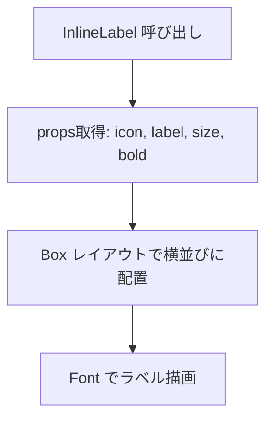
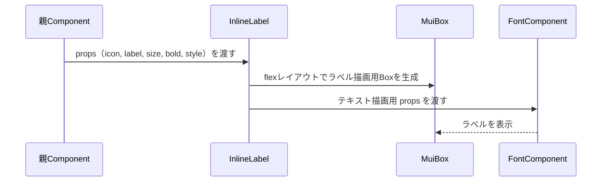

## 📄 InlineLabel モジュール仕様書
## 1. モジュール概要

### 1-1. 目的
このモジュールは、アイコンとテキストラベルを横並びで表示するための軽量な表示専用コンポーネントである。表示内容のカスタマイズ性が高く、シンプルなラベル付きUIパーツとして利用される。

### 1-2. 適用範囲
- ラベル付きアイコン表示（例：通知、ユーザー、状態表示）
- 設定項目、フォームの見出し、メタ情報の付属表示
- フレックスレイアウトでのコンパクトな情報表示ブロック

---
## 2. 設計方針
### 2-1. アーキテクチャ構成
- React Functional Component として実装
- MUIの Box コンポーネント を使用して横並び表示
- 共通フォントコンポーネント FontBase を使用
- アイコンを任意の ReactNode として挿入可能

### 2-2. 使用技術・依存
- React 18+, TypeScript
- Material UI (@mui/material)
- 自作コンポーネント：@base/Font/FontBase

---
## 3. 📂 フォルダ構成とファイルの役割

```plaintext
src/
└── components/
    └── functional/
        └── InlineLabel.tsx        // 本モジュール本体
```

---
## 4. 📌 コンポーネント説明
### InlineLabel.tsx

**役割：**
任意のアイコンとテキストラベルを横並びで表示し、サイズやフォント太さ、クラス名やスタイルなどを柔軟に調整できるユーティリティ表示部品。

**Props定義：**

| 名前          | 型                     | デフォルト   | 説明                        |
| ----------- | --------------------- | ------- | ------------------------- |
| `icon`      | `React.ReactNode`     | ―       | 任意のアイコンノード。テキストの左側に表示される。 |
| `label`     | `string`              | ―       | 表示するテキスト                  |
| `size`      | `number`              | `14`    | テキストのフォントサイズ（px）          |
| `bold`      | `boolean`             | `false` | テキストを太字にするかどうか            |
| `className` | `string`              | ―       | テキストラベルに適用される追加クラス名       |
| `style`     | `React.CSSProperties` | ―       | テキストラベルに適用されるインラインスタイル    |

**実装概要：**
- Box に display="flex" と alignItems="center" を指定し、横並び＋縦中央揃え
- gap={1} によりアイコンとテキストに適度な間隔を追加
- Font コンポーネントでサイズ・太さを柔軟に設定可能
<!-- INCLUDE:FE\spa-next\my-next-app\src\components\functional\InlineLabel.tsx -->

---
## 5. 🧭 処理フロー図



---
## 6. 🔁 処理シーケンス図

