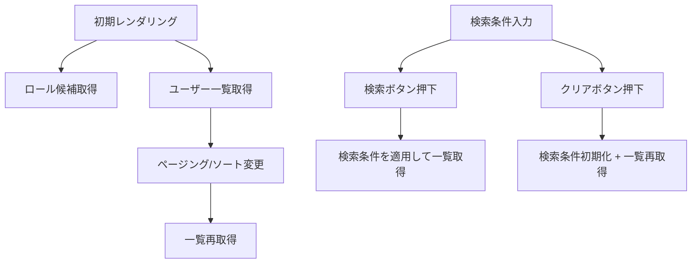

## ユーザー一覧ページ（共通）モジュール仕様書

## 1. モジュール概要

### 1-1. 目的
本モジュールは、ユーザー一覧を検索・表示し、詳細画面へ遷移するための一覧ページコンポーネントである。検索条件、ソート、ページングのUIを提供し、一覧取得とロール候補取得のAPI呼び出しを行う。

### 1-2. 適用範囲
- 管理者向けユーザー一覧画面
- 一般ユーザー向けユーザー一覧画面（同一仕様の場合）

---

## 2. 設計方針

### 2-1. アーキテクチャ構成
- React Functional Component による構成
- 一覧表示は `ControllableListView` を利用し、外部状態管理でページング/ソートを制御
- 検索条件は `FormRow` + `TextBox`/`DropBox` で構成
- API呼び出しは `getUserListApi` / `getRoleDropdownApi` を使用
- エラー通知は `useSnackbar` を使用

### 2-2. 使用技術・依存
- React / Next.js（`useRouter` による詳細遷移）
- `ControllableListView`
- base 入力/ボタン（`FormRow`, `TextBox`, `DropBox`, `ButtonBase`）
- `useSnackbar`
- `getUserListApi`, `getRoleDropdownApi`

---

## 3. フォルダ構成とファイルの役割

```plaintext
src/
└── components/
    └── functional/
        └── UserListPage.tsx  // ユーザー一覧ページ本体
```

---

## 4. コンポーネント詳細

### UserListPage.tsx

**役割:**
- 検索条件の入力と適用
- ユーザー一覧の取得・表示
- ページング/ソートのUI制御
- 詳細画面への遷移

**主要な状態:**

| 変数名 | 役割 |
| --- | --- |
| `searchCondition` | 入力中の検索条件 |
| `appliedCondition` | 適用中の検索条件 |
| `tableState` | ページ番号/件数/ソート状態 |
| `rows` | 一覧データ |
| `totalCount` | 総件数 |
| `loading` | 一覧取得中フラグ |
| `roleOptions` | ロール選択肢 |
| `statusOptions` | ステータス選択肢（現状は初期値のみ） |

**検索条件:**
- `userName`
- `email`
- `role`
- `status`

```ts
<!-- INCLUDE:FE\spa-next\my-next-app\src\components\functional\UserListPage.tsx -->
```

---

## 5. 処理フロー図



---

## 6. 制約・要確認事項
- 詳細遷移先は `/user/detail?id=...` を使用（現行実装）。
- `email` / `status` の検索条件はUIに存在するが、APIパラメータへの連携は要確認。
- ソート条件（`sortKey` / `sortOrder`）のAPI連携は要確認。
- ステータス選択肢の取得方法は要確認（現行は初期値のみ）。

