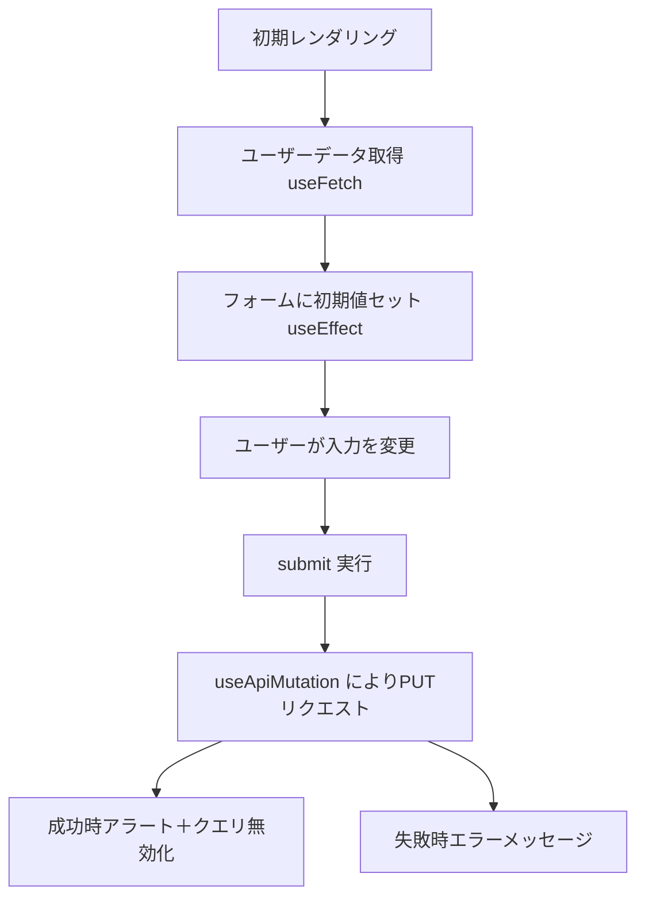

## ユーザー情報更新フォーム モジュール仕様書
## 1. モジュール概要
### 1-1. 目的
本モジュールは、ユーザーのプロフィール情報（名前・メールアドレス）を表示・編集・更新するフォームコンポーネントである。サーバーから現在のプロフィールを取得し、ユーザーが変更・送信することでバックエンドに反映する。

### 1-2. 適用範囲
自分のユーザー情報の参照・編集機能を提供

プロフィール編集画面に組み込む単位コンポーネント

クエリキャッシュの更新やローディング状態・エラー処理の表示も対応

---
## 2. 設計方針
2-1. アーキテクチャ
React Functional Component による構成
UserUpdateForm は状態管理とフォーム制御を行う関数型コンポーネントである。

React Query を利用した非同期処理

useFetch：初期プロフィールデータの取得

useApiMutation：ユーザー情報の PUT 更新リクエスト

queryClient.invalidateQueries によりキャッシュの自動リフェッチを行う

useState + useEffect による状態初期化と変更検知
ユーザー情報を取得した後に name / email に反映する。

ユーザーフィードバック
成功・失敗時のアラート表示により操作結果を明示。

---
### 3. 📂 フォルダ構成とファイルの役割
ユーザー情報更新フォーム モジュール仕様書（INCLUDEタグ付き）

```plaintext
src/
└── components/
    └── UserUpdateForm.tsx  // ユーザー情報の取得・更新フォーム
```

---
### 4. 📌 コンポーネント詳細
### UserUpdateForm.tsx

**役割：**
- 現在のユーザー情報を取得（GET）
- フォームとして編集可能に表示
- 変更内容を送信（PUT）
- 成功時は通知とキャッシュ無効化、失敗時はエラーメッセージ表示

**主要props / state：（内部状態のため外部propsなし）**

| 変数名         | 役割                               |
| ----------- | -------------------------------- |
| `name`      | ユーザーの名前入力値                       |
| `email`     | ユーザーのメールアドレス入力値                  |
| `mutation`  | PUT更新処理を行う useApiMutation オブジェクト |
| `user`      | 現在のユーザー情報（取得データ）                 |
| `isLoading` | データ取得中フラグ                        |
| `error`     | データ取得エラー情報                       |

```js
<!-- INCLUDE:FE\spa-next\my-next-app\src\components\UserUpdateForm.tsx -->
```

---
### 5. 🔁 処理フロー図

