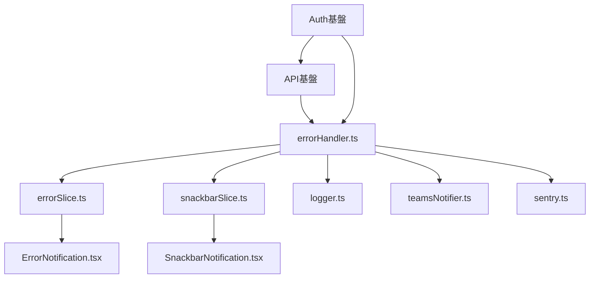
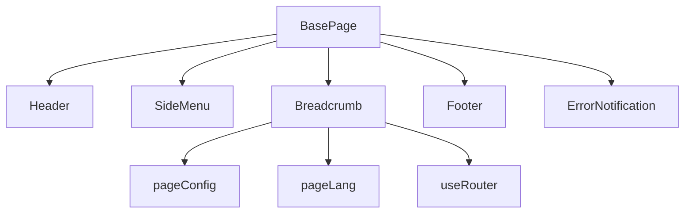
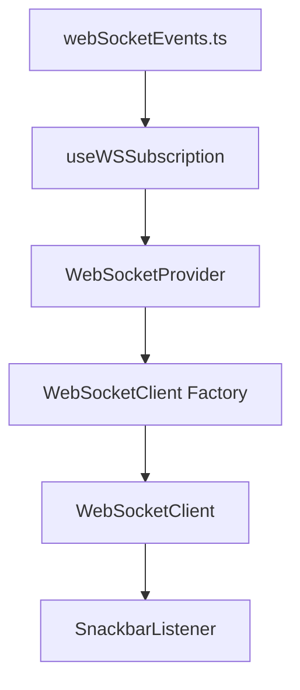

# dependency-map

## 目的
既存モジュール同士の依存関係と導入前提を整理し、再利用コストを判断できるようにする。

## 参照元
- `DOC/1_DesignDocument/1-1_BaseDocs/FE/02_application-foundation/APIConnectModule.md`
- `DOC/1_DesignDocument/1-1_BaseDocs/FE/02_application-foundation/AuthModule.md`
- `DOC/1_DesignDocument/1-1_BaseDocs/FE/02_application-foundation/ErrorHandle.md`
- `DOC/1_DesignDocument/1-1_BaseDocs/FE/02_application-foundation/logModule.md`
- `DOC/1_DesignDocument/1-1_BaseDocs/FE/02_application-foundation/SnackBar.md`
- `DOC/1_DesignDocument/1-1_BaseDocs/FE/modules/composite/layout/BasePage.md`
- `DOC/1_DesignDocument/1-1_BaseDocs/FE/modules/composite/navigation/Header.md`
- `DOC/1_DesignDocument/1-1_BaseDocs/FE/modules/composite/navigation/SideMenu.md`
- `DOC/1_DesignDocument/1-1_BaseDocs/FE/modules/composite/navigation/Breadcrumb.md`
- `DOC/1_DesignDocument/1-1_BaseDocs/FE/modules/composite/navigation/Footer.md`
- `DOC/1_DesignDocument/1-1_BaseDocs/FE/modules/base/input/DatePicker.md`
- `DOC/1_DesignDocument/1-1_BaseDocs/FE/modules/functional/form/UserUpdateForm.md`
- `DOC/1_DesignDocument/1-1_BaseDocs/FE/modules/functional/display/UserListPage.md`
- `DOC/1_DesignDocument/1-1_BaseDocs/FE/03_realtime/websocket/GlobalWebsocket.md`
- `DOC/1_DesignDocument/1-1_BaseDocs/FE/03_realtime/websocket/webSocketFront.md`
- `DOC/1_DesignDocument/1-1_BaseDocs/FE/04_features/file-handling/FileImport.md`

## 更新ルール
- 参照元の依存関係・構成・責務・制約が更新されたら本資料を更新する。
- 新規モジュール追加や既存モジュールの統合・分割が発生したら依存表と依存マップを更新する。
- 「要確認」項目に根拠が追記されたら、該当箇所を反映する。

---

## 1. 目的
- 再利用判断に必要な依存関係・前提条件・影響範囲を横断整理する。
- 依存の強さを明確化し、導入コストと置換難度の見積りを可能にする。

## 2. 依存関係の見方
- 依存先: モジュール、フック、Slice、設定ファイル、外部ライブラリ、環境変数を含む。
- 依存の強さ: 強依存=欠けると成立しない; 弱依存=一部機能が落ちる; 任意=用途次第で不要。
- 単独利用可否: 依存を満たさずに単独で利用できるか。根拠が無い場合は「要確認」。
- 置換困難性: 依存先を差し替える際の影響度。根拠が無い場合は「要確認」。
- 影響範囲: 依存が変わった場合に波及する機能・UI・モジュール範囲。
- 「要確認」: 参照元に明記がない事項は推測せず「要確認」とする。

## 3. 横断基盤の依存マップ

### 依存表
| 対象 | 主な依存先 | 依存の強さ | 根拠 |
| --- | --- | --- | --- |
| API接続基盤 | `apiClient.ts`, `apiService.ts`, `services/*`, `useApi.ts`, `cacheStrategies.ts`, `errorHandler.ts` | 強依存 | APIConnectModule.md |
| Auth基盤 | `apiClient.ts`, `authService.ts`, `authSlice.ts`, `useAuth.ts`, `ProtectedRoute.tsx`, `pageConfig.ts` | 強依存 | AuthModule.md |
| ErrorHandle | `errorHandler.ts`, `errorSlice.ts`, `snackbarSlice.ts`, `ErrorNotification.tsx`, `ErrorBoundary.tsx` | 強依存 | ErrorHandle.md |
| Logモジュール | `logger.ts`, `teamsNotifier.ts`, `sentry.ts`, `errorHandler.ts` | 強依存 | logModule.md |
| SnackBar | `snackbarSlice.ts`, `useSnackbar.ts`, `SnackbarNotification.tsx` | 強依存 | SnackBar.md |

### API接続基盤（APIConnectModule）
- 責務: API呼び出しの統一、エラー処理の集約、キャッシュ戦略の適用、React Query連携。
- 依存先: `apiClient.ts`, `apiService.ts`, `services/v1/*`, `useApi.ts`, `cacheStrategies.ts`, `errorHandler.ts`, React Query, Axios。
- 依存理由: 全APIリクエストを `apiService.ts` 経由に統一し、`apiClient.ts` のインターセプターで `handleApiError` を呼び出し、`useApi.ts` で取得/更新を一元管理し、`cacheStrategies.ts` を適用するため。
- 依存の強さ: `apiClient.ts`=強依存; `apiService.ts`=強依存; `services/v1/*`=強依存; `useApi.ts`=強依存; `cacheStrategies.ts`=強依存; `errorHandler.ts`=強依存; React Query=強依存; Axios=強依存。
- 導入前提: `NEXT_PUBLIC_API_BASE_URL` / `NEXT_PUBLIC_API_TIMEOUT` / `NEXT_PUBLIC_API_VERSION` などの環境変数設定; React Query導入。
- 入出力: 入力=APIリクエスト; 出力=APIレスポンス/エラー。詳細=要確認。
- 制約: すべてのAPIリクエストは `apiService.ts` を経由; API関連エラー処理は `apiClient.ts` → `errorHandler.ts` に集約; キャッシュ戦略は `cacheStrategies.ts` で管理。
- 利用条件: 認証情報（JWT）を `Authorization` ヘッダーに付与; React Query の `staleTime` / `cacheTime` 設定。
- 禁止事項: API関連の個別エラー処理は記述しない（`errorHandler.ts` に集約）。
- 単独利用可否: 要確認。
- 置換困難性: 要確認。
- 影響範囲: すべてのAPI呼び出し、認証系サービス、エラーハンドリング、キャッシュ戦略。

### Auth基盤（AuthModule）
- 責務: 認証/認可の状態管理、権限制御、ProtectedRouteによるルート制御。
- 依存先: `apiClient.ts`, `authService.ts`, `apiService.ts`, `authSlice.ts`, `useAuth.ts`, `ProtectedRoute.tsx`, `pageConfig.ts`, `errorHandler.ts`, `errorSlice.ts`, `snackbarSlice.ts`。
- 依存理由: 認証API呼び出しを `apiClient.ts`/`authService.ts` 経由で実行し、認証状態は `authSlice.ts`/`useAuth.ts` で管理し、権限は `pageConfig.ts` の `requiredPermission` を参照して `ProtectedRoute.tsx` で制御するため。
- 依存の強さ: `apiClient.ts`=強依存; `authService.ts`=強依存; `authSlice.ts`=強依存; `useAuth.ts`=強依存; `ProtectedRoute.tsx`=強依存; `pageConfig.ts`=強依存; `errorHandler.ts`=強依存; `errorSlice.ts`=強依存; `snackbarSlice.ts`=強依存。
- 導入前提: `httpOnly` Cookie運用; CSRF-Token運用; Next.js環境。
- 入出力: 入力=`/auth/login` 等の認証情報; 出力=認証状態/権限情報。詳細=要確認。
- 制約: APIエラーは `errorHandler.ts` 経由; `ProtectedRoute.tsx` は `pageConfig.ts` の `requiredPermission` を参照。
- 利用条件: `useAuth.ts` で認証状態を参照; 認証APIは `apiService.ts` 経由。
- 禁止事項: 要確認。
- 単独利用可否: 要確認。
- 置換困難性: 要確認。
- 影響範囲: ログイン/ログアウト/権限制御、保護ルート、メニュー表示（SideMenu）。

### ErrorHandle
- 責務: API/フロントエンドエラーの集約、UI通知、ログ出力。
- 依存先: `errorHandler.ts`, `errorSlice.ts`, `snackbarSlice.ts`, `useError.ts`, `ErrorBoundary.tsx`, `ErrorNotification.tsx`, `SnackbarNotification.tsx`, `logger.ts`, `teamsNotifier.ts`, `sentry.ts`。
- 依存理由: APIエラーを `errorHandler.ts` に集約し、Redux（`errorSlice.ts`/`snackbarSlice.ts`）を通じて `ErrorNotification` / `SnackbarNotification` を表示し、ログは `logger.ts` / `teamsNotifier.ts` / `sentry.ts` に送信するため。
- 依存の強さ: `errorHandler.ts`=強依存; `errorSlice.ts`=強依存; `snackbarSlice.ts`=強依存; `ErrorNotification.tsx`=強依存; `ErrorBoundary.tsx`=強依存; `SnackbarNotification.tsx`=強依存; `logger.ts`=強依存; `teamsNotifier.ts`=弱依存; `sentry.ts`=弱依存。
- 導入前提: Reduxストア; `TEAMS_WEBHOOK_URL` / `NEXT_PUBLIC_SENTRY_DSN` 等の環境変数設定。
- 入出力: 入力=API/フロントエンドの例外情報; 出力=UI通知/ログ送信。詳細=要確認。
- 制約: APIエラー処理は `errorHandler.ts` に集約; UI通知は Redux を介して表示。
- 利用条件: `useError.ts` でエラー状態を参照・制御。
- 禁止事項: 要確認。
- 単独利用可否: 要確認。
- 置換困難性: 要確認。
- 影響範囲: 全APIエラー、フロントエンド例外、通知UI、ログ基盤。

### Logモジュール
- 責務: エラーや重要イベントのログ記録、外部通知。
- 依存先: `logger.ts`, `teamsNotifier.ts`, `sentry.ts`, `errorHandler.ts`, `errorSlice.ts`, `snackbarSlice.ts`, `ErrorBoundary.tsx`, `ErrorNotification.tsx`, `SnackbarNotification.tsx`。
- 依存理由: `errorHandler.ts` 経由でログ出力を統一し、Teams/Sentry に通知し、必要に応じてUI通知も連携するため。
- 依存の強さ: `logger.ts`=強依存; `teamsNotifier.ts`=弱依存; `sentry.ts`=弱依存; `errorHandler.ts`=強依存; UI通知関連=弱依存。
- 導入前提: `TEAMS_WEBHOOK_URL` / `NEXT_PUBLIC_SENTRY_DSN` / `LOG_LEVEL` 等の環境変数設定。
- 入出力: 入力=エラーデータ/ログメッセージ; 出力=Teams/Sentry/consoleログ。詳細=要確認。
- 制約: 500系など重要エラーは Teams 送信を行う設計。
- 利用条件: `errorHandler.ts` を通じたログ送信。
- 禁止事項: 要確認。
- 単独利用可否: 要確認。
- 置換困難性: 要確認。
- 影響範囲: エラーログの送信先・運用監視。

### SnackBar
- 責務: スナックバー通知の統一表示。
- 依存先: `snackbarSlice.ts`, `useSnackbar.ts`, `SnackbarNotification.tsx`, Reduxストア。
- 依存理由: Reduxで状態を保持し、`useSnackbar.ts` 経由で表示/非表示を制御し、`SnackbarNotification.tsx` でUI表示するため。
- 依存の強さ: `snackbarSlice.ts`=強依存; `useSnackbar.ts`=強依存; `SnackbarNotification.tsx`=強依存。
- 導入前提: Reduxストア導入。
- 入出力: 入力=メッセージ/種別; 出力=通知UI。詳細=要確認。
- 制約: 通知状態は Redux を通じて管理。
- 利用条件: `showSnackbar` / `hideSnackbar` の利用。
- 禁止事項: 要確認。
- 単独利用可否: 要確認。
- 置換困難性: 要確認。
- 影響範囲: 全通知UI、エラー/成功/警告の表示。

### Auth / Error / Log 横断関係

## 4. layout/navigation 系の依存マップ

### 依存表
| 対象 | 主な依存先 | 依存の強さ | 根拠 |
| --- | --- | --- | --- |
| BasePage | `Header`, `SideMenu`, `Breadcrumb`, `Footer`, `ErrorNotification`, `useLanguage`, `useRouter` | 強依存 | BasePage.md |
| Header | MUI `AppBar`/`Toolbar`/`Typography`, `header.lang.ts`, `useLanguage`, FontAwesome | 強依存 | Header.md |
| SideMenu | `useAuth`, `pageConfig.tsx`, `pageLang.ts`, `useLanguage`, MUI `Drawer`等 | 強依存 | SideMenu.md |
| Breadcrumb | `useRouter`, `pageConfig.tsx`, `pageLang.ts`, `useLanguage`, MUI `Breadcrumbs` | 強依存 | Breadcrumb.md |
| Footer | MUI `Box`/`Container`/`Typography`, `footer.lang.ts`, `useLanguage` | 強依存 | Footer.md |

### BasePage（modules/composite/layout）
- 責務: ヘッダー/サイドメニュー/パンくず/フッター/通知を統合した共通レイアウトの提供。
- 依存先: `Header`, `SideMenu`, `Breadcrumb`, `Footer`, `ErrorNotification`, `useLanguage`, `useRouter`, MUI `Box`。
- 依存理由: 共通レイアウトの各要素をBasePage内で配置し、言語設定とルーティングを適用するため。
- 依存の強さ: `Header`=強依存; `SideMenu`=強依存; `Breadcrumb`=強依存; `Footer`=強依存; `ErrorNotification`=強依存; `useLanguage`=強依存; `useRouter`=強依存; MUI `Box`=強依存。
- 導入前提: `useLanguage` による `header.lang.ts` / `footer.lang.ts` の読込; Next.js `useRouter`。
- 入出力: 入力=`children`; 出力=共通レイアウトUI。
- 制約: Header/SideMenu/Breadcrumb/Footers/通知領域を必ず配置する構成。
- 利用条件: ページ共通レイアウトとして利用。
- 禁止事項: 要確認。
- 単独利用可否: 要確認。
- 置換困難性: 要確認。
- 影響範囲: BasePage利用ページ全体のレイアウト構成。

### Header（modules/composite/navigation）
- 責務: グローバルヘッダーUIの表示、ロゴ/ユーザー操作の入口提供。
- 依存先: MUI `AppBar`/`Toolbar`/`Typography`, FontAwesome, `header.lang.ts`, `useLanguage`, `color.ts`。
- 依存理由: UI表示と多言語対応、スタイル適用のため。
- 依存の強さ: MUI=強依存; FontAwesome=強依存; `header.lang.ts`=強依存; `useLanguage`=強依存; `color.ts`=強依存。
- 導入前提: `header.lang.ts` の言語定義; `useLanguage` の利用。
- 入出力: 入力=`language` / `onLogoClick` / `onSettingsClick`; 出力=ヘッダーUI。
- 制約: `language` でタイトル/ユーザー名/ロゴURL等を注入する設計。
- 利用条件: ロゴクリック・設定クリックのコールバックを渡す。
- 禁止事項: 要確認。
- 単独利用可否: 要確認。
- 置換困難性: 要確認。
- 影響範囲: 画面上部の共通表示/遷移。

### SideMenu（modules/composite/navigation）
- 責務: 権限に応じたメニュー生成と折りたたみ表示。
- 依存先: `useAuth`, `pageConfig.tsx`, `pageLang.ts`, `useLanguage`, MUI `Drawer`/`Collapse`/`ListItemButton`/`IconButton`, `color.ts`。
- 依存理由: 権限情報の取得、メニュー構造/表示名/アイコンの取得、UI表示のため。
- 依存の強さ: `useAuth`=強依存; `pageConfig.tsx`=強依存; `pageLang.ts`=強依存; `useLanguage`=強依存; MUI=強依存; `color.ts`=強依存。
- 導入前提: `pageConfig.tsx` の `permissionTargetKey` / `langKey` 定義; Auth基盤。
- 入出力: 入力=権限情報（`useAuth` 経由）; 出力=メニューUI。
- 制約: `pageConfig.tsx` の構造に依存してフィルタリング。
- 利用条件: 権限に応じたメニュー制御が必要な画面で利用。
- 禁止事項: 要確認。
- 単独利用可否: 要確認。
- 置換困難性: 要確認。
- 影響範囲: サイドメニュー表示、権限制御のUI。

### Breadcrumb（modules/composite/navigation）
- 責務: 現在ページに対応するパンくず表示。
- 依存先: `useRouter`, `pageConfig.tsx`, `pageLang.ts`, `useLanguage`, MUI `Breadcrumbs`/`Typography`/`Link`。
- 依存理由: 現在の `pathname` 取得と `pageConfig` の `breadcrumb`/`parentId` 参照、`pageLang` でラベル表示するため。
- 依存の強さ: `useRouter`=強依存; `pageConfig.tsx`=強依存; `pageLang.ts`=強依存; `useLanguage`=強依存; MUI=強依存。
- 導入前提: `pageConfig.tsx` の breadcrumb 定義; `pageLang.ts` の `langKey` 定義。
- 入出力: 入力=現在URL; 出力=パンくずUI。
- 制約: `breadcrumb.parentId` を再帰的に辿る設計。
- 利用条件: `pageConfig` / `pageLang` に対応情報があること。
- 禁止事項: 要確認。
- 単独利用可否: 要確認。
- 置換困難性: 要確認。
- 影響範囲: ナビゲーション表示全体。

### Footer（modules/composite/navigation）
- 責務: フッターUIとコピーライト表示。
- 依存先: MUI `Box`/`Container`/`Typography`, `footer.lang.ts`, `useLanguage`, `color.ts`。
- 依存理由: UI表示と多言語対応のため。
- 依存の強さ: MUI=強依存; `footer.lang.ts`=強依存; `useLanguage`=強依存; `color.ts`=強依存。
- 導入前提: `footer.lang.ts` の言語定義; `useLanguage` の利用。
- 入出力: 入力=`language` / `onClick`; 出力=フッターUI。
- 制約: `language` を注入して文言表示。
- 利用条件: クリック時の遷移処理は呼び出し元で設定。
- 禁止事項: 要確認。
- 単独利用可否: 要確認。
- 置換困難性: 要確認。
- 影響範囲: 画面下部の共通表示。

### layout/navigation 重点対象（BasePage → Header / SideMenu / Breadcrumb / Footer / ErrorNotification）

## 5. form/input 系の依存マップ

### 依存表
| 対象 | 主な依存先 | 依存の強さ | 根拠 |
| --- | --- | --- | --- |
| DatePicker | MUI `DatePicker`, `LocalizationProvider`, `AdapterDayjs`, `dayjs` | 強依存 | DatePicker.md |
| UserUpdateForm | `useFetch`, `useApiMutation`, `queryClient`, `useState`/`useEffect` | 強依存 | UserUpdateForm.md |

### DatePicker（modules/base/input）
- 責務: 日付入力UIの提供とバリデーション支援。
- 依存先: MUI `DatePicker`, `FormControl`, `LocalizationProvider`, `AdapterDayjs`, `dayjs`。
- 依存理由: MUIのDatePickerとDayjsで日付入力・表示を実現するため。
- 依存の強さ: MUI DatePicker=強依存; `LocalizationProvider`=強依存; `AdapterDayjs`=強依存; `dayjs`=強依存。
- 導入前提: MUI + Dayjs 環境; `LocalizationProvider` 設定。
- 入出力: 入力=`value`/`minDate`/`maxDate`/`allowedDaysOfWeek`/`onBlur`; 出力=`onChange` コールバック。
- 制約: `allowedDaysOfWeek` により選択可能日を制限; `onBlur` でバリデーション想定。
- 利用条件: MUIのDatePickerが利用可能な構成。
- 禁止事項: 要確認。
- 単独利用可否: 要確認。
- 置換困難性: 要確認。
- 影響範囲: 日付入力UI。

### UserUpdateForm（modules/functional/form）
- 責務: ユーザー情報の取得/更新フォームと入力制御。
- 依存先: `useFetch`, `useApiMutation`, `queryClient.invalidateQueries`, `useState`, `useEffect`。
- 依存理由: React Queryを用いた取得/更新とキャッシュ更新を行うため。
- 依存の強さ: `useFetch`=強依存; `useApiMutation`=強依存; `queryClient.invalidateQueries`=強依存; React=強依存。
- 導入前提: React Query導入; API接続基盤。
- 入出力: 入力=ユーザー名/メール等のフォーム値; 出力=PUT更新とUI反映。詳細=要確認。
- 制約: 更新後に `queryClient.invalidateQueries` を実行して再取得。
- 利用条件: ユーザー情報の取得APIと更新APIが利用可能であること。
- 禁止事項: 要確認。
- 単独利用可否: 要確認。
- 置換困難性: 要確認。
- 影響範囲: ユーザー更新画面の入力・更新処理。

## 6. list/search 系の依存マップ

### 依存表
| 対象 | 主な依存先 | 依存の強さ | 根拠 |
| --- | --- | --- | --- |
| UserListPage | `ControllableListView`, `FormRow`, `TextBox`, `DropBox`, `ButtonBase`, `useSnackbar`, `getUserListApi`, `getRoleDropdownApi`, `useRouter` | 強依存 | UserListPage.md |

### UserListPage（modules/functional/display）
- 責務: ユーザー一覧の検索/表示/ページング/詳細遷移。
- 依存先: `ControllableListView`, `FormRow`, `TextBox`, `DropBox`, `ButtonBase`, `useSnackbar`, `getUserListApi`, `getRoleDropdownApi`, `useRouter`。
- 依存理由: 一覧UIと検索入力を共通部品で構成し、APIから一覧/ロール候補を取得し、詳細遷移を行うため。
- 依存の強さ: `ControllableListView`=強依存; `FormRow`/`TextBox`/`DropBox`/`ButtonBase`=強依存; `useSnackbar`=強依存; `getUserListApi`/`getRoleDropdownApi`=強依存; `useRouter`=強依存。
- 導入前提: ユーザー一覧APIとロール候補APIが利用可能であること; SnackBar基盤; Next.js Router。
- 入出力: 入力=検索条件/テーブル状態; 出力=一覧表示/詳細遷移。詳細=要確認。
- 制約: `email`/`status` の検索条件連携、`sortKey`/`sortOrder` のAPI連携は要確認。
- 利用条件: 一覧UIは `ControllableListView` を前提とする。
- 禁止事項: 要確認。
- 単独利用可否: 要確認。
- 置換困難性: 要確認。
- 影響範囲: ユーザー一覧画面の検索/表示/詳細遷移。

## 7. realtime 系の依存マップ

### 依存表
| 対象 | 主な依存先 | 依存の強さ | 根拠 |
| --- | --- | --- | --- |
| GlobalWebsocket | `_app.tsx`, `useGlobalWebSocket.ts`, `useWSSubscription.ts`, `wsSubscriptionsSlice.ts`, `notificationsSlice.ts`, `SnackbarListener.tsx` | 強依存 | GlobalWebsocket.md |
| WebSocket Front（Context-only） | `WebSocketProvider.tsx`, `webSocketClient.ts`, `useWSSubscription.ts`, `SnackbarListener.tsx`, `webSocketEvents.ts` | 強依存 | webSocketFront.md |

### GlobalWebsocket（Redux連携）
- 責務: アプリ全体で単一WebSocketを維持し、イベントをReduxへ連携する。
- 依存先: `_app.tsx`, `useGlobalWebSocket.ts`, `useWSSubscription.ts`, `wsSubscriptionsSlice.ts`, `notificationsSlice.ts`, `SnackbarListener.tsx`, `WebSocket`。
- 依存理由: アプリ起動時にWebSocketを初期化し、SliceにeventTypeと通知を蓄積しUIへ反映するため。
- 依存の強さ: `_app.tsx`=強依存; `useGlobalWebSocket.ts`=強依存; `useWSSubscription.ts`=強依存; `wsSubscriptionsSlice.ts`=強依存; `notificationsSlice.ts`=強依存; `SnackbarListener.tsx`=強依存。
- 導入前提: Reduxストア; WebSocket接続先; Snackbar通知。
- 入出力: 入力=WebSocketイベント; 出力=Redux state更新/通知UI。詳細=要確認。
- 制約: リスナーはBasePageに常駐する設計; eventType配列をSliceで管理。
- 利用条件: `_app.tsx` に永続リスナー配置。
- 禁止事項: 要確認。
- 単独利用可否: 要確認。
- 置換困難性: 要確認。
- 影響範囲: 全ページのリアルタイム通知。

### WebSocket Front（Context-only）
- 責務: Redux不要のContext-only WebSocket基盤を提供し、イベントハンドラと通知を管理する。
- 依存先: `WebSocketProvider.tsx`, `webSocketClient.ts`（ClientFactory）, `useWSSubscription.ts`, `SnackbarListener.tsx`, `webSocketEvents.ts`, `sockjs-client`, `@stomp/stompjs`。
- 依存理由: ProviderでClientFactoryを注入し、Hookで購読管理し、イベント定義を型で統一するため。
- 依存の強さ: Provider=強依存; ClientFactory=強依存; Hooks=強依存; SnackbarListener=強依存; Event定義=強依存; SockJS/STOMP=強依存。
- 導入前提: STOMP over WebSocket接続先; React Context運用。
- 入出力: 入力=WebSocketイベント; 出力=Context状態更新/通知UI。詳細=要確認。
- 制約: Context-onlyでRedux不要; ClientFactoryで接続/通知/ハンドラ機能を制御。
- 利用条件: `WebSocketProvider` 配下で `useWSSubscription` を使用。
- 禁止事項: 要確認。
- 単独利用可否: 要確認。
- 置換困難性: 要確認。
- 影響範囲: リアルタイム通知の購読/ハンドラ/通知UI。

### WebSocket 重点対象（Provider / ClientFactory / hooks / SnackbarListener / event definitions）

## 8. feature 系の依存マップ

### 依存表
| 対象 | 主な依存先 | 依存の強さ | 根拠 |
| --- | --- | --- | --- |
| FileImport | `useFileImport.ts`, `validateFileHeaders.ts`, `validateCsvRows.ts`, `validateExcelRows.ts`, `useSnackbar.ts`, `useValidationLang.ts`, `apiClient.post` | 強依存 | FileImport.md |

### FileImport（file-handling）
- 責務: CSV/Excel取込の検証とアップロード処理。
- 依存先: `useFileImport.ts`, `validateFileHeaders.ts`, `validateCsvRows.ts`, `validateExcelRows.ts`, `resolveSchema(kind)`, `HeaderDefinition`, `useSnackbar.ts`, `useValidationLang.ts`, `apiClient.post`。
- 依存理由: ファイル種別ごとにヘッダー/行検証を切替え、エラー通知とアップロード処理を行うため。
- 依存の強さ: `useFileImport.ts`=強依存; `validateFileHeaders.ts`=強依存; `validateCsvRows.ts`=強依存; `validateExcelRows.ts`=強依存; `useSnackbar.ts`=強依存; `useValidationLang.ts`=強依存; `apiClient.post`=強依存。
- 導入前提: 取込スキーマ（`HeaderDefinition[]`）が提供されること; API接続基盤。
- 入出力: 入力=CSV/Excelファイル, `HeaderDefinition[]`; 出力=検証結果/アップロード実行。詳細=要確認。
- 制約: `resolveSchema(kind)` によりスキーマ取得; エラーは `useSnackbar` で通知。
- 利用条件: 取込対象のスキーマ定義が必要。
- 禁止事項: 要確認。
- 単独利用可否: 要確認。
- 置換困難性: 要確認。
- 影響範囲: ファイル取込機能全体、通知UI。

## 9. 導入コスト観点の整理

### 導入コストの主要観点
- 状態管理: Reduxが前提のモジュール（ErrorHandle/SnackBar/GlobalWebsocket/Auth）を導入するか。
- ルーティング: Next.js `useRouter` 前提のモジュール（BasePage/Breadcrumb/Header/Footer）。
- i18n: `useLanguage` と `pageLang.ts`/`header.lang.ts`/`footer.lang.ts` の整備。
- 外部ライブラリ: MUI/Dayjs/React Query/Axios/SockJS/STOMP の導入。
- 運用連携: `TEAMS_WEBHOOK_URL` / `NEXT_PUBLIC_SENTRY_DSN` / `LOG_LEVEL` などの運用設定。

### 再利用しやすい依存構造
- Context-only WebSocket構成（Redux不要と明記）により状態管理依存が小さい構造。
- base/input の DatePicker は MUI + Dayjs 依存に集約された構造。

### 再利用しづらい依存構造
- BasePage は Header/SideMenu/Breadcrumb/Footer/ErrorNotification を必須構成として内包する構造。
- SideMenu/Breadcrumb は `pageConfig.tsx`/`pageLang.ts`/`useAuth` に強く依存する構造。
- ErrorHandle/Log は Redux + 外部通知（Teams/Sentry）に依存する構造。

### 先に整理が必要な箇所
- GlobalWebsocket（Redux連携）と WebSocket Front（Context-only）の適用境界: 併存/移行方針が要確認。
- Auth / Error / Log の横断関係: `errorHandler.ts` への依存集中点の運用方針が要確認。
- pageConfig/pageLang 依存の共通化: ルーティング/権限/多言語の前提整理が要確認。

## 10. 参照元一覧
- `DOC/1_DesignDocument/1-1_BaseDocs/FE/02_application-foundation/APIConnectModule.md`
- `DOC/1_DesignDocument/1-1_BaseDocs/FE/02_application-foundation/AuthModule.md`
- `DOC/1_DesignDocument/1-1_BaseDocs/FE/02_application-foundation/ErrorHandle.md`
- `DOC/1_DesignDocument/1-1_BaseDocs/FE/02_application-foundation/logModule.md`
- `DOC/1_DesignDocument/1-1_BaseDocs/FE/02_application-foundation/SnackBar.md`
- `DOC/1_DesignDocument/1-1_BaseDocs/FE/modules/composite/layout/BasePage.md`
- `DOC/1_DesignDocument/1-1_BaseDocs/FE/modules/composite/navigation/Header.md`
- `DOC/1_DesignDocument/1-1_BaseDocs/FE/modules/composite/navigation/SideMenu.md`
- `DOC/1_DesignDocument/1-1_BaseDocs/FE/modules/composite/navigation/Breadcrumb.md`
- `DOC/1_DesignDocument/1-1_BaseDocs/FE/modules/composite/navigation/Footer.md`
- `DOC/1_DesignDocument/1-1_BaseDocs/FE/modules/base/input/DatePicker.md`
- `DOC/1_DesignDocument/1-1_BaseDocs/FE/modules/functional/form/UserUpdateForm.md`
- `DOC/1_DesignDocument/1-1_BaseDocs/FE/modules/functional/display/UserListPage.md`
- `DOC/1_DesignDocument/1-1_BaseDocs/FE/03_realtime/websocket/GlobalWebsocket.md`
- `DOC/1_DesignDocument/1-1_BaseDocs/FE/03_realtime/websocket/webSocketFront.md`
- `DOC/1_DesignDocument/1-1_BaseDocs/FE/04_features/file-handling/FileImport.md`
