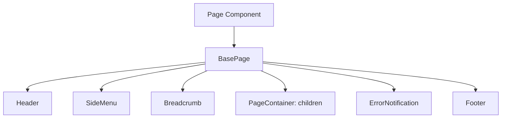
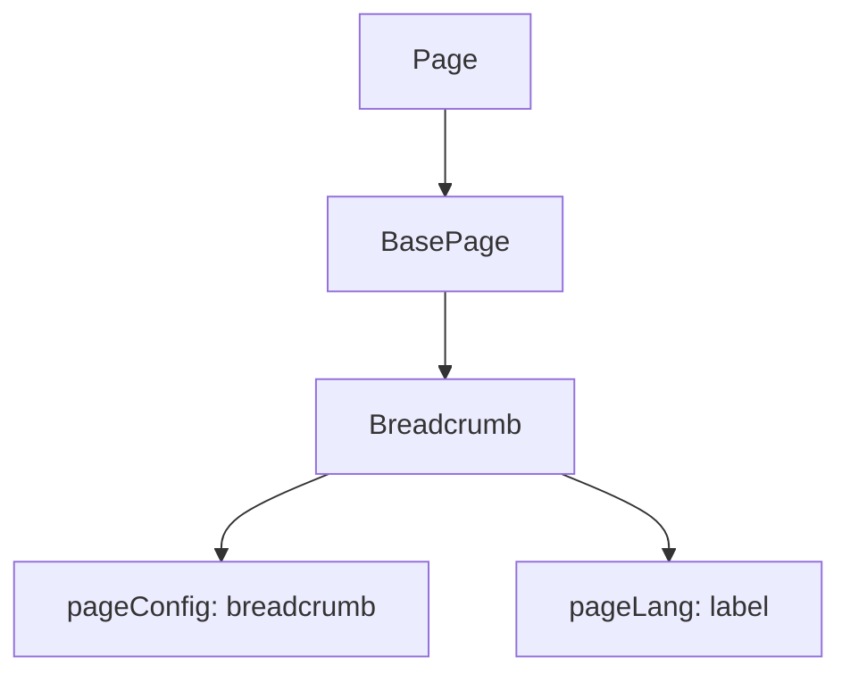
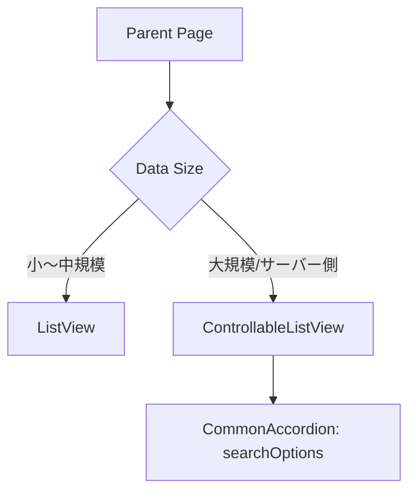
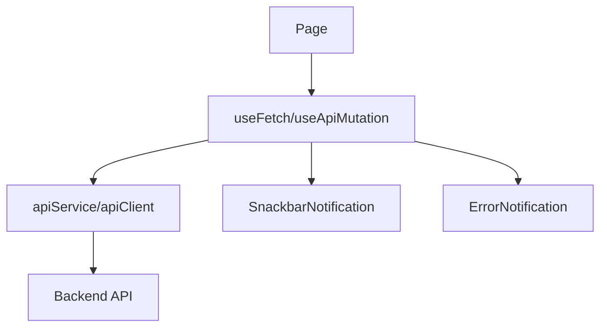
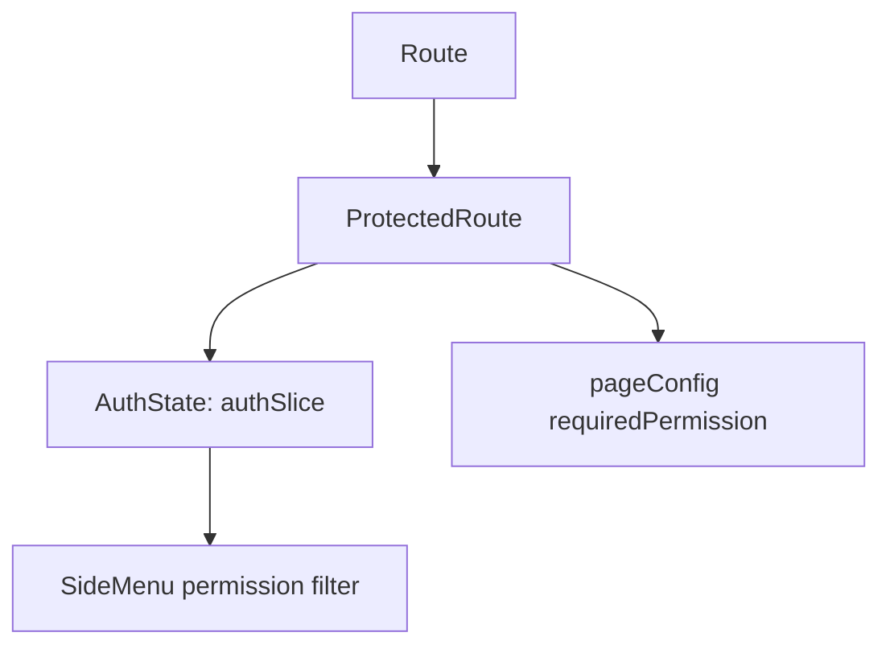
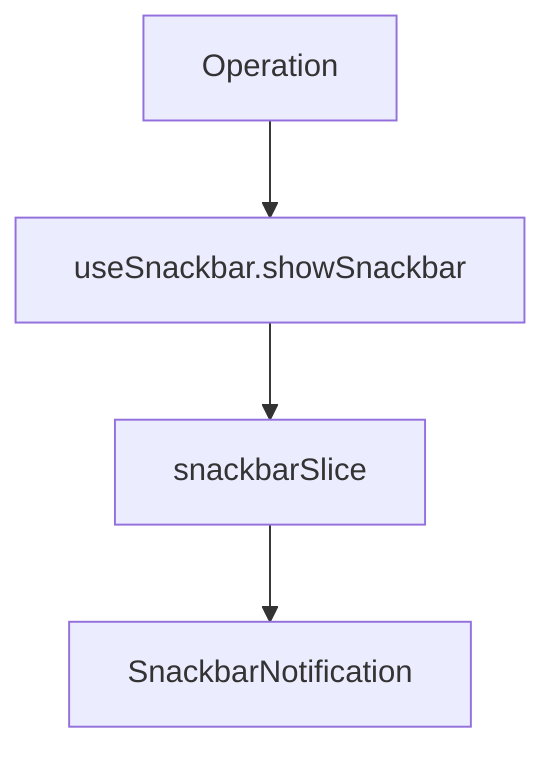
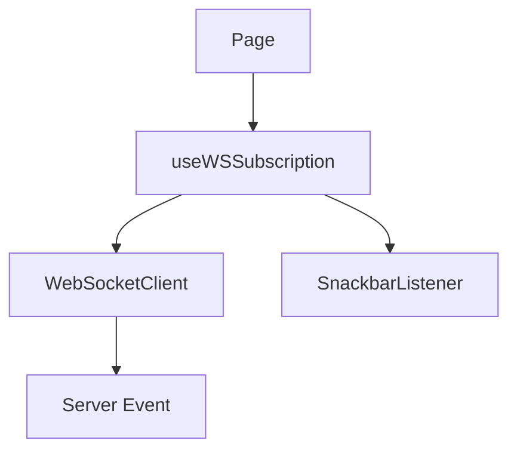
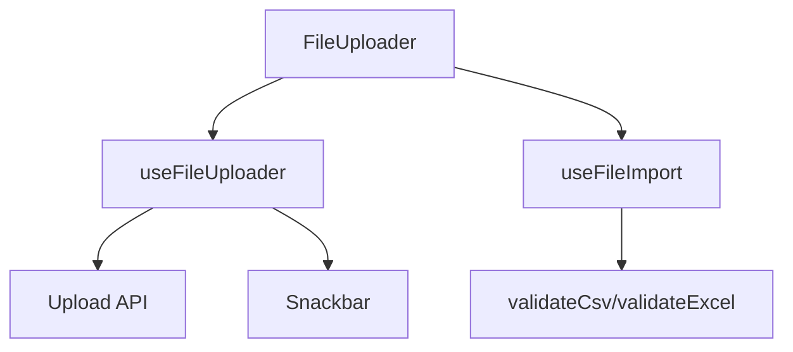
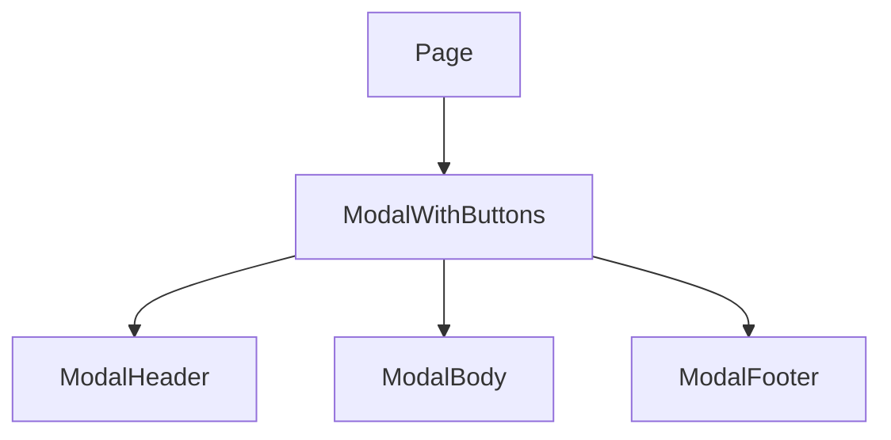

# 実装パターン集（既存資産再利用判断用）

## 目的
新機能を実装する際に、既存資産をどのように組み合わせるべきかの実装パターンを整理し、再利用判断に必要な観点（責務、依存、入出力、制約、利用条件、禁止事項）を明確化する。

## 参照元
- `DOC/1_DesignDocument/1-1_BaseDocs/FE/README.md`
- `DOC/1_DesignDocument/1-1_BaseDocs/FE/reuse/README.md`

## 更新ルール
- `DOC/1_DesignDocument/1-1_BaseDocs/FE/modules` の構成や各モジュール仕様が変更された場合に更新する。
- `DOC/1_DesignDocument/1-1_BaseDocs/FE/02_application-foundation`・`03_realtime`・`04_features` の基盤仕様が変わった場合に更新する。
- 参照している example が更新・廃止された場合は適合性を再評価し、要確認箇所を更新する。

---

## 1. 共通レイアウト付き通常ページ

### 目的
ヘッダー・フッター・サイドメニュー・パンくず・通知領域を統合した共通レイアウト上に、ページ固有の内容を配置する。

### 使う既存モジュール
- `DOC/1_DesignDocument/1-1_BaseDocs/FE/modules/composite/layout/BasePage.md`
- `DOC/1_DesignDocument/1-1_BaseDocs/FE/modules/composite/navigation/Header.md`
- `DOC/1_DesignDocument/1-1_BaseDocs/FE/modules/composite/navigation/Footer.md`
- `DOC/1_DesignDocument/1-1_BaseDocs/FE/modules/composite/navigation/SideMenu.md`
- `DOC/1_DesignDocument/1-1_BaseDocs/FE/modules/composite/navigation/Breadcrumb.md`

### 必須基盤
- React 18+ / Next.js 13+ / TypeScript
- MUI
- `useLanguage` フック（ヘッダー・フッター文言）
- `config.ts` のレイアウト定数（ヘッダー・サイドバーサイズ）

### 任意追加モジュール
- `DOC/1_DesignDocument/1-1_BaseDocs/FE/modules/base/layout/Box.md`
- `DOC/1_DesignDocument/1-1_BaseDocs/FE/modules/base/layout/Spacer.md`
- `DOC/1_DesignDocument/1-1_BaseDocs/FE/modules/base/typography/Font.md`
- `DOC/1_DesignDocument/1-1_BaseDocs/FE/modules/composite/feedback/LoadingSpinner.md`

### 構成例


### 採用理由
BasePage がヘッダー・サイドメニュー・パンくず・メインコンテンツ・通知・フッターを統合し、共通レイアウトを一括提供するため。`useLanguage` を介した多言語対応も組み込み済み。

### 再利用判断ポイント
- `責務`: 画面全体の共通レイアウト提供（ヘッダー、サイドメニュー、パンくず、通知、フッター）。
- `依存`: `useLanguage`、`config.ts`、MUI、Next.js `useRouter`。
- `入出力`: 入力は `children`（ページ固有UI）、出力は統一レイアウト + 通知領域。
- `制約`: Next.js 13+、React 18+、MUI を前提。SideMenu の props 有無は仕様書と example で差異があるため要確認。
- `利用条件`: ヘッダー/フッターの言語情報を `useLanguage` で取得して注入する。
- `禁止事項`: 要確認（BasePage を使わず共通レイアウトを個別実装してよいか）。

### 新規実装が必要になりやすい箇所
- ページ固有のメインコンテンツ。
- BasePage に含まれない独自レイアウト要素。

### 避けるべき実装
- BasePage を使わずに共通レイアウトを個別実装する。
- `useLanguage` を通さずに固定文言でヘッダー/フッターを構築する。

### このパターンが向くケース / 向かないケース
- 向くケース: 全ページ共通のヘッダー/サイドメニュー/フッターが必要な画面。
- 向かないケース: レイアウトが大きく異なる特殊画面（例: ログイン等）。

### 参照元ドキュメント
- `DOC/1_DesignDocument/1-1_BaseDocs/FE/modules/composite/layout/BasePage.md`
- `DOC/1_DesignDocument/1-1_BaseDocs/FE/modules/composite/navigation/Header.md`
- `DOC/1_DesignDocument/1-1_BaseDocs/FE/modules/composite/navigation/Footer.md`
- `DOC/1_DesignDocument/1-1_BaseDocs/FE/modules/composite/navigation/SideMenu.md`
- `DOC/1_DesignDocument/1-1_BaseDocs/FE/modules/composite/navigation/Breadcrumb.md`

---

## 2. パンくず付きページ

### 目的
現在のページ階層を視覚化し、親ページへの遷移を支援する。

### 使う既存モジュール
- `DOC/1_DesignDocument/1-1_BaseDocs/FE/modules/composite/navigation/Breadcrumb.md`
- `DOC/1_DesignDocument/1-1_BaseDocs/FE/modules/composite/layout/BasePage.md`

### 必須基盤
- `pageConfig.tsx`（breadcrumb の `id` と `parentId`）
- `pageLang.ts`（`langKey` による表示名）
- Next.js `useRouter`

### 任意追加モジュール
- `DOC/1_DesignDocument/1-1_BaseDocs/FE/modules/base/typography/Font.md`

### 構成例


### 採用理由
`pageConfig.tsx` と `pageLang.ts` を基盤に、パスから階層を自動構築できるため、手動更新を最小化できる。

### 再利用判断ポイント
- `責務`: パスに基づく階層ナビゲーション表示。
- `依存`: `pageConfig.tsx` の breadcrumb 定義、`pageLang.ts`、`useLanguage`。
- `入出力`: 入力は `router.pathname` と pageConfig、出力はパンくずUI。
- `制約`: breadcrumb の `id` / `parentId` が未定義だと構築できない。
- `利用条件`: 新規ページ追加時に pageConfig/pageLang を更新する。
- `禁止事項`: 要確認（パンくずを pageConfig 以外で定義してよいか）。

### 新規実装が必要になりやすい箇所
- `pageConfig.tsx` のパンくず定義追加。
- `pageLang.ts` の表示名追加。

### 避けるべき実装
- BasePage と独立に Breadcrumb を二重配置する（重複表示）。

### このパターンが向くケース / 向かないケース
- 向くケース: 階層ナビゲーションが必要な業務画面。
- 向かないケース: 階層構造を持たない単独ページ。

### 参照元ドキュメント
- `DOC/1_DesignDocument/1-1_BaseDocs/FE/modules/composite/navigation/Breadcrumb.md`
- `DOC/1_DesignDocument/1-1_BaseDocs/FE/modules/composite/layout/BasePage.md`

---

## 3. 一覧表示ページ

### 目的
データの一覧表示・ソート・ページネーションを提供し、大量データの操作性を確保する。

### 使う既存モジュール
- `DOC/1_DesignDocument/1-1_BaseDocs/FE/modules/composite/list/ListView.md`
- `DOC/1_DesignDocument/1-1_BaseDocs/FE/modules/composite/list/ControllableListView.md`
- `DOC/1_DesignDocument/1-1_BaseDocs/FE/modules/base/display/Accordion.md`

### 必須基盤
- MUI Table / TablePagination
- ListView の `SortParams` 型

### 任意追加モジュール
- `DOC/1_DesignDocument/1-1_BaseDocs/FE/02_application-foundation/APIConnectModule.md`
- `DOC/1_DesignDocument/1-1_BaseDocs/FE/modules/base/input/Form.md`
- `DOC/1_DesignDocument/1-1_BaseDocs/FE/modules/base/input/FormRow.md`

### 構成例


### 採用理由
- ListView は内部でソート/ページネーションを扱い、クライアント側の簡易一覧に適する。
- ControllableListView は外部状態管理によりサーバーサイドソート/ページングに適する。

### 再利用判断ポイント
- `責務`: 一覧表示とページング/ソート。
- `依存`: MUI Table、ListView 各コンポーネント、（検索条件は CommonAccordion）。
- `入出力`: `rowData` / `columns` を入力し、ソート・ページ変更イベントを出力。
- `制約`: ControllableListView は `page` / `rowsPerPage` / `sortParams` を外部管理する必要がある。CommonAccordion の配置パスは資料間で差異があるため要確認。
- `利用条件`: サーバー側ページングの場合は ControllableListView を使用する。
- `禁止事項`: 要確認（大規模データで ListView を使う運用禁止の有無）。

### 新規実装が必要になりやすい箇所
- `rowData` 生成ロジック。
- サーバーサイド検索・ソート API の実装。

### 避けるべき実装
- `onTableStateChange` を未実装で ControllableListView を利用する。
- `totalRowCount` を設定しないままサーバーサイドページングを行う。

### このパターンが向くケース / 向かないケース
- 向くケース: 一覧+ソート+ページングが必要な管理画面。
- 向かないケース: 単純な静的リスト（ListView を使うほどでない）。

### 参照元ドキュメント
- `DOC/1_DesignDocument/1-1_BaseDocs/FE/modules/composite/list/ListView.md`
- `DOC/1_DesignDocument/1-1_BaseDocs/FE/modules/composite/list/ControllableListView.md`
- `DOC/1_DesignDocument/1-1_BaseDocs/FE/modules/base/display/Accordion.md`

---

## 4. 入力フォームページ

### 目的
統一されたフォームUIでユーザー入力を収集し、バリデーションと送信を行う。

### 使う既存モジュール
- `DOC/1_DesignDocument/1-1_BaseDocs/FE/modules/base/input/Form.md`
- `DOC/1_DesignDocument/1-1_BaseDocs/FE/modules/base/input/FormRow.md`
- `DOC/1_DesignDocument/1-1_BaseDocs/FE/modules/base/input/Input.md`
- `DOC/1_DesignDocument/1-1_BaseDocs/FE/modules/base/input/AutoResizingTextBox.md`
- `DOC/1_DesignDocument/1-1_BaseDocs/FE/modules/base/input/DatePicker.md`
- `DOC/1_DesignDocument/1-1_BaseDocs/FE/modules/base/button/Button.md`

### 必須基盤
- MUI
- 呼び出し側でのバリデーション実装（各入力の `error` / `helperText` に反映）

### 任意追加モジュール
- `DOC/1_DesignDocument/1-1_BaseDocs/FE/modules/composite/feedback/ModalWindow.md`
- `DOC/1_DesignDocument/1-1_BaseDocs/FE/02_application-foundation/SnackBar.md`
- `DOC/1_DesignDocument/1-1_BaseDocs/FE/modules/examples/form/Formサンプル.md`

### 構成例
```mermaid
flowchart TD
  A[Form Page] --> B[FormRow]
  B --> C[Input Components]
  A --> D[ButtonBase / ButtonNext]
  A --> E[ModalWindow (optional)]
```

### 採用理由
FormRow と入力系コンポーネントが、ラベル表示・必須/任意チップ・ヘルパーテキスト・エラー表示の統一を提供するため。

### 再利用判断ポイント
- `責務`: 入力UIの統一・補助情報表示。
- `依存`: MUI、各 input コンポーネント。
- `入出力`: 入力は `onChange` で値を受け渡し、出力はフォーム状態と送信イベント。
- `制約`: バリデーション判定は呼び出し元で実装する。
- `利用条件`: `helperText` と `error` を用いてユーザー通知する。
- `禁止事項`: 要確認（バリデーションロジックを入力コンポーネント内に持たせる運用可否）。

### 新規実装が必要になりやすい箇所
- バリデーションロジック。
- 送信処理（API連携）。

### 避けるべき実装
- 固定レイアウト前提の FormRow をレスポンシブ前提で無理に使う。

### このパターンが向くケース / 向かないケース
- 向くケース: 入力項目が複数あり統一レイアウトが必要なフォーム。
- 向かないケース: 単一入力のみの簡易画面。

### 参照元ドキュメント
- `DOC/1_DesignDocument/1-1_BaseDocs/FE/modules/base/input/Form.md`
- `DOC/1_DesignDocument/1-1_BaseDocs/FE/modules/base/input/FormRow.md`
- `DOC/1_DesignDocument/1-1_BaseDocs/FE/modules/base/input/Input.md`
- `DOC/1_DesignDocument/1-1_BaseDocs/FE/modules/base/input/AutoResizingTextBox.md`
- `DOC/1_DesignDocument/1-1_BaseDocs/FE/modules/base/input/DatePicker.md`
- `DOC/1_DesignDocument/1-1_BaseDocs/FE/modules/base/button/Button.md`
- `DOC/1_DesignDocument/1-1_BaseDocs/FE/modules/examples/form/Formサンプル.md`

---

## 5. API取得+更新ページ

### 目的
API から取得したデータを表示し、更新操作を行う。

### 使う既存モジュール
- `DOC/1_DesignDocument/1-1_BaseDocs/FE/02_application-foundation/APIConnectModule.md`
- `DOC/1_DesignDocument/1-1_BaseDocs/FE/02_application-foundation/ErrorHandle.md`
- `DOC/1_DesignDocument/1-1_BaseDocs/FE/02_application-foundation/SnackBar.md`
- `DOC/1_DesignDocument/1-1_BaseDocs/FE/modules/functional/form/UserUpdateForm.md`

### 必須基盤
- `apiService.ts` 経由の API 呼び出し
- `errorHandler.ts` によるエラーハンドリング
- React Query（`useApi.ts`）

### 任意追加モジュール
- `DOC/1_DesignDocument/1-1_BaseDocs/FE/modules/composite/feedback/LoadingSpinner.md`

### 構成例


### 採用理由
API 通信を `apiService.ts` に統一し、共通エラーハンドリングとキャッシュ管理を実現できるため。

### 再利用判断ポイント
- `責務`: API取得/更新の共通化。
- `依存`: apiClient, apiService, useApi, errorHandler。
- `入出力`: 入力は API リクエスト、出力は取得データと更新結果。
- `制約`: すべての API 呼び出しは `apiService.ts` 経由。
- `利用条件`: エラーは `errorHandler.ts` で統一的に処理する。
- `禁止事項`: 直接 Axios を利用し API 通信する。

### 新規実装が必要になりやすい箇所
- APIエンドポイント定義とレスポンス型定義。
- 画面固有の更新ロジック。

### 避けるべき実装
- `errorHandler.ts` を通さない独自のエラー処理。

### このパターンが向くケース / 向かないケース
- 向くケース: CRUD など API と密接に連動する画面。
- 向かないケース: API を使わない静的画面。

### 参照元ドキュメント
- `DOC/1_DesignDocument/1-1_BaseDocs/FE/02_application-foundation/APIConnectModule.md`
- `DOC/1_DesignDocument/1-1_BaseDocs/FE/02_application-foundation/ErrorHandle.md`
- `DOC/1_DesignDocument/1-1_BaseDocs/FE/02_application-foundation/SnackBar.md`
- `DOC/1_DesignDocument/1-1_BaseDocs/FE/modules/functional/form/UserUpdateForm.md`

---

## 6. 認証必須ページ

### 目的
認証済みユーザーのみがアクセス可能なページを実現する。

### 使う既存モジュール
- `DOC/1_DesignDocument/1-1_BaseDocs/FE/02_application-foundation/AuthModule.md`
- `DOC/1_DesignDocument/1-1_BaseDocs/FE/02_application-foundation/Auth-API.md`
- `DOC/1_DesignDocument/1-1_BaseDocs/FE/modules/composite/navigation/SideMenu.md`

### 必須基盤
- Redux（authSlice, errorSlice, snackbarSlice）
- `ProtectedRoute.tsx` によるルート保護
- `pageConfig.ts` の `requiredPermission`

### 任意追加モジュール
- `DOC/1_DesignDocument/1-1_BaseDocs/FE/02_application-foundation/ErrorHandle.md`
- `DOC/1_DesignDocument/1-1_BaseDocs/FE/02_application-foundation/SnackBar.md`

### 構成例


### 採用理由
認証状態・権限判定を Redux に統一し、ProtectedRoute と pageConfig によるアクセス制御を標準化できるため。

### 再利用判断ポイント
- `責務`: 認証状態の管理とルート保護。
- `依存`: authSlice, useAuth, ProtectedRoute, pageConfig。
- `入出力`: 入力は auth 状態と権限、出力は許可/拒否の画面遷移。
- `制約`: 認証は httpOnly Cookie を前提とし、`/auth/status` で状態確認。
- `利用条件`: 認証必須ページは ProtectedRoute を通す。
- `禁止事項`: 要確認（ProtectedRoute を通さず UI のみで制御する運用可否）。

### 新規実装が必要になりやすい箇所
- pageConfig の `requiredPermission` 設定。
- 認証エラー時の画面遷移ルール。

### 避けるべき実装
- 権限判定を各ページで個別実装する。

### このパターンが向くケース / 向かないケース
- 向くケース: 権限によりアクセス制御が必要な画面。
- 向かないケース: 公開ページやログイン画面。

### 参照元ドキュメント
- `DOC/1_DesignDocument/1-1_BaseDocs/FE/02_application-foundation/AuthModule.md`
- `DOC/1_DesignDocument/1-1_BaseDocs/FE/02_application-foundation/Auth-API.md`
- `DOC/1_DesignDocument/1-1_BaseDocs/FE/modules/composite/navigation/SideMenu.md`

---

## 7. 通知付き操作完了ページ

### 目的
操作完了時にスナックバー通知を表示し、ユーザーに結果を即時フィードバックする。

### 使う既存モジュール
- `DOC/1_DesignDocument/1-1_BaseDocs/FE/02_application-foundation/SnackBar.md`
- `DOC/1_DesignDocument/1-1_BaseDocs/FE/02_application-foundation/ErrorHandle.md`

### 必須基盤
- Redux（snackbarSlice）
- `useSnackbar.ts` / `SnackbarNotification.tsx`

### 任意追加モジュール
- `DOC/1_DesignDocument/1-1_BaseDocs/FE/modules/composite/feedback/ModalWindow.md`
- `DOC/1_DesignDocument/1-1_BaseDocs/FE/modules/composite/feedback/LoadingSpinner.md`

### 構成例


### 採用理由
通知を Redux 経由で統一管理することで、通知表示をアプリ全体で標準化できるため。

### 再利用判断ポイント
- `責務`: 操作結果通知の統一。
- `依存`: snackbarSlice, useSnackbar, SnackbarNotification。
- `入出力`: 入力は通知メッセージとタイプ、出力は Snackbar UI。
- `制約`: 通知は Redux を経由して管理する。
- `利用条件`: SnackbarNotification をアプリに常駐させる。
- `禁止事項`: 個別コンポーネントで独自の通知UIを実装する。

### 新規実装が必要になりやすい箇所
- 通知メッセージの文言とトリガー条件。

### 避けるべき実装
- SnackbarNotification を配置せずに showSnackbar を呼ぶ。

### このパターンが向くケース / 向かないケース
- 向くケース: 保存・更新などの完了通知が必須な操作。
- 向かないケース: 通知不要なバックグラウンド処理。

### 参照元ドキュメント
- `DOC/1_DesignDocument/1-1_BaseDocs/FE/02_application-foundation/SnackBar.md`
- `DOC/1_DesignDocument/1-1_BaseDocs/FE/02_application-foundation/ErrorHandle.md`

---

## 8. WebSocket監視ページ

### 目的
リアルタイムイベントを購読し、進捗や通知を即時に反映する。

### 使う既存モジュール
- `DOC/1_DesignDocument/1-1_BaseDocs/FE/03_realtime/websocket/GlobalWebsocket.md`
- `DOC/1_DesignDocument/1-1_BaseDocs/FE/03_realtime/websocket/webSocketFront.md`
- `DOC/1_DesignDocument/1-1_BaseDocs/FE/03_realtime/websocket/websocket-usage-examples.md`

### 必須基盤
- SockJS + STOMP
- WebSocketProvider または GlobalWebSocket（要確認）

### 任意追加モジュール
- `DOC/1_DesignDocument/1-1_BaseDocs/FE/02_application-foundation/SnackBar.md`

### 構成例


### 採用理由
単一 WebSocket でページ遷移に左右されずイベントを購読し、通知を統一処理できるため。

### 再利用判断ポイント
- `責務`: リアルタイムイベント購読と通知。
- `依存`: WebSocketProvider / useWSSubscription / SnackbarListener。
- `入出力`: 入力は eventType と handler、出力は UI 更新と通知。
- `制約`: 現行資料が Redux常駐型と Context-only 型で併存しているため採用方式は要確認。
- `利用条件`: `SnackbarListener` が自動通知するイベントと重複処理しない。
- `禁止事項`: ページごとに複数 WebSocket を新規接続する。

### 新規実装が必要になりやすい箇所
- eventType 定義の追加とハンドラ実装。
- Context-only / Redux どちらを採用するかの確定。

### 避けるべき実装
- `FILE_UPLOAD_COMPLETED` など自動通知対象イベントの二重通知。

### このパターンが向くケース / 向かないケース
- 向くケース: 進捗監視やリアルタイム通知が必要な画面。
- 向かないケース: 通知が不要な静的画面。

### 参照元ドキュメント
- `DOC/1_DesignDocument/1-1_BaseDocs/FE/03_realtime/websocket/GlobalWebsocket.md`
- `DOC/1_DesignDocument/1-1_BaseDocs/FE/03_realtime/websocket/webSocketFront.md`
- `DOC/1_DesignDocument/1-1_BaseDocs/FE/03_realtime/websocket/websocket-usage-examples.md`

---

## 9. ファイルアップロード/処理ページ

### 目的
ファイルのアップロード・検証・処理結果通知を統合的に行う。

### 使う既存モジュール
- `DOC/1_DesignDocument/1-1_BaseDocs/FE/04_features/file-handling/FileUploaderFront.md`
- `DOC/1_DesignDocument/1-1_BaseDocs/FE/04_features/file-handling/FileImport.md`

### 必須基盤
- React Query（`useMutation`）
- `useSnackbar` による通知

### 任意追加モジュール
- `DOC/1_DesignDocument/1-1_BaseDocs/FE/03_realtime/websocket/webSocketFront.md`
- `DOC/1_DesignDocument/1-1_BaseDocs/FE/04_features/file-handling/manifestCheck.md`

### 構成例


### 採用理由
FileUploader が最大3ファイルのアップロード・削除・ダウンロード操作を標準化し、FileImport が CSV/Excel の事前バリデーションを提供するため。

### 再利用判断ポイント
- `責務`: アップロードUI、ファイル検証、通知。
- `依存`: useFileUploader, useFileImport, useSnackbar。
- `入出力`: 入力は File オブジェクト、出力は UploadedFile 配列と検証結果。
- `制約`: FileUploader は最大3ファイルまでの前提。
- `利用条件`: バリデーション結果がエラーの場合はアップロードを中断する。
- `禁止事項`: 検証を経ずにアップロードする。

### 新規実装が必要になりやすい箇所
- ファイル検証スキーマ（HeaderDefinition）とテンプレート取得。
- API エンドポイント実装。

### 避けるべき実装
- FileUploader の制限を超えたファイル数を扱う独自実装。

### このパターンが向くケース / 向かないケース
- 向くケース: CSV/Excel の取り込みやアップロード進捗を扱う画面。
- 向かないケース: 単一添付のみで検証不要な簡易フォーム。

### 参照元ドキュメント
- `DOC/1_DesignDocument/1-1_BaseDocs/FE/04_features/file-handling/FileUploaderFront.md`
- `DOC/1_DesignDocument/1-1_BaseDocs/FE/04_features/file-handling/FileImport.md`
- `DOC/1_DesignDocument/1-1_BaseDocs/FE/04_features/file-handling/manifestCheck.md`

---

## 10. モーダル利用ページ

### 目的
確認・通知・選択操作をモーダルで提供する。

### 使う既存モジュール
- `DOC/1_DesignDocument/1-1_BaseDocs/FE/modules/composite/feedback/ModalWindow.md`
- `DOC/1_DesignDocument/1-1_BaseDocs/FE/modules/base/button/Button.md`

### 必須基盤
- MUI Modal / Box

### 任意追加モジュール
- `DOC/1_DesignDocument/1-1_BaseDocs/FE/02_application-foundation/SnackBar.md`

### 構成例


### 採用理由
ModalWindow がボタン定義と閉じる操作を標準化し、統一されたモーダルUIを提供するため。

### 再利用判断ポイント
- `責務`: 確認/通知のモーダルUI提供。
- `依存`: ButtonBase, ModalHeader/Body/Footer。
- `入出力`: 入力は `open` と `buttons` 定義、出力は `onClick` / `onClose` のイベント。
- `制約`: デフォルトサイズは 600x400、props で上書き可能。
- `利用条件`: `showCloseButton` で閉じるボタンを自動追加できる。
- `禁止事項`: 要確認（閉じる制御に関する運用ルールの有無）。

### 新規実装が必要になりやすい箇所
- モーダル本文の業務ロジック。

### 避けるべき実装
- 独自モーダルを乱立させて UI 一貫性を崩す。

### このパターンが向くケース / 向かないケース
- 向くケース: 操作確認や警告表示。
- 向かないケース: 軽量な通知のみで十分なケース。

### 参照元ドキュメント
- `DOC/1_DesignDocument/1-1_BaseDocs/FE/modules/composite/feedback/ModalWindow.md`
- `DOC/1_DesignDocument/1-1_BaseDocs/FE/modules/base/button/Button.md`

---

## 参照した既存ドキュメント一覧
- `DOC/1_DesignDocument/1-1_BaseDocs/FE/README.md`
- `DOC/1_DesignDocument/1-1_BaseDocs/FE/reuse/README.md`
- `DOC/1_DesignDocument/1-1_BaseDocs/FE/modules/composite/layout/BasePage.md`
- `DOC/1_DesignDocument/1-1_BaseDocs/FE/modules/composite/navigation/Header.md`
- `DOC/1_DesignDocument/1-1_BaseDocs/FE/modules/composite/navigation/Footer.md`
- `DOC/1_DesignDocument/1-1_BaseDocs/FE/modules/composite/navigation/SideMenu.md`
- `DOC/1_DesignDocument/1-1_BaseDocs/FE/modules/composite/navigation/Breadcrumb.md`
- `DOC/1_DesignDocument/1-1_BaseDocs/FE/modules/composite/list/ListView.md`
- `DOC/1_DesignDocument/1-1_BaseDocs/FE/modules/composite/list/ControllableListView.md`
- `DOC/1_DesignDocument/1-1_BaseDocs/FE/modules/base/display/Accordion.md`
- `DOC/1_DesignDocument/1-1_BaseDocs/FE/modules/base/input/Form.md`
- `DOC/1_DesignDocument/1-1_BaseDocs/FE/modules/base/input/FormRow.md`
- `DOC/1_DesignDocument/1-1_BaseDocs/FE/modules/base/input/Input.md`
- `DOC/1_DesignDocument/1-1_BaseDocs/FE/modules/base/input/AutoResizingTextBox.md`
- `DOC/1_DesignDocument/1-1_BaseDocs/FE/modules/base/input/DatePicker.md`
- `DOC/1_DesignDocument/1-1_BaseDocs/FE/modules/base/button/Button.md`
- `DOC/1_DesignDocument/1-1_BaseDocs/FE/modules/base/layout/Box.md`
- `DOC/1_DesignDocument/1-1_BaseDocs/FE/modules/base/layout/Spacer.md`
- `DOC/1_DesignDocument/1-1_BaseDocs/FE/modules/composite/feedback/LoadingSpinner.md`
- `DOC/1_DesignDocument/1-1_BaseDocs/FE/modules/composite/feedback/ModalWindow.md`
- `DOC/1_DesignDocument/1-1_BaseDocs/FE/modules/examples/form/Formサンプル.md`
- `DOC/1_DesignDocument/1-1_BaseDocs/FE/modules/functional/form/UserUpdateForm.md`
- `DOC/1_DesignDocument/1-1_BaseDocs/FE/02_application-foundation/APIConnectModule.md`
- `DOC/1_DesignDocument/1-1_BaseDocs/FE/02_application-foundation/AuthModule.md`
- `DOC/1_DesignDocument/1-1_BaseDocs/FE/02_application-foundation/Auth-API.md`
- `DOC/1_DesignDocument/1-1_BaseDocs/FE/02_application-foundation/ErrorHandle.md`
- `DOC/1_DesignDocument/1-1_BaseDocs/FE/02_application-foundation/SnackBar.md`
- `DOC/1_DesignDocument/1-1_BaseDocs/FE/03_realtime/websocket/GlobalWebsocket.md`
- `DOC/1_DesignDocument/1-1_BaseDocs/FE/03_realtime/websocket/webSocketFront.md`
- `DOC/1_DesignDocument/1-1_BaseDocs/FE/03_realtime/websocket/websocket-usage-examples.md`
- `DOC/1_DesignDocument/1-1_BaseDocs/FE/04_features/file-handling/FileUploaderFront.md`
- `DOC/1_DesignDocument/1-1_BaseDocs/FE/04_features/file-handling/FileImport.md`
- `DOC/1_DesignDocument/1-1_BaseDocs/FE/04_features/file-handling/manifestCheck.md`
