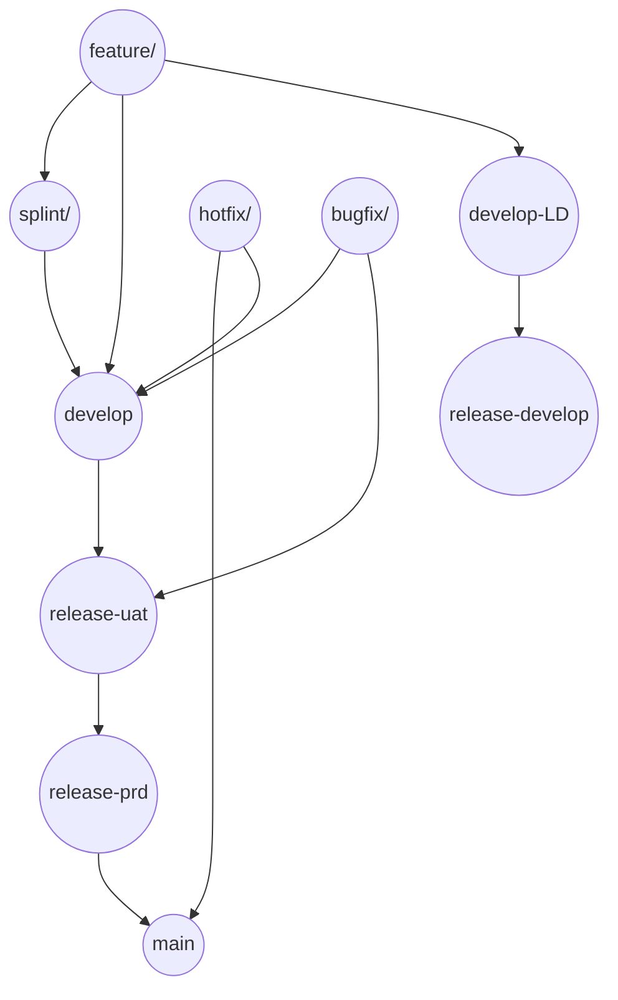

# Gitブランチ運用ルール（最新版）

> 文書ステータス: 補足
> 位置づけ: 各 PJ における複数 `release-*` 系ブランチ運用時の補足資料
> 参照元: `開発ルール総則.md`

## 0. はじめに

本ドキュメントは splint の同時稼働を行う本プロジェクトでの成果物およびリリース環境のバージョン管理を安定して行う Git ブランチ戦略を示した補足ドキュメントです。

標準運用の正本は `標準ブランチ戦略-社内運用.md` とし、本書は各 PJ で `release-develop`, `release-uat`, `release-prd`, `develop-LD` などの拡張ブランチを利用する場合に参照する。

---

## 1. ブランチ一覧と運用ルール

| ブランチ名             | 使用目的                           | マージ元                                 | マージ先                         | 使用者                | マージ責任者             |
| ----------------- | ------------------------------ | ------------------------------------ | ---------------------------- | ------------------ | ------------------ |
| `main`            | 本番環境の安定版コードを保持                 | `release-prd`                        | 必要に応じて `develop`             | CI/CDパイプライン        | 共通基盤チームリーダー        |
| `develop`         | 開発中の最新コードを統合                   | `feature`、`bugfix`、`hotfix`、`splint` | `release-uat`                | 共通基盤チーム開発者、ベンダー開発者 | 共通基盤チームリーダー        |
| `develop-LD`      | 外部開発ベンダー用の開発ブランチ               | `feature`                            | `release-develop`            | ベンダー開発者            | ベンダー開発リーダー         |
| `release-develop` | 開発途中の中間成果物を運用・連携環境に反映するためのブランチ | `develop-LD`                         | 内部検証環境など                     | ベンダー開発者            | ベンダー開発リーダー         |
| `release-uat`     | UAT（検証環境）向けのコードを管理             | `develop`                            | `release-prd`                | 共通基盤チーム開発者、ベンダー開発者 | 共通基盤チームリーダー        |
| `release-prd`     | 本番環境へのデプロイを行う安定版コードを保持         | `release-uat`                        | `main`                       | 共通基盤チーム開発者         | 共通基盤チームリーダー        |
| `splint/<sprint-id>` | 特定スプリントの開発機能を統合                | `feature/*`                          | `develop`                    | 共通基盤チーム開発者、ベンダー開発者 | スプリントリーダー          |
| `feature/<id>`    | 特定の機能やタスクの開発を行う                | `develop` または `splint/<sprint-id>`   | `splint/<sprint-id>` または `develop` | 共通基盤チーム開発者、ベンダー開発者 | ベンダー開発リーダー         |
| `hotfix/<id>`     | 本番環境での緊急バグ修正                   | `main`                               | `main`、`develop`             | 共通基盤チーム開発者、ベンダー開発者 | 共通基盤チームリーダー / メンバー |
| `bugfix/<id>`     | 開発中に発見された不具合の修正                | `develop`                            | `develop`、`release-uat`      | 共通基盤チーム開発者、ベンダー開発者 | 共通基盤チームリーダー / メンバー |

---

## 2. ブランチ命名規則

* **feature ブランチ**: `feature/機能名-チケット番号`
  例: `feature/login-auth-1234`

* **bugfix ブランチ**: `bugfix/機能名-チケット番号`
  例: `bugfix/login-error-5678`

* **hotfix ブランチ**: `hotfix/説明`
  例: `hotfix/critical-error-fix`

* **release ブランチ**:

  * `release-develop`: 外部ベンダー成果物や中間環境向け
  * `release-uat`: UATテスト向け
  * `release-prd`: 本番リリース確定版
    例: `release-uat/1.0.0`

* **splint ブランチ**: `splint/スプリント番号-チーム名`
  例: `splint/2025Q2-TeamA`

---

## 3. 各ブランチの詳細運用ルール（抜粋）

### `main` ブランチ

* **目的**: 本番安定コード
* **マージ元**: `release-prd`
* **マージ先**: `develop`（必要に応じて）
* **CI/CD**: 自動デプロイ＋DB更新
* **責任者**: 共通基盤チームリーダー

### `develop` ブランチ

* **目的**: 開発統合
* **マージ元**: `feature`、`bugfix`、`hotfix`、`splint`
* **マージ先**: `release-uat`
* **CI/CD**: マージ時に自動ビルド＋検証
* **責任者**: 共通基盤チームリーダー

### `develop-LD` ブランチ

* **目的**: 外部ベンダー開発用
* **責任者**: ベンダー開発リーダー

### `release-develop` ブランチ

* **目的**: 中間環境検証
* **CI/CD**: マージ時にデプロイ＋DB更新
* **責任者**: ベンダー開発リーダー

### `release-uat` ブランチ

* **目的**: QA/UAT環境検証
* **CI/CD**: マージ時にデプロイ＋DB更新
* **責任者**: 共通基盤チームリーダー

### `release-prd` ブランチ

* **目的**: 本番リリース確定版
* **CI/CD**: マージ時に本番デプロイ＋DB更新
* **責任者**: 共通基盤チームリーダー

### `feature/*`、`hotfix/*`、`bugfix/*`

* **使用者**: 共通基盤チーム開発者、ベンダー開発者
* **責任者**:

  * `feature`：ベンダー開発リーダー
  * `hotfix`：共通基盤チームリーダー / メンバー
  * `bugfix`：共通基盤チームリーダー / メンバー

---

## 4. ブランチ遷移図（Mermaid）

---

## 5. CI/CD 実行ルール

### 実行トリガー

以下のブランチへのマージをトリガーにCI/CDパイプラインを起動します。

* `main`
* `develop`
* `release-develop`
* `release-uat`
* `release-prd`

### 実行内容

* 各 `release-*` ブランチ：**デプロイ＋DB更新**
* `main`, `develop`：**ビルド／テストのみ（開発環境）**

---

## 6. レビュー担当者一覧（役割）

バイネームは `文書オーナー一覧.md` で管理する。本書では役割単位の責任のみ示す。

| 担当領域      | レビュー担当役割     |
| --------- | ------------ |
| 共通基盤チーム   | 共通基盤チームリーダー |
| ベンダー開発チーム | ベンダー開発リーダー |
| スプリント機能   | スプリントリーダー |
| QAレビュー    | QA担当 または チームリーダー |

---
