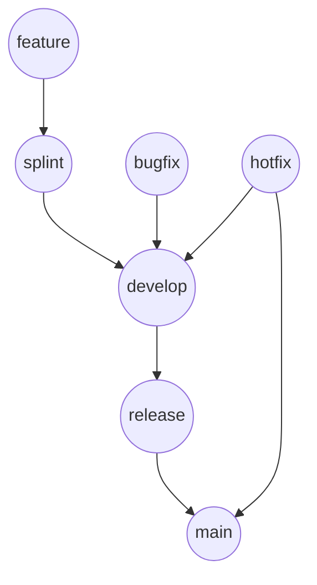

# Gitブランチ運用ルール（社内スプリント版）

> 文書ステータス: 正本
> 位置づけ: 社内スプリント運用の標準ブランチ戦略
> 参照元: `開発ルール総則.md`

## 0. 目的

本ドキュメントは、社内開発におけるスプリント運用を前提とし、  
開発効率と品質を両立するためのGitブランチ戦略を定義する。

本ルールは、既存の外部委託向けブランチ戦略をベースに、  
社内開発向けに簡略化した運用ルールである。

本書を標準運用の正本とし、各 PJ で `release-develop`, `release-uat`, `release-prd`, `develop-LD` などの拡張ブランチを用いる場合は、`brach4splint.md` を補足として併用する。

---

## 1. ブランチ構成

### 永続ブランチ

| ブランチ名 | 目的 |
|------------|------|
| main     | 本番環境の安定コード |
| develop  | 開発統合ブランチ |
| release  | リリース準備・検証用 |

---

### 作業ブランチ

| ブランチ名 | 目的 |
|------------|------|
| splint/<id> | スプリント単位の統合 |
| feature/<id> | 機能開発 |
| bugfix/<id> | 不具合修正 |
| hotfix/<id> | 本番緊急修正 |

---

## 2. ブランチ命名規則

feature/<チケット番号>-<概要>  
bugfix/<チケット番号>-<概要>  
hotfix/<概要>  
splint/<スプリントID>

本書および補足文書では、ブランチ命名は slash 区切りを標準とし、`feature-xx` のような hyphen 区切り表記は使用しない。

---

## 3. ブランチフロー

feature → splint → develop → release → main

---

## 4. 各ブランチの役割

### main
- 本番環境コード
- 常に安定状態
- 直接push禁止

### develop
- 開発統合ブランチ
- feature / bugfix / splint を集約

### release
- リリース前検証用
- QA/UAT相当環境

### splint
- スプリント単位の開発統合
- featureの一次集約

### feature
- 個別機能開発
- splintへマージ

### bugfix
- 開発中不具合修正
- developへマージ

### hotfix
- 本番障害対応
- main / develop 両方へ反映

---

## 5. CI/CDルール

| ブランチ | 実行内容 |
|----------|----------|
| main     | 本番デプロイ |
| release  | 検証環境デプロイ |
| develop  | build / test |

---

## 6. 運用ルール

1. main / develop / release への直接pushは禁止
2. すべての変更はPR/MR経由でマージ
3. featureは develop または splint から作成
4. featureは splint にマージ
5. スプリント終了時に splint → develop へマージ
6. リリース時は develop → release → main
7. hotfixは main から作成し、main と develop に反映
8. マージ後、作業ブランチは削除する

---

## 7. 保護ルール（推奨）

### main
- Protected
- force push禁止
- PR必須
- CI成功必須

### develop
- Protected
- PR経由のみ

### release
- Protected
- force push禁止
- PR経由のみ
- リリース判定後に main へマージ

詳細な保護設定、CI 実行内容、PJ 拡張ブランチの扱いは `ブランチ保護・CI運用一覧.md` を参照する。

---

## 8. 補足

本ルールは以下を目的としている：

- スプリント単位の開発整理
- リリース経路の明確化
- 不具合対応の安全性確保
- エージェント駆動開発との整合性

### 各 PJ における拡張運用

- 各 PJ で `release-*` 系ブランチを使う場合でも、本書を標準運用の入口とする
- 拡張運用が必要な場合のみ `brach4splint.md` を参照し、案件別ルールとして扱う
- Subtree 取り込みが必要な PJ は、別途 `サブツリー運用のブランチ戦略追加.md` を併用する
- ただし正式な保護対象ブランチ名は `main`, `develop`, `release` を標準とする

---

## 9. 今後の拡張

- MRテンプレート
- レビュー観点定義
- リリースタグ運用
- エージェント用プロンプトルール

---

## 10. ソースコードのマージフロー図

以下は、社内スプリント運用におけるソースコードの基本的なマージフローを示す。

### 補足
- 通常の機能開発は `feature` から開始し、`splint` に集約した後、`develop` に反映する
- 開発中の不具合修正は `bugfix` から `develop` に直接反映する
- リリース対象は `develop` から `release` に反映し、検証完了後に `main` へマージする
- 緊急修正は `hotfix` を `main` から作成し、`main` 反映後に `develop` にも反映する
