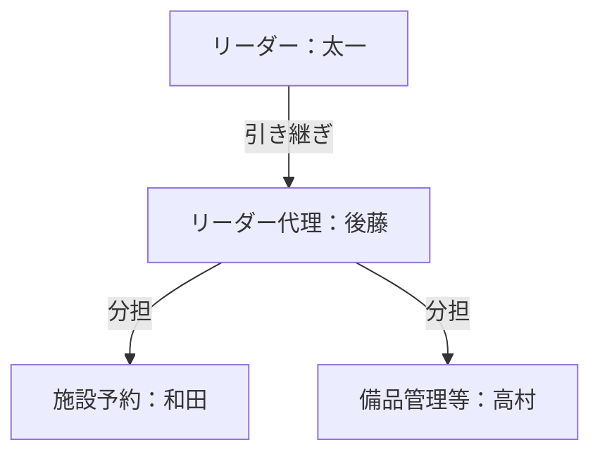

## 🏀 開催頻度
- 月1〜2回程度

---

## 👥 運用体制

---

## 🎒 各自持参
 - 室内用シューズ（バッシュなど）
 - ※屋外シューズは基本NG
 - 着替え & タオル
 - 現金 or 電子マネー
 - ドリンク
 - バスケットボール
 - ビブス
 - ボードゲーム
---

## 持ち物分担
 - 三脚　　　：和田
 - ＩＰａｄ　：後藤
 - 空気入れ　：後藤
 - ボード　　：和田
 - ビブス予備：高村
---